# 1233 短管枪 Stub gun

精校状态：中文行文已逐段精校，部分术语仍为暂定

分类：武器 / 远程武器

原文来源：https://www.bilibili.com/opus/1214747322614808610

原作者：帝国神选罐头

原文时间：2026年06月17日 12:00

[返回分类目录](目录.md) · [全书目录](../../目录.md)

<!-- A1233-B0001 -->
**英文原文**

Stub guns or slug guns are a name that refers to a wide variety of low-velocity, high-calibre pistols.

<!-- /A1233-B0001 -->

<!-- A1233-B0002 -->

原译文

短管枪或子弹枪是指各种低速、大口径手枪的名称。

**校订译文**

短管枪，又称弹丸枪，是多种低初速、大口径手枪的统称。

<!-- /A1233-B0002 -->

<!-- A1233-B0003 图片 -->
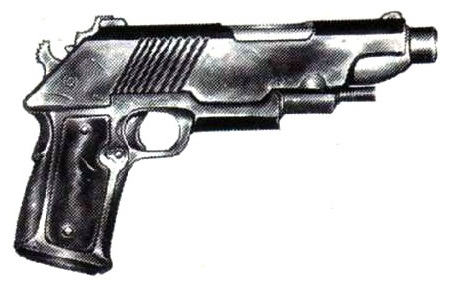

<!-- A1233-B0004 -->

原译文

Imperial Stub Gun 帝国短管枪

**校订译文**

Imperial Stub Gun 帝国短管枪

<!-- /A1233-B0004 -->

<!-- A1233-B0005 -->
## Overview 概述

<!-- /A1233-B0005 -->

<!-- A1233-B0006 -->
**英文原文**

They resemble 20th century revolvers or semi-automatic pistols and fire solid bullets, usually one at a time. Being amongst the easiest firearms to manufacture, they are common on Imperial worlds, where they are often called by local names, such as 'sluggers' 'smokers' or 'shooters'. These weapons are generally locally manufactured or jury-rigged from the parts of other weapons. Stub guns are commonly used by hive gangers, criminals or other citizens, feeling the need to defend themselves. Because of their availability they are often used by chaos cults. Infamous for their poor accuracy and unreliability, stub guns are not usually considered a military weapon, but, as well as Autopistols, they are sometimes used by Guardsmen as a backup weapon, especially by the ones using unreliable melta- or plasma-weaponry.

<!-- /A1233-B0006 -->

<!-- A1233-B0007 -->

原译文

它们类似于20世纪的左轮手枪或半自动手枪，通常一次发射一颗实心子弹。作为最容易制造的枪支之一，它们在帝国世界很常见，在那里它们通常被当地人称为“强击手”、“烟鬼”或“射手”。这些武器通常是当地制造的，或者是用其他武器的零件拼凑而成的。短管枪通常被巢都帮派成员、罪犯或其他公民使用，他们觉得有必要自卫。由于它们的可用性，它们经常被混沌教派使用。短管枪因其精度差和不可靠性而臭名昭著，通常不被视为军事武器，但与自动手枪一样，它们有时也被卫兵用作备用武器，尤其是那些使用不可靠的热熔或等离子武器的卫兵。

**校订译文**

这类武器类似二十世纪的左轮手枪或半自动手枪，发射实弹，通常每次一发。短管枪是最容易制造的枪械之一，在帝国各世界十分常见，当地人常给它们起“弹丸枪”“冒烟枪”或“打枪家伙”之类的俗称。它们通常由本地制造，也可能用其他武器的零件临时拼装而成。巢都帮派成员、罪犯以及认为有必要自卫的普通市民，都经常使用短管枪；混沌教派也因其容易获取而广泛采用。短管枪以精度差、可靠性低著称，通常不被视为军用武器。不过，与自动手枪一样，它们有时也被帝国卫队士兵用作备用武器，尤其受到使用故障风险较高的热熔或等离子武器的士兵青睐。

**校注：** sluggers、smokers、shooters是对枪械的地方俗称，不是射手身份，中文按语境译出戏称。

<!-- /A1233-B0007 -->

<!-- A1233-B0008 -->
## Example 实例

<!-- /A1233-B0008 -->

<!-- A1233-B0009 -->
**英文原文**

This unknown pattern of stub gun displays a superior finish to most and is believed to be manufactured on the Armoury World of Vraks.

<!-- /A1233-B0009 -->

<!-- A1233-B0010 -->

原译文

这种未知的短管枪型号显示出比大多数短管枪更优越的外观，据信是在弗拉克斯军械世界制造的。

**校订译文**

这种型号不明的短管枪做工比大多数同类产品精良，据信产自军械世界弗拉克斯。

<!-- /A1233-B0010 -->

<!-- A1233-B0011 图片 -->
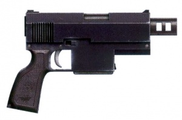

<!-- A1233-B0012 -->

原译文

Example 实例

**校订译文**

Example 实例

<!-- /A1233-B0012 -->

<!-- A1233-B0013 -->
**英文原文**

Length: 26 cm

<!-- /A1233-B0013 -->

<!-- A1233-B0014 -->

原译文

长度：26厘米

**校订译文**

长度：26厘米

<!-- /A1233-B0014 -->

<!-- A1233-B0015 -->
**英文原文**

Barrel: 17 cm

<!-- /A1233-B0015 -->

<!-- A1233-B0016 -->

原译文

枪管：17厘米

**校订译文**

枪管：17厘米

<!-- /A1233-B0016 -->

<!-- A1233-B0017 -->
**英文原文**

Weight: 2.2 kg

<!-- /A1233-B0017 -->

<!-- A1233-B0018 -->

原译文

重量：2.2公斤

**校订译文**

重量：2.2公斤

<!-- /A1233-B0018 -->

<!-- A1233-B0019 -->
**英文原文**

Calibre: short 6.2 mm

<!-- /A1233-B0019 -->

<!-- A1233-B0020 -->

原译文

口径：短6.2毫米

**校订译文**

口径：6.2毫米短弹

<!-- /A1233-B0020 -->

<!-- A1233-B0021 -->
**英文原文**

Feed: 6 round magazine

<!-- /A1233-B0021 -->

<!-- A1233-B0022 -->

原译文

载弹：6发弹匣

**校订译文**

供弹：6发弹匣

<!-- /A1233-B0022 -->

<!-- A1233-B0023 -->
**英文原文**

Muzzle velocity: 220 m/sec

<!-- /A1233-B0023 -->

<!-- A1233-B0024 -->

原译文

枪口速度：220米/秒

**校订译文**

枪口初速：220米／秒

<!-- /A1233-B0024 -->

<!-- A1233-B0025 -->
## Known Patterns 已知型号

<!-- /A1233-B0025 -->

<!-- A1233-B0026 -->
## Agripinaa Mk XIV Quickdraw Stub Revolver 阿格里皮娜 Mk.XIV 快拔短管左轮手枪

原题：Agripinaa Mk XIV Quickdraw Stub Revolver 阿格里皮娜Mk XIV快挂短管左轮手枪

<!-- /A1233-B0026 -->

<!-- A1233-B0027 -->
**英文原文**

A surprisingly weighty, high-calibre pistol, the stopping power of an Agripinaa stub revolver belies its compact size.

<!-- /A1233-B0027 -->

<!-- A1233-B0028 -->

原译文

阿格里皮娜短管左轮手枪是一把重量惊人、口径大的手枪，其制动力掩盖了其紧凑的尺寸。

**校订译文**

阿格里皮娜短管左轮手枪口径大，重量也出人意料；虽然外形紧凑，却有着与体积不相称的强大制止力。

<!-- /A1233-B0028 -->

<!-- A1233-B0029 图片 -->
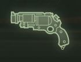

<!-- A1233-B0030 -->

原译文

Agripinaa Mk XIV Quickdraw Stub Revolver 阿格里皮娜Mk XIV快挂短管左轮手枪

**校订译文**

Agripinaa Mk XIV Quickdraw Stub Revolver 阿格里皮娜 Mk.XIV 快拔短管左轮手枪

<!-- /A1233-B0030 -->

<!-- A1233-B0031 -->
## Branx MkVIII 布兰克斯 Mk.VIII

原题：Branx MkVIII 布兰克斯MkVIII

<!-- /A1233-B0031 -->

<!-- A1233-B0032 -->
**英文原文**

A pattern of Branx stub pistols used by the Hive Scum of Hive Tertium.

<!-- /A1233-B0032 -->

<!-- A1233-B0033 -->

原译文

一种由第三巢都的巢都渣滓使用的布兰克斯短管手枪型号。

**校订译文**

一种由第三巢都的巢都渣滓使用的布兰克斯短管手枪型号。

<!-- /A1233-B0033 -->

<!-- A1233-B0034 图片 -->
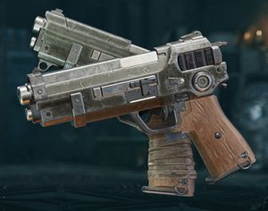

<!-- A1233-B0035 -->

原译文

Dual Branx MkVIII Stub Pistols used by the Hive Scum of Hive Tertium 第三巢都的巢都渣滓使用的两把布兰克斯MkVIII短管手枪

**校订译文**

Dual Branx MkVIII Stub Pistols used by the Hive Scum of Hive Tertium 第三巢都的巢都渣滓使用的一对布兰克斯 Mk.VIII 短管手枪

<!-- /A1233-B0035 -->

<!-- A1233-B0036 -->
## Equalizer Stub Pistol 均衡者短管手枪

<!-- /A1233-B0036 -->

<!-- A1233-B0037 -->
**英文原文**

Used by Necromunda's Palanite Enforcers.

<!-- /A1233-B0037 -->

<!-- A1233-B0038 -->

原译文

由涅克罗蒙达的帕拉尼特执法者使用。

**校订译文**

由涅克罗蒙达的帕拉尼特执法者使用。

<!-- /A1233-B0038 -->

<!-- A1233-B0039 -->
## Hax-Orthlack Armsman-10 Pattern Service Pistol 哈克斯—奥斯拉克武装者-10型制式手枪

原题：Hax-Orthlack Armsman-10 Pattern Service Pistol 哈克斯-奥斯拉克武装者-10型警用手枪

<!-- /A1233-B0039 -->

<!-- A1233-B0040 -->
**英文原文**

This bulky and intimidating high-capacity stub pistol is a copy of the traditional Scipio pattern Naval pistol. It is a common sidearm for enforcers, household troops and mercenaries throughout the Calixis Sector and has been mass-produced for centuries under contract to arm the Magistratum cadres of Scintilla and many other worlds.

<!-- /A1233-B0040 -->

<!-- A1233-B0041 -->

原译文

这种笨重而吓人的大容量短管手枪是传统西庇阿型海军手枪的复制品。它是整个卡利西斯星区的执法者、家族军队和雇佣兵的常见武器，几个世纪以来，根据契约大规模生产，为辛提拉和许多其他世界的法务干部提供武器。

**校订译文**

这款体积庞大、外形慑人的大容量短管手枪，仿制自传统的西庇阿型海军手枪。它是卡利西斯星区执法人员、家族部队和雇佣兵常见的随身武器。数百年来，制造方一直依照供应合同大量生产这种手枪，为辛提拉及许多其他世界的地方执法队伍配发武器。

<!-- /A1233-B0041 -->

<!-- A1233-B0042 -->
## Ironfist 铁拳

<!-- /A1233-B0042 -->

<!-- A1233-B0043 -->
**英文原文**

A highly modifiable stub revolver pattern, popular amongst the gangers and hired guns of Necromunda.

<!-- /A1233-B0043 -->

<!-- A1233-B0044 -->

原译文

一种高度可修改的短管左轮手枪型号，在涅克罗蒙达的帮派成员和雇佣枪手中很受欢迎。

**校订译文**

一种便于进行多种改装的短管左轮手枪，在涅克罗蒙达的帮派成员和雇佣枪手中颇受欢迎。

<!-- /A1233-B0044 -->

<!-- A1233-B0045 图片 -->
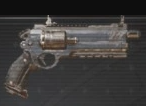

<!-- A1233-B0046 -->

原译文

Ironfist Stub Revolver 铁拳短管左轮手枪

**校订译文**

Ironfist Stub Revolver 铁拳短管左轮手枪

<!-- /A1233-B0046 -->

<!-- A1233-B0047 -->
## Ironhead Stub Gun 铁首短管枪

<!-- /A1233-B0047 -->

<!-- A1233-B0048 -->
**英文原文**

Used by the Squat Ironhead Prospectors on Necromunda.

<!-- /A1233-B0048 -->

<!-- A1233-B0049 -->

原译文

由涅克罗蒙达的矮人铁首勘探者使用。

**校订译文**

由涅克罗蒙达的矮人铁首勘探者使用。

<!-- /A1233-B0049 -->

<!-- A1233-B0050 图片 -->

<!-- A1233-B0051 -->

原译文

Digger with Ironhead Stub Gun 挖掘者配备铁首短管枪

**校订译文**

Digger with Ironhead Stub Gun 挖掘者配备铁首短管枪

<!-- /A1233-B0051 -->

<!-- A1233-B0052 -->
## Khayer-Addin Forge “Fate Bringer” Long Pistol 卡耶尔—阿丁铸造厂“命运使者”长手枪

原题：Khayer-Addin Forge “Fate Bringer” Long Pistol 卡耶尔-插件铸造“命运使者”长手枪

**校注：** Khayer-Addin为专名，Addin不是软件“插件”；暂译卡耶尔—阿丁，原稿“卡耶尔-插件”作为误译留在原译文栏。

<!-- /A1233-B0052 -->

<!-- A1233-B0053 -->
**英文原文**

The Khayer-Addin Forge “Fate Bringer” Long Pistol is mostly used as a duelling pistol by the nobles of Scintilla and off-world imitators. It is well-made from the finest materials. Because the weapon is deceptively simple it can also function as target pistol or as a tool for assassinations. For real combat engagements the pistol lacks clip capacity and is slightly too heavy.

<!-- /A1233-B0053 -->

<!-- A1233-B0054 -->

原译文

卡耶尔-插件铸造“命运使者”长手枪主要被辛提拉贵族和世界各地的模仿者用作决斗手枪。它是用最好的材料做的。因为这种武器看似简单，它也可以作为靶枪或暗杀工具。对于真正的战斗，手枪缺乏弹夹容量，而且有点太重。

**校订译文**

卡耶尔—阿丁铸造厂的“命运使者”长手枪，主要被辛提拉贵族及外星效仿者用作决斗手枪。它采用上等材料精工制造，外观简单却暗藏不凡，也可用作打靶手枪或暗杀工具。不过，若用于实战，它的弹匣容量偏小，重量也略显过大。

<!-- /A1233-B0054 -->

<!-- A1233-B0055 -->
## Lammark Combination Thousander 拉马克“千发者”复合手枪

原题：Lammark Combination Thousander 拉马克结合千者

**校注：** Combination指复合枪械结构，Thousander按武器名暂译“千发者”（原稿“结合千者”）；名称不表示实际能装一千发。

<!-- /A1233-B0055 -->

<!-- A1233-B0056 -->
**英文原文**

A huge chrome revolver with two barrels, one of a regular size and a much larger bore beneath it. Described as an "old" Astra Militarum issue weapon, intended for officers for use in trench-war and street fighting. The main barrel was fed by a cylinder with 10 shots, while the central barrel held a large calibre round in a chamber. This larger chamber could hold a buckshot cartridge or a breaching round for bursting through doors. Switching between the two firing modes was accomplished by adjusting the hammer of the revolver. Pulling back the hammer on the weapon makes a loud, distinct metallic clank. Renner Lightburn was a known user of this pattern.

<!-- /A1233-B0056 -->

<!-- A1233-B0057 -->

原译文

一种巨大的铬合金左轮手枪，有两个枪管，一个是常规尺寸，下面有一个更大的口径。被描述为星界军发行的“旧”武器，供军官在堑壕战和巷战中使用。主枪管由一个装有10发子弹的圆柱体供弹，而中央枪管在一个膛内装有一发大口径子弹。这个更大的腔室可以容纳一个鹿弹弹药或一个破门弹药。通过调整左轮手枪的击锤，实现了两种射击模式之间的切换。拉回武器上的击锤，会发出一声响亮而明显的金属声。伦纳·莱特伯恩是这种型号的已知使用者。

**校订译文**

这是一把体形硕大的镀铬左轮手枪，设有两根枪管：一根口径常规，另一根位于其下方，口径大得多。它被描述为星界军曾经配发的一种“老式”武器，供军官在堑壕战和巷战中使用。主枪管由容纳10发弹药的转轮弹巢供弹，位于中央的粗枪管则在独立膛室中装填一发大口径弹药。这个较大的膛室可装入鹿弹，或用于破门的破障弹。调节击锤即可切换两种射击方式；向后扳动击锤时，会发出响亮而独特的金属铿锵声。伦纳·莱特伯恩是已知使用过这种型号的人物之一。

**校注：** chrome按外观处理为镀铬，不据此认定整枪由铬合金制成。

<!-- /A1233-B0057 -->

<!-- A1233-B0058 -->
## Mariette Cylinder Pistol 马里埃特圆筒手枪

<!-- /A1233-B0058 -->

<!-- A1233-B0059 -->
**英文原文**

The Mariette Cylinder Pistol is crafted from polyflex and ceramics with no metallic or powered components. It is named after a Malfi noble house from which the design originates. Featuring four-chamber barrels that are self-contained the pistol is easy to breakdown into small parts and can be concealed in an innocuous object. Reassembly of the weapon can happen in mere seconds.

<!-- /A1233-B0059 -->

<!-- A1233-B0060 -->

原译文

马里埃特圆筒手枪由高性能热塑性弹性体和陶瓷制成，没有金属或动力部件。它以设计起源的马尔菲贵族家族命名。这款手枪有四个独立的枪管，很容易分解成小部件，可以隐藏在无害的物体中。武器的重新组装可以在几秒钟内完成。

**校订译文**

马里埃特圆筒手枪以聚柔材料和陶瓷制成，不含金属或动力部件。它以马尔菲的一个贵族家族命名，其设计正出自该家族。该枪具有自成一体的四膛枪管结构，容易拆分成小零件，藏入不起眼的物件中；重新组装只需数秒。

**校注：** polyflex是底稿材料名，暂译聚柔材料；不沿原译自行指定为某种现实热塑性弹性体。“four-chamber barrels”结构用语含混，保留四膛概念，不自行扩写机械细节。

<!-- /A1233-B0060 -->

<!-- A1233-B0061 -->
## Phobos Stubber 火卫一伐木枪

<!-- /A1233-B0061 -->

<!-- A1233-B0062 -->
**英文原文**

The Phobos Stubber is a cheap stub automatic that is found across the Imperium from the stalls of underhive scav-traders to frontier ming camps and Administratum supply depots. In the Calixis Sector the gun is produced in the tens of thousands by the Doru Fane of Gunmetal City and by the Belasco Deathworks on Malfi.

<!-- /A1233-B0062 -->

<!-- A1233-B0063 -->

原译文

火卫一伐木枪是一种廉价的自动短管枪，可以在帝国的各个角落找到，从下巢的拾荒者商人到边境明营和内务部补给仓库。在卡利西斯星区，枪铁城的多鲁·法恩和马尔菲的贝拉斯科死作生产了数万支枪。

**校订译文**

火卫一伐木枪是一种廉价的自动短管枪，遍布帝国各地：从下巢拾荒商贩的摊位，到边疆采矿营地，再到内政部的补给仓库，都能见到它。在卡利西斯星区，枪铁城的多鲁工坊和马尔菲的贝拉斯科死亡工厂成千上万地生产这种武器。

**校注：** ming camps应为mining camps的漏字，中文据上下文校作采矿营地；Fane此处按生产机构译工坊。

<!-- /A1233-B0063 -->

<!-- A1233-B0064 -->
## Scipio pattern 西庇阿型

<!-- /A1233-B0064 -->

<!-- A1233-B0065 -->
**英文原文**

This pattern is primarily used in Imperial Navy and fires fat, blunt man-stopper rounds. It holds ten rounds of ammo, spring-loaded into the slide inside the grip.

<!-- /A1233-B0065 -->

<!-- A1233-B0066 -->

原译文

这种型号主要用于帝国海军，发射厚的、钝的制人弹。它装有十发弹药，装载弹簧在握把内的滑块中。

**校订译文**

这种型号主要供帝国海军使用，发射粗大、钝头的制止弹。它可容纳10发弹药，利用握把内供弹机构的弹簧推送弹药。

**校注：** 原文“slide inside the grip”机构表述不够清楚，按握把内弹簧供弹译出，不擅补具体枪机结构。

<!-- /A1233-B0066 -->

<!-- A1233-B0067 -->
## Volg Mercy Killer 伏尔格“怜悯杀手”

原题：Volg Mercy Killer 伏尔加怜悯杀手

<!-- /A1233-B0067 -->

<!-- A1233-B0068 -->
**英文原文**

The Volg Mercy Killer takes its name from the expression that its ‘a mercy if it kills what you’re aiming at’. Scratch-built the crude pistol is fashioned from whatever materials are to hand and can only be used in single-shot. The weapon is widely inaccurate and is as dangerous to the wielder as it is to the target. The Mercy Killer is mass-manufactured on Fenksworld.

<!-- /A1233-B0068 -->

<!-- A1233-B0069 -->

原译文

伏尔加怜悯杀手的名字来源于这样一句话：“如果它杀死了你的目标，那就是怜悯”。这种粗糙的手枪是用任何手头的材料制成的，只能用于单发。这种武器非常不准确，对使用者和目标一样危险。怜悯杀手在芬克斯世界上大规模生产。

**校订译文**

伏尔格“怜悯杀手”得名于一句挖苦话：“能打死你瞄准的东西，就算它大发慈悲了。”这款粗糙的手枪用手边能找到的材料拼装，只能单发射击。它精度极差，对持枪者和目标同样危险。“怜悯杀手”在芬克斯世界大量生产。

<!-- /A1233-B0069 -->

<!-- A1233-B0070 -->
## Westingkrup Model 20 “Scalptaker” Stub Revolver 威斯汀克虏伯20型“剥头皮者”短管左轮手枪

<!-- /A1233-B0070 -->

<!-- A1233-B0071 -->
**英文原文**

The Westingkrup Model 20 “Scalptaker” Stub Revolver is a fantastically reliable pistol that can keep firing after any amount of abuse and mistreatment. It is used as a backup sidearm by professional fighters, frightened hivers and frontier colonists but has a negative reputation with Gunmetal City gangers. Yet, the 9mm handgun is considered solid and reliable in comparison to flashier alternatives. It is capable of making fist-sized holes in its targets with the help of dum-dum bullets.

<!-- /A1233-B0071 -->

<!-- A1233-B0072 -->

原译文

威斯汀克虏伯20型“剥头皮者”短管左轮手枪是一种非常可靠的手枪，可以在任何程度的滥用和虐待后继续射击。它被专业战士、惊吓的巢都人和边境殖民者用作备用武器，但在枪铁城帮派成员中却有负面声誉。然而，与更闪光的替代品相比，9毫米手枪被认为是坚固可靠的。它能够在达姆弹的帮助下在目标身上打出拳头大小的洞。

**校订译文**

威斯汀克虏伯20型“剥头皮者”短管左轮手枪极其可靠，即使饱经粗暴使用、缺乏保养，仍能继续开火。职业战士、惶恐的巢都市民和边疆殖民者常把它当作备用佩枪，但它在枪铁城帮派中名声不佳。尽管如此，与那些更花哨的选择相比，这款9毫米手枪仍以结实可靠见长。装填达姆弹时，它能在目标身上打出拳头大小的伤口。

<!-- /A1233-B0072 -->

<!-- A1233-B0073 -->
## Zarona Mk IIa Quickdraw Stub Revolver 扎罗纳 Mk.IIa 快拔短管左轮手枪

原题：Zarona Mk IIa Quickdraw Stub Revolver 扎罗纳Mk IIa快挂短管左轮手枪

<!-- /A1233-B0073 -->

<!-- A1233-B0074 -->
**英文原文**

One of the most ancient pistol designs, stub revolvers endure across myriad frontier worlds thanks to their durability, simplicity and effectiveness.

<!-- /A1233-B0074 -->

<!-- A1233-B0075 -->

原译文

作为最古老的手枪设计之一，短管左轮手枪因其耐用性、简单性和有效性而在无数边境世界中经久不衰。

**校订译文**

短管左轮手枪是最古老的手枪设计之一。凭借耐用、简单而有效的特点，它至今仍在无数边疆世界广泛使用。

<!-- /A1233-B0075 -->

<!-- A1233-B0076 图片 -->
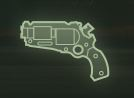

<!-- A1233-B0077 -->

原译文

Zarona Mk IIa Quickdraw Stub Revolver 扎罗纳Mk IIa快挂短管左轮手枪

**校订译文**

Zarona Mk IIa Quickdraw Stub Revolver 扎罗纳 Mk.IIa 快拔短管左轮手枪

<!-- /A1233-B0077 -->

<!-- A1233-B0078 -->
## Variants 变体

<!-- /A1233-B0078 -->

<!-- A1233-B0079 -->
## Stub Revolver 短管左轮手枪

<!-- /A1233-B0079 -->

<!-- A1233-B0080 -->
**英文原文**

The stub revolver carries fewer rounds than most pistols but is very reliable and easy to operate. As shells can be inserted individually, it is relatively easy to load in specialised rounds when needed. It is one of the most ancient of pistol designs and serves as an ideal backup weapon.

<!-- /A1233-B0080 -->

<!-- A1233-B0081 -->

原译文

短管左轮手枪比大多数手枪携带的子弹少，但非常可靠且易于操作。由于子弹可以单独插入，因此在需要时相对容易装入专用弹药。它是最古老的手枪设计之一，是理想的备用武器。

**校订译文**

短管左轮手枪的载弹量少于大多数手枪，但非常可靠，也容易操作。由于每发子弹都能单独装填，使用者可在需要时方便地换入特殊弹药。这种最古老的手枪设计之一，是理想的备用武器。

<!-- /A1233-B0081 -->

<!-- A1233-B0082 图片 -->
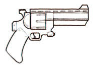

<!-- A1233-B0083 -->

原译文

Stub Revolver 短管左轮手枪

**校订译文**

Stub Revolver 短管左轮手枪

<!-- /A1233-B0083 -->

<!-- A1233-B0084 -->
## Stub Automatic 自动短管枪

<!-- /A1233-B0084 -->

<!-- A1233-B0085 -->
**英文原文**

Unlike the Stub revolver, this pistol weapon also can fire in rapid semi-automatic mode as well as single shots. Like the Autopistol it is easy to produce and maintain, but less accurate at longer ranges. Just as common as the revolver variant, the stub automatic is less reliable, but allows for a greater rate of fire and clip capacity.

<!-- /A1233-B0085 -->

<!-- A1233-B0086 -->

原译文

与短管左轮手枪不同，这种手枪武器也可以在快速半自动模式和单发模式下射击。与自动手枪一样，它易于生产和维护，但在更远的距离上精度较低。与左轮手枪一样常见，自动短管枪的可靠性较低，但允许更高的射速和弹夹容量。

**校订译文**

与短管左轮手枪不同，自动短管枪既能逐发射击，也能以半自动方式快速连续开火。它与自动手枪一样，容易制造和维护，但远距离精度较低。自动短管枪和左轮型号同样常见，虽然可靠性稍逊，却有更高的射速和更大的弹匣容量。

<!-- /A1233-B0086 -->

<!-- A1233-B0087 图片 -->
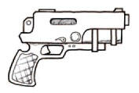

<!-- A1233-B0088 -->

原译文

Stub Automatic 自动短管枪

**校订译文**

Stub Automatic 自动短管枪

<!-- /A1233-B0088 -->

<!-- A1233-B0089 -->
## Hand Cannon 手炮

<!-- /A1233-B0089 -->

<!-- A1233-B0090 -->
**英文原文**

A stub gun that fires huge calibre slugs with massive recoil. These are especially popular with enforcers and bodyguards.

<!-- /A1233-B0090 -->

<!-- A1233-B0091 -->

原译文

一种发射大口径弹药并具有巨大后坐力的短管枪。这些在执法者和护卫中尤其受欢迎。

**校订译文**

一种发射超大口径弹丸、后坐力极强的短管枪，在执法人员和保镖中尤其流行。

<!-- /A1233-B0091 -->

<!-- A1233-B0092 -->
## Macrostubber 宏伐木枪

<!-- /A1233-B0092 -->

<!-- A1233-B0093 -->
**英文原文**

This type of antique weapon is used by Adeptus Mechanicus Tech-Priests and is able to hurl out a thunderous cloud of solid slugs.

<!-- /A1233-B0093 -->

<!-- A1233-B0094 -->

原译文

这种古老武器由机械神教技术神甫使用，能够射出雷鸣般的固体子弹云。

**校订译文**

这种古老的武器由机械修会的技术祭司使用，能够在雷鸣般的枪声中倾泻密集的实弹。

<!-- /A1233-B0094 -->

<!-- A1233-B0095 图片 -->
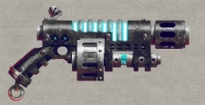

<!-- A1233-B0096 -->

原译文

Macrostubber 宏伐木枪

**校订译文**

Macrostubber 宏伐木枪

<!-- /A1233-B0096 -->

<!-- A1233-B0097 -->
## Stubcarbine 短管卡宾枪

<!-- /A1233-B0097 -->

<!-- A1233-B0098 -->
**英文原文**

The stubcarbine, though small, has the stopping power of the heavy stubbers mounted on the vehicles of the Astra Militarum. When a squad of Sicarian Infiltrators opens fire with these weapons, the air fills with a avalanche of solid shot that chews their victims to shreds.

<!-- /A1233-B0098 -->

<!-- A1233-B0099 -->

原译文

短管卡宾枪虽然很小，但具有星界军载具上安装的重型伐木枪的制动能力。当一队短刃渗透者用这些武器开火时，空气中充满了山崩般的固体子弹，将受害者撕成碎片。

**校订译文**

短管卡宾枪虽小，制止力却堪比星界军载具上安装的重机枪。当一队斯卡里亚渗透者用它们开火时，密集的弹丸便如雪崩般席卷而出，将受害者撕成碎片。

<!-- /A1233-B0099 -->

<!-- A1233-B0100 图片 -->
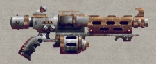

<!-- A1233-B0101 -->

原译文

Stubcarbine 短管卡宾枪

**校订译文**

Stubcarbine 短管卡宾枪

<!-- /A1233-B0101 -->

<!-- A1233-B0102 -->
## Famous Users 著名使用者

<!-- /A1233-B0102 -->

<!-- A1233-B0103 -->
**英文原文**

Inquisitor Gregor Eisenhorn used a Scipio-pattern stub gun, decorated by his companion Lores Vibben

<!-- /A1233-B0103 -->

<!-- A1233-B0104 -->

原译文

审判官格雷戈·艾森霍恩使用了一把西庇阿型短管枪，由他的同伴洛蕾斯·维本装饰

**校订译文**

审判官格雷戈·艾森霍恩曾使用一把西庇阿型短管枪，枪上的装饰由同伴洛蕾斯·维本完成。

<!-- /A1233-B0104 -->

<!-- A1233-B0105 -->

原译文

Iven Rannick 艾文·兰尼克

**校订译文**

Iven Rannick 艾文·兰尼克

<!-- /A1233-B0105 -->

<!-- A1233-B0106 图片 -->
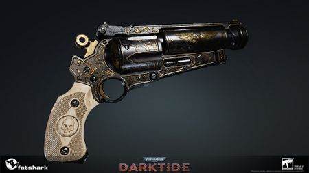

<!-- A1233-B0107 -->

原译文

Iven Rannick's ornate Stub gun 艾文·兰尼克的华丽短管枪

**校订译文**

Iven Rannick's ornate Stub gun 艾文·兰尼克的华丽短管枪

<!-- /A1233-B0107 -->

<!-- A1233-B0108 -->
## Trivia 琐事

<!-- /A1233-B0108 -->

<!-- A1233-B0109 -->
**英文原文**

The Lammark Combination Thousander is likely based on the Lemat Revolver, a real world 1860s era revolver which also had a large central barrel beneath its main barrel, which could fire a larger calibre munition and able to function as a short barrel shotgun. Toggling between the two firing modes was also achieved by adjusting a small lever on the weapons hammer.

<!-- /A1233-B0109 -->

<!-- A1233-B0110 -->

原译文

拉马克结合千者可能基于莱马特左轮手枪，这是一种19世纪60年代的现实世界左轮手枪，其主枪管下方也有一个大型中央枪管，可以发射更大口径的弹药，并能够作为短管霰弹枪使用。通过调整武器击锤上的一个小杠杆，也可以在两种射击模式之间切换。

**校订译文**

拉马克“千发者”复合手枪可能以现实中十九世纪六十年代的勒马左轮手枪为原型。后者同样在主枪管下方设有一根较粗的中央枪管，可以发射更大口径的弹药，兼作短管霰弹枪；调节击锤上的小拨杆，也能切换两种射击方式。

**校注：** 本段是英文底稿对设计灵感的推测，保留“可能”，不提升为官方确认。

<!-- /A1233-B0110 -->

本篇核心术语与暂定项

以下列出本篇出现的英文原形及核心术语表用词。同形词可能指不同对象，具体词义以本篇正文和校注为准；单复数、别名和仅见于图注的名称可能尚未列入。完整候选见[术语表](../../术语表/双语术语候选.csv)。

| 英文 | 采用中文 | 状态 |
| --- | --- | --- |
| Adeptus Mechanicus | 机械修会 | 官方已核对 |
| Astra Militarum | 星界军 | 官方已核对 |
| Inquisitor | 审判官 | 官方已核对 |
| Imperium | 帝国 | 暂定·简称 |
| Imperial Navy | 帝国海军 | 暂定 |
| Administratum | 内政部 | 暂定 |
| Necromunda | 涅克罗蒙达 | 暂定·官方待核 |
| Enforcers | 地方执法者 | 暂定·官方待核 |
| Sector | 星区 | 暂定·官方待核 |
| Scintilla | 辛提拉 | 暂定·官方待核 |
| Agripinaa | 阿格里皮娜 | 暂定·官方待核 |
| Phobos | 火卫一 | 暂定·官方待核 |
| Gregor Eisenhorn | 格雷戈·艾森霍恩 | 暂定·官方待核 |
| Tech | 技术语 | 暂定·官方待核 |
| Ancient | 旗手 | 官方已核对 |
| Sicarian Infiltrators | 斯卡里亚渗透者 | 官方已核对 |
| Armoury | 军械库 | 暂定·官方待核 |
| The Weapon | 武器 | 暂定·官方待核 |
| Lores Vibben | 洛蕾斯·维本 | 暂定·官方待核 |
| Gun | 甘 | 暂定·官方待核 |
| Mercy | 仁慈 | 暂定·官方待核 |
| Calixis Sector | 卡利西斯星区 | 暂定·官方待核 |
| Fenksworld | 芬克斯世界 | 暂定·官方待核 |
| Malfi | 马尔菲 | 暂定·官方待核 |
| Bullets | 子弹 | 暂定·官方待核 |
| Shotgun | 霰弹枪 | 暂定·官方待核 |
| Autopistol | 自动手枪 | 暂定·官方待核 |
| Stub Gun | 短管枪 | 暂定·官方待核 |
| Stub Revolver | 短管左轮手枪 | 暂定·官方待核 |
| Stub Automatic | 自动短管枪 | 暂定·官方待核 |
| Stubcarbine | 短管卡宾枪 | 暂定·官方待核 |
| Khayer-Addin Forge | 卡耶尔—阿丁铸造厂 | 暂定·官方待核 |
| Fate Bringer | 命运使者 | 暂定·官方待核 |
| Lammark Combination Thousander | 拉马克“千发者”复合手枪 | 暂定·官方待核 |
| Renner Lightburn | 伦纳·莱特伯恩 | 暂定·官方待核 |
| Mariette Cylinder Pistol | 马里埃特圆筒手枪 | 暂定·官方待核 |
| Phobos Stubber | 火卫一伐木枪 | 暂定·官方待核 |
| Doru Fane | 多鲁工坊 | 暂定·官方待核 |
| Belasco Deathworks | 贝拉斯科死亡工厂 | 暂定·官方待核 |
| Scipio pattern | 西庇阿型 | 暂定·官方待核 |
| Volg Mercy Killer | 伏尔格“怜悯杀手” | 暂定·官方待核 |
| Westingkrup Model 20 “Scalptaker” Stub Revolver | 威斯汀克虏伯20型“剥头皮者”短管左轮手枪 | 暂定·官方待核 |
| Gunmetal City | 枪铁城 | 暂定·官方待核 |
| Magistratum | 地方执法机构 | 暂定·官方待核 |
| Palanite Enforcers | 帕拉尼特执法者 | 暂定·官方待核 |

