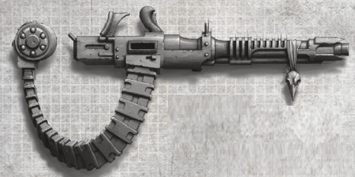
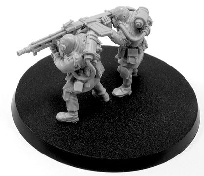
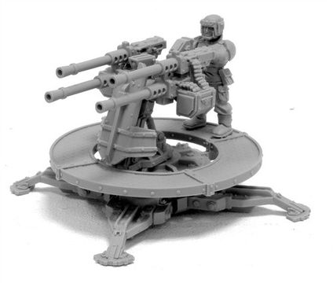
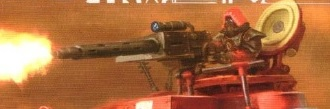
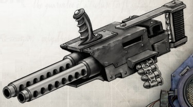
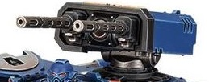
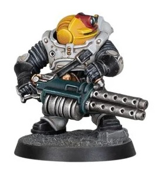
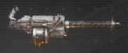
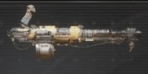
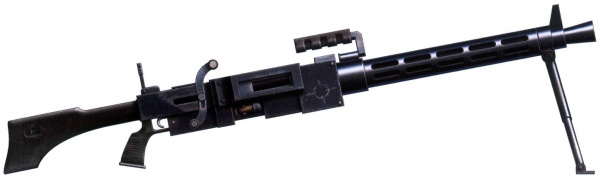

# 1234 重机枪 Heavy Stubber

精校状态：中文行文已逐段精校，部分术语仍为暂定

分类：武器 / 远程武器

原文来源：https://www.bilibili.com/opus/1004335865506299905

原作者：帝国神选罐头

原文时间：2024年11月27日 11:36

[返回分类目录](目录.md) · [全书目录](../../目录.md)

原篇名：重型伐木枪 Heavy Stubber

<!-- A1234-B0001 -->
**英文原文**

The heavy stubber, also known as a heavy stub gun, is a projectile weapon similar in appearance and effect to a M2-era heavy machine gun, firing large-calibre bullets able to stop a man dead in his tracks.

<!-- /A1234-B0001 -->

<!-- A1234-B0002 -->

原译文

重型伐木枪，也称为重型短管枪，是一种外观和效果与M2时代重机枪相似的实弹武器，发射大口径子弹，能够使一个人立刻停止行动。

**校订译文**

重机枪，又称重型短管枪，是一种实弹武器，外观和杀伤效果类似第二千纪的重机枪。它发射大口径子弹，足以将人当场击毙。

**校注：** M2是第二千纪的年代记法，不能误读为某一M2型号重机枪。

<!-- /A1234-B0002 -->

<!-- A1234-B0003 图片 -->

<!-- A1234-B0004 -->

原译文

House Escher Heavy Stubber 'Underhive Thunder' 埃舍尔家族重型伐木枪‘下巢雷霆’

**校订译文**

House Escher Heavy Stubber 'Underhive Thunder' 埃舍尔家族重机枪‘下巢雷霆’

<!-- /A1234-B0004 -->

<!-- A1234-B0005 -->
## Overview 概述

<!-- /A1234-B0005 -->

<!-- A1234-B0006 -->
**英文原文**

The heavy stubber is inferior to the Heavy Bolter in terms of penetration, being defeated by anything better than Flak armour, but compensates with sheer rate of fire, making it an ideal weapon for use against hordes of lightly-armoured infantry and vehicles. The heavy stubber is also cheap and easy to mass produce and can be built on many low-tech worlds which might not otherwise be able to construct laser weapons. The weight and recoil of many patterns of heavy stubbers require that they be fired from the prone position with a bipod or tripod, or require a pintle mount on an armoured vehicle. Others are more man-portable, and even heavier patterns can be wielded by a single trooper through the use of bracing harnesses or suspensors.

<!-- /A1234-B0006 -->

<!-- A1234-B0007 -->

原译文

重型伐木枪在穿透力方面不如重型爆矢枪，无法穿透比防弹甲更好的装甲，但以极高的射速进行补偿，使其成为对抗成群轻装甲步兵和车辆的理想武器。重型伐木枪也很便宜，易于大规模生产，可以在许多低技术世界上建造，这些世界可能无法制造激光武器。许多重型伐木枪的重量和后坐力要求它们以俯卧姿势用双脚架或三脚架射击，或者需要在装甲车上安装枢轴架。其他一些则更便于携带，甚至更重的型号也可以由一名士兵通过使用支撑安全带或吊带来挥舞。

**校订译文**

重机枪的穿甲能力不及重型爆矢枪，难以击穿防护优于防弹甲的装甲，但它以极高射速弥补了这一不足，非常适合打击成群的轻装甲步兵和载具。它价格低廉、便于量产，许多造不出激光武器的低技术世界也能制造。受重量和后坐力所限，许多型号需要用双脚架或三脚架支撑，在卧姿下射击，或者安装在装甲载具的枢轴枪架上。另一些型号更便于人员携行；即使是较重的型号，借助支撑背带或悬浮装置，也可由单兵操持。

**校注：** suspensors指减轻重量的悬浮装置，不是普通吊带。

<!-- /A1234-B0007 -->

<!-- A1234-B0008 图片 -->

<!-- A1234-B0009 -->

原译文

Renegade Heavy Stubber Team 变节者重型伐木枪队

**校订译文**

Renegade Heavy Stubber Team 变节者重机枪队

<!-- /A1234-B0009 -->

<!-- A1234-B0010 -->
**英文原文**

Within the Imperial Guard the heavy stubber remains its most common anti-personnel weapon. It is often used as a crew-served support weapon or mounted on vehicles in cases where the more potent but rarer and significantly shorter-ranged Storm Bolter is unavailable. Siege Regiments in particular, typically suffering heavy casualties and having to use local materials to replace any equipment losses, make prodigious use of heavy stubbers on account of their ease of manufacture and maintenance. Because of its pervasiveness the heavy stubber has also found its way into the hands of Imperial citizens, and is popular with both militias and outlaws.

<!-- /A1234-B0010 -->

<!-- A1234-B0011 -->

原译文

在帝国卫队内部，重型伐木枪仍然是最常见的人员杀伤武器。它通常被用作班组人员的支援武器，或在无法获得更强大、更稀有、射程较短的风暴爆矢枪的情况下安装在车辆上。特别是攻城部队，通常伤亡惨重，不得不使用当地的材料来弥补任何设备损失，由于其易于制造和维护，他们大量使用重型伐木枪。由于其普遍性，这种重型伐木枪也进入了帝国公民的手中，并受到民兵和歹徒的欢迎。

**校订译文**

在帝国卫队中，重机枪仍是最常见的反人员武器。它常被用作由多人操作的支援武器；如果无法获得威力更强、却更稀少且射程明显更短的风暴爆矢枪，也会把它安装在载具上。攻城团尤其大量使用重机枪：这些部队往往伤亡惨重，必须利用当地材料补充损失的装备，因而格外看重其制造和维护方便的特点。由于流通广泛，重机枪也进入了帝国民众手中，深受民兵和法外之徒欢迎。

<!-- /A1234-B0011 -->

<!-- A1234-B0012 图片 -->

<!-- A1234-B0013 -->

原译文

Sabre Gun Platform with quad Heavy Stubbers 带有四个重型伐木枪的长剑火炮平台

**校订译文**

Sabre Gun Platform with quad Heavy Stubbers 装备四联重机枪的长剑火炮平台

<!-- /A1234-B0013 -->

<!-- A1234-B0014 -->
**英文原文**

Adeptus Astartes armour is practically immune to heavy stubber fire, although a lucky bullet can penetrate the less-protected areas. such as the neck or other joints. and cause serious injury.

<!-- /A1234-B0014 -->

<!-- A1234-B0015 -->

原译文

阿斯塔特修会装甲几乎不受猛烈的重型伐木枪火力的影响，尽管幸运的子弹可以穿透保护较少的区域。例如颈部或其他关节。并造成严重伤害。

**校订译文**

阿斯塔特的装甲几乎能完全抵挡重机枪的射击，但偶尔也会有子弹击中颈部或其他关节等防护较弱的位置，造成严重伤害。

<!-- /A1234-B0015 -->

<!-- A1234-B0016 图片 -->

<!-- A1234-B0017 -->

原译文

Onager Dunecrawler with pintle-mounted Heavy Stubber 野驴沙丘爬行者，带枢轴式重型伐木枪

**校订译文**

Onager Dunecrawler with pintle-mounted Heavy Stubber 装有枢轴式重机枪的沙丘爬行者

<!-- /A1234-B0017 -->

<!-- A1234-B0018 -->
## Known Patterns and Variants 已知型号与变体

<!-- /A1234-B0018 -->

<!-- A1234-B0019 -->
### Cognis Heavy Stubber 智能重机枪

原题：Cognis Heavy Stubber 智能重型伐木枪

<!-- /A1234-B0019 -->

<!-- A1234-B0020 -->
**英文原文**

This is simply a heavy stubber which has been upgraded to become a cognis weapon.

<!-- /A1234-B0020 -->

<!-- A1234-B0021 -->

原译文

这只是一个重型伐木枪升级为智能武器。

**校订译文**

这是升级为智能武器的重机枪。

<!-- /A1234-B0021 -->

<!-- A1234-B0022 -->
### Diabolus and Questoris Heavy Stubbers 恶魔与巡游重机枪

原题：Diabolus and Questoris Heavy Stubbers 恶魔与巡游重型伐木枪

<!-- /A1234-B0022 -->

<!-- A1234-B0023 -->
**英文原文**

Chaos Knights and Imperial Knights commonly employ diabolus and questoris heavy stubbers, respectively; aside from being modified to be mounted on a Knight chassis, the two types don't seem to have identical performance on some targets, which may be due to being chambered with distinct types of ammunition.

<!-- /A1234-B0023 -->

<!-- A1234-B0024 -->

原译文

混沌骑士和帝国骑士通常分别使用恶魔和巡游重型伐木枪；除了被改装为安装在骑士底盘上外，这两种类型在某些目标上的性能似乎并不相同，这可能是因为它们装有不同类型的弹药。

**校订译文**

混沌骑士和帝国骑士通常分别使用恶魔重机枪和巡游重机枪。这两种武器都经过改装，可安装在骑士机体上；它们对某些目标的杀伤表现似乎有所不同，可能与所用弹药类型不同有关。

<!-- /A1234-B0024 -->

<!-- A1234-B0025 -->
### Echon Pattern Mark III Assault Stubber 回声型Mark III突击伐木枪

<!-- /A1234-B0025 -->

<!-- A1234-B0026 -->
**英文原文**

A more specialized and advanced variant of the standard Heavy Stubber, this weapon has two barrels that spew out stub ammunition to lay down a dense barrage of shells. It is often used by special forces in quelling uprisings. The gun is designed to be used with a backpack ammo pack massing 25 kg and carrying 200 rounds of ammunition.

<!-- /A1234-B0026 -->

<!-- A1234-B0027 -->

原译文

这种武器是标准重型伐木枪的一种更专业、更先进的变体，它有两个枪管，可以射出剩余弹药，发射密集的弹幕。它经常被特殊部队用来镇压暴动。该枪设计用于携带25公斤重、200发弹药的弹药背包。

**校订译文**

这是标准重机枪的一种更先进、更专门化的改型，两根枪管可倾泻密集实弹，形成弹幕，常被特种部队用于镇压叛乱。该枪配用的背负式弹药箱重25公斤，可容纳200发弹药。

<!-- /A1234-B0027 -->

<!-- A1234-B0028 图片 -->

<!-- A1234-B0029 -->

原译文

Echon Pattern Mark III Assault Stubber 回声型Mark III突击伐木枪

**校订译文**

Echon Pattern Mark III Assault Stubber 回声型Mark III突击伐木枪

<!-- /A1234-B0029 -->

<!-- A1234-B0030 -->
### Ironhail Heavy Stubber 铁雹重机枪

<!-- /A1234-B0030 -->

<!-- A1234-B0031 -->
**英文原文**

Used by Primaris Space Marines, notably Impulsor and Repulsor vehicles; why they are preferred over bolt weapons is unclear. Available in both standard and "Icarus" variations; while what exactly differs about the latter is unclear, it appears to be particularly effective against enemy flyers.

<!-- /A1234-B0031 -->

<!-- A1234-B0032 -->

原译文

主要用于星际战士，特别是冲击者和反击者载具；为什么它们比爆矢武器更受欢迎尚不清楚。有标准和伊卡洛斯两种变体；虽然后者的确切区别尚不清楚，但它似乎对敌方飞行员特别有效。

**校订译文**

原铸星际战士使用这种武器，尤其常见于脉冲战车和反重力战车；为何选用它而非爆矢武器，尚不清楚。它有标准型和“伊卡洛斯”型，后者的具体差异同样不明，但似乎特别适合打击敌方飞行器。

<!-- /A1234-B0032 -->

<!-- A1234-B0033 图片 -->

<!-- A1234-B0034 -->

原译文

Ironhail Heavy Stubber 铁雹重机枪

**校订译文**

Ironhail Heavy Stubber 铁雹重机枪

<!-- /A1234-B0034 -->

<!-- A1234-B0035 -->
### Ironhead Heavy Stubber 铁首重机枪

<!-- /A1234-B0035 -->

<!-- A1234-B0036 -->
**英文原文**

Used by the Squat Ironhead Prospectors of Necromunda. Twin-barrelled and drum-fed.

<!-- /A1234-B0036 -->

<!-- A1234-B0037 -->

原译文

由涅克罗蒙达的铁首矮人探矿队使用。双管和弹鼓。

**校订译文**

涅克罗蒙达的矮人铁首勘探者使用这种双管、弹鼓供弹的武器。

<!-- /A1234-B0037 -->

<!-- A1234-B0038 图片 -->

<!-- A1234-B0039 -->

原译文

Drill Master with Ironhead Heavy Stubber 挖掘大师装备铁首重机枪

**校订译文**

Drill Master with Ironhead Heavy Stubber 装备铁首重机枪的钻探大师

<!-- /A1234-B0039 -->

<!-- A1234-B0040 -->
### Iron Rain 铁雨

<!-- /A1234-B0040 -->

<!-- A1234-B0041 -->
**英文原文**

The Iron Rain is a highly modifiable heavy stubber pattern, popular amongst the gangers and hired guns of Necromunda. In comparison to its contemporary, the 'Tempest', its rounds tend to cause greater injuries to the victim, though it lacks the Tempest's rate of fire, magazine capacity and penetration potential. Associated with the gangers of House Orlock.

<!-- /A1234-B0041 -->

<!-- A1234-B0042 -->

原译文

铁雨是一种高度可修改的重型伐木枪型号，在涅克罗蒙达的歹徒和雇佣枪手中很受欢迎。与同时代的暴风相比，它的子弹往往会对受害者造成更大的伤害，尽管它缺乏暴风的射速、弹匣容量和穿透力。与欧洛克家族的歹徒有关联。

**校订译文**

“铁雨”是一种便于进行多种改装的重机枪，在涅克罗蒙达的帮派成员和雇佣枪手中很受欢迎。与同时代的“暴风”相比，它的单发弹药往往造成更严重的创伤，但射速、弹匣容量和穿甲能力都逊于对方。欧洛克家族的帮派成员常使用这种型号。

<!-- /A1234-B0042 -->

<!-- A1234-B0043 图片 -->

<!-- A1234-B0044 -->

原译文

Iron Rain 铁雨

**校订译文**

Iron Rain 铁雨

<!-- /A1234-B0044 -->

<!-- A1234-B0045 -->
### Tempest 暴风

<!-- /A1234-B0045 -->

<!-- A1234-B0046 -->
**英文原文**

The Tempest is a highly modifiable heavy stubber pattern, popular amongst the gangers and hired guns of Necromunda. In comparison to its contemporary, the 'Iron Rain', the Tempest possesses a higher rate of fire, magazine capacity and penetration though its individual shots tend to be less lethal. Associated with the gangers of House Escher.

<!-- /A1234-B0046 -->

<!-- A1234-B0047 -->

原译文

暴风是一种高度可修改的重型伐木枪型号，在涅克罗蒙达的歹徒和雇佣枪手中很受欢迎。与同时代的铁雨相比，暴风拥有更高的射速、弹匣容量和穿透力，尽管其单次射击往往不那么致命。与埃舍尔家族的歹徒有关联。

**校订译文**

“暴风”是一种便于进行多种改装的重机枪，在涅克罗蒙达的帮派成员和雇佣枪手中很受欢迎。与同时代的“铁雨”相比，它的射速更高、弹匣更大、穿甲能力更强，但单发弹药的杀伤力相对较低。埃舍尔家族的帮派成员常使用这种型号。

<!-- /A1234-B0047 -->

<!-- A1234-B0048 图片 -->

<!-- A1234-B0049 -->

原译文

Tempest 暴风

**校订译文**

Tempest 暴风

<!-- /A1234-B0049 -->

<!-- A1234-B0050 -->
### Unknown Vraks Heavy Stubber 未知的弗拉克斯重机枪

原题：Unknown Vraks Heavy Stubber 未知的弗拉克斯重型伐木枪

<!-- /A1234-B0050 -->

<!-- A1234-B0051 -->
**英文原文**

During the Siege of Vraks the traitorous Vraksian Renegade Militia made use of an unknown pattern of heavy stubber, most likely manufactured on the planet itself using the spare parts of other weapons. Belt-fed and with a bipod for stable firing from the prone position, the weapon was fitted with both backsight and foresight, carrying handle, and perforated outer barrel to aid in cooling.

<!-- /A1234-B0051 -->

<!-- A1234-B0052 -->

原译文

在弗拉克斯围城期间，叛变的弗拉克斯叛徒民兵使用了一种未知的重型伐木枪，很可能是在星球上使用其他武器的备件制造的。该武器采用弹带供弹，配有双脚架，可以俯卧姿态稳定射击，配有后视和前视功能、提手和穿孔外筒，以帮助冷却。

**校订译文**

弗拉克斯围城期间，叛变的弗拉克斯民兵使用了一种型号不明的重机枪，很可能是利用其他武器的零件在当地制造的。它采用弹链供弹，配有双脚架，以便卧姿稳定射击；枪上还装有照门、准星和提把，枪管外套开有散热孔。

<!-- /A1234-B0052 -->

<!-- A1234-B0053 图片 -->

<!-- A1234-B0054 -->

原译文

Vraks Heavy Stubber 弗拉克斯重型伐木枪

**校订译文**

Vraks Heavy Stubber 弗拉克斯重机枪

<!-- /A1234-B0054 -->

<!-- A1234-B0055 -->

原译文

Length: 122 cm 长度：122厘米

**校订译文**

Length: 122 cm 长度：122厘米

<!-- /A1234-B0055 -->

<!-- A1234-B0056 -->

原译文

Barrel: 60 cm 枪管：60厘米

**校订译文**

Barrel: 60 cm 枪管：60厘米

<!-- /A1234-B0056 -->

<!-- A1234-B0057 -->

原译文

Weight: 7.8 kg 重量：7.8公斤

**校订译文**

Weight: 7.8 kg 重量：7.8公斤

<!-- /A1234-B0057 -->

<!-- A1234-B0058 -->

原译文

Calibre: long 8.25 口径：长8.25

**校订译文**

Calibre: long 8.25 口径：长8.25

**校注：** 原文未给出8.25的单位，保留数据原貌，未擅补。

<!-- /A1234-B0058 -->

<!-- A1234-B0059 -->

原译文

Feed: 50 round belt 弹容：50发弹药带

**校订译文**

Feed: 50 round belt 供弹：50发弹链

<!-- /A1234-B0059 -->

<!-- A1234-B0060 -->

原译文

Cyclic rate of fire: 850 rpm 理论射速：850 rpm

**校订译文**

Cyclic rate of fire: 850 rpm 理论射速：每分钟850发

<!-- /A1234-B0060 -->

<!-- A1234-B0061 -->

原译文

Muzzle velocity: 750 m/s 枪口速度：750 m/s

**校订译文**

Muzzle velocity: 750 m/s 枪口初速：750米／秒

<!-- /A1234-B0061 -->

<!-- A1234-B0062 -->
### Volg VI “Crank Cannon” Heavy Stubber 伏尔格 VI“曲柄炮”重机枪

原题：Volg VI “Crank Cannon” Heavy Stubber 伏尔加 VI“曲柄炮”重型伐木枪

<!-- /A1234-B0062 -->

<!-- A1234-B0063 -->
**英文原文**

The Volg VI “Crank Cannon” Heavy Stubber is cheaply manufactured with prefabricated parts and uses standard heavy stubbed ammo. The Crane Cannon is successful despite its drawbacks and is produced in huge numbers on Fenksworld. It finds usage in low-grade PDF forces and the private arms market across the Calixis Sector. The Crank Cannon is fired by cranking the firing handle to force the ammo belt through the breach and to turn the quadruple barrels.

<!-- /A1234-B0063 -->

<!-- A1234-B0064 -->

原译文

伏尔加 VI“曲柄炮”重型伐木枪是用预制件廉价制造的，并使用标准的重型伐木枪弹药。尽管存在缺点，曲柄炮还是取得了成功，并在芬克斯世界上大量生产。它在低级PDF部队和整个卡利西斯星区的私人武器市场中都有使用。曲柄炮是通过转动射击手柄来使弹药带穿过供弹口并转动四根枪管来发射的。

**校订译文**

伏尔格 VI“曲柄炮”重机枪采用预制零件廉价生产，使用标准重机枪弹药。尽管有种种缺点，它仍相当成功，在芬克斯世界大量生产，被装备较差的行星防卫军使用，也流通于卡利西斯星区的私人军火市场。射手转动射击摇柄，带动弹链供弹并使四根枪管旋转，即可开火。

**校注：** 同段Crane Cannon显然是Crank Cannon的异写，中文统一曲柄炮；PDF在此为Planetary Defence Force行星防卫军。

<!-- /A1234-B0064 -->

本篇核心术语与暂定项

以下列出本篇出现的英文原形及核心术语表用词。同形词可能指不同对象，具体词义以本篇正文和校注为准；单复数、别名和仅见于图注的名称可能尚未列入。完整候选见[术语表](../../术语表/双语术语候选.csv)。

| 英文 | 采用中文 | 状态 |
| --- | --- | --- |
| Space Marines | 星际战士 | 官方已核对 |
| Adeptus Astartes | 阿斯塔特修会 | 官方已核对 |
| Imperial Guard | 帝国卫队 | 暂定·语境区分 |
| Equipment | 装备 | 编辑用语已统一 |
| Necromunda | 涅克罗蒙达 | 暂定·官方待核 |
| House Escher | 埃舍尔家族 | 暂定·官方待核 |
| Sector | 星区 | 暂定·官方待核 |
| Tech | 技术语 | 暂定·官方待核 |
| Impulsor | 脉冲战车（载具）／冲击者（小队名） | 语境定译·载具官译已核 |
| Repulsor | 反重力战车 | 官方已核 |
| The Weapon | 武器 | 暂定·官方待核 |
| Gun | 甘 | 暂定·官方待核 |
| Calixis Sector | 卡利西斯星区 | 暂定·官方待核 |
| Fenksworld | 芬克斯世界 | 暂定·官方待核 |
| Bullets | 子弹 | 暂定·官方待核 |
| Projectile Weapon | 实弹武器 | 暂定·官方待核 |
| Stub Gun | 短管枪 | 暂定·官方待核 |
| Heavy stubber | 重机枪 | 官方已核对 |
| Iron Rain | 铁雨 | 暂定·官方待核 |
| Volg VI “Crank Cannon” Heavy Stubber | 伏尔格 VI“曲柄炮”重机枪 | 官方词根参考·全称待核 |
| Bolt | 爆矢 | 暂定·官方待核 |
| Bolter | 爆矢枪 | 暂定·官方待核 |
| Heavy bolter | 重型爆矢枪 | 官方已核对 |
| Storm bolter | 风暴爆矢枪 | 官方已核对 |
| Laser Weapons | 激光武器 | 暂定·官方待核 |
| Tripod | 三脚架 | 暂定·官方待核 |
| House Orlock | 欧洛克家族 | 暂定·官方待核 |

