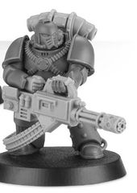
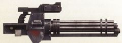

# 1235 转管炮 Rotor Cannon

精校状态：中文行文已逐段精校，部分术语仍为暂定

分类：武器 / 远程武器

原文来源：https://www.bilibili.com/opus/1009181868513296387

原作者：帝国神选罐头

原文时间：2024年12月10日 13:01

[返回分类目录](目录.md) · [全书目录](../../目录.md)

原篇名：旋转炮 Rotor Cannon

<!-- A1235-B0001 -->
**英文原文**

Rotor Cannons were weapons used by the Imperial Army and Space Marine Legions during the Great Crusade and Horus Heresy.

<!-- /A1235-B0001 -->

<!-- A1235-B0002 -->

原译文

旋转炮是帝国陆军和星际战士在大远征和荷鲁斯叛乱期间使用的武器。

**校订译文**

转管炮是帝国军和星际战士军团在大远征及荷鲁斯之乱期间使用的武器。

**校注：** Imperial Army 沿第18篇定译帝国军；旧制包括后来拆出的海军，与普通陆军及后世帝国卫队区分。

<!-- /A1235-B0002 -->

<!-- A1235-B0003 -->
## Overview 概述

<!-- /A1235-B0003 -->

<!-- A1235-B0004 -->
**英文原文**

These weapons were multi-barrelled Stubbers, using electric motors to maintain an extremely high rate of fire from their spinning barrel. Their medium calibre-slugs lacked the power of bolter shells, but nonetheless the sheer volume of them proved effective against unarmoured hordes of foes and fleshy xenos. Eventually, the more famous Space Marine Assault Cannon was developed from the Rotor Cannon.

<!-- /A1235-B0004 -->

<!-- A1235-B0005 -->

原译文

这些武器是多管伐木枪，使用电动机从旋转的枪管中保持极高的射速。他们的中等口径子弹缺乏爆矢弹的威力，但尽管如此，他们的庞大数量仍被证明对无装甲的敌人和肉身的异教徒有效。最终，更著名的星际战士突击炮是从旋转炮发展而来的。

**校订译文**

这类多管伐木枪以电动机驱动枪管旋转，保持极高射速。虽然其中等口径弹丸的威力不及爆矢弹，但凭借密集的弹雨，仍能有效杀伤成群的无装甲敌人和血肉之躯的异形。后来，更为知名的星际战士突击炮便由转管炮发展而来。

<!-- /A1235-B0005 -->

<!-- A1235-B0006 -->
**英文原文**

Their origins obscured by time, many patterns of weapon employed by the Space Marine Legions date back to the Dark Age of Technology or before. Simpler to produce than most heavy weaponry, the Rotor Cannon found use in many Legion Tactical Support squads.

<!-- /A1235-B0006 -->

<!-- A1235-B0007 -->

原译文

他们的起源被时间所掩盖，星际战士使用的许多武器型号可以追溯到黑暗技术时代或更早。比大多数重型武器更容易生产，旋转炮在许多军团战术支援小队中都有使用。

**校订译文**

星际战士军团使用的许多武器型号可追溯至黑暗科技时代，甚至更早，确切起源已湮没在岁月中。转管炮比大多数重型武器更容易生产，因此被许多军团战术支援小队采用。

<!-- /A1235-B0007 -->

<!-- A1235-B0008 -->
**英文原文**

Rotor Cannons are commonly carried by a Voidsman-At-Arms to augment the firepower of their squad. These weapons have earned a variety of nicknames such as: whirgun, deck-clearer, and the Emperor's chainsaw.

<!-- /A1235-B0008 -->

<!-- A1235-B0009 -->

原译文

旋转炮通常由重装虚空水兵携带，以增强其小队的火力。这些武器有各种各样的绰号，如：呼呼枪、甲板清理器和帝皇链锯。

**校订译文**

虚空武装水兵常携带转管炮，以增强小队火力。这种武器有“呼啸枪”“甲板清扫者”和“帝皇的链锯”等许多绰号。

<!-- /A1235-B0009 -->

<!-- A1235-B0010 -->
## Known Patterns 已知型号

<!-- /A1235-B0010 -->

<!-- A1235-B0011 -->
### Proteus pattern 普罗透斯型

<!-- /A1235-B0011 -->

<!-- A1235-B0012 -->
**英文原文**

Unknown origin, in use since long before the coming of the Emperor and the Age of the Imperium.

<!-- /A1235-B0012 -->

<!-- A1235-B0013 -->

原译文

起源不明，早在帝皇和人类帝国时代到来之前就已使用。

**校订译文**

起源不明，早在帝皇和人类帝国时代到来之前就已使用。

<!-- /A1235-B0013 -->

<!-- A1235-B0014 图片 -->

<!-- A1235-B0015 -->

原译文

Proteus Pattern 普罗透斯型

**校订译文**

Proteus Pattern 普罗透斯型

<!-- /A1235-B0015 -->

<!-- A1235-B0016 -->
### Heavy Rotor Cannon 重型转管炮

原题：Heavy Rotor Cannon 重型旋转炮

<!-- /A1235-B0016 -->

<!-- A1235-B0017 -->
**英文原文**

The heavy rotor cannon is an improved version of the humble rotor cannon that fires larger calibre ammunition and possesses more robust motors for the barrel assembly. While still not matching the power of the assault cannon that would render it obsolete, it was superior to the standard rotor cannon and its lighter weight allowed it to be attached to the small Estoc Pattern Jetbikes without compromising their agility.

<!-- /A1235-B0017 -->

<!-- A1235-B0018 -->

原译文

重型旋转炮是简陋旋转炮的改进版，可以发射更大口径的弹药，并为枪管组件配备更坚固的发动机。虽然它仍然无法与将使其过时的突击炮的力量相匹配，但它优于标准旋转炮，而且它的重量更轻，可以连接到小型穿刺型喷气摩托上，而不会影响它们的敏捷性。

**校订译文**

重型转管炮是普通转管炮的改进型，使用更大口径的弹药，枪管组件也配备了更强劲的电动机。它虽然优于标准转管炮，威力仍比不上后来使其过时的突击炮；不过，其相对较轻的重量使它可以安装在小型穿刺型喷气摩托上，而不损害机动性。

**校注：** “lighter weight”的明确比较对象未写明，按上下文保留相对较轻的描述，不断言比标准旋转炮更轻。

<!-- /A1235-B0018 -->

<!-- A1235-B0019 -->
### Nomus Pattern 诺莫斯型

<!-- /A1235-B0019 -->

<!-- A1235-B0020 -->
**英文原文**

Used by the Night Lords during the Horus Heresy.

<!-- /A1235-B0020 -->

<!-- A1235-B0021 -->

原译文

荷鲁斯叛乱时期被午夜领主使用。

**校订译文**

荷鲁斯之乱期间，午夜领主使用这种型号。

<!-- /A1235-B0021 -->

<!-- A1235-B0022 图片 -->

<!-- A1235-B0023 -->

原译文

Nomus Pattern 诺莫斯型

**校订译文**

Nomus Pattern 诺莫斯型

<!-- /A1235-B0023 -->

<!-- A1235-B0024 -->
### Obsidite Pattern 黑曜石型

<!-- /A1235-B0024 -->

<!-- A1235-B0025 -->
**英文原文**

Used by the Salamanders during the Horus Heresy. These weapons have much in common with the multi-barrelled, rotary weapons commonly found in Legion arsenals but are enhanced with the use of specialist rounds, tipped with a hyper-hardened mineral naturally formed from the pyroclastic flows of Nocturne's oldest volcanoes.

<!-- /A1235-B0025 -->

<!-- A1235-B0026 -->

原译文

在荷鲁斯叛乱时期被火蜥蜴使用。这些武器与军团军械库中常见的多管旋转武器有很多共同之处，但通过使用特殊弹药进行了增强，这些弹药的尖端是由夜曲星最古老火山的火山碎屑流自然形成的超硬化矿物。

**校订译文**

荷鲁斯之乱期间，火蜥蜴使用这种型号。它与军团军械库中常见的多管旋转武器有许多共同之处，但采用了特殊弹药来增强威力：弹头尖端使用一种天然形成于夜曲星古老火山碎屑流中的超硬矿物。

<!-- /A1235-B0026 -->

<!-- A1235-B0027 -->
### Snub Pattern 短管型

原题：Snub Pattern 斥责型

**校注：** Snub在枪械语境中指短管、紧凑型，原译“斥责”误取动词词义；首次保留原稿别名。

<!-- /A1235-B0027 -->

<!-- A1235-B0028 -->
**英文原文**

Unlike the more common rotor cannon carried by Space Marine support troops, the snub rotor cannon sacrifices range for a vastly increased ammunition capacity and greater rate of fire. It generates such a hail of projectiles that even heavy armour is not fully proof against the weight of firepower these weapons can produce.

<!-- /A1235-B0028 -->

<!-- A1235-B0029 -->

原译文

与星际战士支援部队携带的更常见的旋转炮不同，斥责旋转炮牺牲了射程，从而大大提高了弹药容量和射速。它会产生大量的投射物，即使是重型装甲也无法完全抵御这些武器所能产生的火力。

**校订译文**

与星际战士支援部队通常携带的转管炮相比，短管转管炮牺牲了射程，换来大幅增加的载弹量和更高射速。它倾泻的弹雨极为密集，连重型装甲也难以完全抵挡。

<!-- /A1235-B0029 -->

本篇核心术语与暂定项

以下列出本篇出现的英文原形及核心术语表用词。同形词可能指不同对象，具体词义以本篇正文和校注为准；单复数、别名和仅见于图注的名称可能尚未列入。完整候选见[术语表](../../术语表/双语术语候选.csv)。

| 英文 | 采用中文 | 状态 |
| --- | --- | --- |
| Imperial Army | 帝国军 | 暂定·官方待核 |
| Horus Heresy | 荷鲁斯之乱 | 官方已核对 |
| Imperium | 帝国 | 暂定·简称 |
| Dark Age of Technology | 黑暗科技时代 | 暂定 |
| Emperor | 帝皇 | 官方已核对 |
| Night Lords | 午夜领主 | 暂定·官方待核 |
| Great Crusade | 大远征 | 暂定·官方待核 |
| Horus | 荷鲁斯 | 暂定·官方待核 |
| Age of the Imperium | 帝国时代 | 暂定·官方待核 |
| Salamanders | 火蜥蜴 | 暂定·官方待核 |
| Nocturne | 夜曲星 | 暂定·官方待核 |
| Space Marine | 星际战士 | 暂定·官方待核 |
| Xenos | 异形 | 暂定·官方待核 |
| Rotor Cannon | 转管炮 | 暂定·官方待核 |
| The Dark | 《黑暗》 | 暂定·官方待核 |
| Assault Cannon | 突击炮 | 暂定·官方待核 |
| Heavy Rotor Cannon | 重型转管炮 | 暂定·官方待核 |
| Snub Rotor Cannon | 短管转管炮 | 暂定·官方待核 |
| Voidsman-At-Arms | 虚空武装水兵 | 暂定·官方待核 |
| Bolter | 爆矢枪 | 暂定·官方待核 |

