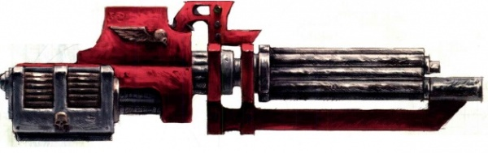
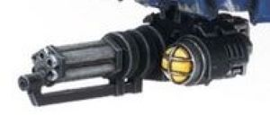
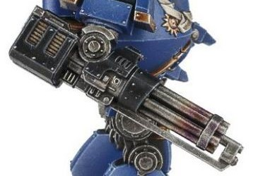
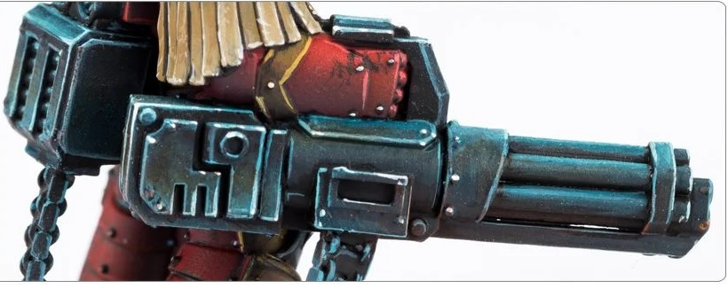

# 1236 突击炮 Assault Cannon

精校状态：中文行文已逐段精校，部分术语仍为暂定

分类：武器 / 远程武器

原文来源：https://www.bilibili.com/opus/1003243144220770329

原作者：帝国神选罐头

原文时间：2024年11月24日 12:55

[返回分类目录](目录.md) · [全书目录](../../目录.md)

<!-- A1236-B0001 -->
**英文原文**

The assault cannon is a heavy, automatic anti-personnel weapon commonly used by Terminator armoured Space Marines.

<!-- /A1236-B0001 -->

<!-- A1236-B0002 -->

原译文

突击炮是一种重型自动杀伤人员武器，通常由终结者装甲星际战士使用。

**校订译文**

突击炮是一种重型自动反人员武器，通常由穿着终结者装甲的星际战士使用。

<!-- /A1236-B0002 -->

<!-- A1236-B0003 图片 -->

<!-- A1236-B0004 -->

原译文

Space Marine Assault Cannon 星际战士突击炮

**校订译文**

Space Marine Assault Cannon 星际战士突击炮

<!-- /A1236-B0004 -->

<!-- A1236-B0005 -->
## Description 描述

原题：Description 说明

<!-- /A1236-B0005 -->

<!-- A1236-B0006 -->
**英文原文**

Its most notable feature is its incredibly high rate of fire, easily eclipsing that of the autocannon it replaced. It is a medium-calibre rotary autocannon, with 6 barrels cycled by an electric motor past a single chamber.

<!-- /A1236-B0006 -->

<!-- A1236-B0007 -->

原译文

它最显著的特点是其令人难以置信的高射速，很容易超过它所取代的自动炮。这是一门中等口径的旋转式自动炮，有6个枪管，通过一个由电动机驱动的膛室。

**校订译文**

突击炮最显著的特点是极高的射速，远超被它取代的自动炮。它是一种中等口径的旋转式自动炮，由电动机驱动六根枪管，依次转过同一膛室。

**校注：** 本句严格保留英文所述“六管依次经过同一膛室”的结构描述，未据现实转管炮构造改写底稿设定。

<!-- /A1236-B0007 -->

<!-- A1236-B0008 -->
**英文原文**

The weapon was developed after the Horus Heresy as a replacement for the autocannon and Rotor Cannon, which had been a common heavy weapon on Terminator suits until then. Introduced during the mark 3a phase of Terminator armour development, this weapon is the standard alternative to the heavy flamer as a squad's special weapon. Its design has changed little, retaining the distinctively long, cylindrical, rotating barrels.

<!-- /A1236-B0008 -->

<!-- A1236-B0009 -->

原译文

该武器是在荷鲁斯叛乱之后开发的，作为自动炮和旋转炮的替代品，在此之前，自动炮一直是终结者上常见的重型武器。这款武器是在Mark.IIIa终结者装甲的开发阶段推出的，作为小队特殊武器的重型火焰枪的标准替代品。它的设计几乎没有变化，保留了独特的长圆柱形旋转枪管。

**校订译文**

这种武器是在荷鲁斯之乱后发展起来的，用以取代此前终结者装甲常用的自动炮和转管炮。它于终结者装甲研发的 Mk.IIIa 阶段引入，作为小队特殊武器，与重型火焰喷射器构成标准的两种选项。其设计此后变化不大，始终保留着长而呈圆柱状的旋转枪管这一鲜明特征。

**校注：** 本段称武器在荷鲁斯之乱后发展，下文却列有大远征原型；两段时代口径存在张力，照原文保留，不擅自将原型改成战后。

<!-- /A1236-B0009 -->

<!-- A1236-B0010 -->
**英文原文**

Although it lacks the range of the autocannon and many other heavy weapons, the assault cannon is a fearsome weapon when used in the close range role it was designed for. The weapon is prone to overheating and jams due to its high rate of fire - the number of rounds fired per second are counted in the hundreds. The barrels and other firing components are made of a heat-dispersing ceramic/metallic alloy, helping the weapon to withstand the intense heat generated by its high rate of fire. Despite this, the barrels still reach temperatures of over 300°. Due to the high rate of wear on the barrels, the barrels are replaced after every mission. Motor and barrel failure are common problems with the assault cannon, making the weapon prone to jamming during sustained bursts. The weight and complexity of the mechanism, and the heavy recoil generated means that the assault cannon requires a stable firing platform. The weapon is not considered man portable, however the powerful servos, recoil compensators and stabilizers built into Terminator armour allows the elite Astartes Terminator squads to carry the weapon into battle. The assault cannon is well suited to the battlefield role of Terminator squads, providing a massive rate of fire which often compensates for the enemies' vast superiority in numbers. In confined environments providing long corridors of fire, such as space hulks and hive worlds, the assault cannon is invaluable.

<!-- /A1236-B0010 -->

<!-- A1236-B0011 -->

原译文

虽然它缺乏自动炮和许多其他重型武器的射程，但突击炮在用于近距离任务时是一种可怕的武器。由于其高射速，该武器容易过热和卡膛——每秒发射的子弹数数以百计。枪管和其他射击部件由散热陶钢/金属合金制成，有助于武器承受其高射速产生的强烈热量。尽管如此，这些枪管的温度仍然超过300°。由于枪管磨损率很高，每次任务后都会更换枪管。引擎和枪管故障是突击炮的常见问题，使武器在持续爆发时容易卡住。该机构的重量和复杂性，以及产生的重后坐力意味着突击炮需要一个稳定的射击平台。该武器不被认为是便携的，但终结者盔甲中内置的强大伺服系统、后坐力补偿器和稳定器使精英阿斯塔特终结者小队能够携带该武器进入战斗。突击炮非常适合终结者小队的战场角色，提供了巨大的火力，这往往弥补了敌人在数量上的巨大优势。在提供长距离火力走廊的密闭环境中，如太空废船和巢都世界，突击炮是无价的。

**校订译文**

突击炮的射程虽然不及自动炮和许多其他重型武器，但在设计所针对的近距离交战中极为可怕。它每秒可发射数百发弹药，因而很容易过热和卡弹。枪管及其他发射部件由利于散热的陶瓷与金属复合材料制成，以承受高射速产生的热量；即便如此，枪管温度仍会超过300度。枪管磨损严重，每次任务结束后都要更换。电动机和枪管故障也很常见，导致武器在持续连射时容易卡弹。复杂而沉重的机构加上强大后坐力，要求突击炮必须拥有稳定的射击平台。它通常不属于可由人员携行使用的武器，但终结者装甲内置的强大伺服系统、后坐力补偿器和稳定装置，使阿斯塔特精锐终结者小队得以带着它投入战斗。它十分适合终结者小队的作战方式，极高射速往往能够抵消敌人的巨大数量优势。在太空废船和巢都世界等空间狭窄、却有长直射击通道的环境中，突击炮的价值尤其突出。

**校注：** 原文只写300°，未说明温标，中文保留为300度。ceramic并未使用专名ceramite，故不译陶钢。

<!-- /A1236-B0011 -->

<!-- A1236-B0012 -->
**英文原文**

The high rate of fire makes the assault cannon unsuitable for extended engagements when used by Terminators, as the ammunition carried is quickly exhausted. This drawback is negated in vehicle and Dreadnought mountings, where ammunition storage capacity is far greater. The standard ammunition fired is a cased round, comprising a dense metallic core covered in a non-metallic composite sheath with a diamantine tip. This provides excellent penetration capabilities against light and personal armour.

<!-- /A1236-B0012 -->

<!-- A1236-B0013 -->

原译文

高射速使得突击炮在终结者使用时不适合长时间交战，因为携带的弹药很快就会耗尽。这一缺点在车辆和无畏上被抵消了，因为它们的弹药储存能力要大得多。发射的标准弹药是一种套壳弹药，由一个致密的金属芯覆盖在一个带有金刚石尖端的非金属复合护套中。这为对抗轻型和个人装甲提供了出色的穿透能力。

**校订译文**

终结者携带的弹药会在高射速下迅速耗尽，因此突击炮不适合由他们用于长时间交战。载具和无畏机甲能储存更多弹药，可以弥补这一缺点。其标准弹药为有壳弹，弹丸采用高密度金属芯，外覆非金属复合材料被甲，尖端使用钻金，对轻型装甲和单兵护甲具有出色的穿透力。

<!-- /A1236-B0013 -->

<!-- A1236-B0014 图片 -->

<!-- A1236-B0015 -->

原译文

Assault Cannon 突击炮

**校订译文**

Assault Cannon 突击炮

<!-- /A1236-B0015 -->

<!-- A1236-B0016 -->
**英文原文**

It has long been reported by the Astartes that the assault cannon's massive rate of fire can allow it to chew through armour that would normally be impenetrable to a weapon of its calibre. Extensive testing by the Adeptus Mechanicus supported this observation, and Astartes targeting doctrines have been officially amended to recognize this attribute. The logistic shortcomings of the assault cannon are far outweighed by its destructiveness in combat and its effect on enemy morale.

<!-- /A1236-B0016 -->

<!-- A1236-B0017 -->

原译文

阿斯塔特长期以来一直宣布，突击炮的巨大射速可以让它穿透通常这种口径的武器无法穿透的盔甲。机械神教的广泛测试支持了这一观点，阿斯塔特瞄准理论已被正式修订以承认这一属性。突击炮在后勤方面的不足远远被其在战斗中的破坏力及其对敌军士气的影响所抵消。

**校订译文**

阿斯塔特长期报告称，突击炮凭借极高射速，能撕开通常不可能被同口径武器击穿的装甲。机械修会的大量试验支持了这一观察，阿斯塔特的射击教范也已正式修订，将这种能力纳入考量。突击炮在战斗中的破坏力及其对敌军士气的打击，远远抵消了后勤保障方面的不足。

<!-- /A1236-B0017 -->

<!-- A1236-B0018 -->
## Known Patterns 已知型号

<!-- /A1236-B0018 -->

<!-- A1236-B0019 -->
**英文原文**

Absinia Pattern - Used by the Sons of Medusa during the Badab War.

<!-- /A1236-B0019 -->

<!-- A1236-B0020 -->

原译文

阿比西尼亚型 - 巴达布战争期间美杜莎之子使用。

**校订译文**

阿比西尼亚型 - 巴达布战争期间美杜莎之子使用。

<!-- /A1236-B0020 -->

<!-- A1236-B0021 -->
**英文原文**

Mk II Absinia Pattern - Used by the Salamanders and Carcharadons during the Badab War.

<!-- /A1236-B0021 -->

<!-- A1236-B0022 -->

原译文

Mk II 阿比西尼亚型 - 在巴达布战争期间被火蜥蜴和噬人鲨使用。

**校订译文**

Mk II 阿比西尼亚型 - 在巴达布战争期间被火蜥蜴和噬人鲨使用。

<!-- /A1236-B0022 -->

<!-- A1236-B0023 -->
**英文原文**

Absolo Pattern - Used by the Red Scorpions during the investigation into Beta Anphelion IV.

<!-- /A1236-B0023 -->

<!-- A1236-B0024 -->

原译文

阿布索罗型 - 红蝎在调查贝塔·远日IV号时使用。

**校订译文**

阿布索罗型——红蝎在调查贝塔-安菲利翁四号星期间使用。

<!-- /A1236-B0024 -->

<!-- A1236-B0025 -->
**英文原文**

Mk VIII Absolo Pattern — Used by the Space Wolves.

<!-- /A1236-B0025 -->

<!-- A1236-B0026 -->

原译文

Mk VIII 阿布索罗型 — 太空野狼使用。

**校订译文**

Mk VIII 阿布索罗型 — 太空野狼使用。

<!-- /A1236-B0026 -->

<!-- A1236-B0027 -->
**英文原文**

Kheres Pattern — Great Crusade-era prototype. Used by Contemptor Pattern Dreadnoughts in the Great Crusade, it was being phased out by more compact designs wielded by Terminator squads by the start of the Horus Heresy.

<!-- /A1236-B0027 -->

<!-- A1236-B0028 -->

原译文

克雷斯型 — 大远征时代的原型。在大远征中，它被蔑视者无畏使用，在荷鲁斯叛乱开始时，它被终结者小队使用的更紧凑的设计所淘汰。

**校订译文**

克雷斯型——大远征时代的原型。蔑视者型无畏机甲曾在大远征中使用它；到荷鲁斯之乱开始时，这一型号已逐渐被终结者小队使用的更紧凑设计取代。

<!-- /A1236-B0028 -->

<!-- A1236-B0029 图片 -->

<!-- A1236-B0030 -->

原译文

Assault cannon of Kheres pattern 克雷斯型突击炮

**校订译文**

Assault cannon of Kheres pattern 克雷斯型突击炮

<!-- /A1236-B0030 -->

<!-- A1236-B0031 -->
**英文原文**

Iliastus Pattern — Great Crusade-era prototype designed by The Dyzanique. A more compact and portable variant of the highly successful Kheres pattern, the pattern boasts formidable firepower, but is prone to catastrophic failure. Used by the Imperial Fists and Blood Angels. Blood Angels techmarines would often fit Iliastus assault cannons to their tanks, both as pintle weapons and in twin-linked configuration for the turret, which in time became known as Baal Predators.

<!-- /A1236-B0031 -->

<!-- A1236-B0032 -->

原译文

伊利亚斯图斯型 — 由戴赞尼克教派设计的大远征时代原型。作为非常成功的克雷斯型的一种更紧凑、更便携的变体，该型号拥有强大的火力，但容易发生灾难性的故障。被帝国之拳和圣血天使使用。圣血天使技术军事经常将伊利亚斯图斯突击炮安装在他们的坦克上，既可以作为枢轴武器，也可以作为炮塔的双联配置，后来被称为巴尔掠食者。

**校订译文**

伊利亚斯图斯型——由戴赞尼克教派设计的大远征时代原型。它是在备受肯定的克雷斯型基础上发展出的紧凑、便携改型，火力强大，却容易发生灾难性故障，曾被帝国之拳和圣血天使使用。圣血天使的科技战士常将伊利亚斯图斯突击炮装到战车上，或安装于枢轴枪架，或以双联形式安装在炮塔内；这些战车后来便被称为巴尔掠食者。

<!-- /A1236-B0032 -->

<!-- A1236-B0033 图片 -->

<!-- A1236-B0034 -->

原译文

Iliastus Pattern Assault Cannon 伊利亚斯图斯型突击炮

**校订译文**

Iliastus Pattern Assault Cannon 伊利亚斯图斯型突击炮

<!-- /A1236-B0034 -->

<!-- A1236-B0035 -->
**英文原文**

Mk I Pattern — A pattern used by the Man of Iron UR-025.

<!-- /A1236-B0035 -->

<!-- A1236-B0036 -->

原译文

Mk I型 — 铁人UR-025使用的图案。

**校订译文**

Mk.I 型——铁人 UR-025 使用的一种型号。

<!-- /A1236-B0036 -->

<!-- A1236-B0037 -->
**英文原文**

Ultima Pattern - Used by the Dark Angels during the Siege of Vraks.

<!-- /A1236-B0037 -->

<!-- A1236-B0038 -->

原译文

极限型 - 黑暗天使在弗拉克斯围城期间使用。

**校订译文**

极限型 - 黑暗天使在弗拉克斯围城期间使用。

<!-- /A1236-B0038 -->

本篇核心术语与暂定项

以下列出本篇出现的英文原形及核心术语表用词。同形词可能指不同对象，具体词义以本篇正文和校注为准；单复数、别名和仅见于图注的名称可能尚未列入。完整候选见[术语表](../../术语表/双语术语候选.csv)。

| 英文 | 采用中文 | 状态 |
| --- | --- | --- |
| Space Marines | 星际战士 | 官方已核对 |
| Blood Angels | 圣血天使 | 官方已核对 |
| Dark Angels | 黑暗天使 | 官方已核对 |
| Space Wolves | 太空野狼 | 官方已核对 |
| Adeptus Mechanicus | 机械修会 | 官方已核对 |
| Terminator | 终结者 | 官方已核对 |
| Horus Heresy | 荷鲁斯之乱 | 官方已核对 |
| Imperial Fists | 帝国之拳 | 暂定 |
| Great Crusade | 大远征 | 暂定·官方待核 |
| Horus | 荷鲁斯 | 暂定·官方待核 |
| UR-025 | UR-025 | 暂定·官方待核 |
| Salamanders | 火蜥蜴 | 暂定·官方待核 |
| Badab | 巴达布 | 暂定·官方待核 |
| Baal | 巴尔 | 暂定·官方待核 |
| Medusa | 美杜莎 | 暂定·官方待核 |
| Mission | 教团／传教机构 | 暂定 |
| Terminators | 终结者 | 暂定·官方待核 |
| Red Scorpions | 红蝎 | 暂定·官方待核 |
| Predators | 掠食者 | 暂定·官方待核 |
| Sons of Medusa | 美杜莎之子 | 暂定·官方待核 |
| Terminator Squads | 终结者小队 | 暂定·官方待核 |
| Rotor Cannon | 转管炮 | 暂定·官方待核 |
| Dreadnought | 无畏机甲 | 暂定·官方待核 |
| The Weapon | 武器 | 暂定·官方待核 |
| The Dark | 《黑暗》 | 暂定·官方待核 |
| Beta | 贝塔号 | 暂定·官方待核 |
| Autocannon | 自动炮 | 暂定·官方待核 |
| Assault Cannon | 突击炮 | 暂定·官方待核 |
| The Dyzanique | 戴赞尼克教派 | 暂定·官方待核 |
| Beta Anphelion IV | 贝塔-安菲利翁四号星 | 暂定·官方待核 |
| Diamantine | 钻金 | 暂定·官方待核 |
| Flamer | 火焰喷射器（武器）／火妖（奸奇单位） | 语境定译·对应官译已核 |
| Heavy flamer | 重型火焰喷射器 | 官方已核对 |
| Terminator Armour | 终结者盔甲 | 暂定·官方待核 |

