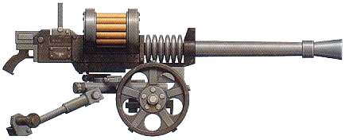
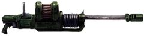
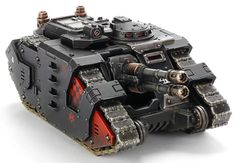
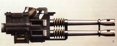
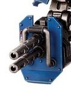
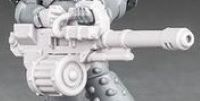
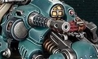

# 1237 自动炮 Autocannon

精校状态：中文行文已逐段精校，部分术语仍为暂定

分类：武器 / 远程武器

原文来源：https://www.bilibili.com/opus/1003242989575733251

原作者：帝国神选罐头

原文时间：2024年11月24日 12:55

[返回分类目录](目录.md) · [全书目录](../../目录.md)

<!-- A1237-B0001 -->
**英文原文**

Autocannons are similar in concept to twentieth century tank guns. They are rapid-firing weapons able to use a wide variety of ammunition, from mass-reactive explosive to solid shells.

<!-- /A1237-B0001 -->

<!-- A1237-B0002 -->

原译文

自动炮在概念上类似于二十世纪的坦克炮。它们是速射武器，能够使用各种各样的弹药，从质量反应炸药到固体炮弹。

**校订译文**

自动炮在概念上类似二十世纪的坦克炮，是能发射多种弹药的速射武器，可使用质量反应式爆炸弹，也可发射实心炮弹。

<!-- /A1237-B0002 -->

<!-- A1237-B0003 图片 -->

<!-- A1237-B0004 -->

原译文

Autocannon 自动炮

**校订译文**

Autocannon 自动炮

<!-- /A1237-B0004 -->

<!-- A1237-B0005 -->
## General Information 基本信息

<!-- /A1237-B0005 -->

<!-- A1237-B0006 -->
**英文原文**

Autocannons are usually either mounted on weapon carriages or vehicles because of their great weight.

<!-- /A1237-B0006 -->

<!-- A1237-B0007 -->

原译文

由于重量较大，自动炮通常安装在武器运输车或载具上。

**校订译文**

由于重量很大，自动炮通常架设在炮架上或安装于载具。

<!-- /A1237-B0007 -->

<!-- A1237-B0008 -->
**英文原文**

Due to their high rate of fire and sufficient killing power, they are effective against large infantry formations and light armored vehicles. which makes them ideal for use against large Tyranid organisms and Orkish vehicles. They are also useful against heavy infantry such as Space Marines, although Marines' power armour has been known to stop autocannon rounds.

<!-- /A1237-B0008 -->

<!-- A1237-B0009 -->

原译文

由于其高射速和足够的杀伤力，它们对大型步兵编队和轻型装甲车非常有效。这使得它们非常适合用于对抗泰伦大型生物和欧克载具。它们对星际战士等重步兵也很有用，尽管众所周知，星际战士的动力装甲可以阻挡自动炮炮弹。

**校订译文**

自动炮射速高、杀伤力强，能有效打击密集步兵和轻型装甲载具，尤其适合对付大型泰伦生物与欧克载具。它也能威胁星际战士等重装步兵，不过，星际战士的动力装甲有时能够挡住自动炮弹。

<!-- /A1237-B0009 -->

<!-- A1237-B0010 图片 -->

<!-- A1237-B0011 -->

原译文

Space Marine Autocannon 星际战士自动炮

**校订译文**

Space Marine Autocannon 星际战士自动炮

<!-- /A1237-B0011 -->

<!-- A1237-B0012 -->
**英文原文**

Autocannons are used by the Imperial Guard, Space Marines, Witch Hunters, and Chaos Space Marines. Orks, in particular, enjoy using autocannons because of the prodigious noise and recoil produced by firing them.

<!-- /A1237-B0012 -->

<!-- A1237-B0013 -->

原译文

帝国卫队、星际战士、猎巫者和混沌星际战士都使用自动炮。尤其是兽人，他们喜欢使用自动炮，因为发射它们会产生巨大的噪音和后坐力。

**校订译文**

帝国卫队、星际战士、猎巫者和混沌星际战士都使用自动炮。欧克尤其喜欢它开火时产生的巨大噪声和后坐力。

<!-- /A1237-B0013 -->

<!-- A1237-B0014 -->
## Known Patterns 已知型号

<!-- /A1237-B0014 -->

<!-- A1237-B0015 -->
**英文原文**

Agrippina Pattern - Used on the Salamander Scout Vehicle, ammunition for this smoothbore gun is fed automatically through a four-round feeding tray, the ammunition for which is dropped into the tray by hand. Includes recoil dampener and electronic sighting and rangefinding.

<!-- /A1237-B0015 -->

<!-- A1237-B0016 -->

原译文

阿格里皮娜型 - 用于火蜥蜴侦察载具，这种滑膛炮的弹药通过一个四发进料托盘自动进料，弹药用手放入托盘。包括反冲减震器和电子的瞄准和测距。

**校订译文**

阿格里皮娜型——用于火蜥蜴侦察载具。这门滑膛炮通过一个可容纳四发炮弹的供弹托盘自动供弹，炮弹则由人员手动放入托盘。它配有后坐缓冲器，以及电子瞄准和测距设备。

<!-- /A1237-B0016 -->

<!-- A1237-B0017 -->
**英文原文**

Accelerator Autocannon, commonly wielded by Space Marine Suppressor Squads.

<!-- /A1237-B0017 -->

<!-- A1237-B0018 -->

原译文

加速自动炮，通常由星际战士压制者小队使用。

**校订译文**

加速自动炮，通常由星际战士压制者小队使用。

<!-- /A1237-B0018 -->

<!-- A1237-B0019 -->
**英文原文**

Anvilus Autocannon Battery - Dual twin-linked mount used on Imperial vehicles.

<!-- /A1237-B0019 -->

<!-- A1237-B0020 -->

原译文

安维鲁斯自动炮架 - 帝国载具上使用的双联炮架。

**校订译文**

安维鲁斯自动炮组——帝国载具使用的双组双联装武器。

**校注：** dual twin-linked指两组双联装，不能漏掉一层数量关系。

<!-- /A1237-B0020 -->

<!-- A1237-B0021 -->
**英文原文**

Anvilus Snub Autocannon - Twin-linked pattern used on Sabre Tank Hunter vehicles.

<!-- /A1237-B0021 -->

<!-- A1237-B0022 -->

原译文

安维鲁斯斥责自动炮 - 双联型号，用于军刀反坦克载具。

**校订译文**

安维鲁斯短管自动炮——用于军刀反坦克车的双联型号。

**校注：** Snub按枪械结构暂译短管，原斥责误取普通动词含义；与1235统一。

<!-- /A1237-B0022 -->

<!-- A1237-B0023 图片 -->

<!-- A1237-B0024 -->

原译文

Sabre Tank Hunter with Anvilus Snub Autocannon 军刀反坦克车装备安维鲁斯斥责自动炮

**校订译文**

Sabre Tank Hunter with Anvilus Snub Autocannon 装备安维鲁斯短管自动炮的军刀反坦克车

<!-- /A1237-B0024 -->

<!-- A1237-B0025 -->

原译文

Armiger Autocannon 扈从自动炮

**校订译文**

Armiger Autocannon 侍从自动炮

<!-- /A1237-B0025 -->

<!-- A1237-B0026 -->
**英文原文**

Cthon Pattern - Used by Terminators during the Great Crusade and Horus Heresy

<!-- /A1237-B0026 -->

<!-- A1237-B0027 -->

原译文

冥府型 - 在大远征和荷鲁斯叛乱期间被终结者使用

**校订译文**

冥府型——大远征和荷鲁斯之乱期间由终结者使用。

<!-- /A1237-B0027 -->

<!-- A1237-B0028 图片 -->

<!-- A1237-B0029 -->

原译文

Cthon Pattern Autocannon 冥府型自动炮

**校订译文**

Cthon Pattern Autocannon 冥府型自动炮

<!-- /A1237-B0029 -->

<!-- A1237-B0030 -->
**英文原文**

Ironhail Pattern - Used on Invictor Tactical Warsuits

<!-- /A1237-B0030 -->

<!-- A1237-B0031 -->

原译文

铁雹型 - 用于不败者战术机甲

**校订译文**

铁雹型 - 用于不败者战术机甲

<!-- /A1237-B0031 -->

<!-- A1237-B0032 图片 -->

<!-- A1237-B0033 -->

原译文

Ironhail Autocannons 铁雹自动炮

**校订译文**

Ironhail Autocannons 铁雹自动炮

<!-- /A1237-B0033 -->

<!-- A1237-B0034 -->
**英文原文**

Kalibrax Pattern Autocannon - Used extensively during the Great Crusade by the Astartes.

<!-- /A1237-B0034 -->

<!-- A1237-B0035 -->

原译文

卡利布拉克斯型自动炮 - 在阿斯塔特的大远征期间广泛使用。

**校订译文**

卡利布拉克斯型自动炮——阿斯塔特在大远征期间广泛使用的型号。

<!-- /A1237-B0035 -->

<!-- A1237-B0036 图片 -->

<!-- A1237-B0037 -->

原译文

Kalibrax-pattern Autocannon 卡利布拉克斯型自动炮

**校订译文**

Kalibrax-pattern Autocannon 卡利布拉克斯型自动炮

<!-- /A1237-B0037 -->

<!-- A1237-B0038 -->
**英文原文**

Magna-Coil Autocannon - Used by Leagues of Votann Magna-Coil Bikes.

<!-- /A1237-B0038 -->

<!-- A1237-B0039 -->

原译文

麦格纳-线圈自动炮 - 由沃坦联盟麦格纳线圈摩托使用。

**校订译文**

麦格纳线圈自动炮——沃坦联盟的麦格纳线圈摩托使用的武器。

<!-- /A1237-B0039 -->

<!-- A1237-B0040 图片 -->

<!-- A1237-B0041 -->

原译文

Hernkyn Pioneer Bike Magna-Coil Autocannon 远行者先锋摩托麦格纳-线圈自动炮

**校订译文**

Hernkyn Pioneer Bike Magna-Coil Autocannon 远行者先锋摩托上的麦格纳线圈自动炮

<!-- /A1237-B0041 -->

<!-- A1237-B0042 -->
**英文原文**

MATR Autocannon - Used by the Leagues of Votann

<!-- /A1237-B0042 -->

<!-- A1237-B0043 -->

原译文

MATR 自动炮 - 由沃坦联盟使用

**校订译文**

MATR 自动炮 - 由沃坦联盟使用

<!-- /A1237-B0043 -->

<!-- A1237-B0044 -->
**英文原文**

Mk IX Chass Fabrik pattern - Comes in two variants, differing in calibre. Operated by a two-man team, one carrying the weapon, the other the ammunition, which is belt-fed or box-loaded. Used by the Tanith First & Only for company support.

<!-- /A1237-B0044 -->

<!-- A1237-B0045 -->

原译文

Mk IX底盘法布里克型 - 有两种不同口径的变体。由两人小组操作，一人携带武器，另一人携带弹药，弹药由链式或箱式装载。由塔尼斯第一唯一团用于连队支持。

**校订译文**

Mk.IX 查斯·法布里克型——有两种口径不同的改型，由两人操作，一人携带武器，另一人携带弹药，采用弹链或弹箱供弹。塔尼斯第一唯一团将其用于连级火力支援。

**校注：** Chass Fabrik为型号专名，暂译查斯·法布里克，原底盘法布里克误将Chass按chassis理解。

<!-- /A1237-B0045 -->

<!-- A1237-B0046 -->
**英文原文**

Mons-Pattern - A pattern of Autocannon manufactured by House Mons of Alecto and issued to the Imperial Guard.

<!-- /A1237-B0046 -->

<!-- A1237-B0047 -->

原译文

蒙斯型 - 由阿莱克托的蒙斯家族制造并发给帝国卫队的自动炮型号。

**校订译文**

蒙斯型 - 由阿勒克图的蒙斯家族制造并发给帝国卫队的自动炮型号。

<!-- /A1237-B0047 -->

<!-- A1237-B0048 -->
**英文原文**

Syrtis Pattern - Used on the Predator Destructor, and hence also known as the Predator Autocannon

<!-- /A1237-B0048 -->

<!-- A1237-B0049 -->

原译文

赛提斯型 - 用于破坏者型猎食者坦克，因此也被称为猎食者自动炮

**校订译文**

赛提斯型——用于破坏者型掠食者战车，因此也称掠食者自动炮。

<!-- /A1237-B0049 -->

<!-- A1237-B0050 -->
### Chaos Patterns 混沌型号

<!-- /A1237-B0050 -->

<!-- A1237-B0051 -->
**英文原文**

These patterns are only used by the forces of Chaos, even though there are other patterns used both by Chaos and by other forces.

<!-- /A1237-B0051 -->

<!-- A1237-B0052 -->

原译文

这些型号仅由混沌力量使用，尽管混沌和其他力量都使用了其他型号。

**校订译文**

以下型号为混沌部队专用；除此之外，也有一些型号由混沌和其他势力共同使用。

<!-- /A1237-B0052 -->

<!-- A1237-B0053 -->
**英文原文**

Hades Autocannon - Used by Forgefiends and Heldrakes.

<!-- /A1237-B0053 -->

<!-- A1237-B0054 -->

原译文

冥王自动炮 - 由铸造恶魔和地狱飞龙使用。

**校订译文**

冥王自动炮——由铸造恶魔和地狱魔龙使用。

<!-- /A1237-B0054 -->

<!-- A1237-B0055 -->
**英文原文**

Helstalker Autocannon - Used by Lords Discordant, mounted on their Helstalkers.

<!-- /A1237-B0055 -->

<!-- A1237-B0056 -->

原译文

地狱追猎者自动炮 - 由不协领主使用，安装在他们的地狱追猎者上。

**校订译文**

地狱追猎者自动炮——由不谐领主使用，安装在其地狱追猎者坐骑上。

**校注：** GW09/GW10第15页完整单位为“骑地狱追猎者的不谐领主”；此处按官方词根统一，不协领主为原稿异译。

<!-- /A1237-B0056 -->

<!-- A1237-B0057 -->
**英文原文**

Reaper Autocannon - A pattern used by Chaos Terminators and Defilers. As a consequence, may actually be Cthon Pattern autocannons that are simply still in service.

<!-- /A1237-B0057 -->

<!-- A1237-B0058 -->

原译文

收割者自动炮 - 混沌终结者和亵渎者使用的一种型号。因此，实际上可能是仍在使用的冥府型自动炮。

**校订译文**

收割者自动炮——混沌终结者和污染者使用的型号。因此，它们可能其实就是沿用至今的冥府型自动炮。

<!-- /A1237-B0058 -->

<!-- A1237-B0059 -->
## Famous Autocannon users 著名自动炮使用者

<!-- /A1237-B0059 -->

<!-- A1237-B0060 -->
**英文原文**

Trooper "Try Again" Bragg, Tanith First and Only

<!-- /A1237-B0060 -->

<!-- A1237-B0061 -->

原译文

士兵 不断射击的巴格，塔尼斯第一唯一团

**校订译文**

塔尼斯第一唯一团士兵布拉格，绰号“再来一次”。

**校注：** Try Again是人物绰号，不是对持续射击的普通描述；暂译“再来一次”，原“不断射击的巴格”。

<!-- /A1237-B0061 -->

本篇核心术语与暂定项

以下列出本篇出现的英文原形及核心术语表用词。同形词可能指不同对象，具体词义以本篇正文和校注为准；单复数、别名和仅见于图注的名称可能尚未列入。完整候选见[术语表](../../术语表/双语术语候选.csv)。

| 英文 | 采用中文 | 状态 |
| --- | --- | --- |
| Space Marines | 星际战士 | 官方已核对 |
| Imperial Guard | 帝国卫队 | 暂定·语境区分 |
| Chaos Space Marines | 混沌星际战士 | 官方已核对 |
| Leagues of Votann | 沃坦联盟 | 官方已核对 |
| Orks | 欧克蛮人 | 官方已核对 |
| Horus Heresy | 荷鲁斯之乱 | 官方已核对 |
| Alecto | 阿勒克图 | 暂定·官方待核 |
| Great Crusade | 大远征 | 暂定·官方待核 |
| Horus | 荷鲁斯 | 暂定·官方待核 |
| Tanith | 塔尼斯 | 暂定·官方待核 |
| Discordant | 失谐者 | 暂定·官方待核 |
| Witch Hunters | 猎巫者 | 暂定 |
| Accelerator Autocannon | 加速自动炮 | 暂定·官方待核 |
| Predator Destructor | 破坏者型掠食者战车 | 官方已核对 |
| Power Armour | 动力盔甲 | 暂定·官方待核 |
| Space Marine | 星际战士 | 暂定·官方待核 |
| Terminators | 终结者 | 暂定·官方待核 |
| Scout | 侦察兵 | 暂定·官方待核 |
| Suppressor | 压制者 | 暂定·官方待核 |
| Suppressor Squads | 压制者小队 | 暂定·官方待核 |
| Destructor | 破坏者（史洛斯类别） | 暂定·官方待核 |
| Bikes | 摩托 | 暂定·官方待核 |
| Reaper | 收割者号 | 暂定·官方待核 |
| The Weapon | 武器 | 暂定·官方待核 |
| Gun | 甘 | 暂定·官方待核 |
| Kalibrax | 卡利布拉克斯 | 暂定·官方待核 |
| Autocannon | 自动炮 | 暂定·官方待核 |
| Anvilus Autocannon Battery | 安维鲁斯自动炮组 | 暂定·官方待核 |
| Anvilus Snub Autocannon | 安维鲁斯短管自动炮 | 暂定·官方待核 |
| Kalibrax Pattern Autocannon | 卡利布拉克斯型自动炮 | 暂定·官方待核 |
| Magna-Coil Autocannon | 麦格纳线圈自动炮 | 暂定·官方待核 |
| MATR Autocannon | MATR 自动炮 | 暂定·官方待核 |
| Mk IX Chass Fabrik pattern | Mk.IX 查斯·法布里克型 | 暂定·官方待核 |
| Hades Autocannon | 冥王自动炮 | 暂定·官方待核 |
| Helstalker Autocannon | 地狱追猎者自动炮 | 暂定·官方待核 |
| Reaper Autocannon | 收割者自动炮 | 暂定·官方待核 |
| Bragg | 布拉格 | 暂定·官方待核 |
| Anvilus | 安维鲁斯 | 暂定·官方待核 |

