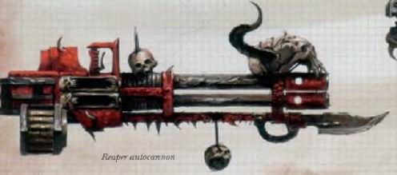
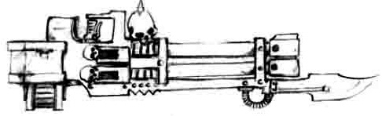

# 1238 收割者自动炮 Reaper Autocannon

精校状态：中文行文已逐段精校，部分术语仍为暂定

分类：武器 / 远程武器

原文来源：https://www.bilibili.com/opus/1010281530442907654

原作者：帝国神选罐头

原文时间：2024年12月13日 12:08

[返回分类目录](目录.md) · [全书目录](../../目录.md)

<!-- A1238-B0001 -->
**英文原文**

The Reaper Autocannon is a type of Autocannon used predominantly by Chaos Space Marine Terminators.

<!-- /A1238-B0001 -->

<!-- A1238-B0002 -->

原译文

收割者自动炮是一种主要由混沌星际战士终结者使用的自动炮。

**校订译文**

收割者自动炮是一种主要由混沌星际战士终结者使用的自动炮。

<!-- /A1238-B0002 -->

<!-- A1238-B0003 图片 -->

<!-- A1238-B0004 -->

原译文

Reaper Autocannon 收割者自动炮

**校订译文**

Reaper Autocannon 收割者自动炮

<!-- /A1238-B0004 -->

<!-- A1238-B0005 -->
**英文原文**

However, at the time of the Great Crusade and Horus Heresy they were common in the arsenals of all the Legiones Astartes. Originally designed as a support weapon for Tactical Dreadnought Armour, the Reaper is a compact, rapid-firing autocannon which depends on the strength of Terminator armor to stabilize the weapon and cope with its massive recoil.

<!-- /A1238-B0005 -->

<!-- A1238-B0006 -->

原译文

然而，在大远征和荷鲁斯叛乱时期，它们在所有阿斯塔特军团的军械库中都很常见。收割者最初被设计为战术无畏装甲的支援武器，是一种紧凑、快速射击的自动炮，它依靠终结者装甲的强度来稳定武器并应对其巨大的后坐力。

**校订译文**

不过，在大远征和荷鲁斯之乱时期，收割者自动炮曾普遍装备于各阿斯塔特军团。它最初是为战术无畏装甲设计的支援武器，结构紧凑、射速很高，需要依靠终结者装甲的力量来稳定枪身，并承受强大后坐力。

<!-- /A1238-B0006 -->

<!-- A1238-B0007 图片 -->

<!-- A1238-B0008 -->

原译文

Chaos Space Marine Reaper Autocannon 混沌星际战士收割者自动炮

**校订译文**

Chaos Space Marine Reaper Autocannon 混沌星际战士收割者自动炮

<!-- /A1238-B0008 -->

本篇核心术语与暂定项

以下列出本篇出现的英文原形及核心术语表用词。同形词可能指不同对象，具体词义以本篇正文和校注为准；单复数、别名和仅见于图注的名称可能尚未列入。完整候选见[术语表](../../术语表/双语术语候选.csv)。

| 英文 | 采用中文 | 状态 |
| --- | --- | --- |
| Terminator | 终结者 | 官方已核对 |
| Horus Heresy | 荷鲁斯之乱 | 官方已核对 |
| Great Crusade | 大远征 | 暂定·官方待核 |
| Horus | 荷鲁斯 | 暂定·官方待核 |
| Legiones Astartes | 阿斯塔特军团 | 暂定·官方待核 |
| Space Marine | 星际战士 | 暂定·官方待核 |
| Terminators | 终结者 | 暂定·官方待核 |
| Dreadnought | 无畏机甲 | 暂定·官方待核 |
| Reaper | 收割者号 | 暂定·官方待核 |
| The Weapon | 武器 | 暂定·官方待核 |
| Autocannon | 自动炮 | 暂定·官方待核 |
| Reaper Autocannon | 收割者自动炮 | 暂定·官方待核 |

