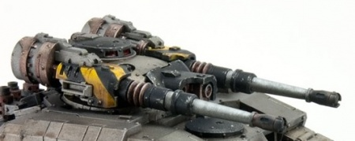

# 1239 加速自动炮 Accelerator Autocannon

精校状态：中文行文已逐段精校，部分术语仍为暂定

分类：武器 / 远程武器

原文来源：https://www.bilibili.com/opus/1010753388439142401

原作者：帝国神选罐头

原文时间：2024年12月14日 18:39

[返回分类目录](目录.md) · [全书目录](../../目录.md)

<!-- A1239-B0001 -->
**英文原文**

Accelerator Autocannons are a type of heavy Autocannon. These rapid-firing weapons fire shells at a much higher velocity than a standard Autocannon, enabling them to successfully engage moving targets and strike with pinpoint accuracy.

<!-- /A1239-B0001 -->

<!-- A1239-B0002 -->

原译文

加速自动炮是一种重型自动炮。这些速射武器以比标准自动炮高得多的速度发射炮弹，使其能够成功地精确打击移动目标。

**校订译文**

加速自动炮是一种重型自动炮。这类速射武器的炮弹初速远高于标准自动炮，因此既能有效打击移动目标，也能实现精准命中。

<!-- /A1239-B0002 -->

<!-- A1239-B0003 -->
**英文原文**

A smaller version of these weapons are used by Primaris Vanguard Suppressors.

<!-- /A1239-B0003 -->

<!-- A1239-B0004 -->

原译文

原铸先锋压制者使用这些武器的较小版本。

**校订译文**

原铸先锋部队中的压制者使用其小型版本。

<!-- /A1239-B0004 -->

<!-- A1239-B0005 -->
## Known Patterns 已知型号

<!-- /A1239-B0005 -->

<!-- A1239-B0006 -->
**英文原文**

Herakles Pattern — Mounted on the Sicaran Battle Tank

<!-- /A1239-B0006 -->

<!-- A1239-B0007 -->

原译文

赫拉克勒斯型 — 安装在西卡然战斗坦克上

**校订译文**

赫拉克勒斯型 — 安装在西卡然战斗坦克上

<!-- /A1239-B0007 -->

<!-- A1239-B0008 图片 -->

<!-- A1239-B0009 -->

原译文

Twin Accelerator Autocannons mounted on a Space Marine Sicaran Battle Tank 安装在星际战士西卡然战斗坦克上的双联加速自动炮

**校订译文**

Twin Accelerator Autocannons mounted on a Space Marine Sicaran Battle Tank 安装在星际战士西卡然战斗坦克上的双联加速自动炮

<!-- /A1239-B0009 -->

本篇核心术语与暂定项

以下列出本篇出现的英文原形及核心术语表用词。同形词可能指不同对象，具体词义以本篇正文和校注为准；单复数、别名和仅见于图注的名称可能尚未列入。完整候选见[术语表](../../术语表/双语术语候选.csv)。

| 英文 | 采用中文 | 状态 |
| --- | --- | --- |
| Vanguard | 先锋 | 暂定·官方待核 |
| Autocannon | 自动炮 | 暂定·官方待核 |
| Herakles Pattern | 赫拉克勒斯型 | 暂定·官方待核 |
| Sicaran Battle Tank | 西卡然战斗坦克 | 暂定·官方待核 |

