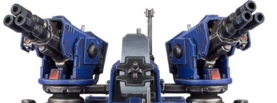
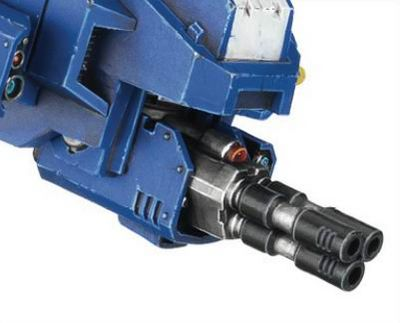

# 1241 伊卡洛斯风暴炮阵列 Icarus Stormcannon Array

精校状态：中文行文已逐段精校，部分术语仍为暂定

分类：武器 / 远程武器

原文来源：https://www.bilibili.com/opus/1006184870401015808

原作者：帝国神选罐头

原文时间：2024年12月02日 11:11

[返回分类目录](目录.md) · [全书目录](../../目录.md)

<!-- A1241-B0001 -->
**英文原文**

The Icarus Stormcannon Array is a Space Marine anti-aircraft platform mounted on Stalker vehicles.

<!-- /A1241-B0001 -->

<!-- A1241-B0002 -->

原译文

伊卡洛斯风暴炮阵列是安装在追猎者载具上的星际战士防空平台。

**校订译文**

伊卡洛斯风暴炮阵列是星际战士安装在追猎者载具上的防空武器系统。

<!-- /A1241-B0002 -->

<!-- A1241-B0003 -->
**英文原文**

Made up of two independently traversing turrets of triple-barreled cannons and a large radar dish, the Icarus Stormcannon Array can track and fire at two separate aerial targets simultaneously. The cannons have a high rate of fire and can launch hundreds of solid rounds into the sky, thanks to its large ammunition storage.

<!-- /A1241-B0003 -->

<!-- A1241-B0004 -->

原译文

伊卡洛斯风暴炮阵列由两个独立移动的三管炮塔和一个大型雷达天线组成，可以同时跟踪和射击两个独立的空中目标。由于其大量的弹药储存，这些大炮的射速很高，可以向天空发射数百发实心炮弹。

**校订译文**

这一阵列由两座可独立转向的三管炮塔和一面大型雷达天线组成，能够同时跟踪、射击两个不同的空中目标。火炮射速很高，充裕的储弹空间使其能够向空中倾泻数百发实弹。

<!-- /A1241-B0004 -->

<!-- A1241-B0005 图片 -->

<!-- A1241-B0006 -->

原译文

Icarus Stormcannon Array 伊卡洛斯风暴炮阵列

**校订译文**

Icarus Stormcannon Array 伊卡洛斯风暴炮阵列

<!-- /A1241-B0006 -->

<!-- A1241-B0007 -->
**英文原文**

The Icarus Stormcannon is slaved to a cogitator array, consisting of several linked mono-task servitors.

<!-- /A1241-B0007 -->

<!-- A1241-B0008 -->

原译文

伊卡洛斯风暴炮被一个由几个相互连接的单任务服务器组成的协同阵列所组成。

**校订译文**

伊卡洛斯风暴炮受一套沉思者阵列控制，该阵列由数名互相连接、各自执行单一任务的机仆组成。

**校注：** servitor是机仆，不是服务器；slaved to指受控于，cogitator是沉思者计算装置。

<!-- /A1241-B0008 -->

<!-- A1241-B0009 -->
**英文原文**

The Icarus Stormcannon also is one of the main weapons of Stormhawk Interceptor.

<!-- /A1241-B0009 -->

<!-- A1241-B0010 -->

原译文

伊卡洛斯风暴炮也是风暴鹰拦截机的主要武器之一。

**校订译文**

伊卡洛斯风暴炮也是风暴鹰拦截者战机的主要武器之一。

<!-- /A1241-B0010 -->

<!-- A1241-B0011 图片 -->

<!-- A1241-B0012 -->

原译文

Icarus Stormcannon on the Stormhawk Interceptor 风暴鹰拦截机上的伊卡洛斯风暴炮

**校订译文**

Icarus Stormcannon on the Stormhawk Interceptor 风暴鹰拦截者战机上的伊卡洛斯风暴炮

<!-- /A1241-B0012 -->

<!-- A1241-B0013 -->
**英文原文**

Finally, the Icarus Stormcannon Array can be used as a stationary anti-aircraft installation by itself.

<!-- /A1241-B0013 -->

<!-- A1241-B0014 -->

原译文

最后，伊卡洛斯风暴炮阵列可以单独用作固定防空设施。

**校订译文**

伊卡洛斯风暴炮阵列也可以独立部署，作为固定防空设施使用。

<!-- /A1241-B0014 -->

本篇核心术语与暂定项

以下列出本篇出现的英文原形及核心术语表用词。同形词可能指不同对象，具体词义以本篇正文和校注为准；单复数、别名和仅见于图注的名称可能尚未列入。完整候选见[术语表](../../术语表/双语术语候选.csv)。

| 英文 | 采用中文 | 状态 |
| --- | --- | --- |
| Stalker | 追猎者 | 暂定·官方待核 |
| Space Marine | 星际战士 | 暂定·官方待核 |
| Stormhawk Interceptor | 风暴鹰拦截者战机 | 官方已核 |
| Stormhawk | 风暴隼 | 暂定·官方待核 |
| Icarus Stormcannon Array | 伊卡洛斯风暴炮阵列 | 暂定·官方待核 |
| Icarus Stormcannon | 伊卡洛斯风暴炮 | 暂定·官方待核 |

