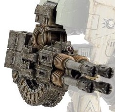

# 1242 利维坦风暴炮 Leviathan Storm Cannon

精校状态：中文行文已逐段精校，部分术语仍为暂定

分类：武器 / 远程武器

原文来源：https://www.bilibili.com/opus/1005075020785909778

原作者：帝国神选罐头

原文时间：2024年11月29日 11:24

[返回分类目录](目录.md) · [全书目录](../../目录.md)

<!-- A1242-B0001 -->
**英文原文**

The Leviathan Storm Cannon is a type of heavy weapon used by Space Marine Leviathan Siege Dreadnoughts. A short-range weapon developed uniquely for the Leviathan, it consists of an array of four heavy Autocannons.

<!-- /A1242-B0001 -->

<!-- A1242-B0002 -->

原译文

利维坦风暴炮是星际战士利维坦攻城无畏使用的一种重型武器。这是一种专为利维坦研制的短程武器，由四门重型自动炮组成。

**校订译文**

利维坦风暴炮是星际战士利维坦攻城无畏机甲使用的重型武器。它专为利维坦研制，射程较短，由四门重型自动炮组成。

<!-- /A1242-B0002 -->

<!-- A1242-B0003 图片 -->

<!-- A1242-B0004 -->

原译文

Leviathan Storm Cannon 利维坦风暴炮

**校订译文**

Leviathan Storm Cannon 利维坦风暴炮

<!-- /A1242-B0004 -->

本篇核心术语与暂定项

以下列出本篇出现的英文原形及核心术语表用词。同形词可能指不同对象，具体词义以本篇正文和校注为准；单复数、别名和仅见于图注的名称可能尚未列入。完整候选见[术语表](../../术语表/双语术语候选.csv)。

| 英文 | 采用中文 | 状态 |
| --- | --- | --- |
| Space Marine | 星际战士 | 暂定·官方待核 |
| Leviathan Storm Cannon | 利维坦风暴炮 | 暂定·官方待核 |

