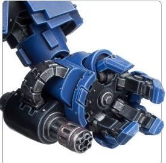
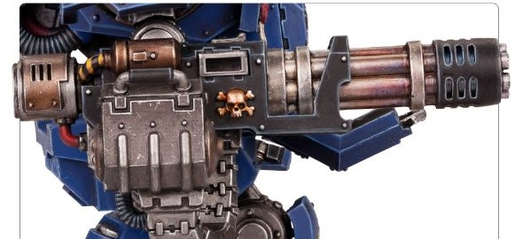

# 1243 猛攻加特林炮 Onslaught Gatling Cannon

精校状态：中文行文已逐段精校，部分术语仍为暂定

分类：武器 / 远程武器

原文来源：https://www.bilibili.com/opus/1005822993615552531

原作者：帝国神选罐头

原文时间：2024年12月01日 11:46

[返回分类目录](目录.md) · [全书目录](../../目录.md)

原篇名：突击加特林炮 Onslaught Gatling Cannon

<!-- A1243-B0001 -->
**英文原文**

The Onslaught Gatling Cannon is a type of gatling weapon used by Primaris Space Marines.

<!-- /A1243-B0001 -->

<!-- A1243-B0002 -->

原译文

突击加特林炮是原铸星际战士使用的一种加特林武器。

**校订译文**

猛攻加特林炮是原铸星际战士使用的一种转管武器。

**校注：** 沿第644篇统一Onslaught为猛攻；原稿另译突击，保留原译文对照。

<!-- /A1243-B0002 -->

<!-- A1243-B0003 -->
## Types 类别

<!-- /A1243-B0003 -->

<!-- A1243-B0004 -->
**英文原文**

Onslaught Gatling Cannon — Used by Redemptor Dreadnought Power Fists and Repulsor Tanks.

<!-- /A1243-B0004 -->

<!-- A1243-B0005 -->

原译文

突击加特林炮 — 由救赎者无畏动力拳和反击者坦克使用。

**校订译文**

猛攻加特林炮——安装于救赎者无畏机甲的动力拳和反重力战车。

<!-- /A1243-B0005 -->

<!-- A1243-B0006 图片 -->

<!-- A1243-B0007 -->

原译文

Onslaught Gatling Cannon 突击加特林炮

**校订译文**

Onslaught Gatling Cannon 猛攻加特林炮

<!-- /A1243-B0007 -->

<!-- A1243-B0008 -->
**英文原文**

Onslaught Heavy Gatling Cannon — Heavier variant used as primary weapon on Redemptor Dreadnoughts.

<!-- /A1243-B0008 -->

<!-- A1243-B0009 -->

原译文

突击重型加特林炮 — 更重的变种，用作救赎者无畏的主要武器。

**校订译文**

猛攻重型加特林炮——更重型的改型，用作救赎者无畏机甲的主武器。

<!-- /A1243-B0009 -->

<!-- A1243-B0010 图片 -->

<!-- A1243-B0011 -->

原译文

Onslaught Heavy Gatling Cannon 突击重型加特林炮

**校订译文**

Onslaught Heavy Gatling Cannon 猛攻重型加特林炮

<!-- /A1243-B0011 -->

本篇核心术语与暂定项

以下列出本篇出现的英文原形及核心术语表用词。同形词可能指不同对象，具体词义以本篇正文和校注为准；单复数、别名和仅见于图注的名称可能尚未列入。完整候选见[术语表](../../术语表/双语术语候选.csv)。

| 英文 | 采用中文 | 状态 |
| --- | --- | --- |
| Space Marines | 星际战士 | 官方已核对 |
| Redemptor Dreadnought | 救赎者无畏机甲 | 官方已核对 |
| Repulsor | 反重力战车 | 官方已核 |
| Dreadnought | 无畏机甲 | 暂定·官方待核 |
| Onslaught Gatling Cannon | 猛攻加特林炮 | 暂定·官方待核 |
| Onslaught Heavy Gatling Cannon | 猛攻重型加特林炮 | 暂定·官方待核 |

