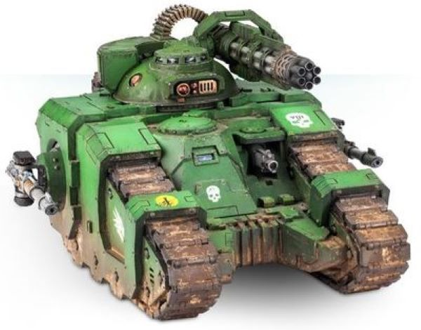

# 1244 惩罚者旋转炮 Punisher Rotary Cannon

精校状态：中文行文已逐段精校，部分术语仍为暂定

分类：武器 / 远程武器

原文来源：https://www.bilibili.com/opus/1012147002242236425

原作者：帝国神选罐头

原文时间：2024年12月18日 12:47

[返回分类目录](目录.md) · [全书目录](../../目录.md)

<!-- A1244-B0001 -->
**英文原文**

The Punisher Rotary Cannon is a weapon used by the Space Marine Sicaran Punisher tank.

<!-- /A1244-B0001 -->

<!-- A1244-B0002 -->

原译文

惩罚者旋转加农炮是星际战士西卡然惩罚者坦克使用的武器。

**校订译文**

惩罚者旋转炮是星际战士西卡然惩罚者坦克使用的武器。

<!-- /A1244-B0002 -->

<!-- A1244-B0003 图片 -->

<!-- A1244-B0004 -->

原译文

Punisher Rotary Cannon 惩罚者旋转加农炮

**校订译文**

Punisher Rotary Cannon 惩罚者旋转炮

<!-- /A1244-B0004 -->

<!-- A1244-B0005 -->
**英文原文**

The punisher rotary cannon fires a ceaseless barrage of high calibre shells, supported by a complex ammo-feed array and a gyro-assisted recoil compensator. Though each of the shells is little more than a solid ferro-carbide slug, the sheer rate of fire that this weapon is capable of is more than sufficient for the obliteration of large infantry formations or light vehicles.

<!-- /A1244-B0005 -->

<!-- A1244-B0006 -->

原译文

惩罚旋转加农炮在复杂的弹药供给阵列和陀螺辅助反冲补偿器的支持下，不断发射大口径炮弹。虽然每一枚炮弹都只不过是一个坚固的碳化铁弹头，但这种武器的火力足以摧毁大型步兵编队或轻型车辆。

**校订译文**

在复杂的供弹系统和陀螺辅助后坐力补偿器支持下，惩罚者旋转炮能够持续倾泻大口径炮弹。虽然每发炮弹不过是实心碳化铁弹丸，但极高的射速已足以摧毁密集步兵编队或轻型载具。

<!-- /A1244-B0006 -->

本篇核心术语与暂定项

以下列出本篇出现的英文原形及核心术语表用词。同形词可能指不同对象，具体词义以本篇正文和校注为准；单复数、别名和仅见于图注的名称可能尚未列入。完整候选见[术语表](../../术语表/双语术语候选.csv)。

| 英文 | 采用中文 | 状态 |
| --- | --- | --- |
| Space Marine | 星际战士 | 暂定·官方待核 |
| Punisher Rotary Cannon | 惩罚者旋转炮 | 暂定·官方待核 |
| Sicaran Punisher | 西卡然惩罚者 | 暂定·官方待核 |

