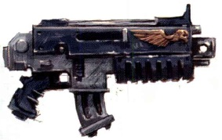
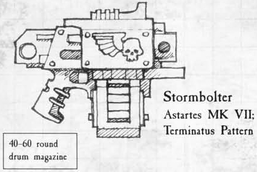
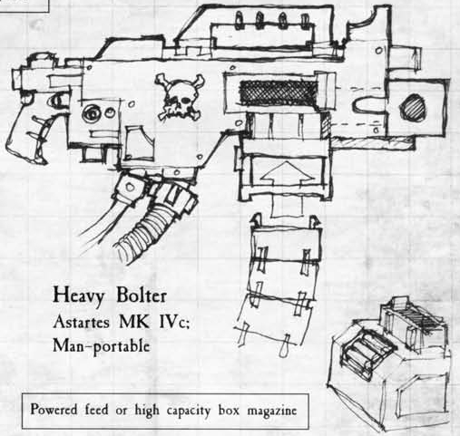

# 1245 爆矢武器 Bolt Weapon

精校状态：中文行文已逐段精校，部分术语仍为暂定

分类：武器 / 远程武器

原文来源：https://www.bilibili.com/opus/997729875057967142

原作者：帝国神选罐头

原文时间：编辑于 2026年05月03日 15:22

[返回分类目录](目录.md) · [全书目录](../../目录.md)

<!-- A1245-B0001 -->
**英文原文**

The bolt weapon is the characteristic Imperial weapon type used most famously by the Space Marines and Adepta Sororitas. They are also used in more limited numbers throughout the Imperium's armed forces, and are popular with its enemies, particularly Orks. Bolt weapons are purposefully unsubtle weapons, with very obvious and bloody effects.

<!-- /A1245-B0001 -->

<!-- A1245-B0002 -->

原译文

爆矢武器是帝国特有的武器类型，最著名的是星际战士和修女会。在帝国的武装部队中，它们的使用数量也较为有限，并且受到敌人的欢迎，尤其是兽人。爆矢武器是有意制造的明显的武器，具有非常明显和血腥的效果。

**校订译文**

爆矢武器是帝国极具代表性的武器，其中以星际战士和修女会的使用最为著名。帝国其他武装力量也有少量装备；它们在帝国的敌人中同样颇受欢迎，尤其是欧克。爆矢武器的设计追求张扬而直接的威慑，造成的杀伤既醒目又血腥。

<!-- /A1245-B0002 -->

<!-- A1245-B0003 -->
**英文原文**

Some models are designed specifically for normal humans which include smaller grips and lighter construction, though these variations are rarely as finely fashioned as Space Marine weapons. Many such weapons are ancient heirlooms and relics passed down through a family's generations. Cheap bolt weapon models can be found on black markets and backwater planets, but will often break down quickly because of the specialised nature of their ammunition.

<!-- /A1245-B0003 -->

<!-- A1245-B0004 -->

原译文

一些型号是专门为普通人设计的，包括更小的握把和更轻的结构，尽管这些变体很少像星际战士武器那样精致。许多这样的武器都是古老的传家宝和世代相传的遗物。廉价的爆矢武器型号可以在黑市和偏远星球上找到，但由于弹药的特殊性，它们往往很快就会崩解。

**校订译文**

一些型号专为普通人设计，握把更小、结构更轻，但做工通常不及星际战士使用的版本精良。许多这类武器是古老的传家宝或世代相传的遗物。黑市和偏远行星上也能找到廉价型号，不过，爆矢弹药对武器的特殊要求，往往使这些廉价枪械很快就发生故障。

<!-- /A1245-B0004 -->

<!-- A1245-B0005 -->
###### Operation 运转

<!-- /A1245-B0005 -->

<!-- A1245-B0006 -->
**英文原文**

Bolt weapons fire self-propelled mass-reactive shells known as bolts, which are timed to explode just after penetration for maximum lethality. The standard bolt is .75 calibre with a super-dense metallic core and diamantine tip. Overall bolt ammunition is expensive and difficult to manufacture and the weapons themselves regularly require maintenance and rituals to appease their spirits, but they are no doubt terrifying and destructive weapons.

<!-- /A1245-B0006 -->

<!-- A1245-B0007 -->

原译文

爆矢武器发射被称为爆矢的自推进质量反应弹，这些枪弹在穿透后立即爆炸，以获得最大的杀伤力。标准螺栓为.75口径，具有超致密金属芯和钻金尖端。总体而言，枪弹价格昂贵，难以制造，武器本身也需要定期维护和仪式来安抚他们的机魂，但毫无疑问，它们是可怕和毁灭性的武器。

**校订译文**

爆矢武器发射一种称为爆矢的自推进质量反应弹。弹丸会在穿入目标后随即爆炸，以取得最大的杀伤效果。标准爆矢口径为0.75英寸，具有超高密度金属芯和钻金尖端。爆矢弹药昂贵且难以制造，武器本身也需要定期维护，并举行仪式安抚机魂；尽管如此，它们无疑是极其可怕、破坏力惊人的武器。

**校注：** Diamantine为底稿材料专名，沿本篇钻金统一其他篇原金刚石异译；未认定其现实材料成分。

<!-- /A1245-B0007 -->

<!-- A1245-B0008 图片 -->

<!-- A1245-B0009 -->

原译文

standard boltgun 标准爆矢枪

**校订译文**

standard boltgun 标准爆矢枪

<!-- /A1245-B0009 -->

<!-- A1245-B0010 -->
**英文原文**

Each bolt is contained within a cartridge which includes a small conventional powder charge. When fired, this charge launches the bolt while simultaneously igniting its solid fuel propellant, which is timed to do so once it is clear of the barrel. The cartridge is then ejected, clearing the breech for the next round, while the bolt accelerates towards the target under its own power. This system helps alleviate the problem in using rocket-propelled munitions, as the gases are not trapped within the barrel and cannot cause problems due to over-pressure. The two-stage process also keeps the weapon's recoil to manageable levels, compared to conventional weapons of similar calibre.

<!-- /A1245-B0010 -->

<!-- A1245-B0011 -->

原译文

每个爆矢都包含在一个子弹中，子弹中包括一个小型传统火药装药。发射时，这种装药会发射爆矢，同时点燃其固体燃料推进剂，一旦它离开枪管，就会定时点火。然后，子弹被弹出，为下一轮射击腾出后膛，同时爆矢在自身力量的作用下向目标加速。该系统有助于缓解使用火箭推进弹药的问题，因为气体不会被困在枪管内，也不会因过压而造成问题。与口径相似的常规武器相比，两阶段过程还将武器的后坐力保持在可控水平。

**校订译文**

每枚爆矢都装在带有少量常规火药的弹壳内。开火时，火药先将弹丸推出，并启动固体燃料推进剂的延时点火，使其在离开枪管后开始燃烧。随后弹壳被抛出，为下一发弹药腾出膛室；爆矢则靠自身动力继续加速飞向目标。这样可以缓解火箭推进弹药在枪管内积聚气体、造成压力过高的问题。与同口径常规武器相比，这种两阶段发射过程也能将后坐力控制在可承受的范围内。

**校注：** 英文同时使用“simultaneously igniting”和“once it is clear of the barrel”，点火时序措辞有歧义；中文按其紧接着解释的两阶段原理处理为启动延时点火。

<!-- /A1245-B0011 -->

<!-- A1245-B0012 图片 -->

<!-- A1245-B0013 -->

原译文

Storm bolter, with attached drum Magazine 装配弹鼓的风暴爆矢枪

**校订译文**

Storm bolter, with attached drum Magazine 装配弹鼓的风暴爆矢枪

<!-- /A1245-B0013 -->

<!-- A1245-B0014 -->
**英文原文**

Using this method, personal bolt weapons can easily fire in bursts of three to four rounds in rapid succession. However, in order to keep the ammunition capacity high, bolt shells lack a subsequent booster stage or fin stabilization. This limits their effective range, though this is seen as less of a problem given their role as a shock and assault weapon. Heavy Bolters fire a larger round with extra propellant, giving them superior range and hitting power to hand-held bolters and bolt pistols.

<!-- /A1245-B0014 -->

<!-- A1245-B0015 -->

原译文

使用这种方法，单人爆矢武器可以很容易地连续快速发射三到四发子弹。然而，为了保持弹药容量高，爆矢弹缺乏后续的助推或稳定。这限制了它们的有效射程，尽管考虑到它们作为冲击和突击武器的作用，这被认为不是一个问题。重型爆矢枪使用额外的推进剂发射更大的子弹，使其具有比手持爆矢枪和爆矢手枪更优越的射程和打击力。

**校订译文**

凭借这种方式，单兵爆矢武器能轻易完成连续三至四发的快速点射。不过，为了维持较高载弹量，爆矢弹没有后续助推级，也不采用尾翼稳定，因而有效射程受到限制。考虑到它们主要用于震慑与突击，这一缺点被认为尚可接受。重型爆矢枪发射更大的弹丸，携带更多推进剂，因此射程和杀伤力都优于手持爆矢枪及爆矢手枪。

<!-- /A1245-B0015 -->

<!-- A1245-B0016 图片 -->

<!-- A1245-B0017 -->

原译文

Heavy bolter, with Belt Feed 弹链供弹的重型爆矢枪

**校订译文**

Heavy bolter, with Belt Feed 弹链供弹的重型爆矢枪

<!-- /A1245-B0017 -->

<!-- A1245-B0018 -->
**英文原文**

The explosive warhead within the bolt is triggered by a mass-reactive detonator; any sudden increase in local mass triggers the explosive, causing the weapon to explode inside the target. This can have a gruesome effect on the target, often killing them in a single shot as their chest cavity or head is blown apart, while simultaneous hits can render the corpse unidentifiable. However, the detonator has a minimum arming distance, during which it will not arm the warhead. At point-blank ranges the bolt will instead pass through the target and explode behind it, though its sheer size and velocity still makes it capable of causing damage.

<!-- /A1245-B0018 -->

<!-- A1245-B0019 -->

原译文

爆矢内的爆炸弹头由质量反应雷管触发；任何局部质量的突然增加都会触发爆炸，导致武器在目标内部爆炸。这可能会对目标产生可怕的影响，通常会在一次射击中杀死他们，因为他们的胸腔或头部被炸开，而同时击中会使尸体无法辨认。然而，雷管有一个最小武装距离，在此期间它不会打开弹头的保险。在近距离射击时，爆矢会穿过目标并在其后方爆炸，尽管其巨大的尺寸和速度仍然使其能够造成伤害。

**校订译文**

爆矢内的炸药由质量反应式引信触发：周围质量骤增时，引信便引爆装药，使弹丸在目标内部爆炸。一次命中便常足以炸开胸腔或头部，数发同时命中甚至会令尸体无法辨认。不过，引信有最小解除保险距离，弹丸飞出这段距离前，弹头不会进入待爆状态。因此，在抵近射击时，爆矢可能先贯穿目标，再在其身后爆炸；即便如此，它的体积和速度仍足以造成伤害。

**校注：** arming distance是解除保险距离；爆炸的是弹丸，不是枪械。

<!-- /A1245-B0019 -->

<!-- A1245-B0020 -->
###### Types of bolt weapons 爆矢武器种类

<!-- /A1245-B0020 -->

<!-- A1245-B0021 -->
**英文原文**

Available bolt weapons include:

<!-- /A1245-B0021 -->

<!-- A1245-B0022 -->

原译文

可用的爆矢武器包括：

**校订译文**

可用的爆矢武器包括：

<!-- /A1245-B0022 -->

<!-- A1245-B0023 -->

原译文

Bolt pistols 爆矢手枪

**校订译文**

Bolt pistols 爆矢手枪

<!-- /A1245-B0023 -->

<!-- A1245-B0024 -->

原译文

Boltguns (also known as Bolters) 爆矢枪

**校订译文**

Boltguns (also known as Bolters) 爆矢枪

<!-- /A1245-B0024 -->

<!-- A1245-B0025 -->

原译文

Bolt Rifles 爆矢步枪

**校订译文**

Bolt Rifles 爆矢步枪

<!-- /A1245-B0025 -->

<!-- A1245-B0026 -->

原译文

Storm bolters 风暴爆矢枪

**校订译文**

Storm bolters 风暴爆矢枪

<!-- /A1245-B0026 -->

<!-- A1245-B0027 -->

原译文

Heavy bolters 重型爆矢枪

**校订译文**

Heavy bolters 重型爆矢枪

<!-- /A1245-B0027 -->

<!-- A1245-B0028 -->

原译文

Heavy Bolt Rifles 重型爆矢步枪

**校订译文**

Heavy Bolt Rifles 重型爆矢步枪

<!-- /A1245-B0028 -->

<!-- A1245-B0029 -->

原译文

Psycannons 灵能炮

**校订译文**

Psycannons 灵能炮

<!-- /A1245-B0029 -->

<!-- A1245-B0030 -->

原译文

Bolt Caster 爆矢发射器

**校订译文**

Bolt Caster 爆矢发射器

<!-- /A1245-B0030 -->

<!-- A1245-B0031 -->

原译文

Assault Bolter 突击爆矢枪

**校订译文**

Assault Bolter 突击爆矢枪

<!-- /A1245-B0031 -->

<!-- A1245-B0032 -->

原译文

Forge Bolter 铸炉爆矢枪

**校订译文**

Forge Bolter 铸炉爆矢枪

<!-- /A1245-B0032 -->

<!-- A1245-B0033 -->

原译文

Boltstorm Gauntlet 爆矢风暴臂铠

**校订译文**

Boltstorm Gauntlet 爆矢风暴臂铠

<!-- /A1245-B0033 -->

<!-- A1245-B0034 -->

原译文

Tempest Bolters 暴风爆矢枪

**校订译文**

Tempest Bolters 暴风爆矢枪

<!-- /A1245-B0034 -->

<!-- A1245-B0035 -->

原译文

Hurricane Bolters 飓风爆矢枪

**校订译文**

Hurricane Bolters 飓风爆矢枪

<!-- /A1245-B0035 -->

<!-- A1245-B0036 -->

原译文

Vulcan Mega-bolters 火神巨型爆矢枪

**校订译文**

Vulcan Mega-bolters 火神巨型爆矢枪

<!-- /A1245-B0036 -->

<!-- A1245-B0037 -->

原译文

Avenger bolt cannon 复仇者爆矢加农

**校订译文**

Avenger bolt cannon 复仇者爆矢加农炮

<!-- /A1245-B0037 -->

<!-- A1245-B0038 -->

原译文

Mauler Bolt Cannon 狂暴者爆矢加农

**校订译文**

Mauler Bolt Cannon 狂暴者爆矢加农炮

<!-- /A1245-B0038 -->

<!-- A1245-B0039 -->

原译文

Castigator Bolt Cannon 惩罚者爆矢加农

**校订译文**

Castigator Bolt Cannon 惩戒者爆矢加农炮

<!-- /A1245-B0039 -->

<!-- A1245-B0040 -->

原译文

Iliastus Accelerator Culverin 伊利亚斯图斯速射重炮

**校订译文**

Iliastus Accelerator Culverin 伊利亚斯图斯加速长炮

**校注：** Accelerator不能漏译；Culverin暂译长炮，原译速射重炮保留在原译栏。

<!-- /A1245-B0040 -->

<!-- A1245-B0041 -->

原译文

Mk.III Shrike Sniper Rifle Mk.III伯劳鸟狙击步枪

**校订译文**

Mk.III Shrike Sniper Rifle Mk.III 伯劳鸟狙击步枪

<!-- /A1245-B0041 -->

<!-- A1245-B0042 -->

原译文

Bolt Shotgun 爆矢霰弹枪

**校订译文**

Bolt Shotgun 爆矢霰弹枪

<!-- /A1245-B0042 -->

<!-- A1245-B0043 -->

原译文

Scatterbolt Launcher 散射爆矢反射器

**校订译文**

Scatterbolt Launcher 散射爆矢发射器

<!-- /A1245-B0043 -->

<!-- A1245-B0044 -->

原译文

Boltspitter 爆矢喷吐者

**校订译文**

Boltspitter 爆矢喷吐者

<!-- /A1245-B0044 -->

<!-- A1245-B0045 -->

原译文

Warpstorm Bolter 亚空间风暴爆矢枪

**校订译文**

Warpstorm Bolter 亚空间风暴爆矢枪

<!-- /A1245-B0045 -->

<!-- A1245-B0046 -->

原译文

Other bolt weapons 其他爆矢武器The Tech-Priests of the Adeptus Mechanicus have developed many types of bolter ammunition over the millennia. The most common variants are:数千年来，机械神教的技术神甫们开发了多种类型的爆矢弹药。最常见的变体是：

**校订译文**

Other bolt weapons 其他爆矢武器The Tech-Priests of the Adeptus Mechanicus have developed many types of bolter ammunition over the millennia. The most common variants are:数千年来，机械修会的技术祭司开发了多种爆矢弹药。最常见的类型如下：

<!-- /A1245-B0046 -->

<!-- A1245-B0047 -->
**英文原文**

Standard Bolts comprise the following components: Outer casing, propellant base, main charge, mass reactive detonator cap, depleted deuterium core, diamantine tip. The standard bolter shell is standardized at .75 caliber, whereas heavy bolter rounds are larger, at 1.00 Cal.

<!-- /A1245-B0047 -->

<!-- A1245-B0048 -->

原译文

标准爆矢由以下部件组成：外壳、推进剂底座、主装药、质量反应雷管帽、贫化氘芯、钻金尖端。标准爆矢弹的口径为.75口径，而重型爆矢枪的口径更大，为1.00口径。

**校订译文**

标准爆矢由外壳、底部推进剂、主装药、质量反应式引信帽、贫化氘芯和钻金尖端构成。标准爆矢弹的口径为0.75英寸，重型爆矢枪弹则更大，达到1.00英寸。

**校注：** depleted deuterium是英文原稿的材料用语，中文保留“贫化氘”，不将虚构设定改写成现实材料学结论。

<!-- /A1245-B0048 -->

<!-- A1245-B0049 -->
**英文原文**

Hellfire Rounds have devastating results on organic matter, as the rounds are developed to combat Tyranids. The core and tip are replaced with a vial of mutagenic acid with thousands of needles that fire into target upon the shattering of the vial, pumping the acid into the target. Heavy Bolters can also equip a large calibre version known as a Hellfire Shell which are carried by Scouts

<!-- /A1245-B0049 -->

<!-- A1245-B0050 -->

原译文

地狱火弹药对有机物具有毁灭性的影响，因为这些弹药是为了对抗泰伦而开发的。核心和尖端被一小瓶诱变酸所取代，小瓶上有数千根针头，一旦小瓶破裂，针头就会刺入目标，将酸泵入目标。重型爆矢枪也可以装备一种被称为地狱火弹的大口径版本，由侦察兵携带

**校订译文**

地狱火弹专为对付泰伦而开发，对有机物具有毁灭性的杀伤力。它以盛有诱变酸的小瓶和数千根细针取代弹芯及尖端；小瓶破碎时，细针射入目标，将酸液注入其体内。重型爆矢枪也能使用一种称为地狱火重爆矢弹的大口径版本，由侦察兵携带。

<!-- /A1245-B0050 -->

<!-- A1245-B0051 -->
**英文原文**

Stalker Silenced Shells are rounds with low sound signatures, meant for covert fighting and used in conjunction with an M40 targeting system and an extended barrel and stock on a bolter to produce a sniping weapon system. A solidified mercury slug replaces the mass-reactive warhead for lethality at sub-sonic projectile speed. A gas cartridge also replaces both the propellant base and main charge for silent firing.

<!-- /A1245-B0051 -->

<!-- A1245-B0052 -->

原译文

潜行者无声弹药是一种声音特征较低的子弹，用于秘密战斗，与M40瞄准系统、加长枪管和枪托结合使用，以形成一种狙击武器系统。凝固汞弹塞取代了质量反应弹头，为了亚音速弹速下的致命性。气体子弹也取代了推进剂底座和主装药，实现了无声发射。

**校订译文**

追猎者消声弹发射声响很低，用于隐蔽作战。为爆矢枪配上 M40 瞄准系统、加长枪管和枪托，再搭配这种弹药，就构成了一套狙击武器系统。它以凝固的汞弹丸取代质量反应弹头，确保亚音速下仍有足够杀伤力；底部推进剂和主装药也由储气组件取代，以实现消声射击。

<!-- /A1245-B0052 -->

<!-- A1245-B0053 -->
**英文原文**

Asphyx Shells were created by the Thousand Sons during the Great Crusade. Originally as simple projectile ammunition for use against Psychneuein on Prospero, these psycho-reactive toxic shells were used in their elite units. However they were difficult to mass produce and thus their deployment was limited.

<!-- /A1245-B0053 -->

<!-- A1245-B0054 -->

原译文

窒息弹药是由千子在大远征期间创造的。最初，这些精神反应毒素弹药是用来对付普罗斯佩罗上的噬灵蜂的简单枪弹弹药，被用于他们的精英部队。然而，它们很难大规模生产，因此部署有限。

**校订译文**

窒息弹由千子在大远征时期研制。这种具有灵能反应的毒性弹药，起初只是用来对付普罗斯佩罗灵能毒蜂的普通射弹，后来装备于精锐部队；由于难以量产，使用范围始终有限。

<!-- /A1245-B0054 -->

<!-- A1245-B0055 -->
**英文原文**

Inferno Bolts are designed to immolate their targets and destroy them with superheated chemical fire. The deuterium core is replaced with an oxy-phosphorus gel, known as Promethium. It should be noted that the Chaos Space Marine Thousand Sons have their own similarly-named but unrelated type of inferno bolts, which are actually psychically-bound slugs that release arcane energies; these slugs explode with sorcerous energies upon impact.

<!-- /A1245-B0055 -->

<!-- A1245-B0056 -->

原译文

炼狱爆矢的设计目的是烧毁他们的目标，并用极热的化学火焰将其摧毁。氘核被一种称为钷素的氧磷凝胶所取代。应该指出的是，混沌星际战士千子有他们自己的名字相似但无关的炼狱爆矢，它们实际上是灵能缠绕弹药，可以释放什么能量；这些弹药在撞击后会爆发出巫术能量。

**校订译文**

炼狱爆矢用于以极高温的化学火焰焚毁目标，其氘芯被称为钷素的氧磷凝胶取代。混沌星际战士中的千子军团也有一种同名弹药，但二者并无关联：千子的炼狱爆矢是以灵能束缚秘法能量的弹丸，命中时会爆发出巫术能量。

**校注：** 本段仅反映底稿对钷素的配方描述；千子同名炼狱爆矢另指灵能弹，不合并为同一弹药。

<!-- /A1245-B0056 -->

<!-- A1245-B0057 -->
**英文原文**

Dragonfire Rounds are similar to Inferno Bolts, but contain superheated gas instead of Promethium. They are effective against enemies hidden behind cover as the superheated pocket of gas expands and immolate the foe even as they hide.

<!-- /A1245-B0057 -->

<!-- A1245-B0058 -->

原译文

龙火弹药类似于炼狱爆矢，但含有极热气体而不是钷素。它们对隐藏在掩体后面的敌人非常有效，因为极热的气体容器会膨胀，甚至在敌人躲藏时也会将其烧死。

**校订译文**

龙火爆矢与炼狱爆矢相似，但装填的是超高温气体，而非钷素。气团膨胀后，即使敌人躲在掩体后方也会被火焰吞没，因此特别适合打击据守掩体的目标。

<!-- /A1245-B0058 -->

<!-- A1245-B0059 -->
**英文原文**

Odysseus Bolts are bolts which are psychically impregnated. Fired into large objects, the distinctive signature of the bolt can then be tracked through the Warp by an Astropath.

<!-- /A1245-B0059 -->

<!-- A1245-B0060 -->

原译文

奥德修斯爆矢是充满灵能的爆矢。射入大型物体后，星语者可以通过亚空间追踪到爆矢的独特特征。

**校订译文**

奥德修斯爆矢被注入了灵能。将其射入大型物体后，星语者便能通过亚空间追踪弹丸独特的灵能印记。

<!-- /A1245-B0060 -->

<!-- A1245-B0061 -->
**英文原文**

Metal Storm Frag Shells are best against multiple lightly-armoured targets. They detonate before impact and spray shrapnel, shredding their victims. A proximity detonator replaces the mass-reactive cap, and the diamantine tip and deuterium core are replaced with an increased charge and fragmentation casing. They are similar to flak rounds and are used against clusters of enemies.

<!-- /A1245-B0061 -->

<!-- A1245-B0062 -->

原译文

金属风暴破片弹药最适合对付多个轻装甲目标。它们在撞击前引爆并喷射弹片，将受害者撕碎。近炸雷管取代了质量反应帽，钻金尖端和氘核被增加的装药和破片外壳所取代。它们类似于高射炮弹，用于对付成群的敌人。

**校订译文**

金属风暴破片弹最适合对付成群的轻装甲目标。它在接触目标之前便引爆，抛射弹片撕碎敌人。近炸引信取代了质量反应式引信帽，钻金尖端和氘芯则被更多装药与破片弹壳取代。它的作用类似高射破片弹，主要用于打击密集敌群。

<!-- /A1245-B0062 -->

<!-- A1245-B0063 -->
**英文原文**

Kraken Pattern Penetrator Rounds are powerful armour-piercing rounds. The deuterium core is replaced by a solid adamantine core and uses a heavier main charge. Upon impact, the outer casing peels away and the high velocity adamantium needle accelerates into the victim, where the larger detonator propels shards of super hardened metal further into the wound. These are effective against heavily-armoured infantry.

<!-- /A1245-B0063 -->

<!-- A1245-B0064 -->

原译文

克拉肯型穿甲弹是一种强大的穿甲弹。氘核被坚固的固体精金核所取代，并使用更重的主装药。撞击后，外壳剥落，高速金刚烷针加速进入受害者体内，较大的雷管将超硬金属碎片进一步推入伤口。这些对重装甲步兵很有效。

**校订译文**

克拉肯型穿甲弹威力强大，以实心精金芯取代氘芯，并增加主装药。命中后，外壳剥离，高速精金针进一步钻入目标体内；更大的起爆装置随后将超硬金属碎片推入伤口深处。它对重装甲步兵尤其有效。

**校注：** adamantium是精金，不是现实化合物金刚烷。

<!-- /A1245-B0064 -->

<!-- A1245-B0065 -->
**英文原文**

Vengeance Rounds utilise unstable flux-core technology for lethal penetrative power, and are highly effective at anything up to and including Power Armour. The trade off is that the rounds have a shorter range than standard bolts and the flux-core's unstable nature makes it hazardous to the firer, not unlike a Plasma weapon.

<!-- /A1245-B0065 -->

<!-- A1245-B0066 -->

原译文

复仇弹药利用不稳定磁通量堆芯技术获得致命的穿透力，在任何东西上都非常有效，包括动力盔甲。权衡的结果是，这些子弹的射程比标准爆矢短，而磁通核心的不稳定性质使其对发射者构成危险，与等离子武器不同。

**校订译文**

复仇弹采用不稳定的通量核心技术，获得极强的穿透力，对包括动力装甲在内的防护目标都十分有效。代价是其射程短于标准爆矢，而且不稳定的核心会危及射手，危险性与等离子武器相似。

**校注：** not unlike表示与……相似，原译“与等离子武器不同”使结论反转。

<!-- /A1245-B0066 -->

<!-- A1245-B0067 -->
**英文原文**

Gas-Powered Bolts are propelled only by the gas expelled from the barrel. As they lack the secondary rocket ignition, they are substantially more quiet than standard bolt rounds. As a result, they are used for stealth operations.

<!-- /A1245-B0067 -->

<!-- A1245-B0068 -->

原译文

气动爆矢仅由枪管排出的气体推动。由于它们没有二次火箭点火，因此比标准爆矢弹安静得多。因此，它们被用于隐秘作战。

**校订译文**

气动爆矢只依靠枪管内喷出的气体推动，没有第二阶段火箭点火，因此比标准爆矢弹安静得多，常用于隐蔽行动。

<!-- /A1245-B0068 -->

<!-- A1245-B0069 -->
**英文原文**

Tempest Bolts incorporate tiny plasma shock generators that emit electromagnetic and thermal radiation when the shell detonates. Produced only on Mars, Tempest shells are noted as particularly effective against machines and mechanical targets.

<!-- /A1245-B0069 -->

<!-- A1245-B0070 -->

原译文

暴风爆矢装有微型等离子冲击发生器，当弹药爆炸时，会发出电磁波和热辐射。暴风弹药仅在火星上生产，被认为对机器和机械目标特别有效。

**校订译文**

暴风爆矢内置微型等离子冲击发生器，会在弹丸引爆时释放电磁辐射和热辐射。这种弹药仅产于火星，对机器和机械目标尤其有效。

<!-- /A1245-B0070 -->

<!-- A1245-B0071 -->
**英文原文**

Bloodshard Bolts are ammunition used by the Blood Angels for their Angelus boltguns. Its payload of razor-filament is very effective against most armours.

<!-- /A1245-B0071 -->

<!-- A1245-B0072 -->

原译文

圣血破片爆矢是圣血天使为他们的祷告爆矢枪使用的弹药。它的剃刀细丝装载量对大多数盔甲非常有效。

**校订译文**

圣血破片爆矢是圣血天使为祷告爆矢枪配用的弹药，内部装填的剃刀细丝能有效破坏大多数护甲。

<!-- /A1245-B0072 -->

<!-- A1245-B0073 -->
**英文原文**

Banestrike Bolts are mysterious shells believed to have been developed in secret by the Alpha Legion during the Great Crusade. Their sole purpose seems to have been to breach the ceramite Power Armour of Space Marines. It was used openly for the first time at the Drop Site Massacre where they proved devastating. The ammo was also infamously used by the Sons of Horus in various sizes. Known weapons that the Sons of Horus used the ammo in, included the modified Banestrike Fusilade bolt pistols and Banestrike Bolt Cannons.

<!-- /A1245-B0073 -->

<!-- A1245-B0074 -->

原译文

致命打击爆矢是一种神秘的弹药，据信是阿尔法军团在大远征期间秘密开发的。他们的唯一目的似乎是破坏星际战士的陶钢动力装甲。它在登陆点大屠杀中首次被公开使用，在那里它们被证明是毁灭性的。荷鲁斯之子也臭名昭著地使用了各种尺寸的弹药。荷鲁斯之子使用这种弹药的已知武器包括改良的致命打击连射爆矢手枪和致命打击爆矢加农。

**校订译文**

致命打击爆矢是一种神秘弹药，据信由阿尔法军团在大远征期间秘密研制，唯一目的似乎就是击穿星际战士的陶钢动力装甲。它在登陆点大屠杀中首次公开使用，展现了毁灭性威力。荷鲁斯之子也因使用不同尺寸的这种弹药而声名狼藉，配用武器包括改装的致命打击连射爆矢手枪和致命打击爆矢加农炮。

<!-- /A1245-B0074 -->

<!-- A1245-B0075 -->
**英文原文**

Korvidari Bolts are utilized by the Raven Guard. These are etched with raven-feather charms and sport an abnormally long range. The bolts are packed with extra propellant for superior range and accuracy. Each bolt also houses a minute, hyper-sensitive targeting and flight correction relay, allowing for a marksman's accuracy even against heavily obscured foes.

<!-- /A1245-B0075 -->

<!-- A1245-B0076 -->

原译文

暗鸦守卫使用暗鸦爆矢。雕刻着鸦羽特征，射程异常远。这些爆矢装有额外的推进剂，以获得更高的射程和精度。每个爆矢还装有一个微型、超灵敏的瞄准和飞行校正设备，即使面对严重模糊的敌人，也能保证射手的准确性。

**校订译文**

暗鸦守卫使用的暗鸦爆矢上刻有鸦羽符纹，射程异常远。它装有额外推进剂，以提高射程和精度；每发弹丸还内置一套微型、极灵敏的瞄准与飞行修正装置，即使敌人被遮挡得十分严密，也能精确命中。

<!-- /A1245-B0076 -->

<!-- A1245-B0077 -->
**英文原文**

Nullbolts are used by the Grey Knights and fire anti-Warp shards.

<!-- /A1245-B0077 -->

<!-- A1245-B0078 -->

原译文

虚无爆矢被灰骑士使用，并发射反亚空间破片。

**校订译文**

灰骑士使用的虚无爆矢可释放反亚空间碎片。

<!-- /A1245-B0078 -->

<!-- A1245-B0079 -->
**英文原文**

Psycannon Bolts are used by the Inquisition, primarily the Ordo Malleus and Grey Knights. They are very similar in nature to the rounds fired by their namesake, the Psycannon, and are similarly used against psychic and daemonic targets. Of all the rounds these are the most expensive, as each and every bolt is inscribed with runes on a microscopic level. Other sources say that they contain an anti-psychic substance that still others claim is a byproduct of the Emperor's Golden Throne. The psychic nature of these rounds are not only effective at destroying daemonic targets but also highly efficient at piercing the powerful barriers created by forcefield generators (such as the Tau Shield Generator and the Imperium's own Iron Halo and Storm Shield).

<!-- /A1245-B0079 -->

<!-- A1245-B0080 -->

原译文

灵能炮爆矢被审判庭使用，主要是圣锤修会和灰骑士。它们在性质上与同名的灵能炮发射的子弹非常相似，同样用于对付灵能和恶魔目标。在所有弹药中，这些是最昂贵的，因为每一个爆矢都刻有微观层面的符文。其他消息来源称，它们含有一种反灵能物质，还有一些人声称这是帝皇黄金王座的副产品。这些弹药的灵能性质不仅能有效摧毁恶魔目标，而且能高效穿透力场发生器（如钛 盾牌发生器和帝国自己的铁光环和风暴盾）产生的强大屏障。

**校订译文**

灵能炮爆矢由审判庭使用，主要配发给恶魔审判庭和灰骑士。其性质与同名灵能炮发射的弹药相近，同样用于打击灵能及恶魔目标。这是最昂贵的弹药，因为每一发都刻有微观符文。另一些资料称，它含有反灵能物质，甚至有人声称这种物质是帝皇黄金王座的副产物。其灵能特性不但能有效摧毁恶魔，还能高效穿透力场发生器形成的强大屏障，例如钛族的护盾发生器，以及帝国的铁光环和风暴盾。

<!-- /A1245-B0080 -->

<!-- A1245-B0081 -->
**英文原文**

Quake Bolts are crafted individually by a Magos, each bolt contains a warhead that emits a pulsed shock wave.

<!-- /A1245-B0081 -->

<!-- A1245-B0082 -->

原译文

震荡爆矢是由一名贤者单独制作的，每个爆矢都包含一个发射脉冲冲击波的弹头。

**校订译文**

震荡爆矢由贤者逐发手工制作，每枚弹头都能释放脉冲冲击波。

<!-- /A1245-B0082 -->

<!-- A1245-B0083 -->
**英文原文**

Witch Seeker Bolts are used by the Black Templars. These consist of metal casings forged from the blades of fallen Battle-Brothers and blessed by Ecclesiarchy Priests. These bolts have an unnerving talent for finding their way into the heart of a Psyker.

<!-- /A1245-B0083 -->

<!-- A1245-B0084 -->

原译文

黑色圣堂使用猎巫爆矢。由倒下的战斗兄弟的刀刃锻造而成的金属外壳组成，并由国教牧师祝福。这些爆矢具有令人不安的天赋，可以自动寻路灵能者的心脏。

**校订译文**

黑色圣堂使用猎巫爆矢。其金属外壳以阵亡战斗兄弟的刀剑熔铸而成，并经国教会祭司祝圣。这种弹药似乎总能找到灵能者的心脏，准得令人不安。

<!-- /A1245-B0084 -->

<!-- A1245-B0085 -->
**英文原文**

Tranquilizer Rounds are a rare variety of boltgun ammunition. As the name suggests, they are filled with a powerful tranquilizing agent in lieu of explosives. Silent when fired from a Stalker Bolter, a single shot is capable of incapacitating a full-grown Ork. Tranquilizer Rounds saw service with Raven Guard forces seconded to the Deathwatch during the War of the Beast in mid-M32.

<!-- /A1245-B0085 -->

<!-- A1245-B0086 -->

原译文

镇静弹药是一种罕见的爆矢枪弹药。顾名思义，它们充满了强效镇静剂，而不是炸药。从潜行者爆矢枪发射时保持寂静，一枪就可以使成年的兽人丧失能力。在M32中期的野兽战争期间，镇静弹药被分发，与借调到死亡守望的暗鸦守卫一起服役。

**校订译文**

镇静弹是一种罕见的爆矢枪弹药，以强效镇静剂取代炸药。由追猎者爆矢枪发射时，它悄无声息，单发便能令成年欧克失去行动能力。M32中叶的野兽战争期间，借调至死亡守望的暗鸦守卫部队曾使用这种弹药。

<!-- /A1245-B0086 -->

<!-- A1245-B0087 -->
**英文原文**

Vortex Bolts were crafted long ago in forgotten times. These immensely rare rounds create miniature vortices within the target upon detonation. Such an event causes catastrophic damage to even the largest enemies and psykers who miraculously survive are driven mad by the creatures of the Warp that pour from the tear in reality.

<!-- /A1245-B0087 -->

<!-- A1245-B0088 -->

原译文

旋涡爆矢是在很久以前被遗忘的时代制作的。这些极为罕见的弹药在引爆时会在目标内产生微型涡流。这样的事件甚至会对最大的敌人造成灾难性的伤害，奇迹般幸存下来的灵能者也会被现实中从裂隙中倾泻而出的亚空间生物逼疯。

**校订译文**

旋涡爆矢诞生于早已被遗忘的远古时代，极为罕见。它引爆后会在目标体内制造微型旋涡，即使是最大的敌人，也会遭受灾难性创伤。侥幸生还的灵能者，则会被涌出现实裂隙的亚空间生物逼疯。

<!-- /A1245-B0088 -->

本篇核心术语与暂定项

以下列出本篇出现的英文原形及核心术语表用词。同形词可能指不同对象，具体词义以本篇正文和校注为准；单复数、别名和仅见于图注的名称可能尚未列入。完整候选见[术语表](../../术语表/双语术语候选.csv)。

| 英文 | 采用中文 | 状态 |
| --- | --- | --- |
| Space Marines | 星际战士 | 官方已核对 |
| Black Templars | 黑色圣堂 | 官方已核对 |
| Blood Angels | 圣血天使 | 官方已核对 |
| Deathwatch | 死亡守望 | 官方已核对 |
| Grey Knights | 灰骑士 | 官方已核对 |
| Adepta Sororitas | 修女会 | 官方已核对 |
| Thousand Sons | 千子 | 官方已核对 |
| Tyranids | 泰伦虫族 | 官方已核对 |
| Orks | 欧克蛮人 | 官方已核对 |
| Psyker | 灵能者 | 官方已核对 |
| Astropath | 星语者 | 官方已核对 |
| Boltgun | 爆矢枪 | 官方已核对 |
| Warp | 亚空间 | 官方已核对 |
| Inquisition | 审判庭 | 暂定 |
| Imperium | 帝国 | 暂定·简称 |
| Ordo Malleus | 恶魔审判庭 | 用户指定 |
| Emperor | 帝皇 | 官方已核对 |
| Ecclesiarchy | 国教会 | 暂定 |
| Great Crusade | 大远征 | 暂定·官方待核 |
| Horus | 荷鲁斯 | 暂定·官方待核 |
| Sons of Horus | 荷鲁斯之子 | 暂定·官方待核 |
| Stalker | 追猎者 | 暂定·官方待核 |
| Stalker Bolter | 追猎者爆矢枪 | 暂定·官方待核 |
| Golden Throne | 黄金王座 | 暂定·官方待核 |
| Marksman | 神射手 | 暂定·官方待核 |
| Mars | 火星 | 暂定·官方待核 |
| Mercury | 水星 | 暂定·官方待核 |
| Blank | 空白者 | 暂定·官方待核 |
| Clear | 清明 | 暂定·官方待核 |
| Hellfire Rounds | 地狱火弹 | 暂定·官方待核 |
| Kraken Pattern Penetrator Rounds | 克拉肯型穿甲弹 | 暂定·官方待核 |
| Tempest Bolts | 暴风爆矢 | 暂定·官方待核 |
| Vengeance Rounds | 复仇弹 | 暂定·官方待核 |
| Ancient | 旗手 | 官方已核对 |
| Alpha Legion | 阿尔法军团 | 暂定·官方待核 |
| Raven Guard | 暗鸦守卫 | 官方已核 |
| Iron Halo | 铁光环 | 暂定·官方待核 |
| Seeker | 追踪者 | 暂定·官方待核 |
| Power Armour | 动力盔甲 | 暂定·官方待核 |
| Space Marine | 星际战士 | 暂定·官方待核 |
| The Black Templars | 黑色圣堂 | 暂定·官方待核 |
| The Beast | 野兽 | 暂定·官方待核 |
| Vengeance | 复仇号 | 暂定·官方待核 |
| Psycannon | 灵能炮 | 暂定·官方待核 |
| The Weapon | 武器 | 暂定·官方待核 |
| The Blood | 鲜血 | 暂定·官方待核 |
| System | 星系（恒星系统） | 暂定·官方待核 |
| Psychneuein | 灵能毒蜂 | 暂定·官方待核 |
| Bolt Weapon | 爆矢武器 | 暂定·官方待核 |
| Bolt | 爆矢 | 暂定·官方待核 |
| Diamantine | 钻金 | 暂定·官方待核 |
| Promethium | 钷素 | 暂定·官方待核 |
| Hellfire Shell | 地狱火重爆矢弹 | 暂定·官方待核 |
| Stalker Silenced Shells | 追猎者消声弹 | 暂定·官方待核 |
| Asphyx Shells | 窒息弹 | 暂定·官方待核 |
| Inferno Bolts | 炼狱爆矢 | 暂定·官方待核 |
| Dragonfire Rounds | 龙火爆矢 | 暂定·官方待核 |
| Odysseus Bolts | 奥德修斯爆矢 | 暂定·官方待核 |
| Metal Storm Frag Shells | 金属风暴破片弹 | 暂定·官方待核 |
| Gas-Powered Bolts | 气动爆矢 | 暂定·官方待核 |
| Bloodshard Bolts | 圣血破片爆矢 | 暂定·官方待核 |
| Banestrike Bolts | 致命打击爆矢 | 暂定·官方待核 |
| Korvidari Bolts | 暗鸦爆矢 | 暂定·官方待核 |
| Nullbolts | 虚无爆矢 | 暂定·官方待核 |
| Psycannon Bolts | 灵能炮爆矢 | 暂定·官方待核 |
| Quake Bolts | 震荡爆矢 | 暂定·官方待核 |
| Witch Seeker Bolts | 猎巫爆矢 | 暂定·官方待核 |
| Tranquilizer Rounds | 镇静弹 | 暂定·官方待核 |
| Vortex Bolts | 旋涡爆矢 | 暂定·官方待核 |
| Seeker Bolts | 追踪爆矢 | 暂定·官方待核 |
| Bolter | 爆矢枪 | 暂定·官方待核 |
| Heavy bolter | 重型爆矢枪 | 官方已核对 |
| Plasma Weapon | 等离子武器 | 暂定·官方待核 |
| Storm Shield | 风暴盾 | 暂定·官方待核 |
| Kraken | 克拉肯 | 暂定·官方待核 |

