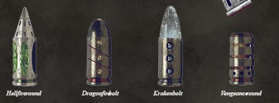

# 1246 爆矢 Bolt

精校状态：中文行文已逐段精校，部分术语仍为暂定

分类：武器 / 远程武器

原文来源：https://www.bilibili.com/opus/999872973552746496

原作者：帝国神选罐头

原文时间：编辑于 2024年12月23日 14:47

[返回分类目录](目录.md) · [全书目录](../../目录.md)

<!-- A1246-B0001 图片 -->

<!-- A1246-B0002 -->

原译文

Various types of Bolter ammunition 多种爆矢弹药

**校订译文**

Various types of Bolter ammunition 多种爆矢弹药

<!-- /A1246-B0002 -->

<!-- A1246-B0003 -->
## Standard bolts 标准爆矢

<!-- /A1246-B0003 -->

<!-- A1246-B0004 -->
**英文原文**

Standard bolts comprise the following components: outer casing, propellant base, main charge, mass reactive detonator cap, depleted deuterium core, diamantine tip. The calibre of the standard round .75 and it possesses a super-dense metallic core. Standard bolts can also feature a depleted uranium core.

<!-- /A1246-B0004 -->

<!-- A1246-B0005 -->

原译文

标准爆矢由以下部件组成：外壳、推进剂底座、主装药、质量反应雷管帽、贫氘芯、金刚石尖端。标准爆矢的口径为.75，它具有超致密的金属芯。标准爆矢也可以具有贫铀芯。

**校订译文**

标准爆矢由外壳、底部推进剂、主装药、质量反应式引信帽、贫化氘芯及钻金尖端构成。标准弹口径为0.75英寸，具有超高密度金属芯；也有采用贫铀芯的版本。

<!-- /A1246-B0005 -->

<!-- A1246-B0006 -->
## Banebolts of Eryxia 艾瑞克西亚的灾祸爆矢

<!-- /A1246-B0006 -->

<!-- A1246-B0007 -->
**英文原文**

Used by the Deathwatch, the relic Banebolts were created by the Arch-Magister Eryxia, who spent her entire life in search of the perfect bolt shell. She spent decades working with the Deathwatch and some of Eryxia's finest creations are still extant, housed within ammunition clips chased in platinum. Whatever the nature of the foe, just one of the Arch-Magister's Banebolts, when delivered to the centre mass, can slay its target in a second.

<!-- /A1246-B0007 -->

<!-- A1246-B0008 -->

原译文

由死亡守望使用的圣物灾祸爆矢是由大魔士艾瑞克西亚创造的，她一生都在寻找完美的爆矢弹药。她花了几十年的时间与死亡守望合作，艾瑞克西亚的一些最优秀的作品仍然存在，被放在白金制成的弹夹中。无论敌人的性质如何，只要一个大魔士的灾祸爆矢送达质心，就可以在一秒钟内杀死目标。

**校订译文**

死亡守望使用的艾瑞克西亚灾祸爆矢，是大宗师艾瑞克西亚留下的遗物。她毕生追求完美的爆矢弹药，曾与死亡守望合作数十年。其部分最杰出的作品仍保存至今，装在饰有铂金錾刻纹样的弹夹内。无论敌人是什么，只要一发灾祸爆矢命中躯干中心，便能在瞬息之间将其杀死。

**校注：** chased in platinum指以铂金錾刻装饰，不等于整个弹夹由铂金制成；centre mass在射击语境指躯干中心。Arch-Magister暂译大宗师（原大魔士），未在无依据时指定所属组织。

<!-- /A1246-B0008 -->

<!-- A1246-B0009 -->
## Banestrike Rounds 致命打击弹药

<!-- /A1246-B0009 -->

<!-- A1246-B0010 -->
**英文原文**

These mysterious shells are believed to have been developed in secret by the Alpha Legion during the Great Crusade. Their sole purpose seems to have been to breach the ceramite Power Armour of Space Marines. The Alpha Legion also gifted the ammunition to the Sons of Horus, where they were used by the Warmaster's veterans. The Banestrikes were used openly for the first time at the Drop Site Massacre where they proved to be devastating against the Loyalist Legions' forces.

<!-- /A1246-B0010 -->

<!-- A1246-B0011 -->

原译文

这些神秘的弹药被认为是阿尔法军团在大远征期间秘密开发的。他们的唯一目的似乎是破坏星际战士的陶钢动力装甲。阿尔法军团还将弹药赠送给了荷鲁斯之子，供战帅的老兵使用。致命打击弹药在登陆点大屠杀首次公开使用，在那里它们被证明对忠诚军团的部队具有毁灭性打击。

**校订译文**

这种神秘弹药据信由阿尔法军团在大远征期间秘密研制，唯一目的似乎就是击穿星际战士的陶钢动力装甲。阿尔法军团也将它赠给荷鲁斯之子，供战帅麾下的老兵使用。致命打击爆矢在登陆点大屠杀中首次公开亮相，对忠诚派军团造成了毁灭性打击。

<!-- /A1246-B0011 -->

<!-- A1246-B0012 -->
## Black Vault Bolts 黑色穹顶爆矢

<!-- /A1246-B0012 -->

<!-- A1246-B0013 -->
**英文原文**

Amongst the rarest forms of special issue ammunition available to the Deathwatch. These bolts are handed out, a few each, to warriors sent on investigative mssions, lest they encounter a foe their usual wargear cannot best.

<!-- /A1246-B0013 -->

<!-- A1246-B0014 -->

原译文

死亡守望所拥有的最稀有的特别弹药之一。这些爆矢被分发给被派去进行调查的战士，每人几枚，以免他们遇到他们通用的战争装备无法击败的敌人。

**校订译文**

这是死亡守望拥有的最稀有特种弹药之一。奉命执行调查任务的战士每人会领到几发，以备遭遇常规装备无法对付的敌人。

<!-- /A1246-B0014 -->

<!-- A1246-B0015 -->
## Bloodshard Shells 圣血破片爆矢

原题：Bloodshard Shells 圣血碎片弹药

<!-- /A1246-B0015 -->

<!-- A1246-B0016 -->
**英文原文**

Ammunition used by the Blood Angels for their Angelus boltguns. Its payload of razor-filament is very effective against most armours.

<!-- /A1246-B0016 -->

<!-- A1246-B0017 -->

原译文

圣血天使为他们的祷告爆矢枪使用的弹药。它的剃刀丝装载量对大多数盔甲非常有效。

**校订译文**

圣血破片爆矢是圣血天使为祷告爆矢枪配用的弹药，内部装填的剃刀细丝能有效破坏大多数护甲。

<!-- /A1246-B0017 -->

<!-- A1246-B0018 -->
## Derevenant Shells 终死弹药

<!-- /A1246-B0018 -->

<!-- A1246-B0019 -->
**英文原文**

Used by the Deathwatch, the Shells were developed by survivors from Fort Volossia. They contain a cyclic temporal core found to disrupt the Necron's reanimation long enough for their remains to vanish entirely.

<!-- /A1246-B0019 -->

<!-- A1246-B0020 -->

原译文

这些弹药由死亡守望使用，由沃罗希亚堡的幸存者研制而成。它们包含一个循环时间核心，被发现可以破坏死灵的复活用足够长的时间让它们的遗骸完全消失。

**校订译文**

这种弹药由沃罗希亚堡的幸存者研制，供死亡守望使用。其内部的循环时间核心能够阻断太空死灵的复生过程，使其遗骸在恢复之前就彻底消失。

<!-- /A1246-B0020 -->

<!-- A1246-B0021 -->
## Dragonfire Bolts 龙火爆矢

<!-- /A1246-B0021 -->

<!-- A1246-B0022 -->
**英文原文**

Used by Sternguard Veterans and release a gout of superheated gas that makes a mockery of cover; the gas discharge ensuring that struck targets receive full damage, even if partially protected.

<!-- /A1246-B0022 -->

<!-- A1246-B0023 -->

原译文

由肃卫老兵使用，释放出一股过热气体，使掩护显得可笑；气体放电确保被击中的目标即使受到部分保护也能受到完全的伤害。

**校订译文**

肃卫老兵使用这种弹药。它释放的大股超高温气体能绕过掩体，使只得到部分遮蔽的目标仍遭受充分杀伤。

**校注：** gas discharge指释放气体，不是气体放电。

<!-- /A1246-B0023 -->

<!-- A1246-B0024 -->
## Hellfire Rounds 地狱火弹

原题：Hellfire Rounds 地狱火弹药

<!-- /A1246-B0024 -->

<!-- A1246-B0025 -->
**英文原文**

Replaces the core and tip of the standard bolt round with a vial of mutagenic acid, and thousands of needles that fire into the target's flesh on impact, pumping the acid into the target. Developed specially to combat Tyranids, Hellfire Rounds have equally devastating results on other organic targets.

<!-- /A1246-B0025 -->

<!-- A1246-B0026 -->

原译文

用一小瓶诱变酸和数千根针头代替标准爆矢的核心和尖端，这些针头在撞击时射入目标的血肉中，将酸泵入目标。地狱火弹药是专门为对抗泰伦而开发的，对其他有机目标同样具有毁灭性的效果。

**校订译文**

地狱火弹以盛有诱变酸的小瓶和数千根细针，取代标准爆矢的弹芯与尖端。命中时，细针射入目标血肉，将酸液注入体内。它专为对付泰伦研制，但对其他有机目标同样具有毁灭性的杀伤力。

<!-- /A1246-B0026 -->

<!-- A1246-B0027 -->
## Helspears 地狱之矛弹药

<!-- /A1246-B0027 -->

<!-- A1246-B0028 -->
**英文原文**

Used by the Deathwatch, these bolts are sheathed in a proscribed material and can pierce the hellish defences of any entity hiding behind the Warp's corrupting power.

<!-- /A1246-B0028 -->

<!-- A1246-B0029 -->

原译文

这些爆矢由死亡守望使用，被一种被禁止的材料包裹，可以刺穿任何隐藏在亚空间腐败力量背后的实体的地狱般的防御。

**校订译文**

死亡守望使用这种包覆禁用材料的爆矢，能够穿透借亚空间腐化之力庇护自身的实体所拥有的可怕防御。

<!-- /A1246-B0029 -->

<!-- A1246-B0030 -->
## Hyper-Growth Bolts 增生爆矢

<!-- /A1246-B0030 -->

<!-- A1246-B0031 -->
**英文原文**

Used by the Creations of Bile. Contain toxins that cause victims to explode in eruptions of swelling flesh.

<!-- /A1246-B0031 -->

<!-- A1246-B0032 -->

原译文

拜尔的造物使用。含有毒素，导致受害者在爆发肿胀的肉体时爆炸。

**校订译文**

拜尔造物使用的弹药，所含毒素会使受害者的血肉猛烈增生、膨胀，直至爆裂。

<!-- /A1246-B0032 -->

<!-- A1246-B0033 -->
## Inertial Fusion Bolts 惯性聚变爆矢

<!-- /A1246-B0033 -->

<!-- A1246-B0034 -->
**英文原文**

Used by the Deathwatch, these bolts cause a series of micro vaccum wells to collapse on detonation. Like a crushing fist, they violently implode and cause horrendous, gaping craters in whatever the bolts penetrate.

<!-- /A1246-B0034 -->

<!-- A1246-B0035 -->

原译文

这些爆矢由死亡守望使用，在引爆时会导致一系列微型真空坍塌。就像一个破碎的拳头，它们猛烈地内爆，在爆矢穿透的任何地方都会造成可怕的、巨大的弹坑。

**校订译文**

死亡守望使用这种爆矢。引爆时，一连串微型真空井随之坍缩，如同巨拳猛然攥紧，产生剧烈内爆，在弹丸穿入的位置留下骇人的巨大凹坑。

<!-- /A1246-B0035 -->

<!-- A1246-B0036 -->
## Inferno Bolts 炼狱爆矢

<!-- /A1246-B0036 -->

<!-- A1246-B0037 -->
**英文原文**

Designed to immolate their targets and destroy them with superheated chemical fire. The deuterium core is replaced with an oxy-phosphorus gel, known as Promethium. It should be noted that the Chaos Space Marine Thousand Sons have their own similarly-named but unrelated type of inferno bolts, which are actually psychically-bound slugs that release arcane energies; these slugs explode with sorcerous energies upon impact.

<!-- /A1246-B0037 -->

<!-- A1246-B0038 -->

原译文

旨在焚烧他们的目标，并用极热的化学火焰将其摧毁。氘核被一种称为钷的氧磷凝胶所取代。应该指出的是，混沌星际战士千子有他们自己的名字相似但无关的炼狱爆矢，它们实际上是灵能束缚的子弹，可以释放神秘能量；这些子弹在撞击后会爆发出巫术能量。

**校订译文**

炼狱爆矢用于以极高温的化学火焰焚毁目标，其氘芯被称为钷素的氧磷凝胶取代。混沌星际战士中的千子军团也有一种同名弹药，但二者并无关联：千子的炼狱爆矢是以灵能束缚秘法能量的弹丸，命中时会爆发出巫术能量。

<!-- /A1246-B0038 -->

<!-- A1246-B0039 -->
## Gas-Powered Rounds 气动爆矢

原题：Gas-Powered Rounds 气体推进弹药

<!-- /A1246-B0039 -->

<!-- A1246-B0040 -->
**英文原文**

These Bolter shells are propelled only by the gas expelled from the barrel. As they lack the secondary rocket ignition, they are substantially more quiet than standard bolt rounds. As a result, they are used for stealth operations.

<!-- /A1246-B0040 -->

<!-- A1246-B0041 -->

原译文

这些爆矢仅由枪管排出的气体推动。由于它们没有二次火箭点火，因此比标准爆矢安静得多。因此，它们被用于秘密作战。

**校订译文**

气动爆矢只依靠枪管内喷出的气体推动，没有第二阶段火箭点火，因此比标准爆矢弹安静得多，常用于隐蔽行动。

<!-- /A1246-B0041 -->

<!-- A1246-B0042 -->
## Korvidari Bolts 暗鸦爆矢

<!-- /A1246-B0042 -->

<!-- A1246-B0043 -->
**英文原文**

Utilized by the Raven Guard. These are etched with raven-feather charms and sport an abnormally long range. The bolts are packed with extra propellant for superior range and accuracy. Each bolt also houses a minute, hyper-sensitive targeting and flight correction relay, allowing for a marksman's accuracy even against heavily obscured foes.

<!-- /A1246-B0043 -->

<!-- A1246-B0044 -->

原译文

由暗鸦守卫使用。雕刻着鸦羽饰物，射程异常远。这些爆矢装有额外的推进剂，以获得更高的射程和精度。每个爆矢还装有一个精准、超灵敏的瞄准飞行校正中继器，即使面对严重模糊的敌人，也能保证射手的准确性。

**校订译文**

暗鸦守卫使用的暗鸦爆矢上刻有鸦羽符纹，射程异常远。它装有额外推进剂，以提高射程和精度；每发弹丸还内置一套微型、极灵敏的瞄准与飞行修正装置，即使敌人被遮挡得十分严密，也能精确命中。

<!-- /A1246-B0044 -->

<!-- A1246-B0045 -->
## Kraken Pattern Penetrator Rounds 克拉肯型穿甲弹

原题：Kraken Pattern Penetrator Rounds 海妖型穿甲弹药

<!-- /A1246-B0045 -->

<!-- A1246-B0046 -->
**英文原文**

Powerful armour-piercing rounds. The deuterium core is replaced by a solid adamantine core and uses a heavier main charge. Upon impact, the outer casing peels away and the high velocity adamantium needle accelerates into the victim, where the larger detonator propels shards of super hardened metal further into the wound. These are effective against heavily-armoured infantry.

<!-- /A1246-B0046 -->

<!-- A1246-B0047 -->

原译文

强大的穿甲弹。氘核被坚固的固体精金核所取代，并使用更重的主装药。撞击后，外壳剥落，高速固体精金针加速进入受害者体内，更大的雷管将超硬金属碎片进一步推入伤口。这些对重装甲步兵很有效。

**校订译文**

克拉肯型穿甲弹威力强大，以实心精金芯取代氘芯，并增加主装药。命中后，外壳剥离，高速精金针进一步钻入目标体内；更大的起爆装置随后将超硬金属碎片推入伤口深处。它对重装甲步兵尤其有效。

<!-- /A1246-B0047 -->

<!-- A1246-B0048 -->
## Metal Storm Frag Shells 金属风暴破片弹

原题：Metal Storm Frag Shells 金属风暴破片弹药

<!-- /A1246-B0048 -->

<!-- A1246-B0049 -->
**英文原文**

Best against multiple lightly-armoured targets. They detonate before impact and spray shrapnel, shredding their victims. A proximity detonator replaces the mass-reactive cap, and the diamantine tip and deuterium core are replaced with an increased charge and fragmentation casing. They are similar to flak rounds and are used against clusters of enemies.

<!-- /A1246-B0049 -->

<!-- A1246-B0050 -->

原译文

最适合对抗多个轻装甲目标。它们在撞击前引爆并喷射弹片，将受害者撕碎。近炸雷管取代了质量反应帽，金刚石尖端和氘核被增加的装药和破片外壳所取代。它们类似于高射炮弹，用于对付成群的敌人。

**校订译文**

金属风暴破片弹最适合对付成群的轻装甲目标。它在接触目标之前便引爆，抛射弹片撕碎敌人。近炸引信取代了质量反应式引信帽，钻金尖端和氘芯则被更多装药与破片弹壳取代。它的作用类似高射破片弹，主要用于打击密集敌群。

<!-- /A1246-B0050 -->

<!-- A1246-B0051 -->
## Morbidus Bolts 疫病爆矢

<!-- /A1246-B0051 -->

<!-- A1246-B0052 -->
**英文原文**

Silent projectiles that are relics of Vanguard Spearhead formations. They are a perfection of the specialist shells used by Reiver operatives behind enemy lines. When fired, Morbidus Bolts streak unseen and unerringly through the weak spots of a foe's armor. They then shatter and dispense potent toxins, that slay their targets instantly and silently. A spent Morbidus shell's final act, is to expel a gaseous hallucinogen, that renders the silent victim doubly horrific to their shocked allies.

<!-- /A1246-B0052 -->

<!-- A1246-B0053 -->

原译文

先锋矛头部队遗留下来的寂静投射物。它们是掠夺者特工在敌后使用的专业子弹的完美体现。当发射时，疫病爆矢会看不见地、准确地穿过敌人盔甲的弱点。然后，它们会粉碎并释放强效毒素，立即悄无声息地杀死目标。一个用过的疫病爆矢的最后一个动作是排出一种气态致幻剂，这使得沉默的受害者对他们震惊的盟友来说更加可怕。

**校订译文**

疫病爆矢是先锋矛头部队的遗物级无声弹药，也是掠夺者在敌后行动时使用的特种弹药的完善版本。它悄无声息地划过，精准穿透敌人护甲的薄弱处，随后碎裂，释放强效毒素，令目标当即毙命。弹药最后还会排出气态致幻剂，让这名无声死去的受害者在惊恐同伴眼中显得更加骇人。

**校注：** 此处relic指遗物级装备，不是部队撤离后遗落的物件。

<!-- /A1246-B0053 -->

<!-- A1246-B0054 -->
## Nullbolts 虚无爆矢

<!-- /A1246-B0054 -->

<!-- A1246-B0055 -->
**英文原文**

Anti-Warp ammunition used by the Grey Knights.

<!-- /A1246-B0055 -->

<!-- A1246-B0056 -->

原译文

灰骑士使用的反亚空间弹药。

**校订译文**

灰骑士使用的反亚空间弹药。

<!-- /A1246-B0056 -->

<!-- A1246-B0057 -->
## Psycannon Bolts 灵能炮爆矢

<!-- /A1246-B0057 -->

<!-- A1246-B0058 -->
**英文原文**

Are used by the Inquisition, primarily the Ordo Malleus and Grey Knights, in Psycannons.

<!-- /A1246-B0058 -->

<!-- A1246-B0059 -->

原译文

被审判庭使用，主要是圣锤修会和灰骑士，在灵能炮中。

**校订译文**

这种弹药供审判庭的灵能炮使用，主要由恶魔审判庭和灰骑士装备。

<!-- /A1246-B0059 -->

<!-- A1246-B0060 -->
## Quake Bolts 震荡爆矢

<!-- /A1246-B0060 -->

<!-- A1246-B0061 -->
**英文原文**

Crafted individually by a Magos, each bolt contains a warhead that emits a pulsed shock wave.

<!-- /A1246-B0061 -->

<!-- A1246-B0062 -->

原译文

每个爆矢由贤者单独制造，每个爆矢都包含一个发射脉冲冲击波的弹头。

**校订译文**

震荡爆矢由贤者逐发手工制作，每枚弹头都能释放脉冲冲击波。

<!-- /A1246-B0062 -->

<!-- A1246-B0063 -->
## Reclusiam-Blessed Bolts 隐修祝福爆矢

<!-- /A1246-B0063 -->

<!-- A1246-B0064 -->
## Seeker Bolts 追踪爆矢

<!-- /A1246-B0064 -->

<!-- A1246-B0065 -->
**英文原文**

Special rounds used by Chaplain Boreas of the Dark Angels. Each handcrafted round contains a miniature cogitator capable of steering the bolt towards the heat signature of a target.

<!-- /A1246-B0065 -->

<!-- A1246-B0066 -->

原译文

黑暗天使牧师波瑞阿斯使用的特殊弹药。每一个手工制作的弹药都包含一个微型沉思者阵列，能够将爆矢转向目标的热量特征。

**校订译文**

黑暗天使教士波瑞亚斯使用的特殊弹药。每发均为手工制作，内含微型沉思者，能引导爆矢追踪目标的热源特征。

<!-- /A1246-B0066 -->

<!-- A1246-B0067 -->
## Stalker Silenced Shells 追猎者消声弹

原题：Stalker Silenced Shells 寂静潜行弹药

<!-- /A1246-B0067 -->

<!-- A1246-B0068 -->
**英文原文**

Are rounds with low sound signatures, meant for covert fighting and used in conjunction with an M40 targeting system and an extended barrel and stock on a bolter to produce a sniping weapon system. A solidified mercury slug replaces the mass-reactive warhead for lethality at sub-sonic projectile speed. A gas cartridge also replaces both the propellant base and main charge for silent firing.

<!-- /A1246-B0068 -->

<!-- A1246-B0069 -->

原译文

是具有低声特征的子弹，用于秘密作战，与M40瞄准系统和长管和枪托一起使用，以形成狙击武器系统。凝固的汞弹塞取代了质量反应弹头，在亚音速弹速下具有杀伤力。贮气瓶也取代了推进剂底座和主装药，实现了无声发射。

**校订译文**

追猎者消声弹发射声响很低，用于隐蔽作战。为爆矢枪配上 M40 瞄准系统、加长枪管和枪托，再搭配这种弹药，就构成了一套狙击武器系统。它以凝固的汞弹丸取代质量反应弹头，确保亚音速下仍有足够杀伤力；底部推进剂和主装药也由储气组件取代，以实现消声射击。

<!-- /A1246-B0069 -->

<!-- A1246-B0070 -->
## Tempest Bolts 暴风爆矢

<!-- /A1246-B0070 -->

<!-- A1246-B0071 -->
**英文原文**

Incorporate tiny plasma shock generators that emit electromagnetic and thermal radiation when the shell detonates. Produced only on Mars, Tempest shells are noted as particularly effective against machines and mechanical targets.

<!-- /A1246-B0071 -->

<!-- A1246-B0072 -->

原译文

采用微型等离子冲击发生器，当子弹爆炸时，会发出电磁和热辐射。暴风弹药仅在火星上生产，被认为对机器和机械目标特别有效。

**校订译文**

暴风爆矢内置微型等离子冲击发生器，会在弹丸引爆时释放电磁辐射和热辐射。这种弹药仅产于火星，对机器和机械目标尤其有效。

<!-- /A1246-B0072 -->

<!-- A1246-B0073 -->
## Thermic Penetrator Rounds 热透弹药

<!-- /A1246-B0073 -->

<!-- A1246-B0074 -->
**英文原文**

Used by the Deathwatch, these bolts are supplemented by thermic acceleration and releashed at hypervelocities, that result in near instant hits.

<!-- /A1246-B0074 -->

<!-- A1246-B0075 -->

原译文

这些爆矢由死亡守望使用，辅以热力加速，以超高速释放，达成近乎瞬间的撞击。

**校订译文**

死亡守望使用这种经热力加速的爆矢，其速度极高，几乎一经发射便能命中目标。

<!-- /A1246-B0075 -->

<!-- A1246-B0076 -->
## Tranquilizer Rounds 镇静弹药

<!-- /A1246-B0076 -->

<!-- A1246-B0077 -->
**英文原文**

A rare variety of boltgun ammunition filled with a powerful tranquilizing agent in lieu of explosives. Silent when fired from a Stalker Bolter, a single shot is capable of incapacitating a full-grown Ork. Issued one to a magazine, Tranquilizer Rounds saw service with Raven Guard forces seconded to the Deathwatch during the War of the Beast in mid-M32.

<!-- /A1246-B0077 -->

<!-- A1246-B0078 -->

原译文

一种罕见的爆矢枪弹药，里面装有强效镇静剂代替炸药。从潜行者爆矢枪发射时保持寂静，一枪就可以使成年的欧克丧失能力。在M32中期的野兽战争中，镇静弹药与借调到死亡守望的暗鸦守卫一起服役

**校订译文**

镇静弹是一种罕见的爆矢枪弹药，以强效镇静剂代替炸药。由追猎者爆矢枪发射时，它悄无声息，单发便可令成年欧克失去行动能力，每个弹匣只配一发。M32中叶的野兽战争期间，借调至死亡守望的暗鸦守卫部队曾使用这种弹药。

**校注：** 补回原译漏掉的“每个弹匣配一发”。

<!-- /A1246-B0078 -->

<!-- A1246-B0079 -->
## Vengeance Rounds 复仇弹

原题：Vengeance Rounds 复仇弹药

<!-- /A1246-B0079 -->

<!-- A1246-B0080 -->
**英文原文**

Utilise an unstable flux technology which makes them slightly hazardous to use but makes them very good against armoured targets. In fact, they were originally developed to combat Traitor Marines.

<!-- /A1246-B0080 -->

<!-- A1246-B0081 -->

原译文

利用不稳定熔解技术，使其使用起来有点危险，但对装甲目标非常有效。事实上，它们最初是为了对抗叛徒星际战士而开发的。

**校订译文**

复仇弹使用不稳定的通量技术，射击时有一定危险，却十分擅长对付装甲目标；它最初正是为打击叛变星际战士而研制的。

**校注：** flux是底稿技术名，按1245统一通量，不译熔解。

<!-- /A1246-B0081 -->

<!-- A1246-B0082 -->
## Vortex Bolts 旋涡爆矢

原题：Vortex Bolts 涡旋爆矢

<!-- /A1246-B0082 -->

<!-- A1246-B0083 -->
**英文原文**

Crafted long ago in forgotten times, these immensely rare rounds creature miniature vortexes within the target upon detonation. Such an event causes catastrophic damage to even the largest enemies and Psykers who miraculously survive are driven mad by the creatures of the Warp that pour from the tear in reality.

<!-- /A1246-B0083 -->

<!-- A1246-B0084 -->

原译文

这些极为罕见的子弹在被遗忘的时代很久以前就被制造出来，在引爆时会在目标内产生微型漩涡。这样的事件甚至会对最大的敌人造成灾难性的伤害，而奇迹般幸存下来的灵能者已经被现实中从裂隙中倾泻而出的亚空间生物逼疯了。

**校订译文**

旋涡爆矢诞生于早已被遗忘的远古时代，极为罕见。它引爆后会在目标体内制造微型旋涡，即使是最大的敌人，也会遭受灾难性创伤。侥幸生还的灵能者，则会被涌出现实裂隙的亚空间生物逼疯。

<!-- /A1246-B0084 -->

<!-- A1246-B0085 -->
## Witchseeker Bolts 猎巫爆矢

<!-- /A1246-B0085 -->

<!-- A1246-B0086 -->
**英文原文**

Used by the Black Templars. These consist of metal casings forged from the blades of fallen Battle-Brothers and blessed by Ecclesiarchy Priests. These bolts have an unnerving talent for finding their way into the heart of a Psyker.

<!-- /A1246-B0086 -->

<!-- A1246-B0087 -->

原译文

黑色圣堂使用。这些由倒下的战斗兄弟的刀刃锻造而成的金属外壳组成，并由国教牧师祝福。这些爆矢具有令人担心的天赋，可以进入灵能者的心脏。

**校订译文**

黑色圣堂使用猎巫爆矢。其金属外壳以阵亡战斗兄弟的刀剑熔铸而成，并经国教会祭司祝圣。这种弹药似乎总能找到灵能者的心脏，准得令人不安。

<!-- /A1246-B0087 -->

本篇核心术语与暂定项

以下列出本篇出现的英文原形及核心术语表用词。同形词可能指不同对象，具体词义以本篇正文和校注为准；单复数、别名和仅见于图注的名称可能尚未列入。完整候选见[术语表](../../术语表/双语术语候选.csv)。

| 英文 | 采用中文 | 状态 |
| --- | --- | --- |
| Space Marines | 星际战士 | 官方已核对 |
| Black Templars | 黑色圣堂 | 官方已核对 |
| Blood Angels | 圣血天使 | 官方已核对 |
| Dark Angels | 黑暗天使 | 官方已核对 |
| Deathwatch | 死亡守望 | 官方已核对 |
| Grey Knights | 灰骑士 | 官方已核对 |
| Thousand Sons | 千子 | 官方已核对 |
| Tyranids | 泰伦虫族 | 官方已核对 |
| Psyker | 灵能者 | 官方已核对 |
| Boltgun | 爆矢枪 | 官方已核对 |
| Warp | 亚空间 | 官方已核对 |
| Inquisition | 审判庭 | 暂定 |
| Ordo Malleus | 恶魔审判庭 | 用户指定 |
| Ecclesiarchy | 国教会 | 暂定 |
| Great Crusade | 大远征 | 暂定·官方待核 |
| Horus | 荷鲁斯 | 暂定·官方待核 |
| Sons of Horus | 荷鲁斯之子 | 暂定·官方待核 |
| Stalker | 追猎者 | 暂定·官方待核 |
| Stalker Bolter | 追猎者爆矢枪 | 暂定·官方待核 |
| Marksman | 神射手 | 暂定·官方待核 |
| Mars | 火星 | 暂定·官方待核 |
| Mercury | 水星 | 暂定·官方待核 |
| Hellfire Rounds | 地狱火弹 | 暂定·官方待核 |
| Chaplain | 教士 | 官方已核对 |
| Alpha Legion | 阿尔法军团 | 暂定·官方待核 |
| Raven Guard | 暗鸦守卫 | 官方已核 |
| Power Armour | 动力盔甲 | 暂定·官方待核 |
| Space Marine | 星际战士 | 暂定·官方待核 |
| Vanguard | 先锋 | 暂定·官方待核 |
| Reiver | 掠夺者 | 暂定·官方待核 |
| The Black Templars | 黑色圣堂 | 暂定·官方待核 |
| Sternguard Veterans | 肃卫老兵 | 暂定·官方待核 |
| The Beast | 野兽 | 暂定·官方待核 |
| Boreas | 波瑞亚斯 | 暂定·官方待核 |
| The Dark | 《黑暗》 | 暂定·官方待核 |
| The Blood | 鲜血 | 暂定·官方待核 |
| System | 星系（恒星系统） | 暂定·官方待核 |
| Bolt | 爆矢 | 暂定·官方待核 |
| Diamantine | 钻金 | 暂定·官方待核 |
| Promethium | 钷素 | 暂定·官方待核 |
| Inferno Bolts | 炼狱爆矢 | 暂定·官方待核 |
| Tranquilizer Rounds | 镇静弹 | 暂定·官方待核 |
| Arch-Magister Eryxia | 大宗师艾瑞克西亚 | 暂定·官方待核 |
| Fort Volossia | 沃罗希亚堡 | 暂定·官方待核 |
| Morbidus Bolts | 疫病爆矢 | 暂定·官方待核 |
| Bolter | 爆矢枪 | 暂定·官方待核 |

