# 1248 爆矢手枪 Bolt Pistol

精校状态：中文行文已逐段精校，部分术语仍为暂定

分类：武器 / 远程武器

原文来源：https://www.bilibili.com/opus/999873050861109269

原作者：帝国神选罐头

原文时间：编辑于 2025年03月21日 20:47

[返回分类目录](目录.md) · [全书目录](../../目录.md)

<!-- A1248-B0001 -->
**英文原文**

The Bolt Pistol is a smaller handheld version of the venerable Bolter. Assault Marines in particular favor the Bolt Pistol, frequently using them alongside the Chainsword. Imperial Guard Commissars and Officers also favor the weapon.

<!-- /A1248-B0001 -->

<!-- A1248-B0002 -->

原译文

爆矢手枪是老式爆矢手枪的小型手持版本。突击星际战士特别喜欢爆矢手枪，经常将其与链锯剑一起使用。帝国卫队的政委和军官也喜欢这种武器。

**校订译文**

爆矢手枪是历史悠久的爆矢枪的小型手持版本。突击星际战士尤其偏爱这种武器，常将其与链锯剑搭配使用；帝国卫队的政委和军官也十分青睐它。

**校注：** 首句Bolter是爆矢枪，原译误成爆矢手枪自我缩小。

<!-- /A1248-B0002 -->

<!-- A1248-B0003 -->
**英文原文**

Outside of Space Marines and other elite Imperial forces, bolt pistols are rare and are signs of status and power. They are only manufactured in specialized facilities on Mars and Space Marine homeworlds due to the advanced technology inherent to them. Only a minority can afford them because of the high cost of maintenance and ammunition. Sometimes they are passed down through the generations of noble families as heirlooms and relics detailed with elaborate scrollwork and family crests.

<!-- /A1248-B0003 -->

<!-- A1248-B0004 -->

原译文

在星际战士和其他精英帝国部队之外，爆矢手枪很少见，是地位和权力的象征。由于其固有的先进技术，它们只能在火星和星际战士家园世界的专门设施中制造。由于维护和弹药成本高昂，只有少数人能负担得起。有时，它们会作为传家宝和遗物代代相传，上面有精美的卷轴和家族纹章。

**校订译文**

在星际战士和其他帝国精锐部队之外，爆矢手枪并不常见，往往象征着地位与权力。它所需技术先进，只能在火星和星际战士家园世界的专门设施中制造；维护和弹药费用高昂，也让大多数人无力负担。一些爆矢手枪饰有精致卷纹和家族纹章，作为传家宝与遗物，在贵族家族中代代相传。

**校注：** 本段限定生产地点，下文又列辛提拉等产地，原文口径不一致；照底稿保留，不自行删去后文型号。

<!-- /A1248-B0004 -->

<!-- A1248-B0005 -->
## Imperial Bolter designs 帝国爆矢设计

<!-- /A1248-B0005 -->

<!-- A1248-B0006 -->
## Adeptus Astartes 阿斯塔特修会

<!-- /A1248-B0006 -->

<!-- A1248-B0007 -->
### Absolvor Bolt Pistol 赦免者爆矢手枪

<!-- /A1248-B0007 -->

<!-- A1248-B0008 -->
**英文原文**

The Absolvor Bolt Pistol is a newer generation of Bolt Pistol seen wielded by Primaris Space Marine Chaplains. This heavy weapon would seem like a fully sized rifle in non-augmented human hands and has significant stopping power.

<!-- /A1248-B0008 -->

<!-- A1248-B0009 -->

原译文

赦免者爆矢手枪是原铸星际战士牧师使用的新一代爆矢手枪。这种重型武器在非强化人手上看起来就像一支全尺寸步枪，具有强大的制动能力。

**校订译文**

赦免者爆矢手枪是原铸星际战士教士使用的新一代爆矢手枪。这款重型武器握在未经强化的普通人手中，几乎有一支完整步枪那么大，制止力十分强劲。

<!-- /A1248-B0009 -->

<!-- A1248-B0010 图片 -->
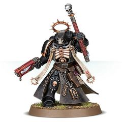

<!-- A1248-B0011 -->

原译文

Absolvor Bolt Pistol 赦免者爆矢手枪

**校订译文**

Absolvor Bolt Pistol 赦免者爆矢手枪

<!-- /A1248-B0011 -->

<!-- A1248-B0012 -->
### Eliminator Bolt Pistol 歼灭者爆矢手枪

<!-- /A1248-B0012 -->

<!-- A1248-B0013 -->
**英文原文**

This long-barreled bolt pistol has been observed in use by Primaris Space Marine Vanguard Eliminators.

<!-- /A1248-B0013 -->

<!-- A1248-B0014 -->

原译文

这种长管爆矢手枪已被观察到由原铸星际战士先锋歼灭者使用。

**校订译文**

原铸星际战士先锋部队中的歼灭者使用这种长管爆矢手枪。

<!-- /A1248-B0014 -->

<!-- A1248-B0015 图片 -->
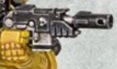

<!-- A1248-B0016 -->

原译文

Eliminator Bolt Pistol 歼灭者爆矢手枪

**校订译文**

Eliminator Bolt Pistol 歼灭者爆矢手枪

<!-- /A1248-B0016 -->

<!-- A1248-B0017 -->
### Equis-Pattern Bolt Pistol 奔马型爆矢手枪

<!-- /A1248-B0017 -->

<!-- A1248-B0018 -->
**英文原文**

Equis-Pattern Bolt Pistol is a variant of the Bolt Pistol, that was created by the Techmarines of the White Scars Chapter.

<!-- /A1248-B0018 -->

<!-- A1248-B0019 -->

原译文

奔马型爆矢手枪是爆矢手枪的一种变体，由白色疤痕战团的技术军士创造。

**校订译文**

奔马型爆矢手枪由白疤战团的科技战士研制，是爆矢手枪的一种改型。

<!-- /A1248-B0019 -->

<!-- A1248-B0020 -->
### Guardian Bolt Pistol 守护者爆矢手枪

<!-- /A1248-B0020 -->

<!-- A1248-B0021 -->
**英文原文**

The Guardian Bolt Pistol is a distinction awarded to Deathwatch Space Marines regardless of rank for conspicuous gallantry, courage under fire, or actions above and beyond the call of duty. Therefore they also serve as a status sign for veterans and the bearer's name and his deed are inscribed on the weapon during the awarding ceremony. Each weapon is tailored for its wearer and he is allowed to keep it, even after leaving the Deathwatch to return to his Chapter. However if these pistols are not buried with their owner but are found somewhere they are taken back to the Deathwatch where they are enshrined along with the recorded deeds of it's previous owner. These pistols are not re-issued.

<!-- /A1248-B0021 -->

<!-- A1248-B0022 -->

原译文

守护者爆矢手枪是授予死亡守望星际战士的一种荣誉，无论其军衔如何，都是为了表彰其非凡的英勇、在炮火下的勇气或超出职责范围的行动。因此，它们也可以作为老兵的身份标志，在颁奖仪式上，持有者的姓名和行为会刻在武器上。每件武器都是为佩戴者量身定制的，即使在离开死亡守望返回自己的战团后，他也可以保留它。然而，如果这些手枪没有与拥有者一起埋葬，而是在某个地方被发现，它们会被带回死亡守望，在那里它们会与前拥有者的行动记录一起被供奉。这些手枪不会重新发放。

**校订译文**

守护者爆矢手枪是一种荣誉奖赏，可授予任何军衔的死亡守望星际战士，以表彰卓越英勇、临阵无畏或超越职责的功绩。它也因此成为老兵的身份象征；授奖仪式上，获奖者的姓名和事迹会刻在枪身上。每把手枪都为持有者量身打造，即使他离开死亡守望、回归原属战团，也获准继续保留。如果手枪没有随主人下葬，而是在别处被寻获，便会送回死亡守望，与主人生前的事迹记录一同供奉，不再重新配发。

<!-- /A1248-B0022 -->

<!-- A1248-B0023 -->
### Godwyn-Branx Pattern Bolt Pistol 戈德温-布兰克斯型爆矢手枪

<!-- /A1248-B0023 -->

<!-- A1248-B0024 -->
**英文原文**

A subtle variation on the more well-known Godwyn-Ultima pattern bolt pistol. This human-portable weapon still carries a terrifying punch, provided by the high-calibre mass reactive shells loaded into its clip.

<!-- /A1248-B0024 -->

<!-- A1248-B0025 -->

原译文

更为人所知的戈德温-极限型爆矢手枪的微妙变体。这种人类携带的便携式武器仍然携带可怕的一击，这是由装在弹夹里的大口径质量反应弹提供的。

**校订译文**

这是较知名的戈德温—极限型爆矢手枪的一种小幅改型，可由普通人携行使用。弹匣内的大口径质量反应弹仍赋予它可怕的威力。

<!-- /A1248-B0025 -->

<!-- A1248-B0026 图片 -->
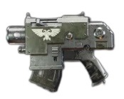

<!-- A1248-B0027 -->

原译文

Godwyn-Branx Pattern Bolt Pistol 戈德温-布兰克斯型爆矢手枪

**校订译文**

Godwyn-Branx Pattern Bolt Pistol 戈德温-布兰克斯型爆矢手枪

<!-- /A1248-B0027 -->

<!-- A1248-B0028 -->
### Godwyn Ultima 戈德温-极限型

<!-- /A1248-B0028 -->

<!-- A1248-B0029 -->
**英文原文**

The Minotaurs are known to have used Godwyn Ultima bolt weapons during the Badab War - it is unclear if these are Boltguns or bolt pistols.

<!-- /A1248-B0029 -->

<!-- A1248-B0030 -->

原译文

众所周知，米诺陶在巴达布战争期间使用了戈德温-极限爆矢武器——目前尚不清楚这些是爆矢枪还是爆矢手枪。

**校订译文**

米诺陶在巴达布战争期间曾使用戈德温—极限型爆矢武器，但无法确定具体是爆矢枪还是爆矢手枪。

<!-- /A1248-B0030 -->

<!-- A1248-B0031 图片 -->
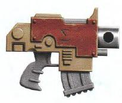

<!-- A1248-B0032 -->

原译文

Godwyn Ultima or Ultima 戈德温-极限型或极限型

**校订译文**

Godwyn Ultima or Ultima 戈德温-极限型或极限型

<!-- /A1248-B0032 -->

<!-- A1248-B0033 -->
### Heavy Bolt Pistol 重型爆矢手枪

<!-- /A1248-B0033 -->

<!-- A1248-B0034 -->
**英文原文**

The Heavy Bolt Pistol, also called the Special Issue Bolt Pistol is a larger variant of the standard Bolt Pistol used by Primaris Space Marines, most notably Reivers and Assault Intercessors.

<!-- /A1248-B0034 -->

<!-- A1248-B0035 -->

原译文

重型爆矢手枪，也称为特殊爆矢手枪，是原铸星际战士使用的标准爆矢手枪的大型变体，最著名的是掠夺者和突击仲裁者。

**校订译文**

重型爆矢手枪又称特种配发爆矢手枪，是原铸星际战士使用的标准爆矢手枪的大型改型，尤常见于掠夺者和突击仲裁者。

<!-- /A1248-B0035 -->

<!-- A1248-B0036 图片 -->
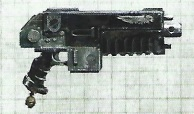

<!-- A1248-B0037 -->

原译文

Heavy Bolt Pistol 重型爆矢手枪

**校订译文**

Heavy Bolt Pistol 重型爆矢手枪

<!-- /A1248-B0037 -->

<!-- A1248-B0038 -->
### Phobos pattern 火卫一型

<!-- /A1248-B0038 -->

<!-- A1248-B0039 -->
**英文原文**

This design dates back to the Great Crusade and Horus Heresy

<!-- /A1248-B0039 -->

<!-- A1248-B0040 -->

原译文

这种设计可以追溯到大远征和荷鲁斯叛乱

**校订译文**

这种设计可追溯至大远征和荷鲁斯之乱时期。

<!-- /A1248-B0040 -->

<!-- A1248-B0041 图片 -->
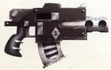

<!-- A1248-B0042 -->

原译文

Phobos pattern Bolt Pistol 火卫一型爆矢手枪

**校订译文**

Phobos pattern Bolt Pistol 火卫一型爆矢手枪

<!-- /A1248-B0042 -->

<!-- A1248-B0043 -->
### Ikanos pattern 伊卡诺斯型

<!-- /A1248-B0043 -->

<!-- A1248-B0044 -->
**英文原文**

This design dates back to the Great Crusade, and is a .50 caliber weapon.

<!-- /A1248-B0044 -->

<!-- A1248-B0045 -->

原译文

这种设计可以追溯到大远征，是一种.50口径的武器。

**校订译文**

这种设计可追溯至大远征时期，口径为0.50英寸。

<!-- /A1248-B0045 -->

<!-- A1248-B0046 图片 -->
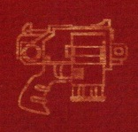

<!-- A1248-B0047 -->

原译文

Ikanos pattern Bolt Pistol 伊卡诺斯型爆矢枪

**校订译文**

Ikanos pattern Bolt Pistol 伊卡诺斯型爆矢手枪

<!-- /A1248-B0047 -->

<!-- A1248-B0048 -->
### Ryza-Ultima variant 瑞扎-极限型

<!-- /A1248-B0048 -->

<!-- A1248-B0049 -->
**英文原文**

This design is known to have been used by the Star Phantoms during the Badab War.

<!-- /A1248-B0049 -->

<!-- A1248-B0050 -->

原译文

众所周知，这种设计在巴达布战争期间被星空幻影使用过。

**校订译文**

星辰幻影在巴达布战争期间使用过这种型号。

<!-- /A1248-B0050 -->

<!-- A1248-B0051 图片 -->
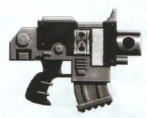

<!-- A1248-B0052 -->

原译文

Ryza-Ultima variant 瑞扎-极限型

**校订译文**

Ryza-Ultima variant 瑞扎-极限型

<!-- /A1248-B0052 -->

<!-- A1248-B0053 -->
### Silentus Pistol 静默手枪

<!-- /A1248-B0053 -->

<!-- A1248-B0054 -->
**英文原文**

Silentus Pistols are modified Bolt Pistols that have been created by the Raven Guard Chapter.

<!-- /A1248-B0054 -->

<!-- A1248-B0055 -->

原译文

静默手枪是由暗鸦守卫战团制造的改进型爆矢手枪。

**校订译文**

静默手枪是由暗鸦守卫战团制造的改进型爆矢手枪。

<!-- /A1248-B0055 -->

<!-- A1248-B0056 -->
### Spectris pattern 观察者型

<!-- /A1248-B0056 -->

<!-- A1248-B0057 -->
**英文原文**

This design is known to have been used by the Marines Errant during the Badab War.

<!-- /A1248-B0057 -->

<!-- A1248-B0058 -->

原译文

众所周知，星际战士在巴达布战争期间曾使用过这种设计。

**校订译文**

游侠战士在巴达布战争期间使用过这种型号。

**校注：** Marines Errant是战团专名游侠战士，不能泛译为星际战士。

<!-- /A1248-B0058 -->

<!-- A1248-B0059 图片 -->
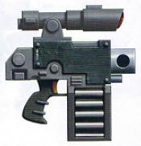

<!-- A1248-B0060 -->

原译文

Spectris pattern with high-capacity magazine 带有大容量弹匣的观察者型

**校订译文**

Spectris pattern with high-capacity magazine 带有大容量弹匣的观察者型

<!-- /A1248-B0060 -->

<!-- A1248-B0061 -->
### Tigrus pattern 泰格鲁斯型

<!-- /A1248-B0061 -->

<!-- A1248-B0062 -->
**英文原文**

Tigrus Pattern Bolt pistol was first discovered in the depths of Forge World Tigrus and the STC data for it was quickly disseminated throughout the Imperium before the beginning of Horus Heresy. Tigrus is now lost, yet the bolt-pistols that bear its name, though no longer produced, continue to see service in the 41st Millennium.

<!-- /A1248-B0062 -->

<!-- A1248-B0063 -->

原译文

泰格鲁斯型爆矢手枪最早是在铸造世界泰格鲁斯深处发现的，在荷鲁斯叛乱开始之前，它的STC数据很快在整个帝国传播开来。泰格鲁斯现在已经失踪，但以泰格鲁斯命名的爆矢手枪虽然不再生产，但在第41个千年仍然服役。

**校订译文**

泰格鲁斯型爆矢手枪的设计最初发现于铸造世界泰格鲁斯深处；荷鲁斯之乱爆发前，其标准建造模板（STC）数据便已迅速传播到帝国各地。如今泰格鲁斯已经失落，这些以它命名的爆矢手枪虽不再生产，却仍在第四十一千纪服役。

<!-- /A1248-B0063 -->

<!-- A1248-B0064 图片 -->
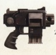

<!-- A1248-B0065 -->

原译文

Tigris Pattern Bolt Pistol 泰格鲁斯型爆矢手枪

**校订译文**

Tigris Pattern Bolt Pistol 泰格鲁斯型爆矢手枪

**校注：** 图注Tigris与正文Tigrus异拼，按同一型号统一中文，原英文保持。

<!-- /A1248-B0065 -->

<!-- A1248-B0066 -->
### Ultima Bolt pistol 极限爆矢手枪

<!-- /A1248-B0066 -->

<!-- A1248-B0067 -->
**英文原文**

This design is known to have been used by the Mantis Warriors and the Fire Hawks during the Badab War. The Minotaurs are known to have used Ultima bolt weapons during the Badab War - it is unclear if these are Boltguns or bolt pistols.

<!-- /A1248-B0067 -->

<!-- A1248-B0068 -->

原译文

众所周知，在巴达布战争期间，螳螂勇士和火鹰曾使用过这种设计。众所周知，米诺陶在巴达布战争期间使用了极限爆矢武器，目前尚不清楚这些是爆矢枪还是爆矢手枪。

**校订译文**

螳螂勇士和火鹰曾在巴达布战争期间使用这种型号。米诺陶当时也使用过极限型爆矢武器，但无法确定是爆矢枪还是爆矢手枪。

<!-- /A1248-B0068 -->

<!-- A1248-B0069 图片 -->
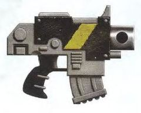

<!-- A1248-B0070 -->

原译文

Ultima Bolt pistol 极限爆矢手枪

**校订译文**

Ultima Bolt pistol 极限爆矢手枪

<!-- /A1248-B0070 -->

<!-- A1248-B0071 -->
### Umbra Bolt pistol 阴影爆矢手枪

<!-- /A1248-B0071 -->

<!-- A1248-B0072 -->
**英文原文**

The Umbra Bolt pistol is one of the oldest patterns used by the Astartes. This pattern lacks many of the more advanced sensory and other power armor interfaces used by later patterns. Despite this, the pattern was known as reliable and effective. This pattern is known to have been used by First Captain Zerberyn of the Fists Exemplar during the War of the Beast, and by the Executioners during the Badab War.

<!-- /A1248-B0072 -->

<!-- A1248-B0073 -->

原译文

阴影爆矢手枪是阿斯塔特使用的最古老的型号之一。这种型号缺少许多后来型号使用的更高级的感知和其他动力装甲界面。尽管如此，这种型号被认为是可靠和有效的。众所周知，在野兽战争期间，典范之拳的第一连长泽伯林和巴达布战争期间的处刑者都使用了这种型号。

**校订译文**

阴影爆矢手枪是阿斯塔特使用的最古老型号之一，缺少后期型号上的许多先进感应装置及动力装甲接口，但仍以可靠、有效著称。野兽战争期间，典范之拳第一连长泽伯林使用过它；巴达布战争期间，处刑者也曾采用这一型号。

<!-- /A1248-B0073 -->

<!-- A1248-B0074 图片 -->
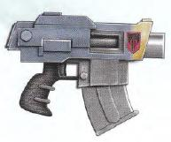

<!-- A1248-B0075 -->

原译文

Umbra Bolt pistol 阴影爆矢手枪

**校订译文**

Umbra Bolt pistol 阴影爆矢手枪

<!-- /A1248-B0075 -->

<!-- A1248-B0076 -->
### Umbra-Magnus Bolt pistol 巨影爆矢手枪

<!-- /A1248-B0076 -->

<!-- A1248-B0077 -->
**英文原文**

This design is known to have been used by the Mantis Warriors and the Carcharodons during the Badab War.

<!-- /A1248-B0077 -->

<!-- A1248-B0078 -->

原译文

众所周知，这种设计在巴达布战争期间被螳螂勇士和噬人鲨使用过。

**校订译文**

螳螂勇士和噬人鲨在巴达布战争期间使用过这种型号。

<!-- /A1248-B0078 -->

<!-- A1248-B0079 图片 -->
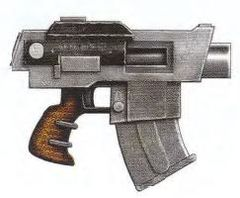

<!-- A1248-B0080 -->

原译文

Umbra-Magnus Bolt pistol 巨影爆矢手枪

**校订译文**

Umbra-Magnus Bolt pistol 巨影爆矢手枪

<!-- /A1248-B0080 -->

<!-- A1248-B0081 图片 -->
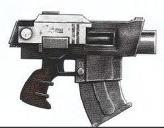

<!-- A1248-B0082 -->

原译文

Star Phantoms(possibly Umbra or Umbra-Magnus) 星空幻影（可能是阴影型或巨影型）

**校订译文**

Star Phantoms(possibly Umbra or Umbra-Magnus) 星辰幻影所用型号（可能为阴影型或巨影型）

<!-- /A1248-B0082 -->

<!-- A1248-B0083 -->
## Other Bolt pistols used by Imperial or human factions and organisations 帝国或人类派系和组织使用的其他爆矢手枪

<!-- /A1248-B0083 -->

<!-- A1248-B0084 -->
### Ceres pattern 谷神星型

<!-- /A1248-B0084 -->

<!-- A1248-B0085 -->
**英文原文**

The Ceres-pattern bolt pistol is associated with the Imperial Navy and often found in the arsenal of Rogue Traders.

<!-- /A1248-B0085 -->

<!-- A1248-B0086 -->

原译文

谷神星型爆矢手枪与帝国海军有关，经常出现在行浪商人的军火库中。

**校订译文**

谷神星型爆矢手枪通常与帝国海军联系在一起，也经常出现在行商浪人的军械库中。

<!-- /A1248-B0086 -->

<!-- A1248-B0087 图片 -->
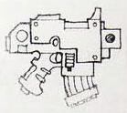

<!-- A1248-B0088 -->

原译文

Ceres Partten 谷神星型

**校订译文**

Ceres Partten 谷神星型

<!-- /A1248-B0088 -->

<!-- A1248-B0089 -->
### Garm Pattern Service Bolt Pistol 加姆型制式爆矢手枪

原题：Garm Pattern Service Bolt Pistol 加姆型武装爆矢手枪

<!-- /A1248-B0089 -->

<!-- A1248-B0090 -->
**英文原文**

The Garm Pattern Service Bolt Pistol is a large and intimidating design that are therefore often used by Commissar who wear them unholstered in the line of duty.

<!-- /A1248-B0090 -->

<!-- A1248-B0091 -->

原译文

加姆型武装爆矢手枪是一种庞大而令人生畏的设计，因此经常被在执行任务时佩戴它们的政委使用。

**校订译文**

加姆型制式爆矢手枪体积庞大、外形慑人，因而经常被政委选用；他们执行任务时，会把它露在枪套外，直接展示这件武器。

**校注：** unholstered指未收入枪套，原译漏掉该佩带方式；未擅补为某种专用悬挂结构。

<!-- /A1248-B0091 -->

<!-- A1248-B0092 图片 -->
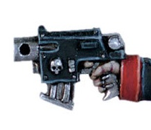

<!-- A1248-B0093 -->

原译文

Commissar Bolt Pistol(possibly Garm) 政委爆矢手枪（可能是加姆型）

**校订译文**

Commissar Bolt Pistol(possibly Garm) 政委爆矢手枪（可能是加姆型）

<!-- /A1248-B0093 -->

<!-- A1248-B0094 -->
### Cinder Crag Forge "Mauler" Bolt Pistol 灰烬岩峰铸造厂“重击”爆矢手枪

原题：Cinder Crag Forge "Mauler" Bolt Pistol 灰烬岩峰铸造“重击”爆矢手枪

<!-- /A1248-B0094 -->

<!-- A1248-B0095 -->
**英文原文**

Mauler bolt pistols are designed for "normal" humans (not like the much heavier and bulkier Adeptus Astartes variants) and are manufactured using the best alloys and components. Each sophisticated copy is hand-made by the Servitor-savants of the Cinder Crag and unique as it has to be tailored to the client's precise biometric data.

<!-- /A1248-B0095 -->

<!-- A1248-B0096 -->

原译文

重击爆矢手枪是为“正常”人设计的（不像更重、更庞大的阿斯塔特修会变体），并使用最好的合金和部件制造。每一份精密的复制品都是由灰烬岩峰的伺服专家手工制作的，并且是独一无二的，因为它必须根据客户的精确生物特征数据量身定制。

**校订译文**

“重击”爆矢手枪专为普通人设计，体积和重量小于阿斯塔特使用的型号，并采用上等合金与零件制造。每一把都由灰烬岩峰的博学机仆手工打造，按照客户精确的生物测量数据量身定制，因此件件独一无二。

**校注：** Servitor-savants指具备专门知识的机仆，不是伺服系统专家。

<!-- /A1248-B0096 -->

<!-- A1248-B0097 图片 -->
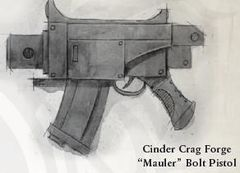

<!-- A1248-B0098 -->

原译文

Cinder Crag Forge "Mauler" Bolt Pistol 灰烬岩峰铸造“重击”爆矢手枪

**校订译文**

Cinder Crag Forge "Mauler" Bolt Pistol 灰烬岩峰铸造厂“重击”爆矢手枪

<!-- /A1248-B0098 -->

<!-- A1248-B0099 -->
### Goliath Bolt Pistol 歌利亚爆矢手枪

<!-- /A1248-B0099 -->

<!-- A1248-B0100 -->
**英文原文**

Used by House Goliath of Necromunda.

<!-- /A1248-B0100 -->

<!-- A1248-B0101 -->

原译文

由涅克罗蒙达的歌利亚家族使用。

**校订译文**

由涅克罗蒙达的歌利亚家族使用。

<!-- /A1248-B0101 -->

<!-- A1248-B0102 图片 -->
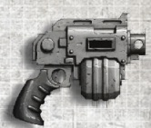

<!-- A1248-B0103 -->

原译文

Goliath Bolt Pistol 歌利亚爆矢手枪

**校订译文**

Goliath Bolt Pistol 歌利亚爆矢手枪

<!-- /A1248-B0103 -->

<!-- A1248-B0104 -->

原译文

Hesh Pattern M38 Mk.II Bolt Pistol 赫什型M38 Mk.II爆矢手枪

**校订译文**

Hesh Pattern M38 Mk.II Bolt Pistol 赫什型M38 Mk.II爆矢手枪

<!-- /A1248-B0104 -->

<!-- A1248-B0105 -->
**英文原文**

Rare outside the ranks of the Adeptus Mechanicus hailing from the shrouded Lathe Worlds of the Calixis Sector, the Hesh-pattern M38 MkII was never widely adopted by the Departmento Munitorum due to its temperamental nature, difficult to maintain even by the standards of bolt weaponry. The M38 MkII almost seems as if it was designed to be used by individuals more knowledgeable of firearms than even those august members of the Imperial Guard who wield such weapons. Nevertheless, the Tech-Priests of the Lathe Worlds appreciate the weapon’s effectiveness, and do not have the same trouble with its machine spirit as those less attuned to the mysteries of technology. The MkII’s distinctive drum magazine allows for a higher rate of fire than other bolt pistols, but is also prone to more frequent malfunction.

<!-- /A1248-B0105 -->

<!-- A1248-B0106 -->

原译文

在卡利西斯星区隐蔽的车床世界中，很少有机械神教之外的人，但由于其喜怒无常的性质，即使按照爆矢武器的标准也难以维护，因此从未被军务部广泛采用。M38 Mk.II似乎是为比那些使用这种武器的威严的帝国卫队成员更了解枪支的人而设计的。然而，车床世界的技术神甫们欣赏这种武器的有效性，并且不会像那些不太了解技术奥秘的人那样，对它的机魂有同样的困扰。Mk.II独特的弹鼓比其他爆矢手枪具有更高的射速，但也容易发生更频繁的故障。

**校订译文**

赫什型 M38 Mk.II 爆矢手枪主要见于卡利西斯星区神秘的拉特诸世界所出的机械修会人员手中，在其他群体中很少见。它性能不稳定，即使以爆矢武器的标准衡量也难以维护，因此从未被军务部广泛采用。它似乎是为那些比帝国卫队中有资格使用爆矢武器的显赫成员还要精通枪械的人设计的。不过，拉特诸世界的技术祭司很欣赏它的效能；他们深谙技术奥秘，不像旁人那样难以驾驭其机魂。Mk.II 独特的弹鼓可支持比其他爆矢手枪更高的射速，但也更容易发生故障。

<!-- /A1248-B0106 -->

<!-- A1248-B0107 -->
### Ironhead Bolt Pistol 铁首爆矢手枪

<!-- /A1248-B0107 -->

<!-- A1248-B0108 -->
**英文原文**

Used by the Squat Ironhead Prospectors of Necromunda. The weapon is twin-barreled and features a drum magazine.

<!-- /A1248-B0108 -->

<!-- A1248-B0109 -->

原译文

由涅克罗蒙达的铁首矮人探矿队使用。这种武器是双管的，有一个弹鼓。

**校订译文**

涅克罗蒙达的矮人铁首勘探者使用这种双管、弹鼓供弹的武器。

<!-- /A1248-B0109 -->

<!-- A1248-B0110 图片 -->
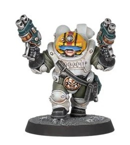

<!-- A1248-B0111 -->

原译文

Ironhead Bolt Pistol 铁首爆矢手枪

**校订译文**

Ironhead Bolt Pistol 铁首爆矢手枪

<!-- /A1248-B0111 -->

<!-- A1248-B0112 -->
### M-six-seven-six Union Model Autobolter M-6-7-6联盟型自动爆矢枪

<!-- /A1248-B0112 -->

<!-- A1248-B0113 -->
**英文原文**

A type of bolt pistol similar in design to the Phobos pattern but predating the Imperial pattern designation. By the time of the Horus Heresy it was considered an antique.

<!-- /A1248-B0113 -->

<!-- A1248-B0114 -->

原译文

一种设计类似于火卫一型但早于帝国型号称呼的爆矢手枪。在荷鲁斯叛乱时代，它被认为是古董。

**校订译文**

一种设计类似火卫一型的爆矢手枪，出现年代早于帝国型号命名体系。到荷鲁斯之乱时期，它已被视作古董。

<!-- /A1248-B0114 -->

<!-- A1248-B0115 -->
### Orlock Bolt Pistol 欧洛克爆矢手枪

<!-- /A1248-B0115 -->

<!-- A1248-B0116 -->
**英文原文**

Used by House Orlock of Necromunda, drum fed.

<!-- /A1248-B0116 -->

<!-- A1248-B0117 -->

原译文

由涅克罗蒙达的欧洛克家族使用，鼓式进弹。

**校订译文**

涅克罗蒙达的欧洛克家族使用这种弹鼓供弹的型号。

<!-- /A1248-B0117 -->

<!-- A1248-B0118 图片 -->
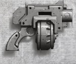

<!-- A1248-B0119 -->

原译文

Orlock Bolt Pistol 欧洛克爆矢手枪

**校订译文**

Orlock Bolt Pistol 欧洛克爆矢手枪

<!-- /A1248-B0119 -->

<!-- A1248-B0120 -->
### Sacristan Bolt Pistol 司库爆矢手枪

<!-- /A1248-B0120 -->

<!-- A1248-B0121 -->
**英文原文**

The Sacristan Bolt Pistol is manufactured for the Ordo Calixis by the Orthlack on Scintilla. This model is based on the Godwyn-De’az patterns of the Sisters of Battle and the weapons are marked with the Inquisition's brand and seal.

<!-- /A1248-B0121 -->

<!-- A1248-B0122 -->

原译文

司库爆矢手枪是由微光星的奥特拉克神殿为卡利西斯审判庭制造的。该型号基于战斗修女的戈德温-德阿兹图案，武器上标有审判庭的烙印和印章。

**校订译文**

司库爆矢手枪由辛提拉的奥斯拉克为卡利西斯审判庭制造，以战斗修女的戈德温—德阿兹型为基础，枪上刻有审判庭标志和印记。

**校注：** Sacristan此处为武器名，沿现稿司库，不等同于826世界名；Orthlack与前述Hax-Orthlack统一奥斯拉克词根。

<!-- /A1248-B0122 -->

<!-- A1248-B0123 -->
### Volg "Spitfire" Bolt Pistol 伏尔格“喷火”爆矢手枪

原题：Volg "Spitfire" Bolt Pistol 伏尔加“喷火”爆矢手枪

<!-- /A1248-B0123 -->

<!-- A1248-B0124 -->
**英文原文**

The Spitfire "bolt pistol" is not a real bolt pistol, see other bolt weapons.

<!-- /A1248-B0124 -->

<!-- A1248-B0125 -->

原译文

喷火“爆矢手枪”不是真正的爆矢手枪，具体在其他爆矢武器。

**校订译文**

“喷火爆矢手枪”并非真正的爆矢手枪，详见“其他爆矢武器”。

<!-- /A1248-B0125 -->

<!-- A1248-B0126 -->

原译文

Valhallan Mk 45 瓦尔哈拉Mk.45

**校订译文**

Valhallan Mk 45 瓦尔哈拉Mk.45

<!-- /A1248-B0126 -->

<!-- A1248-B0127 -->
**英文原文**

A bulky pattern of bolt pistol used by the Imperial Guard's Valhallan Ice Warriors.

<!-- /A1248-B0127 -->

<!-- A1248-B0128 -->

原译文

帝国卫队瓦尔哈拉冰雪战士使用的一种笨重的爆矢手枪。

**校订译文**

帝国卫队瓦尔哈拉冰雪战士使用的一种笨重的爆矢手枪。

<!-- /A1248-B0128 -->

<!-- A1248-B0129 -->
### Scars Machina 机械伤痕

<!-- /A1248-B0129 -->

<!-- A1248-B0130 -->
**英文原文**

A highly modifiable bolt pistol pattern, popular amongst the gangers and hired guns of Necromunda. Associated with the gangers of House Goliath.

<!-- /A1248-B0130 -->

<!-- A1248-B0131 -->

原译文

一种高度可修改的爆矢手枪型号，在涅克罗蒙达的歹徒和雇佣枪手中很受欢迎。与歌利亚家族的成员有关。

**校订译文**

一种便于进行多种改装的爆矢手枪，在涅克罗蒙达的帮派成员和雇佣枪手中很受欢迎，尤其常见于歌利亚家族帮派。

<!-- /A1248-B0131 -->

<!-- A1248-B0132 图片 -->
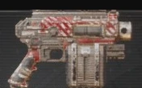

<!-- A1248-B0133 -->

原译文

Scars Machina 机械伤痕

**校订译文**

Scars Machina 机械伤痕

<!-- /A1248-B0133 -->

<!-- A1248-B0134 -->
### More bolt pistol designs 更多爆矢手枪设计

<!-- /A1248-B0134 -->

<!-- A1248-B0135 -->
**英文原文**

Due to the fact that in most cases specific bolt pistols images are not labelled, unnamed designs are collected here, grouped by outward similarity.

<!-- /A1248-B0135 -->

<!-- A1248-B0136 -->

原译文

由于在大多数情况下，特定的爆矢手枪图像没有标记，因此这里收集了未披露的设计，并按外观相似性进行分组。

**校订译文**

由于多数具体的爆矢手枪图片没有标明型号，此处汇集了这些未具名的设计，并按外观相似程度分组。

<!-- /A1248-B0136 -->

<!-- A1248-B0137 图片 -->
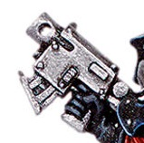

<!-- A1248-B0138 -->

原译文

Seraphim Bolt Pistol 炽天使爆矢手枪

**校订译文**

Seraphim Bolt Pistol 炽天使爆矢手枪

<!-- /A1248-B0138 -->

<!-- A1248-B0139 图片 -->
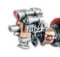

<!-- A1248-B0140 -->

原译文

Sword Brethren Bolt Pistol 圣剑兄弟爆矢手枪

**校订译文**

Sword Brethren Bolt Pistol 圣剑兄弟爆矢手枪

<!-- /A1248-B0140 -->

<!-- A1248-B0141 图片 -->
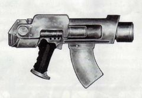

<!-- A1248-B0142 -->

原译文

2nd edition pistol 二版手枪

**校订译文**

2nd edition pistol 二版手枪

<!-- /A1248-B0142 -->

<!-- A1248-B0143 -->
## Squat Bolt Pistol Designs 矮人爆矢手枪设计

<!-- /A1248-B0143 -->

<!-- A1248-B0144 -->
### Autoch-Pattern Bolt Pistol 奥托克型爆矢手枪

原题：Autoch-Pattern Bolt Pistol 自动型爆矢手枪

**校注：** Autoch为型号专名，沿1163奥托克，不是automatic自动。

<!-- /A1248-B0144 -->

<!-- A1248-B0145 -->
**英文原文**

Used by the Leagues of Votann.

<!-- /A1248-B0145 -->

<!-- A1248-B0146 -->

原译文

由沃坦联盟使用。

**校订译文**

由沃坦联盟使用。

<!-- /A1248-B0146 -->

<!-- A1248-B0147 图片 -->
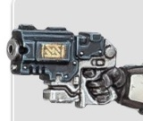

<!-- A1248-B0148 -->

原译文

Autoch-Pattern Bolt Pistol 自动型爆矢手枪

**校订译文**

Autoch-Pattern Bolt Pistol 奥托克型爆矢手枪

<!-- /A1248-B0148 -->

<!-- A1248-B0149 -->
### Bolt Revolver 爆矢左轮

<!-- /A1248-B0149 -->

<!-- A1248-B0150 -->
**英文原文**

Used by the Leagues of Votann. The Bolt Revolver has a clear similarity and common ancestry with Imperial equivalents, but hits harder and works better.

<!-- /A1248-B0150 -->

<!-- A1248-B0151 -->

原译文

由沃坦联盟使用。爆矢左轮与帝国的同类产品有着明显的相似之处和共同的祖先，但打击更重，效果更好。

**校订译文**

沃坦联盟使用这种武器。爆矢左轮与帝国同类武器有明显的相似之处，并拥有共同起源，但威力更强，性能也更好。

<!-- /A1248-B0151 -->

<!-- A1248-B0152 图片 -->
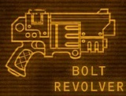

<!-- A1248-B0153 -->

原译文

Bolt Revolver 爆矢左轮

**校订译文**

Bolt Revolver 爆矢左轮

<!-- /A1248-B0153 -->

本篇核心术语与暂定项

以下列出本篇出现的英文原形及核心术语表用词。同形词可能指不同对象，具体词义以本篇正文和校注为准；单复数、别名和仅见于图注的名称可能尚未列入。完整候选见[术语表](../../术语表/双语术语候选.csv)。

| 英文 | 采用中文 | 状态 |
| --- | --- | --- |
| Space Marines | 星际战士 | 官方已核对 |
| Adeptus Astartes | 阿斯塔特修会 | 官方已核对 |
| Deathwatch | 死亡守望 | 官方已核对 |
| Adeptus Mechanicus | 机械修会 | 官方已核对 |
| Imperial Guard | 帝国卫队 | 暂定·语境区分 |
| Leagues of Votann | 沃坦联盟 | 官方已核对 |
| Bolt Pistol | 爆矢手枪 | 官方已核对 |
| Chainsword | 链锯剑 | 官方已核对 |
| Commissar | 政委 | 官方已核对 |
| Horus Heresy | 荷鲁斯之乱 | 官方已核对 |
| Inquisition | 审判庭 | 暂定 |
| Imperium | 帝国 | 暂定·简称 |
| Imperial Navy | 帝国海军 | 暂定 |
| Servitor | 机仆 | 暂定 |
| Departmento Munitorum | 军务部 | 暂定 |
| Forge World | 铸造世界 | 暂定·官方待核 |
| Necromunda | 涅克罗蒙达 | 暂定·官方待核 |
| House Goliath | 歌利亚家族 | 暂定·官方待核 |
| Goliath | 歌利亚 | 暂定·官方待核 |
| Great Crusade | 大远征 | 暂定·官方待核 |
| Horus | 荷鲁斯 | 暂定·官方待核 |
| STC | 标准建造模板 | 暂定·官方待核 |
| Vanguard Eliminators | 先锋歼灭者 | 暂定·官方待核 |
| Sisters of Battle | 战斗修女 | 暂定·官方待核 |
| Sector | 星区 | 暂定·官方待核 |
| Badab | 巴达布 | 暂定·官方待核 |
| Scintilla | 辛提拉 | 暂定·官方待核 |
| Mars | 火星 | 暂定·官方待核 |
| Phobos | 火卫一 | 暂定·官方待核 |
| Tech | 技术语 | 暂定·官方待核 |
| Clear | 清明 | 暂定·官方待核 |
| Minotaurs | 米诺陶 | 暂定·官方待核 |
| Absolvor Bolt Pistol | 赦免者爆矢手枪 | 暂定·官方待核 |
| Sacristan | 圣物保管者（骑士职务）／萨克里斯坦（世界） | 语境定译·官方待核 |
| Lathe Worlds | 拉特诸世界 | 暂定·官方待核 |
| Ordo Calixis | 卡利西斯审判庭 | 暂定·官方待核 |
| White Scars | 白疤 | 官方已核 |
| Raven Guard | 暗鸦守卫 | 官方已核 |
| Scars | 伤疤 | 暂定·官方待核 |
| First Captain | 第一连长 | 暂定·官方待核 |
| Space Marine | 星际战士 | 暂定·官方待核 |
| Chapter | 战团 | 暂定·官方待核 |
| Captain | 连长 | 暂定·官方待核 |
| Vanguard | 先锋 | 暂定·官方待核 |
| Primaris Space Marine | 原铸星际战士 | 暂定·官方待核 |
| Fists Exemplar | 典范之拳 | 暂定·官方待核 |
| Executioners | 处刑者 | 语境定译·官方待核 |
| Mantis Warriors | 螳螂勇士 | 暂定·官方待核 |
| Fire Hawks | 火鹰 | 暂定·官方待核 |
| Marines Errant | 游侠战士 | 暂定·官方待核 |
| Star Phantoms | 星辰幻影 | 暂定·官方待核 |
| Assault Intercessors | 突击仲裁者 | 暂定·官方待核 |
| Carcharodons | 噬人鲨 | 暂定·官方待核 |
| Umbra | 本影 | 暂定·官方待核 |
| The Beast | 野兽 | 暂定·官方待核 |
| Chaplains | 教士 | 暂定·官方待核 |
| Brand | 布兰德 | 暂定·官方待核 |
| The Weapon | 武器 | 暂定·官方待核 |
| Bear | 熊 | 暂定·官方待核 |
| Calixis Sector | 卡利西斯星区 | 暂定·官方待核 |
| Hesh | 赫什 | 暂定·官方待核 |
| Tigrus | 泰格鲁斯 | 暂定·官方待核 |
| Valhallan Ice Warriors | 瓦尔哈拉冰雪战士 | 暂定·官方待核 |
| Bolt | 爆矢 | 暂定·官方待核 |
| Heavy Bolt | 重爆矢 | 暂定·官方待核 |
| Equis-Pattern Bolt Pistol | 奔马型爆矢手枪 | 暂定·官方待核 |
| Guardian Bolt Pistol | 守护者爆矢手枪 | 暂定·官方待核 |
| Godwyn Ultima | 戈德温—极限型 | 暂定·官方待核 |
| Heavy Bolt Pistol | 重型爆矢手枪 | 暂定·官方待核 |
| Special Issue Bolt Pistol | 特种配发爆矢手枪 | 暂定·官方待核 |
| Tigrus Pattern Bolt Pistol | 泰格鲁斯型爆矢手枪 | 暂定·官方待核 |
| Umbra Bolt Pistol | 阴影爆矢手枪 | 暂定·官方待核 |
| Garm Pattern Service Bolt Pistol | 加姆型制式爆矢手枪 | 暂定·官方待核 |
| Sacristan Bolt Pistol | 司库爆矢手枪 | 暂定·官方待核 |
| Orthlack | 奥斯拉克 | 暂定·官方待核 |
| Bolt Revolver | 爆矢左轮 | 暂定·官方待核 |
| Bolter | 爆矢枪 | 暂定·官方待核 |
| House Orlock | 欧洛克家族 | 暂定·官方待核 |
| Reivers | 掠夺者 | 暂定·官方待核 |

