# 1249 爆矢枪 Boltgun

精校状态：中文行文已逐段精校，部分术语仍为暂定

分类：武器 / 远程武器

原文来源：https://www.bilibili.com/opus/1000256746052124676

原作者：帝国神选罐头

原文时间：编辑于 2025年02月10日 10:44

[返回分类目录](目录.md) · [全书目录](../../目录.md)

<!-- A1249-B0001 -->
**英文原文**

The Boltgun, also commonly referred to as the Bolter, is the standard weapon of the Adeptus Astartes and Adepta Sororitas. A .75 caliber weapon, the boltgun works similarly to a grenade launcher firing a relatively small explosive; an initial ballistic charge launches the bolt in the same way as with an autogun, after which the explosive, commonly called a 'bolt', is self-propelled. Once it penetrates its target, it explodes. Finely hand-crafted in Space Marine or Adeptus Mechanicus forges, Boltguns are heavy, sturdy weapons with a powerful recoil normal humans would find difficult to handle.

<!-- /A1249-B0001 -->

<!-- A1249-B0002 -->

原译文

爆矢枪，也常被称为爆弹枪，是阿斯塔特和修女会标准武器。一种0.75口径的武器，爆矢枪的工作原理类似于发射相对较小爆炸物的榴弹发射器；初始弹道装药以与自动枪相同的方式发射爆矢，之后通常称为“爆矢”的弹药是自推进的。一旦它穿透目标，就会爆炸。爆矢枪是在星际战士或机械神教铸造厂手工制作的，是重型、坚固的武器，具有强大的后坐力，普通人很难处理。

**校订译文**

爆矢枪在英文中既称 Boltgun，也常称 Bolter，是阿斯塔特和修女会的标准武器。它的口径为0.75英寸，工作方式类似发射小型爆炸弹的榴弹发射器：初始装药像自动枪一样将弹丸推出，此后爆矢靠自身推进装置继续飞行，穿入目标后引爆。爆矢枪由星际战士或机械修会的铸造厂精工手制，结构沉重而坚固，强大后坐力使普通人难以驾驭。

**校注：** Boltgun与Bolter为同一武器的英文名称，正文统一爆矢枪，不让同义英文制造两种中文武器。

<!-- /A1249-B0002 -->

<!-- A1249-B0003 -->
**英文原文**

For the Astartes and Sororitas the boltgun is a holy symbol of the Emperor's wrath.

<!-- /A1249-B0003 -->

<!-- A1249-B0004 -->

原译文

对于阿斯塔特和修女来说，爆矢枪是皇帝愤怒的神圣象征。

**校订译文**

对于阿斯塔特和修女会而言，爆矢枪是帝皇之怒的神圣象征。

<!-- /A1249-B0004 -->

<!-- A1249-B0005 -->
## Imperial Bolter Designs 帝国爆矢设计

<!-- /A1249-B0005 -->

<!-- A1249-B0006 -->
**英文原文**

The original Imperial boltgun was an invention of the Emperor of Mankind's own design.

<!-- /A1249-B0006 -->

<!-- A1249-B0007 -->

原译文

最初的帝国爆矢枪是人类帝皇自己设计的。

**校订译文**

最初的帝国爆矢枪是人类帝皇自己设计的。

<!-- /A1249-B0007 -->

<!-- A1249-B0008 -->
## Adeptus Astartes 阿斯塔特修会

<!-- /A1249-B0008 -->

<!-- A1249-B0009 -->
**英文原文**

Like other Space Marine weaponry, Astartes boltguns are designed around their superhuman physique. The weight of each weapon would require most humans to use a supporting brace, with hand-grips larger than any normal human could manage. However, even if a normal human were to fire the boltgun, the resulting recoil would rip their arm from its socket. Normal humans found to be in possession of even a single Astartes bolt round, much less a boltgun, can expect a swift justice for their crimes.

<!-- /A1249-B0009 -->

<!-- A1249-B0010 -->

原译文

像其他星际战士武器一样，阿斯塔特爆矢枪是围绕其超人的体格设计的。每件武器的重量都需要大多数人使用支撑支架，把手比任何正常人都大。然而，即使一个正常的人发射爆矢枪，产生的后座力也会把他们的手臂从肩膀上扯下来。被发现拥有哪怕一发阿斯塔特爆矢的普通人，更不用说爆矢枪了，都可以预计到他们的罪行得到迅速的审判。

**校订译文**

与其他星际战士武器一样，阿斯塔特爆矢枪是按他们超人的体格设计的。仅武器本身的重量，就足以让大多数普通人必须借助支架才能使用，握把也大得难以握持。即便普通人勉强开火，后坐力也会将手臂从肩关节处扯脱。普通人若被发现持有阿斯塔特武器，哪怕只有一发爆矢而非整把枪，也会很快遭到惩处。

<!-- /A1249-B0010 -->

<!-- A1249-B0011 -->
### Angelus boltgun/bolter 祷告爆矢枪

<!-- /A1249-B0011 -->

<!-- A1249-B0012 -->
**英文原文**

The Blood Angels and their successor Chapter use a wrist-mounted, drum-fed variation of the standard boltgun for their Sanguinary Guard called the Angelus boltgun. It uses Bloodshard shells as ammunition. This is not to be confused with the Angelus Bolt Carbine which is not a boltgun and not a Space Marine weapon.

<!-- /A1249-B0012 -->

<!-- A1249-B0013 -->

原译文

圣血天使和他们的子战团为他们的圣血卫队使用了一种手腕安装的、鼓式的标准爆矢枪变体，称为祷告爆矢枪。它使用圣血破片弹作为弹药。不要将其与祷告爆矢卡宾枪混淆，后者既不是爆矢枪，也不是星际战士武器。

**校订译文**

圣血天使及其子战团为圣血守卫装备一种腕戴式、弹鼓供弹的爆矢枪改型，称为祷告爆矢枪，使用圣血破片爆矢。它与祷告爆矢卡宾枪不同：后者并非真正的爆矢枪，也不是星际战士武器。

<!-- /A1249-B0013 -->

<!-- A1249-B0014 图片 -->
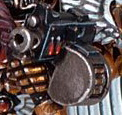

<!-- A1249-B0015 -->

原译文

Angelus boltgun 祷告爆矢枪

**校订译文**

Angelus boltgun 祷告爆矢枪

<!-- /A1249-B0015 -->

<!-- A1249-B0016 -->
### Artifex Pattern 工匠型

<!-- /A1249-B0016 -->

<!-- A1249-B0017 -->
**英文原文**

The artifex pattern bolter is amongst the most potent of its kind. Fitted with multi-spectral augur lenses, a silacharibdis shot selector and a gene-grip bioveritor, its warlike spirit responds only to its rightful owner. It is known to be used among the ranks of the Deathwatch.

<!-- /A1249-B0017 -->

<!-- A1249-B0018 -->

原译文

工匠型爆矢枪是同类产品中最强大的之一。它配备了多光谱的占卜者瞄准镜、一个西拉查理布迪斯射击选择器和一个基因抓取生物验证器，它的好战机魂只对它的正确拥有者做出反应。众所周知，它被用于死亡守望的队伍中。

**校订译文**

工匠型爆矢枪是同类中威力最强的型号之一，配有多光谱探测瞄镜、西拉查理布迪斯射击选择器，以及装在握把上的基因生物识别装置。其好战的机魂只会回应获准的主人。死亡守望的战士使用过这种武器。

<!-- /A1249-B0018 -->

<!-- A1249-B0019 图片 -->
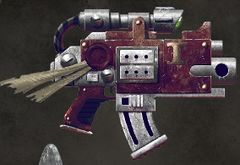

<!-- A1249-B0020 -->

原译文

Artifex Pattern Bolter 工匠型爆矢枪

**校订译文**

Artifex Pattern Bolter 工匠型爆矢枪

<!-- /A1249-B0020 -->

<!-- A1249-B0021 -->
### Banestrike bolter 致命打击爆矢枪

<!-- /A1249-B0021 -->

<!-- A1249-B0022 -->
**英文原文**

The Banestrike bolters were used by Space Marines Legionaries during the Horus Heresy.

<!-- /A1249-B0022 -->

<!-- A1249-B0023 -->

原译文

在荷鲁斯叛乱时期，星际战士军团使用了致命打击爆矢枪。

**校订译文**

荷鲁斯之乱期间，星际战士军团战士使用过致命打击爆矢枪。

<!-- /A1249-B0023 -->

<!-- A1249-B0024 图片 -->
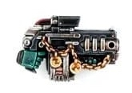

<!-- A1249-B0025 -->

原译文

Banestrike bolter 致命打击爆矢枪

**校订译文**

Banestrike bolter 致命打击爆矢枪

<!-- /A1249-B0025 -->

<!-- A1249-B0026 -->

原译文

Mk.II Cawl pattern Bolt Rifle Mk.II考尔型爆矢步枪

**校订译文**

Mk.II Cawl pattern Bolt Rifle Mk.II考尔型爆矢步枪

<!-- /A1249-B0026 -->

<!-- A1249-B0027 -->
**英文原文**

The Mk.II Cawl Pattern Bolt Rifle is a new version of the venerable Boltgun developed in the closing days of the 41st Millennium for the Primaris Space Marines. Named after Magos Belisarius Cawl, the large Cawl-pattern Bolter is said to be re-crafted and re-engineered to perfection. The Bolt Rifle is a larger and longer-barreled upgrade of the standard Bolter, allowing for longer range and armour-piercing capability.

<!-- /A1249-B0027 -->

<!-- A1249-B0028 -->

原译文

Mk.II考尔型爆矢步枪是在第41个千年的最后几天为原铸太空星际战士开发的古老爆矢枪的新版本。以贝利撒留·考尔贤者命名的大型考尔型爆矢枪据说经过重新制作和重新设计，达到完美。爆矢步枪是标准爆矢枪的更大、更长的枪管升级版，具有更远的射程和穿甲能力。

**校订译文**

Mk.II 考尔型爆矢步枪是在第四十一千纪末期，为原铸星际战士研制的爆矢枪新版本。它以贤者贝利萨留斯·考尔命名，据说经过重新设计与打造，已臻完善。与标准爆矢枪相比，爆矢步枪体积更大、枪管更长，因此具有更远射程和更强的穿甲能力。

**校注：** closing days在时代语境指末期，不宜字面译成“最后几天”。

<!-- /A1249-B0028 -->

<!-- A1249-B0029 图片 -->
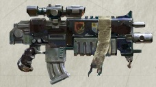

<!-- A1249-B0030 -->

原译文

Cawl pattern Bolt Rifle 考尔型爆矢步枪

**校订译文**

Cawl pattern Bolt Rifle 考尔型爆矢步枪

<!-- /A1249-B0030 -->

<!-- A1249-B0031 -->
**英文原文**

The Bolt Rifle is highly modular, allowing for a number of easily-created variants, such as the Auto Bolt Rifle, which is a rapid-fire weapon equipped high-capacity magazine, and the Stalker Bolt Rifle, which is a essentially the Bolt Rifle equivalent of a Stalker Bolter.

<!-- /A1249-B0031 -->

<!-- A1249-B0032 -->

原译文

爆矢步枪是高度模块化的，允许许多易于创建的变体，例如自动爆矢步枪，这是一种配备大容量弹匣的速射武器，以及追猎者爆矢步枪，它本质上是一种相当于追猎者爆矢枪的爆矢步枪。

**校订译文**

爆矢步枪采用高度模块化的设计，便于衍生多种改型，例如配有大容量弹匣的速射型自动爆矢步枪，以及在爆矢步枪系列中承担类似追猎者爆矢枪职责的追猎者爆矢步枪。

<!-- /A1249-B0032 -->

<!-- A1249-B0033 -->
### Bolt Carbines 爆矢卡宾枪

<!-- /A1249-B0033 -->

<!-- A1249-B0034 -->
**英文原文**

These variations are more compact and are typically wielded by Vanguard forces, although some chapters may employ them differently.

<!-- /A1249-B0034 -->

<!-- A1249-B0035 -->

原译文

这些变体更为紧凑，通常由先锋部队使用，尽管有些战团可能会以不同的方式使用它们。

**校订译文**

这些变体更为紧凑，通常由先锋部队使用，尽管有些战团可能会以不同的方式使用它们。

<!-- /A1249-B0035 -->

<!-- A1249-B0036 图片 -->
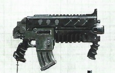

<!-- A1249-B0037 -->

原译文

Bolt Carbines 爆矢卡宾枪

**校订译文**

Bolt Carbines 爆矢卡宾枪

<!-- /A1249-B0037 -->

<!-- A1249-B0038 -->
### Primaris Bolt Carbine 原铸爆矢卡宾枪

<!-- /A1249-B0038 -->

<!-- A1249-B0039 -->
**英文原文**

This compact Bolter is used by Primaris Space Marines. It features an extra grip under the barrel. This model of Bolt Carbine is used by Reiver Squads and Black Templar Primaris Crusader Squads. Bolt carbines fire smaller bolts than the standard bolt rifle, leading to a decrease in both penetrating power and effective range. However, the weapons are considered exceptionally easy to handle.

<!-- /A1249-B0039 -->

<!-- A1249-B0040 -->

原译文

这款紧凑型爆矢枪被原铸星际战士使用。它在枪管下有一个额外的握把。这种爆矢卡宾枪型号被掠夺者小队和黑色圣堂原铸十字军小队使用。爆矢卡宾枪发射的爆矢比标准爆矢步枪小，导致穿透力和有效射程都降低。然而，这些武器被认为非常易于处理。

**校订译文**

这款紧凑的爆矢枪供原铸星际战士使用，枪管下方另设一个握把。掠夺者小队和黑色圣堂原铸十字军小队都装备这种爆矢卡宾枪。它发射的弹丸小于标准爆矢步枪，因此穿甲能力和有效射程有所降低，但操作格外灵便。

<!-- /A1249-B0040 -->

<!-- A1249-B0041 -->
### Marksman Bolt Carbine 神射手爆矢卡宾枪

<!-- /A1249-B0041 -->

<!-- A1249-B0042 -->
**英文原文**

Marksman Bolt Carbines are semi-automatic Bolt Carbine variants with a high rate of fire and an added scope used by Vanguard Infiltrators.

<!-- /A1249-B0042 -->

<!-- A1249-B0043 -->

原译文

神射手爆矢卡宾枪是半自动爆矢卡宾枪变体，具有高射速，先锋渗透者使用的有附加范围。

**校订译文**

射手型爆矢卡宾枪是先锋渗透者使用的半自动改型，射速很高，并加装了瞄准镜。

**校注：** scope是瞄准镜，不是射程或范围。

<!-- /A1249-B0043 -->

<!-- A1249-B0044 图片 -->
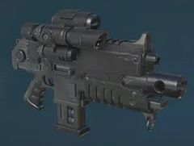

<!-- A1249-B0045 -->

原译文

Marksman Bolt Carbine 神射手爆矢卡宾枪

**校订译文**

Marksman Bolt Carbine 神射手爆矢卡宾枪

<!-- /A1249-B0045 -->

<!-- A1249-B0046 -->
### Instigator Bolt Carbine 煽动者爆矢卡宾枪

<!-- /A1249-B0046 -->

<!-- A1249-B0047 -->
**英文原文**

Instigator Bolt Carbines are suppressed, stealthy versions of the Cawl-Pattern Bolt Rifle utilized by Vanguard Space Marine Captains and some Eliminator Sergeants to strike targets at extreme range. The weapon fires three round bursts.

<!-- /A1249-B0047 -->

<!-- A1249-B0048 -->

原译文

煽动者爆矢卡宾枪是先锋星际战士连长和一些歼灭者军士使用的考尔型爆矢步枪的隐秘版本，用于在极限范围内打击目标。该武器为三连发。

**校订译文**

煽动者爆矢卡宾枪是考尔型爆矢步枪的消声隐蔽改型，由先锋星际战士连长及部分歼灭者军士使用，擅长打击极远距离的目标。它采用三发点射。

<!-- /A1249-B0048 -->

<!-- A1249-B0049 图片 -->
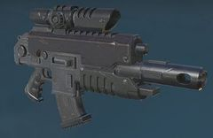

<!-- A1249-B0050 -->

原译文

Instigator Bolt Carbine 煽动者爆矢卡宾枪

**校订译文**

Instigator Bolt Carbine 煽动者爆矢卡宾枪

<!-- /A1249-B0050 -->

<!-- A1249-B0051 -->
### Occulus Bolt Carbine 全知者爆矢卡宾枪

<!-- /A1249-B0051 -->

<!-- A1249-B0052 -->
**英文原文**

The Occulus Bolt Carbine (sometimes spelled Oculus) is a variant of the Cawl-Pattern Bolt Rifle used by some Vanguard Lieutenants and all Incursors. It is a rapid-fire, mid-range weapon with an extended magazine. The Carbine is also equipped with a sophisticated Occulus sight array.

<!-- /A1249-B0052 -->

<!-- A1249-B0053 -->

原译文

全知者爆矢卡宾枪（有时拼写为Oculus）是一些先锋副官和所有入侵者使用的考尔型爆矢步枪的变体。这是一种快速射击的中程武器，带有加长弹匣。卡宾枪还配备了复杂的全知者瞄准阵列。

**校订译文**

全知者爆矢卡宾枪的英文名有时也写作 Oculus，是考尔型爆矢步枪的一种改型，供部分先锋副官及所有入侵者使用。这款中程速射武器配有加长弹匣和精密的全知者瞄准阵列。

<!-- /A1249-B0053 -->

<!-- A1249-B0054 图片 -->
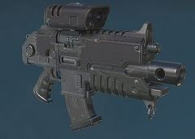

<!-- A1249-B0055 -->

原译文

Occulus Bolt Carbine 全知者爆矢卡宾枪

**校订译文**

Occulus Bolt Carbine 全知者爆矢卡宾枪

<!-- /A1249-B0055 -->

<!-- A1249-B0056 -->
### Gravis Bolt Rifles 重装爆矢步枪

原题：Gravis Bolt Rifles 格拉维斯爆矢步枪

<!-- /A1249-B0056 -->

<!-- A1249-B0057 -->
**英文原文**

These variations are significantly larger and heavier, requiring the use of Gravis Pattern Power Armour to wield effectively.

<!-- /A1249-B0057 -->

<!-- A1249-B0058 -->

原译文

这些变体明显更大、更重，需要使用格拉维斯型动力护甲才能有效挥舞。

**校订译文**

这些改型明显更大、更重，需要借助重装型动力甲才能有效使用。

<!-- /A1249-B0058 -->

<!-- A1249-B0059 -->
### Executor Bolt Rifle 执行者爆矢步枪

<!-- /A1249-B0059 -->

<!-- A1249-B0060 -->
**英文原文**

Executor Bolt Rifles are a variant of the Stalker Bolt Rifle used by Primaris Heavy Intercessors. It is nearly identical to the standard Heavy Bolt Rifle and Hellstorm Bolt Rifle, save that it has an elongated magazine; performance-wise it boasts superior range and armor penetration.

<!-- /A1249-B0060 -->

<!-- A1249-B0061 -->

原译文

执行者爆矢步枪是原铸重型仲裁者使用的潜行者爆矢步枪的变体。它几乎与标准重型爆矢步枪和地狱风暴爆矢步枪相同，除了它有一个细长的弹匣；在性能方面，它拥有优越的射程和装甲穿透力。

**校订译文**

执行者爆矢步枪是原铸重装仲裁者使用的追猎者爆矢步枪改型。除了加长弹匣外，其外形几乎与标准重型爆矢步枪及地狱风暴爆矢步枪相同，但射程和穿甲能力更强。

<!-- /A1249-B0061 -->

<!-- A1249-B0062 图片 -->
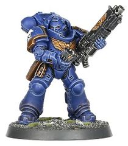

<!-- A1249-B0063 -->

原译文

Executor Bolt Rifle 执行者爆矢步枪

**校订译文**

Executor Bolt Rifle 执行者爆矢步枪

<!-- /A1249-B0063 -->

<!-- A1249-B0064 -->
### Heavy Bolt Rifle 重型爆矢步枪

<!-- /A1249-B0064 -->

<!-- A1249-B0065 -->
**英文原文**

Heavy Bolt Rifles are extended variants of the Bolt Rifle used by Primaris Heavy Intercessors and some Captains wearing Gravis armour. It is a fully automatic weapon intended for mid-range engagements. It looks almost identical to the Hellstorm and Executor Bolt Rifles save a box-shaped magazine with exposed ammunition.

<!-- /A1249-B0065 -->

<!-- A1249-B0066 -->

原译文

重型爆矢步枪是爆矢步枪的延伸变体，主要用于原铸重型仲裁者和一些穿着格拉维斯装甲的连长。这是一种用于中程交战的全自动武器。它看起来几乎与地狱风暴和执行者爆矢步枪完全相同，除了有一个弹盒，里面有暴露的弹药。

**校订译文**

重型爆矢步枪是爆矢步枪的加长改型，由原铸重装仲裁者及部分穿着重装型护甲的连长使用。这款全自动武器面向中距离交战；其外形几乎与地狱风暴和执行者爆矢步枪相同，区别在于采用能看到内部弹药的盒状弹匣。

<!-- /A1249-B0066 -->

<!-- A1249-B0067 图片 -->
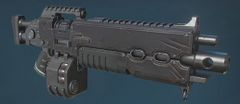

<!-- A1249-B0068 -->

原译文

Heavy Bolt Rifle 重型爆矢步枪

**校订译文**

Heavy Bolt Rifle 重型爆矢步枪

<!-- /A1249-B0068 -->

<!-- A1249-B0069 -->
### Hellstorm Bolt Rifle 地狱风暴爆矢步枪

<!-- /A1249-B0069 -->

<!-- A1249-B0070 -->
**英文原文**

Hellstorm Bolt Rifles are a variant of the Auto Bolt Rifle used by Primaris Heavy Intercessors and is capable of a high rate of fire. It looks almost identical to the standard and Executor Heavy Bolt Rifles save a drum-shaped magazine with exposed ammunition.

<!-- /A1249-B0070 -->

<!-- A1249-B0071 -->

原译文

地狱风暴爆矢步枪是原铸重型仲裁者使用的自动爆矢步枪的变体，能够实现高射速。它看起来几乎与标准和执行者重型爆矢步枪完全相同，除了有一个弹鼓，里面有暴露的弹药。

**校订译文**

地狱风暴爆矢步枪是原铸重装仲裁者使用的自动爆矢步枪改型，射速很高。除了能看到内部弹药的鼓状弹匣外，其外形几乎与标准重型爆矢步枪和执行者重型爆矢步枪相同。

<!-- /A1249-B0071 -->

<!-- A1249-B0072 图片 -->
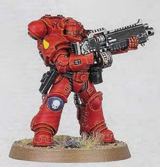

<!-- A1249-B0073 -->

原译文

Hellstorm Bolt Rifle 地狱风暴爆矢步枪

**校订译文**

Hellstorm Bolt Rifle 地狱风暴爆矢步枪

<!-- /A1249-B0073 -->

<!-- A1249-B0074 -->
### Bellicos Bolt Rifle 贝利科斯爆矢步枪

<!-- /A1249-B0074 -->

<!-- A1249-B0075 -->
**英文原文**

Bellicos Bolt Rifles are prototype bolt rifles of an incredibly advanced pattern, that were created on the Forge World Bellicos.

<!-- /A1249-B0075 -->

<!-- A1249-B0076 -->

原译文

贝利科斯爆矢步枪是在贝利科斯铸造世界上制造的令人难以置信的先进型号的原型爆矢步枪。

**校订译文**

贝利科斯爆矢步枪是铸造世界贝利科斯研制的一种技术极其先进的原型武器。

<!-- /A1249-B0076 -->

<!-- A1249-B0077 -->

原译文

Fenris pattern Mk.IV 芬里斯型Mk.IV

**校订译文**

Fenris pattern Mk.IV 芬里斯型Mk.IV

<!-- /A1249-B0077 -->

<!-- A1249-B0078 -->
**英文原文**

The Space Wolves utilize a pattern of Boltgun produced on their own homeworld of Fenris, decorated with the skulls of Fenrisian beasts.

<!-- /A1249-B0078 -->

<!-- A1249-B0079 -->

原译文

太空野狼使用了在他们自己的家园世界芬里斯制作的爆矢枪型号，上面装饰着芬里斯野兽的头骨。

**校订译文**

太空野狼使用了在他们自己的家园世界芬里斯制作的爆矢枪型号，上面装饰着芬里斯野兽的头骨。

<!-- /A1249-B0079 -->

<!-- A1249-B0080 图片 -->
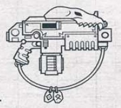

<!-- A1249-B0081 -->

原译文

Fenris pattern Mk.IV Boltgun 芬里斯型Mk.IV爆矢枪

**校订译文**

Fenris pattern Mk.IV Boltgun 芬里斯型Mk.IV爆矢枪

<!-- /A1249-B0081 -->

<!-- A1249-B0082 -->
### Godwyn pattern 戈德温型

<!-- /A1249-B0082 -->

<!-- A1249-B0083 -->
**英文原文**

The model currently used by most Space Marines is designated the Astartes MK Vb Godwyn pattern. The Godwyn-pattern bolter has a built-in ammo counter and uses a Sinister/Dexter locking mechanism with a sickle-shaped magazine carrying 30 rounds. It fires the standard Astartes .75 calibre bolt, composed of a diamantine tip, depleted deuterium core and mass-reactive detonator, typically in bursts of four rounds. Other features include a palm-print sensor for genetic identification, as well as an integral targeter that links with the autosenses in the Marine's helmet for superior accuracy. It can also be upgraded with weapon accessories such as the M40 Targeting System.

<!-- /A1249-B0083 -->

<!-- A1249-B0084 -->

原译文

大多数星际战士目前使用的型号被指定为阿斯塔特Mk. Vb戈德温型。戈德温型爆矢枪有一个内置的弹药计数器，使用罪/爱锁定机制，带有一个镰刀形弹匣，可携带30发子弹。它发射标准的阿斯塔特.75口径爆矢，由金刚石尖端、贫氘芯和质量反应雷管组成，通常为四连发。其他功能包括一个用于基因识别的掌纹传感器，以及一个与星际战士头盔中的自动传感器连接的整体式瞄准器，以获得更高的精度。它还可以用M40瞄准系统等武器配件进行升级。

**校订译文**

大多数星际战士目前使用的型号为阿斯塔特 Mk.Vb 戈德温型。它内置弹药计数器，采用左右锁定机构，并以可容纳30发弹药的弧形弹匣供弹。它发射标准阿斯塔特0.75英寸爆矢，弹丸具有钻金尖端、贫化氘芯和质量反应式引信，通常采用四发点射。其他设备包括用于基因识别的掌纹感应器，以及与星际战士头盔自动感应系统联动的一体式瞄准装置，以提高精度。它还可加装 M40 瞄准系统等武器附件。

**校注：** Sinister/Dexter为左／右，原“罪／爱”不合语义；锁定机构的具体原理仍按原文保留，不自行补充。

<!-- /A1249-B0084 -->

<!-- A1249-B0085 图片 -->

<!-- A1249-B0086 -->

原译文

Godwyn pattern Bolter 戈德温型爆矢枪

**校订译文**

Godwyn pattern Bolter 戈德温型爆矢枪

<!-- /A1249-B0086 -->

<!-- A1249-B0087 -->
**英文原文**

Other Godwyn patterns include the Astartes Mk IIIa Godwyn Pattern, an older version, still used by the Dark Angels Chapter.

<!-- /A1249-B0087 -->

<!-- A1249-B0088 -->

原译文

其他戈德温型包括阿斯塔特Mk.IIIa戈德温型，这是一个旧版本，至今仍被黑暗天使战团使用。

**校订译文**

戈德温型的其他型号还包括较老的阿斯塔特 Mk.IIIa；黑暗天使战团至今仍在使用。

<!-- /A1249-B0088 -->

<!-- A1249-B0089 -->
### Godwyn Ultima 戈德温—极限型

原题：Godwyn Ultima 戈德温-极限

<!-- /A1249-B0089 -->

<!-- A1249-B0090 -->
**英文原文**

The Minotaurs are known to have used Godwyn Ultima bolt weapons during the Badab War - it is unclear if these are Boltguns or Bolt pistols. The Exorcists used Godwyn-Ultima bolters during this war.

<!-- /A1249-B0090 -->

<!-- A1249-B0091 -->

原译文

众所周知，米诺陶在巴达布战争期间使用了戈德-极限爆矢武器——目前尚不清楚这些是爆矢枪还是爆矢手枪。在这场战争中，驱魔人使用了戈德温-极限爆矢枪。

**校订译文**

米诺陶曾在巴达布战争期间使用戈德温—极限型爆矢武器，但无法确定是爆矢枪还是爆矢手枪。驱魔者则明确在这场战争中使用了该型爆矢枪。

<!-- /A1249-B0091 -->

<!-- A1249-B0092 图片 -->
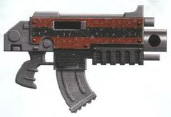

<!-- A1249-B0093 -->

原译文

Godwyn Ultima 戈德温-极限

**校订译文**

Godwyn Ultima 戈德温—极限型

<!-- /A1249-B0093 -->

<!-- A1249-B0094 -->
### Hesh-pattern 赫什型

<!-- /A1249-B0094 -->

<!-- A1249-B0095 -->
**英文原文**

The Deathwatch uses the Hesh-pattern boltguns since M36. This weapon was originally designed by Magos Cymbry Jamis of the Adeptus Mechanicus in recognition of the Deathwatch's services. The bolters of this pattern are more compact than other weapons of its type and show exceptional craftsmanship. Due to their smaller size they are well-suited for fighting in confined spaces and they are also favoured by vehicle crews and by certain Assault Marines. The bolters incorporate an integral folding stock, motion predictor, and prey-sense sight.

<!-- /A1249-B0095 -->

<!-- A1249-B0096 -->

原译文

死亡守望自M36以来一直使用赫什型爆矢枪。这种武器最初是由机械神教的贤者辛布里·贾米斯设计的，以表彰死亡守望的服务。这种型号的爆矢枪比同类武器更紧凑，展现出卓越的工艺。由于其较小的尺寸，它们非常适合在密闭空间内作战，也受到载具乘员和某些突击星际战士的青睐。爆矢枪集成了一个完整的折叠枪托、运动预测器和猎物感知瞄具。

**校订译文**

死亡守望自M36起便使用赫什型爆矢枪。机械修会贤者辛布里·贾米斯最初设计这种武器，是为了表彰死亡守望的功绩。它比同类武器更紧凑，工艺也格外精良，既适合在狭窄空间中战斗，也受到载具乘员和部分突击星际战士青睐。枪上集成了折叠枪托、运动预测器和猎物感知瞄具。

<!-- /A1249-B0096 -->

<!-- A1249-B0097 图片 -->
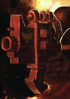

<!-- A1249-B0098 -->

原译文

Hesh-pattern 赫什型

**校订译文**

Hesh-pattern 赫什型

<!-- /A1249-B0098 -->

<!-- A1249-B0099 -->
### Lion Pattern 莱昂型

<!-- /A1249-B0099 -->

<!-- A1249-B0100 -->
**英文原文**

The Lion Pattern is a boltgun developed and used by the Dark Angels sometime before the Horus Heresy. The STC fragment for this pattern was discovered, sometime in late M41, in the wreckage of the pre-heresy Dark Angel's ship: Caliban's Will, which was fused to the Olethros space hulk when it attempted to travel to Zaramund to reinforce Horus.

<!-- /A1249-B0100 -->

<!-- A1249-B0101 -->

原译文

莱昂型是黑暗天使在荷鲁斯叛乱之前开发和使用的一种爆矢枪。这种型号的STC碎片是在M41晚期的某个时候在叛乱前的黑暗天使飞船：卡利班意志号的残骸中发现的，当它试图前往扎拉蒙德增援荷鲁斯时，它与太空废船奥勒罗斯融合在一起。

**校订译文**

莱昂型是黑暗天使在荷鲁斯之乱前开发并使用的爆矢枪。M41末期，人们在乱前黑暗天使舰船“卡利班意志号”的残骸中发现了这一型号的标准建造模板（STC）碎片。该舰曾在前往扎拉蒙德增援荷鲁斯的途中，与太空废船“奥勒罗斯”融合。

**校注：** 保留增援荷鲁斯这一原文战时背景，不因后来的阵营变化而改写。

<!-- /A1249-B0101 -->

<!-- A1249-B0102 -->

原译文

Mark III boltgun Mark.III爆矢枪

**校订译文**

Mark III boltgun Mark.III爆矢枪

<!-- /A1249-B0102 -->

<!-- A1249-B0103 -->
**英文原文**

The Mark III or MKIII pattern boltgun is known to exist as Badab Primaris Manufactura Issue and has been used during the Badab War by the Astral Claws.

<!-- /A1249-B0103 -->

<!-- A1249-B0104 -->

原译文

Mark.III或Mk.III型螺栓枪作为巴达布主星制造发行的存在而被知晓，并在巴达布战争期间被星空之爪使用。

**校订译文**

Mark.III 又写作 Mk.III 型，其中有由巴达布主星制造厂配发的版本，星辰之爪曾在巴达布战争中使用。

<!-- /A1249-B0104 -->

<!-- A1249-B0105 图片 -->
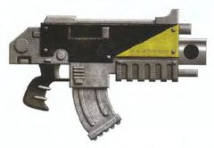

<!-- A1249-B0106 -->

原译文

Mark III boltgun Mark.III爆矢枪

**校订译文**

Mark III boltgun Mark.III爆矢枪

<!-- /A1249-B0106 -->

<!-- A1249-B0107 -->

原译文

Mark IV 'Macragge' pattern boltgun Mark.IV‘马库拉格’型爆矢枪

**校订译文**

Mark IV 'Macragge' pattern boltgun Mark.IV‘马库拉格’型爆矢枪

<!-- /A1249-B0107 -->

<!-- A1249-B0108 -->
**英文原文**

The standard model Mark IV 'Macragge' Pattern (pictured here with a sickle magazine containing 20 bolts) has single-shot and burst fire (i.e. firing three bolts in short succession) modes. The bolter also incorporates a palm-print sensor to identify its wielder by its genetic imprint.

<!-- /A1249-B0108 -->

<!-- A1249-B0109 -->

原译文

标准型号的Mark IV“Macragge”模式（镰刀式弹匣包含20个爆矢）具有单发和连射（即短时间连续发射三个爆矢）模式。爆矢枪还集成了一个掌纹传感器，通过其基因印记来识别使用者。

**校订译文**

标准 Mark.IV“马库拉格”型爆矢枪具有单发和三发点射模式。图示配用的弧形弹匣容纳20发爆矢，枪上还装有掌纹感应器，通过基因印记识别使用者。

<!-- /A1249-B0109 -->

<!-- A1249-B0110 图片 -->
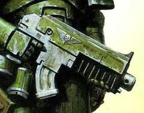

<!-- A1249-B0111 -->

原译文

Mark IV 'Macragge' pattern boltgun Mark.IV‘马库拉格’型爆矢枪

**校订译文**

Mark IV 'Macragge' pattern boltgun Mark.IV‘马库拉格’型爆矢枪

<!-- /A1249-B0111 -->

<!-- A1249-B0112 -->
### Nocturne-Ultima 夜曲-极限型

<!-- /A1249-B0112 -->

<!-- A1249-B0113 -->
**英文原文**

The Salamanders are known to have used Nocturne-Ultima modified boltguns during the Badab War.

<!-- /A1249-B0113 -->

<!-- A1249-B0114 -->

原译文

众所周知，在巴达布战争期间，火蜥蜴使用了夜曲-极限改装爆矢枪。

**校订译文**

众所周知，在巴达布战争期间，火蜥蜴使用了夜曲—极限型改装爆矢枪。

<!-- /A1249-B0114 -->

<!-- A1249-B0115 图片 -->
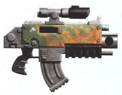

<!-- A1249-B0116 -->

原译文

Nocturne-Ultima 夜曲-极限型

**校订译文**

Nocturne-Ultima 夜曲-极限型

<!-- /A1249-B0116 -->

<!-- A1249-B0117 -->
### Phobos pattern 火卫一型

<!-- /A1249-B0117 -->

<!-- A1249-B0118 -->
**英文原文**

The Phobos Pattern Bolter, officially known as the Phobos R/017 Pattern, is closely associated with Mk II ‘Crusade’ Armour and is perhaps the most venerable design of the Bolter used by the Adeptus Astartes. This weapon was .70 caliber as opposed to the .75 round most associated with the Bolter today. Phobos pattern bolters were hand-crafted at the very birth of the Imperium, and were in service from the late Unification Wars.

<!-- /A1249-B0118 -->

<!-- A1249-B0119 -->

原译文

火卫一型爆矢枪，正式名称为火卫一R/017型，与Mk II“远征”装甲密切相关，可能是阿斯塔特修会使用的爆矢枪中最古老的设计。这种武器是0.70口径，而不是与当今爆矢最相关的.75口径。火卫一型爆矢枪是在帝国诞生之初手工制作的，从统一战争后期开始服役。

**校订译文**

火卫一型爆矢枪的正式名称为火卫一 R/017 型，与 Mk.II“远征”装甲密切相关，可能是阿斯塔特采用的最古老爆矢枪设计。它使用0.70英寸弹药，而非今日常见的0.75英寸标准。帝国诞生之初，火卫一型便已由工匠手工制造，自统一战争后期开始服役。

<!-- /A1249-B0119 -->

<!-- A1249-B0120 图片 -->
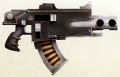

<!-- A1249-B0121 -->

原译文

Phobos pattern 火卫一型

**校订译文**

Phobos pattern 火卫一型

<!-- /A1249-B0121 -->

<!-- A1249-B0122 -->
### Ryza-Ultima Variant 瑞扎-极限型

<!-- /A1249-B0122 -->

<!-- A1249-B0123 -->
**英文原文**

The Star Phantoms are known to have used Ryza-Ultima variant boltguns during the Badab War.

<!-- /A1249-B0123 -->

<!-- A1249-B0124 -->

原译文

众所周知，星空幻影在巴达布战争期间使用了瑞扎-极限型爆矢枪。

**校订译文**

星辰幻影在巴达布战争期间曾使用瑞扎—极限型爆矢枪。

<!-- /A1249-B0124 -->

<!-- A1249-B0125 图片 -->
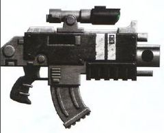

<!-- A1249-B0126 -->

原译文

Ryza-Ultima Variant 瑞扎-极限型

**校订译文**

Ryza-Ultima Variant 瑞扎-极限型

<!-- /A1249-B0126 -->

<!-- A1249-B0127 -->
### Sternguard Bolter 肃卫爆矢枪

<!-- /A1249-B0127 -->

<!-- A1249-B0128 -->
**英文原文**

The Sternguard Bolter is a variant of the standard Boltgun wielded by Sternguards. It includes an enhanced scope, shoulder-sling strap, and a specialized magazine that allows the Sternguard to carry different types of ammunition and switch between them freely. The specialized magazine allows a variety of ammo types, at the expense of capacity of standard ammo and an increased cost to reload.

<!-- /A1249-B0128 -->

<!-- A1249-B0129 -->

原译文

肃卫爆矢枪是肃卫使用的标准爆矢枪的变体。它包括一个增强的瞄准镜、肩带和一个专门的弹匣，使肃卫能够携带不同类型的弹药并在它们之间自由切换。专用弹匣允许使用多种弹药类型，但以牺牲标准弹药的容量和增加的装弹成本为代价。

**校订译文**

肃卫爆矢枪是肃卫使用的标准爆矢枪改型，配有增强瞄准镜、肩带和特殊弹匣，让使用者能携带多种弹药并自由切换。代价是标准弹药载量减少，补充弹药的成本也更高。

<!-- /A1249-B0129 -->

<!-- A1249-B0130 图片 -->
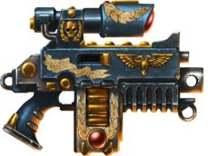

<!-- A1249-B0131 -->

原译文

Sternguard Bolter 肃卫爆矢枪

**校订译文**

Sternguard Bolter 肃卫爆矢枪

<!-- /A1249-B0131 -->

<!-- A1249-B0132 -->
### Tigrus Pattern Bolter 泰格鲁斯型爆矢枪

<!-- /A1249-B0132 -->

<!-- A1249-B0133 -->
**英文原文**

The Tigrus Pattern Bolter (sometimes spelled Tigris Pattern) was first discovered in the depths of Forge World Tigrus and the STC data for it was quickly disseminated throughout the Imperium before the beginning of Horus Heresy. The Tigrus pattern Bolter is a .60 caliber weapon as opposed to the modern .75 standard. The weapon was predomianent in the Traitor Legions by the outbreak of the Horus Heresy. Tigrus is now lost, yet the Bolters that bear its name, though no longer produced, continue to see service in the 41st Millennium.

<!-- /A1249-B0133 -->

<!-- A1249-B0134 -->

原译文

泰格鲁斯型爆矢枪（有时拼写为泰格里斯型）最初是在泰格鲁斯铸造世界的深处发现的，在荷鲁斯叛乱开始之前，它的STC数据很快在整个帝国传播开来。泰格鲁斯型爆矢枪是一种.60口径的武器，而不是现代的.75标准。荷鲁斯叛乱爆发时，这种武器在叛徒军团中占主导地位。泰格鲁斯现在已经消失了，但以它的名字命名的爆矢枪虽然不再生产，但仍在第41个千年继续服役。

**校订译文**

泰格鲁斯型爆矢枪的英文名有时写作 Tigris Pattern。其设计最早发现于铸造世界泰格鲁斯深处，相关标准建造模板（STC）数据在荷鲁斯之乱前迅速传播到帝国各地。它使用0.60英寸弹药，而非现代0.75英寸标准。荷鲁斯之乱爆发时，这款武器在叛变军团中占据主流。如今泰格鲁斯已经失落，以它命名的爆矢枪虽不再生产，却仍在第四十一千纪服役。

<!-- /A1249-B0134 -->

<!-- A1249-B0135 图片 -->
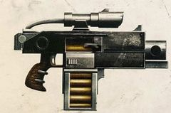

<!-- A1249-B0136 -->

原译文

Tigrus Pattern Bolter 泰格鲁斯型爆矢枪

**校订译文**

Tigrus Pattern Bolter 泰格鲁斯型爆矢枪

<!-- /A1249-B0136 -->

<!-- A1249-B0137 -->
### Ultima Pattern 极限型

<!-- /A1249-B0137 -->

<!-- A1249-B0138 -->
**英文原文**

The Minotaurs are known to have used Ultima bolt weapons during the Badab War - it is unclear if these are Boltguns or Bolt pistols.

<!-- /A1249-B0138 -->

<!-- A1249-B0139 -->

原译文

众所周知，米诺陶在巴达布战争期间使用了极限爆矢武器，目前尚不清楚这些是螺爆矢还是爆矢手枪。

**校订译文**

米诺陶在巴达布战争期间曾使用极限型爆矢武器，但无法确定是爆矢枪还是爆矢手枪。

<!-- /A1249-B0139 -->

<!-- A1249-B0140 图片 -->
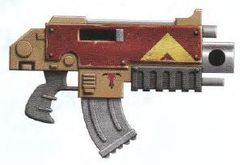

<!-- A1249-B0141 -->

原译文

Ultima Pattern 极限型

**校订译文**

Ultima Pattern 极限型

<!-- /A1249-B0141 -->

<!-- A1249-B0142 -->
### Ultra pattern 超越型

<!-- /A1249-B0142 -->

<!-- A1249-B0143 -->
**英文原文**

The Mk II Ultra Pattern features a Dark-Eye nightscope.

<!-- /A1249-B0143 -->

<!-- A1249-B0144 -->

原译文

Mk.II超越型配备了暗眼夜视仪。

**校订译文**

Mk.II超越型配备了暗眼夜视仪。

<!-- /A1249-B0144 -->

<!-- A1249-B0145 -->
**英文原文**

The Mk IV Ultra Pattern has a 25-round magazine, standard features include ammo-counter and targeter which links with autosenses, and palm-print genetic indentification.

<!-- /A1249-B0145 -->

<!-- A1249-B0146 -->

原译文

Mk.IV超越型有一个25发的弹匣，标准功能包括弹药计数器和与自动传感器连接的瞄准器，以及掌纹基因识别。

**校订译文**

Mk.IV 超越型配有25发弹匣，标准设备包括弹药计数器、与自动感应系统联动的瞄准装置，以及掌纹基因识别系统。

<!-- /A1249-B0146 -->

<!-- A1249-B0147 图片 -->
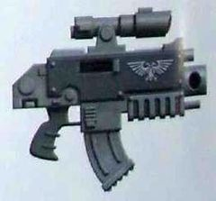

<!-- A1249-B0148 -->

原译文

Ultra pattern 超越型

**校订译文**

Ultra pattern 超越型

<!-- /A1249-B0148 -->

<!-- A1249-B0149 -->
### Umbra pattern 阴影型

<!-- /A1249-B0149 -->

<!-- A1249-B0150 -->
**英文原文**

The Umbra pattern boltgun was first used in the later years of the Great Crusade and was produced in large quantities by the time of the Siege of Terra. They were known to be favoured by the Sons of Horus Legion. By M42, the pattern was reinstated for use by the Sisters of Silence.

<!-- /A1249-B0150 -->

<!-- A1249-B0151 -->

原译文

阴影型爆矢枪最早是在大远征后期使用的，到泰拉围城时大量生产。众所周知，他们受到荷鲁斯军团之子的青睐。到了M42，这种型号被恢复，供寂静修女使用。

**校订译文**

阴影型爆矢枪最早在大远征后期投入使用，到泰拉围城时已大批量生产，深受荷鲁斯之子军团青睐。到M42，这一型号恢复使用，装备于寂静修女。

<!-- /A1249-B0151 -->

<!-- A1249-B0152 图片 -->
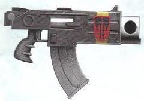

<!-- A1249-B0153 -->

原译文

Umbra pattern 阴影型

**校订译文**

Umbra pattern 阴影型

<!-- /A1249-B0153 -->

<!-- A1249-B0154 -->
### Umbra-Ferrox pattern 影铁型

<!-- /A1249-B0154 -->

<!-- A1249-B0155 -->
**英文原文**

A variant of the Umbra pattern known as Umbra-Ferrox was mass-produced by Chapter Techmarines to ensure that enough weapons and ammunition were available during the ongoing Horus Heresy. The Umbra-Ferrox iterates on the original Umbra pattern by incorporating a cyber-optical target reciprocator system that is slaved to the user's power armour's autosenses, as well as commonly an additional long-range gunsight. Most examples of the Umbra-Ferrox replace the normal Umbra pattern's sickle magazine with a higher-capacity box magazine. This pattern of bolter was standard issue to Legion Seekers.

<!-- /A1249-B0155 -->

<!-- A1249-B0156 -->

原译文

被称为影铁的阴影型的变体由战团技术军士大规模生产，以确保在正在进行的荷鲁斯叛乱期间有足够的武器和弹药可用。影铁型在原始阴影型的基础上进行了迭代，加入了一个赛博光学目标往复系统，该系统受制于使用者的动力装甲的自动感应器，以及通常的额外远程瞄准器。影铁型的大多数例子都用容量更大的弹盒取代了普通阴影型的镰刀弹匣。这种型号的爆矢枪是军团探求者的标准装备。

**校订译文**

影铁型是阴影型的改进版本。荷鲁斯之乱期间，战团科技战士大批制造这种武器，以确保战争中有充足的枪械和弹药。它在阴影型基础上增加了与使用者动力装甲自动感应系统联动的机械光学目标反馈装置，通常还加装远距离瞄准镜。多数影铁型用更大容量的盒式弹匣，替换原阴影型的弧形弹匣。它是军团探求者的标准装备。

**校注：** 英文使用Chapter Techmarines描述荷鲁斯之乱年代，本译保留“战团科技战士”，不擅改其历史编制口径。

<!-- /A1249-B0156 -->

<!-- A1249-B0157 图片 -->
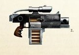

<!-- A1249-B0158 -->

原译文

Umbra-Ferrox pattern 影铁型

**校订译文**

Umbra-Ferrox pattern 影铁型

<!-- /A1249-B0158 -->

<!-- A1249-B0159 -->
### Naval Boltgun 海军爆矢枪

<!-- /A1249-B0159 -->

<!-- A1249-B0160 -->
**英文原文**

The Naval Boltgun is a boltgun that the Marines Errant use on boarding actions.

<!-- /A1249-B0160 -->

<!-- A1249-B0161 -->

原译文

海军爆矢枪是游侠战士在登船行动中使用的爆矢枪。

**校订译文**

海军爆矢枪是游侠战士在登船行动中使用的爆矢枪。

<!-- /A1249-B0161 -->

<!-- A1249-B0162 -->
## Adepta Sororitas 修女会

<!-- /A1249-B0162 -->

<!-- A1249-B0163 -->
### Godwyn-De'az Pattern 戈德温—德阿兹型

原题：Godwyn-De'az Pattern 戈德温-迪亚兹型

<!-- /A1249-B0163 -->

<!-- A1249-B0164 -->
**英文原文**

The Godwyn-De'az Pattern boltgun has been the standard-issue weapon for the Battle Sisters since their first formation, and is unchanged due to its superiority to nearly all other boltgun-type weapons. The sisters also make use of a Sarissa as a blade attachment for their bolters.

<!-- /A1249-B0164 -->

<!-- A1249-B0165 -->

原译文

戈德温-迪亚兹型爆矢枪自第一次制成以来一直是战斗修女的标准武器，由于其优于几乎所有其他爆矢枪类型的武器，因此没有改变。修女们还使用萨里沙作为她们的爆矢枪的刀刃附件。

**校订译文**

自战斗修女组建以来，戈德温—德阿兹型便是她们的制式爆矢枪。由于性能优于几乎所有同类武器，其设计始终未变。修女们还会在枪上加装名为萨里沙的战斗刃。

**校注：** their first formation指战斗修女初次组建，不是枪械第一次制造。

<!-- /A1249-B0165 -->

<!-- A1249-B0166 图片 -->
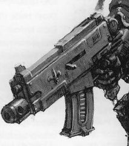

<!-- A1249-B0167 -->

原译文

Godwyn-De'az Pattern 戈德温-迪亚兹型

**校订译文**

Godwyn-De'az Pattern 戈德温—德阿兹型

<!-- /A1249-B0167 -->

<!-- A1249-B0168 -->

原译文

Mars Pattern Mark II Scourge Boltgun 火星型Mark.ll天灾爆矢枪

**校订译文**

Mars Pattern Mark II Scourge Boltgun 火星型 Mk.II 天灾爆矢枪

<!-- /A1249-B0168 -->

<!-- A1249-B0169 -->
**英文原文**

The Mars Pattern Mark II Scourge Boltgun is the preferred variant used by the Sisters of Battle of the Order of the Ebon Chalice at the Abbey of Dawn on Iocanthos. The Scourge is equipped with a Sarissa as a combat blade.

<!-- /A1249-B0169 -->

<!-- A1249-B0170 -->

原译文

火星型Mark.II天灾爆矢枪是伊卡索斯黎明修道院乌木圣杯修会战斗修女使用的首选变体。天灾配备了萨里沙作为格斗刀刃。

**校订译文**

在伊卡索斯黎明修道院驻守的乌木圣杯修会战斗修女，偏爱火星型 Mk.II 天灾爆矢枪。该枪配有萨里沙战斗刃。

<!-- /A1249-B0170 -->

<!-- A1249-B0171 图片 -->
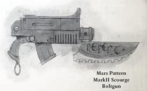

<!-- A1249-B0172 -->

原译文

Mars Pattern Mark II Scourge Boltgun with Sarissa 火星型Mark.II天灾爆矢枪配备萨里沙

**校订译文**

Mars Pattern Mark II Scourge Boltgun with Sarissa 火星型Mark.II天灾爆矢枪配备萨里沙

<!-- /A1249-B0172 -->

<!-- A1249-B0173 -->

原译文

Mark XII Jove Pattern Boltgun Mark. Xll朱庇特型爆矢枪

**校订译文**

Mark XII Jove Pattern Boltgun Mk.XII 朱庇特型爆矢枪

<!-- /A1249-B0173 -->

<!-- A1249-B0174 图片 -->
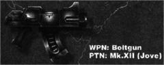

<!-- A1249-B0175 -->

原译文

Mark XII Jove Pattern Boltgun Mark. Xll朱庇特型爆矢枪

**校订译文**

Mark XII Jove Pattern Boltgun Mk.XII 朱庇特型爆矢枪

<!-- /A1249-B0175 -->

<!-- A1249-B0176 -->
## Adeptus Mechanicus 机械修会

<!-- /A1249-B0176 -->

<!-- A1249-B0177 -->
### Maxima Bolter 马克西姆爆矢枪

<!-- /A1249-B0177 -->

<!-- A1249-B0178 -->
**英文原文**

A relatively compact sort-chambered rotary Bolter, these weapons were used by the Legio Cybernetica. They were capable of a much higher rate of fire than a standard Boltgun but their weight and recoil meant that they were only used by heavily augmented machines such as Battle-automata, Karkinos Servitors or Myrmidons.

<!-- /A1249-B0178 -->

<!-- A1249-B0179 -->

原译文

这些武器是一种相对紧凑的旋转爆矢枪，由智控军团使用。它们的射速比标准爆矢枪高得多，但它们的重量和后坐力意味着它们只被自动战斗机兵、巨蟹侍从或辅军等大幅增强的机器使用。

**校订译文**

这是智控军团使用的一种结构相对紧凑的短膛旋转式爆矢枪，射速远高于标准爆矢枪。不过，重量和后坐力限制了使用者：只有自动机兵、巨蟹机仆和辅军精锐等接受大量机械强化的单位才能操持。

**校注：** sort-chambered疑为short-chambered漏字，暂按短膛处理；Myrmidons属于高度机械强化者，避免将列表一律误说为纯机器。

<!-- /A1249-B0179 -->

<!-- A1249-B0180 图片 -->
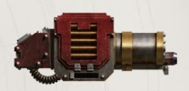

<!-- A1249-B0181 -->

原译文

Clavus Pattern Maxim Bolter 秘匙型马克西姆爆矢枪

**校订译文**

Clavus Pattern Maxim Bolter 秘匙型马克西姆爆矢枪

<!-- /A1249-B0181 -->

<!-- A1249-B0182 -->
## Sisters of Silence 寂静修女

<!-- /A1249-B0182 -->

<!-- A1249-B0183 -->
### Vratine Bolter 弗拉廷爆矢枪

原题：Vratine Bolter 瓦拉庭爆矢枪

<!-- /A1249-B0183 -->

<!-- A1249-B0184 -->
**英文原文**

Specialized and ornate bolters of Terran design.

<!-- /A1249-B0184 -->

<!-- A1249-B0185 -->

原译文

人族设计的专业和华丽的爆矢枪。

**校订译文**

一种源自泰拉、用途专门且装饰华丽的爆矢枪。

<!-- /A1249-B0185 -->

<!-- A1249-B0186 -->
### Nemesis Bolter 复仇女神爆矢枪

<!-- /A1249-B0186 -->

<!-- A1249-B0187 -->
**英文原文**

Longer-ranged variant of the Vratine Bolter.

<!-- /A1249-B0187 -->

<!-- A1249-B0188 -->

原译文

瓦拉庭爆矢枪的长射程变体。

**校订译文**

弗拉廷爆矢枪的长射程改型。

<!-- /A1249-B0188 -->

<!-- A1249-B0189 -->
## Other Boltguns used by Imperial or human factions and organisations 帝国或人类派系和组织使用的其他爆矢枪

<!-- /A1249-B0189 -->

<!-- A1249-B0190 -->
**英文原文**

Boltguns usable by mere "mortals" come in various patterns, though they still follow the same basic design philosophy. Despite the fact that they pale in comparison to their larger cousins, their power is still such that they can easily cut a man in two. Boltguns meant for the Imperial Guard are supplied by the Departmento Munitorum.

<!-- /A1249-B0190 -->

<!-- A1249-B0191 -->

原译文

仅“凡人”可用的爆矢枪有各种型号，它们仍然遵循相同的基本设计理念。尽管与体型较大的表亲相比，它们显得苍白无力，但它们的力量仍然足以轻易地将人一分为二。供帝国卫队使用的爆矢枪由军务部提供。

**校订译文**

供普通“凡人”使用的爆矢枪型号繁多，但基本设计思路一致。它们虽不及更大的阿斯塔特版本，仍有足以轻易将人打成两截的威力。帝国卫队使用的爆矢枪由军务部供应。

<!-- /A1249-B0191 -->

<!-- A1249-B0192 -->
### Angelus Bolt Carbine 祷告爆矢卡宾枪

<!-- /A1249-B0192 -->

<!-- A1249-B0193 -->
**英文原文**

The Angelus Bolt Carbine is secretly produced by the Fane of Fykos on Gunmetal and makes use of illegal bolt rounds originally meant for use by Space Marines. The fanes on Gunmetal produce, under strict surveillance and security measures, the casings and primary propulsion charges which go into making these powerful bolt rounds. Despite these precautions though some of these shells "disappear" and are sold to owners of the aforementioned carbine; they are known as "blind" shells because they lack the official marks of approval normally stamped on Astartes bolt shells. Only the most exquisite materials are used for this carbine but despite its expense the sheer size of the bolt rounds mean only three can be loaded into the magazine, housed within the carbine's lacquered stock, and it can only fire in single-shot mode. Due to the highly illegal nature of these weapons (and its ammunition) only very wealthy and trusted clients get the opportunity to obtain one, amongst them the richest bounty hunters and most famous beast-slayers of the Calixis Sector.

<!-- /A1249-B0193 -->

<!-- A1249-B0194 -->

原译文

祷告爆矢卡宾枪由菲科斯神殿在铁灰城上秘密生产，并使用最初由星际战士使用的非法爆矢。铁灰城的神殿在严格的监视和安全措施下生产弹壳和主要推进装置，用于制造这些强大的子弹。尽管采取了这些预防措施，但其中一些弹药“消失”并被卖给了上述卡宾枪的主人；它们被称为“失明”弹药，因为它们缺少通常印在阿斯塔特爆矢弹壳上的官方批准标志。这种卡宾枪使用了最精致的材料，尽管它很昂贵，但子弹的巨大尺寸意味着只有三发可以装入装在卡宾枪覆漆枪托内的弹匣中，而且它只能以单发模式射击。由于这些武器（及其弹药）的高度非法性质，只有非常富有和值得信赖的客户才有机会获得武器，其中包括卡利西斯星区最富有的赏金猎人和最著名的野兽杀手。

**校订译文**

祷告爆矢卡宾枪由枪铁城的菲科斯工坊秘密制造，使用非法流出的星际战士用爆矢。枪铁城各工坊在严密监控和安全措施之下，为这种强大弹药生产弹壳及初级推进装药；然而，仍有部分弹药会“失踪”，被卖给卡宾枪持有者。这些弹药没有阿斯塔特爆矢弹壳通常具有的官方核准标记，因此被称为“无标弹”。卡宾枪以最上等材料制成，价格高昂，但爆矢体积太大，设于涂漆枪托内的弹匣只能容纳三发，而且只能单发射击。这种武器及弹药都属严重违禁品，仅向既极其富裕又深受信任的客户提供，其中包括卡利西斯星区最富有的赏金猎人和最著名的猎兽者。

**校注：** Gunmetal沿1233枪铁城；Fane按其生产机构语境译工坊。blind shells指缺少核准标记的弹药，暂译无标弹（原失明弹药）。

<!-- /A1249-B0194 -->

<!-- A1249-B0195 -->
### Locke pattern 洛克型

<!-- /A1249-B0195 -->

<!-- A1249-B0196 -->
**英文原文**

The Locke-pattern is a variant of an old Adeptus Arbites design and the most common boltgun design found in the Koronus Expanse.

<!-- /A1249-B0196 -->

<!-- A1249-B0197 -->

原译文

洛克型是古老的法务部设计的变体，也是科罗努斯星区最常见的爆矢枪设计。

**校订译文**

洛克型是帝国法务部某种旧设计的改型，也是克洛诺斯广域最常见的爆矢枪。

<!-- /A1249-B0197 -->

<!-- A1249-B0198 图片 -->
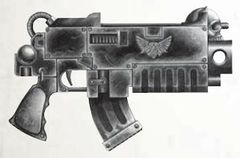

<!-- A1249-B0199 -->

原译文

Locke pattern 洛克型

**校订译文**

Locke pattern 洛克型

<!-- /A1249-B0199 -->

<!-- A1249-B0200 -->

原译文

Locke Mk IIb Spearhead Boltgun 洛克Mk.llb矛头爆矢枪

**校订译文**

Locke Mk IIb Spearhead Boltgun 洛克 Mk.IIb 矛头爆矢枪

<!-- /A1249-B0200 -->

<!-- A1249-B0201 -->
**英文原文**

A variant of an old Adeptus Arbites design, Lock-pattern boltguns are known for their reliability and stopping power.

<!-- /A1249-B0201 -->

<!-- A1249-B0202 -->

原译文

旧古老的法务部设计的一种变体，洛克型爆矢枪以其可靠性和制动能力而闻名。

**校订译文**

洛克型源自帝国法务部的一种旧设计，以可靠性和强大制止力闻名。

<!-- /A1249-B0202 -->

<!-- A1249-B0203 图片 -->
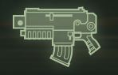

<!-- A1249-B0204 -->

原译文

Locke Mk IIb Spearhead Boltgun 洛克Mk.llb矛头爆矢枪

**校订译文**

Locke Mk IIb Spearhead Boltgun 洛克 Mk.IIb 矛头爆矢枪

<!-- /A1249-B0204 -->

<!-- A1249-B0205 -->
### Enforcer Bolter 执法者爆矢枪

<!-- /A1249-B0205 -->

<!-- A1249-B0206 -->
**英文原文**

The Enforcer Bolter is a Boltgun design used by Enforcer squads.

<!-- /A1249-B0206 -->

<!-- A1249-B0207 -->

原译文

执法者爆矢枪是执法者小队使用的爆矢枪设计。

**校订译文**

执法者爆矢枪是执法者小队使用的爆矢枪设计。

<!-- /A1249-B0207 -->

<!-- A1249-B0208 图片 -->
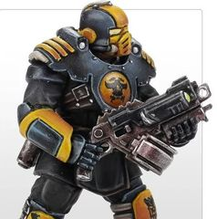

<!-- A1249-B0209 -->

原译文

Enforcer Bolter 执法者爆矢枪

**校订译文**

Enforcer Bolter 执法者爆矢枪

<!-- /A1249-B0209 -->

<!-- A1249-B0210 -->
### Perinetus pattern 佩里内图斯型

<!-- /A1249-B0210 -->

<!-- A1249-B0211 -->
**英文原文**

The Perinetus Pattern "Solo" Mark II is considered to be heretical by some members of the Adeptus Mechanicus. Its workings are much less sophisticated compared to other boltguns and it can only be operated in single-shot mode. Its lack of an automatic fire mode is made up for by its somewhat longer range, better accuracy and higher reliability of its mechanism. These features make it popular with PDF and rebels alike.

<!-- /A1249-B0211 -->

<!-- A1249-B0212 -->

原译文

佩里内图斯型“独奏”Mark.II被机械神教的一些成员认为是异端。与其他爆矢枪相比，它的工作原理要简单得多，只能在单发模式下操作。它没有自动射击模式，但它的射程更长，精度更高，机构可靠性更高。这些功能使其在PDF和叛逆者中都很受欢迎。

**校订译文**

佩里内图斯型 Mk.II“独奏”被部分机械修会成员视为异端设计。它的机构比其他爆矢枪简单得多，只能单发射击，却以稍长的射程、更高的精度和更可靠的机构弥补了缺乏自动射击的不足，因此同样受到行星防卫军和叛军欢迎。

<!-- /A1249-B0212 -->

<!-- A1249-B0213 图片 -->
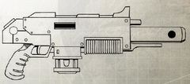

<!-- A1249-B0214 -->

原译文

Perinetus Pattern "Solo" Mark II 佩里内图斯型“独奏”Mark.II

**校订译文**

Perinetus Pattern "Solo" Mark II 佩里内图斯型“独奏”Mark.II

<!-- /A1249-B0214 -->

<!-- A1249-B0215 -->
### Gilded Boltgun 镀金爆矢枪

<!-- /A1249-B0215 -->

<!-- A1249-B0216 -->
**英文原文**

The Gilded Boltgun is a master-crafted artificer weapon of unsurpassed beauty and artistry; a weapon fit for a Sector Lord, or a Space Marine Captain. No record remains of how this weapon made its way to the Jericho Reach, but it has been used by some of the most heralded Ultramarines to serve in the Reach.

<!-- /A1249-B0216 -->

<!-- A1249-B0217 -->

原译文

镀金爆矢枪是一种技艺精湛的工匠武器，具有无与伦比的美感和艺术性；适合星区领主或星际战士连长的武器。关于这种武器是如何到达杰里科星区的，目前还没有任何记录，但已经被一些已经在星区服役的最著名的极限战士所使用。

**校订译文**

镀金爆矢枪是大师精工打造的武器，美感与技艺都无可比拟，足以配得上星区领主或星际战士连长。它如何流入杰里科疆域，已无记录可考；不过，在该地区服役的一些声望最高的极限战士曾使用过它。

<!-- /A1249-B0217 -->

<!-- A1249-B0218 图片 -->
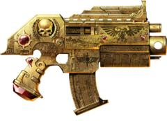

<!-- A1249-B0219 -->

原译文

Gilded Boltgun 镀金爆矢枪

**校订译文**

Gilded Boltgun 镀金爆矢枪

<!-- /A1249-B0219 -->

<!-- A1249-B0220 -->
### Orlock Boltgun 欧洛克爆矢枪

<!-- /A1249-B0220 -->

<!-- A1249-B0221 -->
**英文原文**

Used by House Orlock on Necromunda. Drum-fed and uses customized road crew casings.

<!-- /A1249-B0221 -->

<!-- A1249-B0222 -->

原译文

由欧洛克家族在涅克罗蒙达使用。采用弹鼓供弹，并使用定制的筑路人员外壳。

**校订译文**

涅克罗蒙达的欧洛克家族使用这种弹鼓供弹的爆矢枪，枪身配有道路作业队式的定制外壳。

**校注：** road crew casings的具体外壳形制在底稿中未说明，中文保留道路作业队式的描述；不把人员本身误写成弹壳材料。

<!-- /A1249-B0222 -->

<!-- A1249-B0223 图片 -->
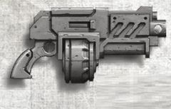

<!-- A1249-B0224 -->

原译文

Orlock Boltgun 欧洛克爆矢枪

**校订译文**

Orlock Boltgun 欧洛克爆矢枪

<!-- /A1249-B0224 -->

<!-- A1249-B0225 -->
### Goliath Boltgun 歌利亚爆矢枪

<!-- /A1249-B0225 -->

<!-- A1249-B0226 -->
**英文原文**

Used by House Goliath on Necromunda.

<!-- /A1249-B0226 -->

<!-- A1249-B0227 -->

原译文

在涅克罗蒙达上被歌利亚家族使用。

**校订译文**

在涅克罗蒙达上被歌利亚家族使用。

<!-- /A1249-B0227 -->

<!-- A1249-B0228 图片 -->
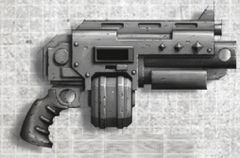

<!-- A1249-B0229 -->

原译文

Goliath Boltgun 歌利亚爆矢枪

**校订译文**

Goliath Boltgun 歌利亚爆矢枪

<!-- /A1249-B0229 -->

<!-- A1249-B0230 -->
### Death Bringer 死亡使者

<!-- /A1249-B0230 -->

<!-- A1249-B0231 -->
**英文原文**

A highly modifiable boltgun pattern, popular amongst the gangers and hired guns of Necromunda. Associated with the ganger's of House Goliath.

<!-- /A1249-B0231 -->

<!-- A1249-B0232 -->

原译文

一种高度可修改的爆矢枪型号，在涅克罗蒙达的歹徒和雇佣枪手中很受欢迎。与歌利亚家族的歹徒有关。

**校订译文**

这种便于进行多种改装的爆矢枪，在涅克罗蒙达的帮派成员和雇佣枪手中很受欢迎，尤其常见于歌利亚家族帮派。

<!-- /A1249-B0232 -->

<!-- A1249-B0233 图片 -->
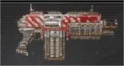

<!-- A1249-B0234 -->

原译文

Death Bringer 死亡使者

**校订译文**

Death Bringer 死亡使者

<!-- /A1249-B0234 -->

<!-- A1249-B0235 -->
### More boltgun designs 更多爆矢枪设计

<!-- /A1249-B0235 -->

<!-- A1249-B0236 -->
**英文原文**

Due to the fact that in most cases specific boltgun images are not labelled, unnamed designs are collected here, grouped by outward similarity.

<!-- /A1249-B0236 -->

<!-- A1249-B0237 -->

原译文

由于在大多数情况下，特定的爆矢枪没有标记，因此这里收集了未命名的设计，并按外观相似性进行分组。

**校订译文**

多数爆矢枪图片没有标明具体型号，此处汇集了这些未具名的设计，并按外观相似程度分组。

<!-- /A1249-B0237 -->

<!-- A1249-B0238 图片 -->
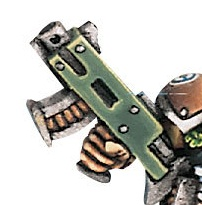

<!-- A1249-B0239 -->

原译文

Tallarn Bolter 塔兰爆矢枪

**校订译文**

Tallarn Bolter 塔兰爆矢枪

<!-- /A1249-B0239 -->

<!-- A1249-B0240 图片 -->
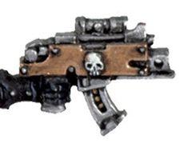

<!-- A1249-B0241 -->

原译文

Superior Bolter 高级爆矢枪

**校订译文**

Superior Bolter 高级爆矢枪

<!-- /A1249-B0241 -->

<!-- A1249-B0242 -->
## Squat Bolter Designs 矮人爆矢枪设计

<!-- /A1249-B0242 -->

<!-- A1249-B0243 -->
### Autoch Pattern Bolter 奥托克型爆矢枪

原题：Autoch Pattern Bolter 自动型爆矢枪

<!-- /A1249-B0243 -->

<!-- A1249-B0244 -->
**英文原文**

The Autoch Pattern Bolter used by the Leagues of Votann has some similarity and common ancestry to their Imperial counterparts, but are superior in every respect. The weapon hits harder and works better.

<!-- /A1249-B0244 -->

<!-- A1249-B0245 -->

原译文

沃坦联盟使用的自动型爆矢枪与他们的帝国同行有一些相似之处和共同的祖先，但在各个方面都更优越。这种武器打击更重，效果更好。

**校订译文**

沃坦联盟使用的奥托克型爆矢枪，与帝国对应武器具有相似之处和共同起源，但各方面性能都更胜一筹，威力更强，也更加好用。

<!-- /A1249-B0245 -->

<!-- A1249-B0246 图片 -->
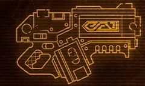

<!-- A1249-B0247 -->

原译文

Autoch Pattern Bolter 自动型爆矢枪

**校订译文**

Autoch Pattern Bolter 奥托克型爆矢枪

<!-- /A1249-B0247 -->

<!-- A1249-B0248 -->
### Ironhead Boltgun 铁首爆矢枪

<!-- /A1249-B0248 -->

<!-- A1249-B0249 -->
**英文原文**

Used by Squat Ironhead Prospectors on Necromunda. It features a double-barrel and 3 drum-magazine.

<!-- /A1249-B0249 -->

<!-- A1249-B0250 -->

原译文

由涅克罗蒙达上的铁首矮人探矿队使用。它有一个双枪管和三个弹鼓。

**校订译文**

涅克罗蒙达的矮人铁首勘探者使用这种爆矢枪，配有双枪管和三个弹鼓。

<!-- /A1249-B0250 -->

<!-- A1249-B0251 图片 -->
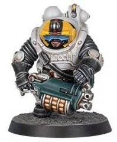

<!-- A1249-B0252 -->

原译文

Ironhead Boltgun 铁首爆矢枪

**校订译文**

Ironhead Boltgun 铁首爆矢枪

<!-- /A1249-B0252 -->

本篇核心术语与暂定项

以下列出本篇出现的英文原形及核心术语表用词。同形词可能指不同对象，具体词义以本篇正文和校注为准；单复数、别名和仅见于图注的名称可能尚未列入。完整候选见[术语表](../../术语表/双语术语候选.csv)。

| 英文 | 采用中文 | 状态 |
| --- | --- | --- |
| Space Marines | 星际战士 | 官方已核对 |
| Adeptus Astartes | 阿斯塔特修会 | 官方已核对 |
| Blood Angels | 圣血天使 | 官方已核对 |
| Dark Angels | 黑暗天使 | 官方已核对 |
| Deathwatch | 死亡守望 | 官方已核对 |
| Space Wolves | 太空野狼 | 官方已核对 |
| Adepta Sororitas | 修女会 | 官方已核对 |
| Adeptus Mechanicus | 机械修会 | 官方已核对 |
| Imperial Guard | 帝国卫队 | 暂定·语境区分 |
| Leagues of Votann | 沃坦联盟 | 官方已核对 |
| Boltgun | 爆矢枪 | 官方已核对 |
| Ultramarines | 极限战士 | 官方已核对 |
| Horus Heresy | 荷鲁斯之乱 | 官方已核对 |
| Imperium | 帝国 | 暂定·简称 |
| Legio Cybernetica | 智控军团 | 暂定 |
| Sanguinary | 圣血学派 | 暂定·学派语境 |
| Emperor of Mankind | 人类帝皇 | 暂定 |
| Emperor | 帝皇 | 官方已核对 |
| Departmento Munitorum | 军务部 | 暂定 |
| Adeptus Arbites | 法务部 | 暂定 |
| Forge World | 铸造世界 | 暂定·官方待核 |
| Necromunda | 涅克罗蒙达 | 暂定·官方待核 |
| House Goliath | 歌利亚家族 | 暂定·官方待核 |
| Goliath | 歌利亚 | 暂定·官方待核 |
| Unchanged | 未变者 | 暂定·官方待核 |
| The Order | 秩序 | 暂定·官方待核 |
| Great Crusade | 大远征 | 暂定·官方待核 |
| Terra | 泰拉 | 暂定·官方待核 |
| Horus | 荷鲁斯 | 暂定·官方待核 |
| STC | 标准建造模板 | 暂定·官方待核 |
| Sons of Horus | 荷鲁斯之子 | 暂定·官方待核 |
| Stalker | 追猎者 | 暂定·官方待核 |
| Occulus Bolt Carbine | 全知者爆矢卡宾枪 | 暂定·官方待核 |
| Stalker Bolter | 追猎者爆矢枪 | 暂定·官方待核 |
| Sisters of Battle | 战斗修女 | 暂定·官方待核 |
| Sisters of Silence | 寂静修女 | 暂定·官方待核 |
| Unification Wars | 统一战争 | 暂定·官方待核 |
| Sector | 星区 | 暂定·官方待核 |
| Marksman | 神射手 | 暂定·官方待核 |
| Salamanders | 火蜥蜴 | 暂定·官方待核 |
| Badab | 巴达布 | 暂定·官方待核 |
| Mars | 火星 | 暂定·官方待核 |
| Ryza | 瑞扎 | 暂定·官方待核 |
| Iocanthos | 伊卡索斯 | 暂定·官方待核 |
| Caliban | 卡利班 | 暂定·官方待核 |
| Fenris | 芬里斯 | 暂定·官方待核 |
| Nocturne | 夜曲星 | 暂定·官方待核 |
| Phobos | 火卫一 | 暂定·官方待核 |
| Macragge | 马库拉格 | 暂定·官方待核 |
| Koronus Expanse | 克洛诺斯广域 | 暂定·官方待核 |
| Master | 导师（审判庭职衔）／舰务官（舰员职务） | 语境定译·官方待核 |
| Minotaurs | 米诺陶 | 暂定·官方待核 |
| Gravis Pattern Power Armour | 重装型动力甲 | 暂定·官方待核 |
| Sanguinary Guard | 圣血守卫 | 官方已核对 |
| Belisarius Cawl | 贝利萨留斯·考尔 | 官方已核对 |
| Power Armour | 动力盔甲 | 暂定·官方待核 |
| Space Marine | 星际战士 | 暂定·官方待核 |
| Chapter | 战团 | 暂定·官方待核 |
| Captain | 连长 | 暂定·官方待核 |
| Vanguard | 先锋 | 暂定·官方待核 |
| Reiver | 掠夺者 | 暂定·官方待核 |
| Eliminator | 歼灭者 | 暂定·官方待核 |
| Vanguard Space Marine | 先锋星际战士 | 暂定·官方待核 |
| Exorcists | 驱魔者 | 暂定·官方待核 |
| Marines Errant | 游侠战士 | 暂定·官方待核 |
| Star Phantoms | 星辰幻影 | 暂定·官方待核 |
| Heavy Intercessors | 重装仲裁者 | 暂定·官方待核 |
| Artificer | 技工 | 暂定·官方待核 |
| Jericho Reach | 杰里科疆域 | 暂定·官方待核 |
| Umbra | 本影 | 暂定·官方待核 |
| Seekers | 寻觅者 | 官方已核对 |
| The Weapon | 武器 | 暂定·官方待核 |
| Bear | 熊 | 暂定·官方待核 |
| The Dark | 《黑暗》 | 暂定·官方待核 |
| The Blood | 鲜血 | 暂定·官方待核 |
| System | 星系（恒星系统） | 暂定·官方待核 |
| Calixis Sector | 卡利西斯星区 | 暂定·官方待核 |
| Badab Primaris | 巴达布主星 | 暂定·官方待核 |
| Bellicos | 贝利科斯 | 暂定·官方待核 |
| Hesh | 赫什 | 暂定·官方待核 |
| Perinetus | 佩里内图斯 | 暂定·官方待核 |
| Tigrus | 泰格鲁斯 | 暂定·官方待核 |
| Astral Claws | 星辰之爪 | 暂定·官方待核 |
| Umbra-Ferrox | 影铁 | 暂定·官方待核 |
| Zaramund | 扎拉蒙德 | 暂定·官方待核 |
| Grenade launcher | 榴弹发射器 | 暂定·官方待核 |
| Autogun | 自动枪 | 暂定·官方待核 |
| Order of the Ebon Chalice | 乌木圣杯修会 | 暂定·官方待核 |
| Bolt | 爆矢 | 暂定·官方待核 |
| Diamantine | 钻金 | 暂定·官方待核 |
| Bloodshard Shells | 圣血破片爆矢 | 暂定·官方待核 |
| Heavy Bolt | 重爆矢 | 暂定·官方待核 |
| Godwyn Ultima | 戈德温—极限型 | 暂定·官方待核 |
| Bolter | 爆矢枪 | 暂定·官方待核 |
| Artifex Pattern Bolter | 工匠型爆矢枪 | 暂定·官方待核 |
| Cawl Pattern Bolt Rifle | 考尔型爆矢步枪 | 暂定·官方待核 |
| Bolt Rifle | 爆矢步枪 | 暂定·官方待核 |
| Auto Bolt Rifle | 自动爆矢步枪 | 暂定·官方待核 |
| Stalker Bolt Rifle | 追猎者爆矢步枪 | 暂定·官方待核 |
| Bolt Carbine | 爆矢卡宾枪 | 暂定·官方待核 |
| Heavy Bolt Rifle | 重型爆矢步枪 | 暂定·官方待核 |
| Hellstorm Bolt Rifle | 地狱风暴爆矢步枪 | 暂定·官方待核 |
| Godwyn Pattern | 戈德温型 | 暂定·官方待核 |
| Cymbry Jamis | 辛布里·贾米斯 | 暂定·官方待核 |
| Caliban's Will | 卡利班意志号 | 暂定·官方待核 |
| Olethros | 奥勒罗斯 | 暂定·官方待核 |
| Phobos R/017 Pattern | 火卫一 R/017 型 | 暂定·官方待核 |
| Sternguard Bolter | 肃卫爆矢枪 | 暂定·官方待核 |
| Tigrus Pattern Bolter | 泰格鲁斯型爆矢枪 | 暂定·官方待核 |
| Umbra Pattern Boltgun | 阴影型爆矢枪 | 暂定·官方待核 |
| Naval Boltgun | 海军爆矢枪 | 暂定·官方待核 |
| Godwyn-De'az Pattern | 戈德温—德阿兹型 | 暂定·官方待核 |
| Mars Pattern Mark II Scourge Boltgun | 火星型 Mk.II 天灾爆矢枪 | 暂定·官方待核 |
| Sarissa | 萨里沙 | 暂定·官方待核 |
| Abbey of Dawn | 黎明修道院 | 暂定·官方待核 |
| Vratine Bolter | 弗拉廷爆矢枪 | 暂定·官方待核 |
| Angelus Bolt Carbine | 祷告爆矢卡宾枪 | 暂定·官方待核 |
| Fane of Fykos | 菲科斯工坊 | 暂定·官方待核 |
| Enforcer Bolter | 执法者爆矢枪 | 暂定·官方待核 |
| Gilded Boltgun | 镀金爆矢枪 | 暂定·官方待核 |
| Autoch Pattern Bolter | 奥托克型爆矢枪 | 暂定·官方待核 |
| Nocturne-Ultima | 夜曲—极限型 | 暂定·官方待核 |
| Grenade | 手榴弹 | 暂定·官方待核 |
| House Orlock | 欧洛克家族 | 暂定·官方待核 |

