# 1250 重型爆矢枪 Heavy Bolter

精校状态：中文行文已逐段精校，部分术语仍为暂定

分类：武器 / 远程武器

原文来源：https://www.bilibili.com/opus/1004335539081445382

原作者：帝国神选罐头

原文时间：编辑于 2025年02月23日 11:16

[返回分类目录](目录.md) · [全书目录](../../目录.md)

<!-- A1250-B0001 -->
**英文原文**

The Heavy Bolter (also known as Back Breaker) is an enormous version of the Boltgun. Of much larger size and weight, the heavy bolter fires powerful armour-piercing fist-sized bolts at the enemy with a staggering rate of fire.

<!-- /A1250-B0001 -->

<!-- A1250-B0002 -->

原译文

重型爆矢枪（也称为断背者）是爆矢枪的巨大版本。重型爆矢枪的尺寸和重量要大得多，它以惊人的射速向敌人发射强大的拳头大小的穿甲重爆矢。

**校订译文**

重型爆矢枪又称“断背者”，是爆矢枪的重型版本。它体积和重量都大得多，能以惊人射速向敌人倾泻拳头大小、穿甲能力强劲的重爆矢。

<!-- /A1250-B0002 -->

<!-- A1250-B0003 图片 -->
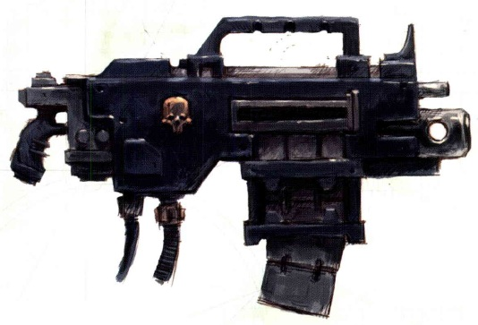

<!-- A1250-B0004 -->

原译文

Heavy Bolter 重型爆矢枪

**校订译文**

Heavy Bolter 重型爆矢枪

<!-- /A1250-B0004 -->

<!-- A1250-B0005 -->
**英文原文**

The heavy bolter is generally used for anti-infantry or fire support roles, also known as the "Back Breaker" or the "Bruiser" by the crew who have to carry it because of its great weight - but also because of the heavy punishment it can deal out to the enemy. It fires a round considerably larger than that of the standard bolter shell, with more propellant and longer range and higher stopping power, making it capable of destroying light vehicles. Because of its high rate of fire, jamming is often a problem. Like all bolt weapons, heavy bolters require regular maintenance and ancient litanies to appease their spirits. It is seldom seen outside military organizations.

<!-- /A1250-B0005 -->

<!-- A1250-B0006 -->

原译文

重型爆矢枪通常用于反步兵或火力支援任务，也被武器组人员称为“断背者”或“野蛮人”，因为它的重量很大，也因为它可以对敌人进行严厉的惩罚。它发射的子弹比标准爆矢弹大得多，有更多的推进剂、更远的射程和更高的拦截力，使其能够摧毁轻型车辆。由于其高射速，堵塞往往是一个问题。像所有爆矢武器一样，重型爆矢枪需要定期维护和古老的祷言来安抚它们的机魂。在军事组织之外很少见。

**校订译文**

重型爆矢枪通常承担反步兵和火力支援任务。携行它的武器组成员称它为“断背者”或“狠揍者”，既因为它沉重，也因为它能给予敌人重创。它使用的弹丸远大于标准爆矢，推进剂更多、射程更远、制止力更强，足以摧毁轻型载具。不过，高射速也使卡弹成为常见问题。与所有爆矢武器一样，它需要定期维护，并以古老祷文安抚机魂。军事组织之外很少能见到这种武器。

**校注：** Bruiser是绰号，按能给予重击的语境译“狠揍者”（原野蛮人），不表示使用者族群。

<!-- /A1250-B0006 -->

<!-- A1250-B0007 图片 -->
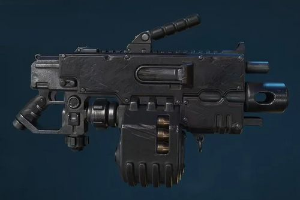

<!-- A1250-B0008 -->

原译文

Primaris Space Marine Heavy Bolter 原铸星际战士重型爆矢枪

**校订译文**

Primaris Space Marine Heavy Bolter 原铸星际战士重型爆矢枪

<!-- /A1250-B0008 -->

<!-- A1250-B0009 -->
**英文原文**

The most modern version of the heavy bolter in wide spread use is the Astartes Mk Ivc. The weapon goes through rounds very quickly using either a disintegrating belt or 40-round high capacity box magazine.

<!-- /A1250-B0009 -->

<!-- A1250-B0010 -->

原译文

广泛使用的重型爆矢枪的最现代版本是阿斯塔特Mk-Ivc。该武器使用弹带或40发大容量弹匣进行快速射击。

**校订译文**

广泛使用的较新重型爆矢枪型号是阿斯塔特 Mk.IVc。它可采用可散式弹链或40发大容量盒式弹匣供弹，消耗弹药极快。

**校注：** disintegrating belt指供弹后链节散开的可散式弹链，原译遗漏该类型。

<!-- /A1250-B0010 -->

<!-- A1250-B0011 -->
## Imperial Bolter designs 帝国爆矢枪设计

<!-- /A1250-B0011 -->

<!-- A1250-B0012 -->
### Accatran Pattern 阿卡特兰型

<!-- /A1250-B0012 -->

<!-- A1250-B0013 -->
**英文原文**

The Accatran pattern MkVd heavy bolter is used by the 99th Elysian Drop Troops Regiment. It features an integral bipod for sustained firing and a sight inside of the carrying handle. The ammunition used by this weapon is anti-vehicle: self-propelled, mass-reactive, high-explosive, and armour-piercing.

<!-- /A1250-B0013 -->

<!-- A1250-B0014 -->

原译文

阿卡特兰型MkVd重型爆矢枪由艾丽西亚空降部队第99团使用。它具有一个整体式双脚架，用于持续射击，手柄内有一个瞄准器。这种武器使用的弹药是反车辆的：自推进、质量反应、高爆和穿甲。

**校订译文**

阿卡特兰型 Mk.Vd 重型爆矢枪由艾丽西亚空降部队第99团使用，设有便于持续射击的一体式双脚架，提把内部装有瞄准器。它使用兼具自推进、质量反应、高爆及穿甲特性的反载具弹药。

<!-- /A1250-B0014 -->

<!-- A1250-B0015 图片 -->
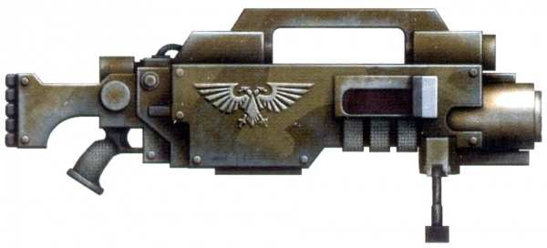

<!-- A1250-B0016 -->

原译文

Accatran pattern MkVd 阿卡特兰型MkVd

**校订译文**

Accatran pattern MkVd 阿卡特兰型MkVd

<!-- /A1250-B0016 -->

<!-- A1250-B0017 -->
### Astartes MK IVa 阿斯塔特 MK IVa

<!-- /A1250-B0017 -->

<!-- A1250-B0018 图片 -->
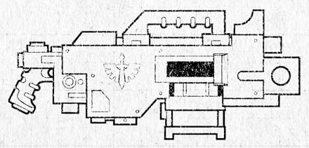

<!-- A1250-B0019 -->

原译文

Astartes MK IVa 阿斯塔特 MK IVa

**校订译文**

Astartes MK IVa 阿斯塔特 MK IVa

<!-- /A1250-B0019 -->

<!-- A1250-B0020 -->
### Delta-Ceres Pattern 德尔塔-谷神星型

<!-- /A1250-B0020 -->

<!-- A1250-B0021 -->
**英文原文**

A pattern sometimes fitted to servitors. It is known to suffer from unreliable performance in sandy conditions.

<!-- /A1250-B0021 -->

<!-- A1250-B0022 -->

原译文

有时适合机仆的型号。众所周知，它在沙质条件下性能不可靠。

**校订译文**

有时安装在机仆上的型号，在沙尘环境中表现不够可靠。

<!-- /A1250-B0022 -->

<!-- A1250-B0023 -->
### Executor Heavy Bolter 执行者重型爆矢枪

<!-- /A1250-B0023 -->

<!-- A1250-B0024 -->
**英文原文**

The Executor Heavy Bolter is a pattern of heavy bolter used by Primaris Space Marine Heavy Intercessors.

<!-- /A1250-B0024 -->

<!-- A1250-B0025 -->

原译文

执行者重型爆矢枪是原铸星际战士重型仲裁者使用的重型爆矢枪的一种型号。

**校订译文**

执行者重型爆矢枪是原铸星际战士重装仲裁者使用的一种重型爆矢枪。

<!-- /A1250-B0025 -->

<!-- A1250-B0026 图片 -->
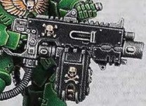

<!-- A1250-B0027 -->

原译文

Executor Heavy Bolter 执行者重型爆矢枪

**校订译文**

Executor Heavy Bolter 执行者重型爆矢枪

<!-- /A1250-B0027 -->

<!-- A1250-B0028 -->
### Jove Mk III 朱庇特Mk III

<!-- /A1250-B0028 -->

<!-- A1250-B0029 -->
**英文原文**

This shoulder-braced pattern is in use with the Adepta Sororitas.

<!-- /A1250-B0029 -->

<!-- A1250-B0030 -->

原译文

这种肩部支撑型号由修女会使用。

**校订译文**

修女会使用的肩部支撑式型号。

<!-- /A1250-B0030 -->

<!-- A1250-B0031 图片 -->
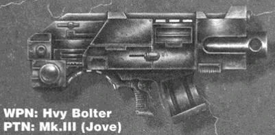

<!-- A1250-B0032 -->

原译文

Jove Mk III 朱庇特Mk III

**校订译文**

Jove Mk III 朱庇特Mk III

<!-- /A1250-B0032 -->

<!-- A1250-B0033 -->
### Godwyn Pattern 戈德温型

<!-- /A1250-B0033 -->

<!-- A1250-B0034 图片 -->
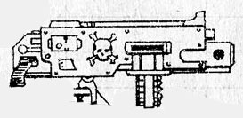

<!-- A1250-B0035 -->

原译文

Godwyn Pattern 戈德温型

**校订译文**

Godwyn Pattern 戈德温型

<!-- /A1250-B0035 -->

<!-- A1250-B0036 -->
### Hellstorm Heavy Bolter 地狱风暴重型爆矢枪

<!-- /A1250-B0036 -->

<!-- A1250-B0037 -->
**英文原文**

The Hellstorm Heavy Bolter is a pattern of heavy bolter used by Primaris Space Marine Heavy Intercessors.

<!-- /A1250-B0037 -->

<!-- A1250-B0038 -->

原译文

地狱风暴重型爆矢枪是原铸星际战士重型仲裁者使用的重型爆矢枪的一种型号。

**校订译文**

地狱风暴重型爆矢枪是原铸星际战士重装仲裁者使用的一种重型爆矢枪。

<!-- /A1250-B0038 -->

<!-- A1250-B0039 -->
### Lucius 卢修斯

<!-- /A1250-B0039 -->

<!-- A1250-B0040 -->
**英文原文**

A collection of models of heavy bolter produced by the Forge World of Lucius; specific patterns include the Pattern VI and LXV Lucius type. Some of these may be found mounted on various Imperial vehicles, including some varieties of Baneblade.

<!-- /A1250-B0040 -->

<!-- A1250-B0041 -->

原译文

卢修斯铸造世界生产的重型爆矢枪型号集；具体模式包括VI型和LXV 卢修斯型。其中一些可能安装在各种帝国车辆上，包括一些毒刃。

**校订译文**

铸造世界卢修斯生产的一系列重型爆矢枪，具体包括卢修斯 VI 型和 LXV 型等。其中一些用于帝国各类载具，包括部分毒刃型号。

<!-- /A1250-B0041 -->

<!-- A1250-B0042 -->
### Mars Pattern 火星型

<!-- /A1250-B0042 -->

<!-- A1250-B0043 -->
**英文原文**

The Mars Pattern Heavy Bolter is the workhorse of the Space Marine Chapter's heavy support units throughout the war-torn Imperium.

<!-- /A1250-B0043 -->

<!-- A1250-B0044 -->

原译文

火星型重型爆矢枪是整个饱受战争蹂躏的帝国星际战士重型支援部队的主力。

**校订译文**

在战火纷飞的帝国各地，火星型重型爆矢枪都是星际战士战团重火力支援部队的主力武器。

<!-- /A1250-B0044 -->

<!-- A1250-B0045 图片 -->
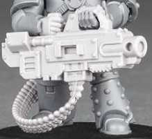

<!-- A1250-B0046 -->

原译文

Mars Pattern Heavy Bolter 火星型重型爆矢枪

**校订译文**

Mars Pattern Heavy Bolter 火星型重型爆矢枪

<!-- /A1250-B0046 -->

<!-- A1250-B0047 -->
### Massada Pattern 'Firefury' 马萨达型“炽怒”

<!-- /A1250-B0047 -->

<!-- A1250-B0048 -->
**英文原文**

Mounted on the Mark V Phobos Pattern Land Raiders.

<!-- /A1250-B0048 -->

<!-- A1250-B0049 -->

原译文

安装在Mark V火卫一型兰德掠袭者上。

**校订译文**

安装于 Mk.V 福波斯型兰德掠袭者战车。

<!-- /A1250-B0049 -->

<!-- A1250-B0050 -->
### Maxima 马克西姆

<!-- /A1250-B0050 -->

<!-- A1250-B0051 -->
**英文原文**

The Maxima MkIV heavy bolter is used by the Space Marines, including the Mantis Warriors' Tactical Squads.

<!-- /A1250-B0051 -->

<!-- A1250-B0052 -->

原译文

马克西姆 MkIV重型爆矢枪被星际战士使用，包括螳螂勇士战术小队。

**校订译文**

马克西姆 Mk.IV 重型爆矢枪由星际战士使用，其中包括螳螂勇士的战术小队。

<!-- /A1250-B0052 -->

<!-- A1250-B0053 图片 -->
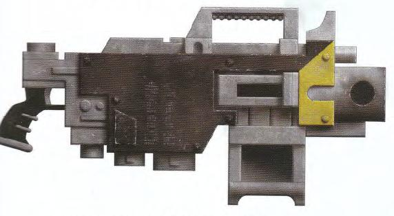

<!-- A1250-B0054 -->

原译文

Maxima MkIV 马克西姆 MkIV

**校订译文**

Maxima MkIV 马克西姆 MkIV

<!-- /A1250-B0054 -->

<!-- A1250-B0055 -->
### Orlock 欧洛克

<!-- /A1250-B0055 -->

<!-- A1250-B0056 -->
**英文原文**

A snub-nosed drum-fed Heavy Bolter design used by House Orlock on Necromunda.

<!-- /A1250-B0056 -->

<!-- A1250-B0057 -->

原译文

欧洛克家族在涅克罗蒙达上使用的塌鼻弹鼓式重型爆矢枪设计。

**校订译文**

涅克罗蒙达欧洛克家族使用的一种短枪口、弹鼓供弹的重型爆矢枪。

<!-- /A1250-B0057 -->

<!-- A1250-B0058 图片 -->
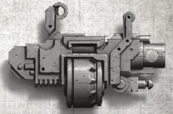

<!-- A1250-B0059 -->

原译文

Orlock Heavy Bolter 欧洛克重型爆矢枪

**校订译文**

Orlock Heavy Bolter 欧洛克重型爆矢枪

<!-- /A1250-B0059 -->

<!-- A1250-B0060 -->
### Requiem Pattern 安魂曲型

<!-- /A1250-B0060 -->

<!-- A1250-B0061 -->
**英文原文**

The MK IV Requiem Pattern Heavy Bolter generally sees more use in the hands of the Dark Angel chapter, their dedication to scripture and lore far surpassing most other chapters. The special incense burned in the censor has gained the nickname “Uzziel’s breath”, and is said to be calming and to sharpen focus.

<!-- /A1250-B0061 -->

<!-- A1250-B0062 -->

原译文

MK IV安魂曲型重型爆矢枪通常在黑暗天使战团中有更多的用途，他们对经文和传说的奉献远远超过了大多数其他战团。在香炉中燃烧的特殊熏香获得了“乌西勒之息”的绰号，据说可以镇静和集中注意力。

**校订译文**

Mk.IV 安魂曲型重型爆矢枪尤其常见于黑暗天使战团，他们对经文和传统知识的重视远超过大多数战团。枪上香炉燃烧的特殊熏香被称为“乌西勒之息”，据说能使人平静，并让注意力更加集中。

**校注：** censor应为censer香炉，中文据句意修正；lore在此为战团传统知识，不只是传奇故事。

<!-- /A1250-B0062 -->

<!-- A1250-B0063 图片 -->
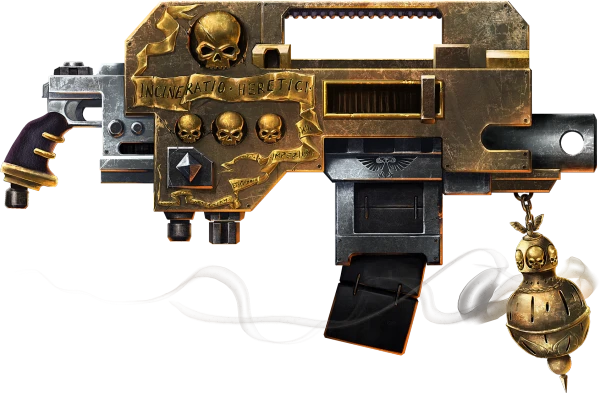

<!-- A1250-B0064 -->

原译文

Requiem Pattern 安魂曲型

**校订译文**

Requiem Pattern 安魂曲型

<!-- /A1250-B0064 -->

<!-- A1250-B0065 -->

原译文

Sanctus Mk.IVf Pattern 神圣 Mk.IVf图案

**校订译文**

Sanctus Mk.IVf Pattern 神圣 Mk.IVf 型

<!-- /A1250-B0065 -->

<!-- A1250-B0066 -->
**英文原文**

The ammunition of the Sanctus Pattern Heavy Bolter is belt-fed rather than clipped, magazine, or drum. The belt loader is jacketed in flexible segmented armour, reducing the chance of misfire, jamming or accidental damage.

<!-- /A1250-B0066 -->

<!-- A1250-B0067 -->

原译文

神圣型重型爆矢枪的弹药是带式的，而不是弹夹式的、匣式的或鼓式的。弹带装载机采用柔性分段装甲，减少了失火、堵塞或意外损坏的可能性。

**校订译文**

神圣型重型爆矢枪采用弹链供弹，而非弹夹、弹匣或弹鼓。供弹链路外覆柔性分段装甲，以减少哑火、卡弹和意外损坏的风险。

<!-- /A1250-B0067 -->

<!-- A1250-B0068 图片 -->
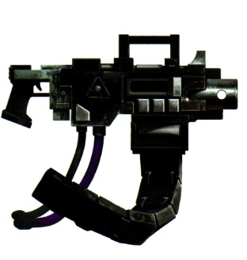

<!-- A1250-B0069 -->

原译文

Sanctus Mk.IVf Pattern 神圣 Mk.IVf图案

**校订译文**

Sanctus Mk.IVf Pattern 神圣 Mk.IVf 型

<!-- /A1250-B0069 -->

<!-- A1250-B0070 -->
### Solar-Pattern 太阳型

<!-- /A1250-B0070 -->

<!-- A1250-B0071 -->
**英文原文**

Solar-pattern heavy bolters find usage as one of the heavy weapons mounted on Praetorian Servitors.

<!-- /A1250-B0071 -->

<!-- A1250-B0072 -->

原译文

太阳型重型爆矢枪是安装在禁卫侍从上的重型武器之一。

**校订译文**

太阳型重型爆矢枪是禁卫机仆可安装的重型武器之一。

**校注：** Praetorian Servitor为机仆型号，不是普通侍从。

<!-- /A1250-B0072 -->

<!-- A1250-B0073 图片 -->
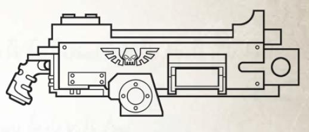

<!-- A1250-B0074 -->

原译文

Solar-Pattern 太阳型

**校订译文**

Solar-Pattern 太阳型

<!-- /A1250-B0074 -->

<!-- A1250-B0075 -->
### Sol Militaris Pattern 太阳军型

<!-- /A1250-B0075 -->

<!-- A1250-B0076 -->
**英文原文**

Shoulder-mounted; .75 cal, selective fire; suppression/anti-personnel. Issued to Legiones Astartes during the Great Crusade and Horus Heresy.

<!-- /A1250-B0076 -->

<!-- A1250-B0077 -->

原译文

肩扛式。.75口径，有射击模式；镇压/杀伤人员。在大远征和荷鲁斯叛乱期间提供给阿斯塔特军团。

**校订译文**

肩扛式，口径0.75英寸，可选择射击模式，用于压制及反人员任务。大远征和荷鲁斯之乱期间配发给阿斯塔特军团。

**校注：** 本型口径照原文保留0.75英寸，与通论所称重爆矢1.00英寸不同，不强行抹平型号差异。

<!-- /A1250-B0077 -->

<!-- A1250-B0078 图片 -->
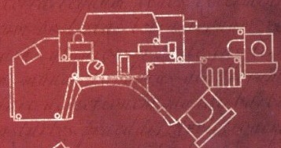

<!-- A1250-B0079 -->

原译文

Sol Militaris Pattern 太阳军型

**校订译文**

Sol Militaris Pattern 太阳军型

<!-- /A1250-B0079 -->

<!-- A1250-B0080 -->
### Voss-Incarnadine Pattern 沃斯-血色型

<!-- /A1250-B0080 -->

<!-- A1250-B0081 -->
**英文原文**

Issued to Legiones Astartes during the Great Crusade and Horus Heresy.

<!-- /A1250-B0081 -->

<!-- A1250-B0082 -->

原译文

在大远征和荷鲁斯叛乱期间提供给阿斯塔特军团。

**校订译文**

大远征和荷鲁斯之乱期间配发给阿斯塔特军团。

<!-- /A1250-B0082 -->

<!-- A1250-B0083 图片 -->
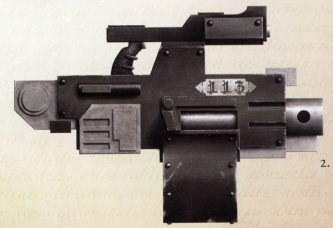

<!-- A1250-B0084 -->

原译文

Voss-Incarnadine Heavy Bolter 沃斯-血色型重型爆矢枪

**校订译文**

Voss-Incarnadine Heavy Bolter 沃斯-血色型重型爆矢枪

<!-- /A1250-B0084 -->

<!-- A1250-B0085 -->
### Scatter 散射

<!-- /A1250-B0085 -->

<!-- A1250-B0086 -->
**英文原文**

A highly modifiable heavy bolter pattern popular amongst the gangers and hired guns of Necromunda. Associated with the gangers of House Goliath.

<!-- /A1250-B0086 -->

<!-- A1250-B0087 -->

原译文

一种高度可修改的重型爆矢枪型号，在涅克罗蒙达的歹徒和雇佣枪手中很受欢迎。与歌利亚家族的歹徒有关。

**校订译文**

一种便于进行多种改装的重型爆矢枪，在涅克罗蒙达的帮派成员和雇佣枪手中广受欢迎，尤其常见于歌利亚家族帮派。

<!-- /A1250-B0087 -->

<!-- A1250-B0088 图片 -->
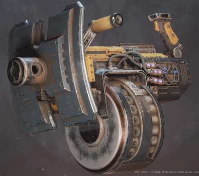

<!-- A1250-B0089 -->

原译文

Scatter Heavy Bolter 散射重型爆矢枪

**校订译文**

Scatter Heavy Bolter 散射重型爆矢枪

<!-- /A1250-B0089 -->

<!-- A1250-B0090 -->
### More heavy bolter designs 更多重型爆矢枪设计

<!-- /A1250-B0090 -->

<!-- A1250-B0091 -->
**英文原文**

Due to the fact that in most cases specific heavy bolter images are not labelled, unnamed designs are collected , grouped by outward similarity

<!-- /A1250-B0091 -->

<!-- A1250-B0092 -->

原译文

由于在大多数情况下，特定的重型爆矢枪没有标记，因此收集了未命名的设计，并按外观相似性进行分组。

**校订译文**

多数重型爆矢枪图片没有标明具体型号，此处汇集这些未具名的设计，按外观相似程度分组。

<!-- /A1250-B0092 -->

<!-- A1250-B0093 图片 -->
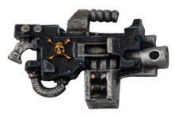

<!-- A1250-B0094 -->

原译文

Sternguard Heavy bolter 肃卫重型爆矢枪

**校订译文**

Sternguard Heavy bolter 肃卫重型爆矢枪

<!-- /A1250-B0094 -->

<!-- A1250-B0095 图片 -->
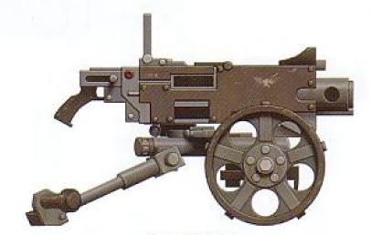

<!-- A1250-B0096 -->

原译文

Death Korps of Krieg Heavy bolter 克里格死亡军团重型爆矢枪

**校订译文**

Death Korps of Krieg Heavy bolter 克里格死亡军团重型爆矢枪

<!-- /A1250-B0096 -->

<!-- A1250-B0097 -->
## Variants 变体

<!-- /A1250-B0097 -->

<!-- A1250-B0098 -->
### Assault Bolter 突击爆矢枪

<!-- /A1250-B0098 -->

<!-- A1250-B0099 -->
**英文原文**

The Assault Bolter is a miniaturized version of the Heavy Bolter used by Primaris Space Marines.

<!-- /A1250-B0099 -->

<!-- A1250-B0100 -->

原译文

突击爆矢枪是原铸星际战士使用的重型爆矢枪的小型化版本。

**校订译文**

突击爆矢枪是原铸星际战士使用的重型爆矢枪的小型化版本。

<!-- /A1250-B0100 -->

<!-- A1250-B0101 -->
### Infernus Heavy Bolter 炼狱重型爆矢枪

<!-- /A1250-B0101 -->

<!-- A1250-B0102 -->
**英文原文**

The Infernus Heavy Bolter is a pattern of heavy bolter used by the Deathwatch. These weapons are mag-clamped with rare suspensor discs that reduce the weapon's weight considerably. It is also equipped with a Heavy Flamer.

<!-- /A1250-B0102 -->

<!-- A1250-B0103 -->

原译文

炼狱重型爆矢枪是死亡守望使用的重型爆矢枪的一种型号。这些武器是用罕见的悬吊盘夹紧的，大大减轻了武器的重量。它还配备了重型火焰枪。

**校订译文**

炼狱重型爆矢枪由死亡守望使用，枪上以磁力固定着罕见的悬浮盘，可大幅减轻武器重量。它还集成了一支重型火焰喷射器。

<!-- /A1250-B0103 -->

<!-- A1250-B0104 图片 -->
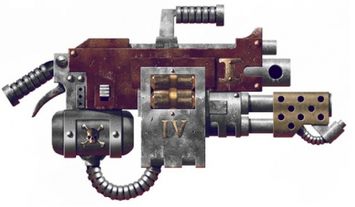

<!-- A1250-B0105 -->

原译文

Infernus Heavy Bolter 炼狱重型爆矢枪

**校订译文**

Infernus Heavy Bolter 炼狱重型爆矢枪

<!-- /A1250-B0105 -->

本篇核心术语与暂定项

以下列出本篇出现的英文原形及核心术语表用词。同形词可能指不同对象，具体词义以本篇正文和校注为准；单复数、别名和仅见于图注的名称可能尚未列入。完整候选见[术语表](../../术语表/双语术语候选.csv)。

| 英文 | 采用中文 | 状态 |
| --- | --- | --- |
| Space Marines | 星际战士 | 官方已核对 |
| Deathwatch | 死亡守望 | 官方已核对 |
| Adepta Sororitas | 修女会 | 官方已核对 |
| Boltgun | 爆矢枪 | 官方已核对 |
| Horus Heresy | 荷鲁斯之乱 | 官方已核对 |
| Imperium | 帝国 | 暂定·简称 |
| Forge World | 铸造世界 | 暂定·官方待核 |
| Necromunda | 涅克罗蒙达 | 暂定·官方待核 |
| House Goliath | 歌利亚家族 | 暂定·官方待核 |
| Goliath | 歌利亚 | 暂定·官方待核 |
| Great Crusade | 大远征 | 暂定·官方待核 |
| Horus | 荷鲁斯 | 暂定·官方待核 |
| Legiones Astartes | 阿斯塔特军团 | 暂定·官方待核 |
| Mars | 火星 | 暂定·官方待核 |
| Lucius | 卢修斯 | 暂定·官方待核 |
| Phobos | 火卫一 | 暂定·官方待核 |
| Ancient | 旗手 | 官方已核对 |
| Praetorian | 禁卫兵 | 暂定·官方待核 |
| Space Marine | 星际战士 | 暂定·官方待核 |
| Chapter | 战团 | 暂定·官方待核 |
| Primaris Space Marine | 原铸星际战士 | 暂定·官方待核 |
| Mantis Warriors | 螳螂勇士 | 暂定·官方待核 |
| Land Raiders | 兰德掠袭者 | 暂定·官方待核 |
| Tactical Squads | 战术小队 | 暂定·官方待核 |
| Heavy Intercessors | 重装仲裁者 | 暂定·官方待核 |
| Baneblade | 毒刃 | 官方已核对 |
| Sanctus | 圣裁者 | 官方已核对 |
| The Weapon | 武器 | 暂定·官方待核 |
| The Dark | 《黑暗》 | 暂定·官方待核 |
| Accatran | 阿卡特兰 | 暂定·官方待核 |
| Infernus Heavy Bolter | 炼狱重型爆矢枪 | 暂定·官方待核 |
| Bolt | 爆矢 | 暂定·官方待核 |
| Bolter | 爆矢枪 | 暂定·官方待核 |
| Heavy bolter | 重型爆矢枪 | 官方已核对 |
| Accatran Pattern MkVd Heavy Bolter | 阿卡特兰型 Mk.Vd 重型爆矢枪 | 暂定·官方待核 |
| Executor Heavy Bolter | 执行者重型爆矢枪 | 暂定·官方待核 |
| Hellstorm Heavy Bolter | 地狱风暴重型爆矢枪 | 暂定·官方待核 |
| Requiem Pattern Heavy Bolter | 安魂曲型重型爆矢枪 | 暂定·官方待核 |
| Assault Bolter | 突击爆矢枪 | 暂定·官方待核 |
| Flamer | 火焰喷射器（武器）／火妖（奸奇单位） | 语境定译·对应官译已核 |
| Heavy flamer | 重型火焰喷射器 | 官方已核对 |
| Suspensor | 悬浮装置 | 暂定·官方待核 |
| House Orlock | 欧洛克家族 | 暂定·官方待核 |
| Elysian Drop Troops | 艾丽西亚空降兵 | 暂定·官方待核 |

