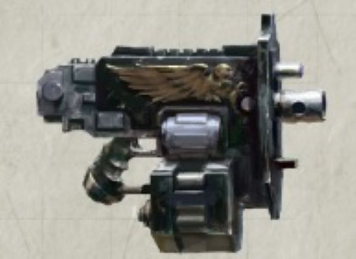

# 1251 突击爆矢枪 Assault Bolter

精校状态：中文行文已逐段精校，部分术语仍为暂定

分类：武器 / 远程武器

原文来源：https://www.bilibili.com/opus/999872814664122377

原作者：帝国神选罐头

原文时间：2024年11月15日 10:57

[返回分类目录](目录.md) · [全书目录](../../目录.md)

<!-- A1251-B0001 -->
**英文原文**

Assault Bolters are a variant of Bolt Weapon used by the Primaris Space Marines.

<!-- /A1251-B0001 -->

<!-- A1251-B0002 -->

原译文

突击爆矢枪是原铸星际战士使用的爆矢武器的变体。

**校订译文**

突击爆矢枪是原铸星际战士使用的爆矢武器的变体。

<!-- /A1251-B0002 -->

<!-- A1251-B0003 图片 -->

<!-- A1251-B0004 -->

原译文

Assault Bolters 突击爆矢枪

**校订译文**

Assault Bolters 突击爆矢枪

<!-- /A1251-B0004 -->

<!-- A1251-B0005 -->
**英文原文**

Developed over centuries by Belisarius Cawl the Assault Bolter is in essence a miniaturized, single-handed version of the Heavy Bolter. It is equipped with a high-capacity magazine, gun-shield, and auto reloader. The Assault Bolter is short-ranged, but its rate of fire and hitting strength are considerable, with the recoil contained by a mag-shield.

<!-- /A1251-B0005 -->

<!-- A1251-B0006 -->

原译文

贝利撒留·考尔几个世纪以来开发的突击爆矢枪本质上是重型爆矢机的小型单手化版本。它配备了一个大容量弹匣、枪盾和自动装弹器。突击爆矢枪射程较短，但其射速和打击力相当大，后坐力由磁盾控制。

**校订译文**

突击爆矢枪由贝利萨留斯·考尔历经数百年研发，本质上是重型爆矢枪的单手小型版本。它配有大容量弹匣、枪盾和自动装填器，射程虽短，射速与杀伤力却相当可观，并以磁力护盾抑制后坐力。

<!-- /A1251-B0006 -->

<!-- A1251-B0007 -->
**英文原文**

Assault Bolters are normally wielded by Inceptor Squads.

<!-- /A1251-B0007 -->

<!-- A1251-B0008 -->

原译文

突击爆矢枪通常由先驱者小队使用。

**校订译文**

突击爆矢枪通常由先驱者小队使用。

<!-- /A1251-B0008 -->

本篇核心术语与暂定项

以下列出本篇出现的英文原形及核心术语表用词。同形词可能指不同对象，具体词义以本篇正文和校注为准；单复数、别名和仅见于图注的名称可能尚未列入。完整候选见[术语表](../../术语表/双语术语候选.csv)。

| 英文 | 采用中文 | 状态 |
| --- | --- | --- |
| Space Marines | 星际战士 | 官方已核对 |
| Belisarius Cawl | 贝利萨留斯·考尔 | 官方已核对 |
| Inceptor | 先驱者 | 暂定·官方待核 |
| Gun | 甘 | 暂定·官方待核 |
| Bolt Weapon | 爆矢武器 | 暂定·官方待核 |
| Bolt | 爆矢 | 暂定·官方待核 |
| Bolter | 爆矢枪 | 暂定·官方待核 |
| Heavy bolter | 重型爆矢枪 | 官方已核对 |
| Assault Bolter | 突击爆矢枪 | 暂定·官方待核 |

