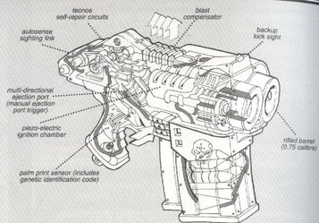
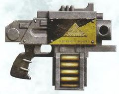
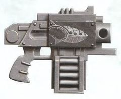
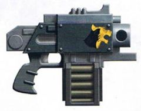
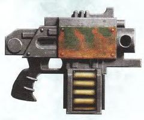
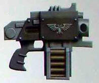
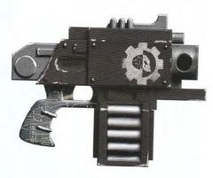
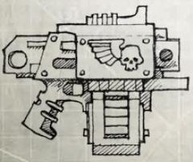
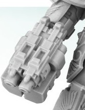
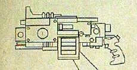

# 1252 风暴爆矢枪 Storm Bolter

精校状态：中文行文已逐段精校，部分术语仍为暂定

分类：武器 / 远程武器

原文来源：https://www.bilibili.com/opus/1002474830398750743

原作者：帝国神选罐头

原文时间：2024年11月22日 11:14

[返回分类目录](目录.md) · [全书目录](../../目录.md)

<!-- A1252-B0001 -->
**英文原文**

The Storm Bolter is a compact, double-barreled version of the Boltgun. Resembling two boltguns attached side by side, the storm bolter is capable of withering fire without hindering maneuverability, granting the wielder enormous individual firepower. Storm bolters are popular with Space Marine forces, specifically in the hands of Terminators and as infantry defense on Rhinos.

<!-- /A1252-B0001 -->

<!-- A1252-B0002 -->

原译文

风暴爆矢枪是爆矢枪的紧凑型双管版本。类似于并排安装的两个爆矢枪，风暴爆矢枪能够在不影响机动性的情况下进行猛烈射击，为使用者提供巨大的个人火力。风暴爆矢枪在星际战士中很受欢迎，特别是在终结者手中，以及作为犀牛的步兵防御。

**校订译文**

风暴爆矢枪是爆矢枪的紧凑双管版本，外观如同两支并排连接的爆矢枪。它能在保持机动性的同时倾泻密集火力，赋予使用者强大的单兵作战能力。风暴爆矢枪深受星际战士青睐，尤其常见于终结者手中，也被安装在犀牛战车上，用来防御敌方步兵。

<!-- /A1252-B0002 -->

<!-- A1252-B0003 图片 -->

<!-- A1252-B0004 -->

原译文

Storm Bolter components 风暴爆矢枪组成成分

**校订译文**

Storm Bolter components 风暴爆矢枪组成成分

<!-- /A1252-B0004 -->

<!-- A1252-B0005 -->
**英文原文**

Outside of the Space Marines and Adepta Sororitas, storm bolters are utilized by few elite Imperial forces.

<!-- /A1252-B0005 -->

<!-- A1252-B0006 -->

原译文

除了星际战士和修女会，很少有帝国精英部队使用风暴爆矢枪。

**校订译文**

除星际战士和修女会外，只有少数帝国精锐部队使用风暴爆矢枪。

<!-- /A1252-B0006 -->

<!-- A1252-B0007 -->
**英文原文**

The high-velocity bolts fired by an Astartes Storm Bolter can easily penetrate through eight inches of plasteel.

<!-- /A1252-B0007 -->

<!-- A1252-B0008 -->

原译文

阿斯塔特风暴爆矢枪发射的高速爆矢可以很容易地穿透8英寸的塑钢。

**校订译文**

阿斯塔特风暴爆矢枪发射的高速爆矢可以很容易地穿透8英寸的塑钢。

<!-- /A1252-B0008 -->

<!-- A1252-B0009 -->
**英文原文**

Storm bolters are often adorned with glyphs and purity seals that point out their ancient origin.

<!-- /A1252-B0009 -->

<!-- A1252-B0010 -->

原译文

风暴爆矢枪经常装饰着纹饰和纯结印章，指出它们的古老起源。

**校订译文**

风暴爆矢枪常装饰着符纹和纯洁印章，彰显其古老来历。

<!-- /A1252-B0010 -->

<!-- A1252-B0011 -->
## Imperial Bolter designs 帝国爆矢枪设计

<!-- /A1252-B0011 -->

<!-- A1252-B0012 -->
## Adeptus Astartes 阿斯塔特修会

<!-- /A1252-B0012 -->

<!-- A1252-B0013 -->
### Hecaton variant 百式

<!-- /A1252-B0013 -->

<!-- A1252-B0014 -->
**英文原文**

The Hecation variant MkIIIc storm bolter is a standard issue Terminator weapon.

<!-- /A1252-B0014 -->

<!-- A1252-B0015 -->

原译文

百式MkIIIc风暴爆矢枪是标准版终结者武器。

**校订译文**

百式 Mk.IIIc 风暴爆矢枪是终结者的制式武器。

**校注：** 正文Hecation与标题Hecaton异拼，按同一型号统一中文百式，不改英文。

<!-- /A1252-B0015 -->

<!-- A1252-B0016 图片 -->

<!-- A1252-B0017 -->

原译文

Hecaton variant 百式

**校订译文**

Hecaton variant 百式

<!-- /A1252-B0017 -->

<!-- A1252-B0018 -->
### Incaladion pattern 因卡拉迪翁型

原题：Incaladion pattern 英卡拉迪翁型

<!-- /A1252-B0018 -->

<!-- A1252-B0019 -->
**英文原文**

The Incaladion pattern storm bolter is known to have been used by Carcharodons Terminators during the Badab War.

<!-- /A1252-B0019 -->

<!-- A1252-B0020 -->

原译文

众所周知，在巴达布战争期间，噬人鲨终结者使用了英卡拉迪翁型风暴爆矢。

**校订译文**

噬人鲨终结者曾在巴达布战争期间使用因卡拉迪翁型风暴爆矢枪。

<!-- /A1252-B0020 -->

<!-- A1252-B0021 图片 -->

<!-- A1252-B0022 -->

原译文

Incaladion pattern 英卡拉迪翁型

**校订译文**

Incaladion pattern 因卡拉迪翁型

<!-- /A1252-B0022 -->

<!-- A1252-B0023 -->
### Indomitus pattern 不屈型

<!-- /A1252-B0023 -->

<!-- A1252-B0024 -->
**英文原文**

The Indomitus pattern storm bolter is used by Terminators.

<!-- /A1252-B0024 -->

<!-- A1252-B0025 -->

原译文

终结者使用不屈型风暴爆矢枪。

**校订译文**

终结者使用不屈型风暴爆矢枪。

<!-- /A1252-B0025 -->

<!-- A1252-B0026 -->

原译文

MKIII pattern MK.III型

**校订译文**

MKIII pattern MK.III型

<!-- /A1252-B0026 -->

<!-- A1252-B0027 -->
**英文原文**

The MKIII pattern storm bolter is known to have been used by the Astral Claws during the Badab War.

<!-- /A1252-B0027 -->

<!-- A1252-B0028 -->

原译文

MKIII型风暴爆矢枪在巴达布战争期间被星空之爪使用。

**校订译文**

星辰之爪曾在巴达布战争期间使用 Mk.III 型风暴爆矢枪。

<!-- /A1252-B0028 -->

<!-- A1252-B0029 图片 -->

<!-- A1252-B0030 -->

原译文

MKIII pattern MK.III型

**校订译文**

MKIII pattern MK.III型

<!-- /A1252-B0030 -->

<!-- A1252-B0031 -->
### Nocturne-Ultima 夜曲-极限型

<!-- /A1252-B0031 -->

<!-- A1252-B0032 -->
**英文原文**

The Salamanders are known to have used Nocturne-Ultima modified storm bolters during the Badab War.

<!-- /A1252-B0032 -->

<!-- A1252-B0033 -->

原译文

众所周知，在巴达布战争期间，火蜥蜴曾使用过夜曲-极限型改装风暴爆矢枪。

**校订译文**

火蜥蜴在巴达布战争期间曾使用夜曲—极限型改装风暴爆矢枪。

<!-- /A1252-B0033 -->

<!-- A1252-B0034 图片 -->

<!-- A1252-B0035 -->

原译文

Nocturne-Ultima 夜曲-极限型

**校订译文**

Nocturne-Ultima 夜曲-极限型

<!-- /A1252-B0035 -->

<!-- A1252-B0036 -->
### Ryza-pattern 瑞扎型

<!-- /A1252-B0036 -->

<!-- A1252-B0037 -->
**英文原文**

The Ryza-pattern Storm bolter is almost exclusively used by the Adeptus Astartes.

<!-- /A1252-B0037 -->

<!-- A1252-B0038 -->

原译文

瑞扎型风暴爆矢枪几乎完全由阿斯塔特修会使用。

**校订译文**

瑞扎型风暴爆矢枪几乎专供阿斯塔特使用。

<!-- /A1252-B0038 -->

<!-- A1252-B0039 -->
### Umbra pattern 阴影型

<!-- /A1252-B0039 -->

<!-- A1252-B0040 -->
**英文原文**

The Umbra pattern storm bolter is known to be used by Terminators of the Red Scorpions. With the dual magazines pictured below their ammunition capacity is forty rounds.

<!-- /A1252-B0040 -->

<!-- A1252-B0041 -->

原译文

已知红蝎终结者使用的是阴影型风暴爆矢枪。双弹匣的弹药容量为40发。

**校订译文**

红蝎终结者曾使用阴影型风暴爆矢枪。下图所示双弹匣的总容量为40发。

<!-- /A1252-B0041 -->

<!-- A1252-B0042 图片 -->

<!-- A1252-B0043 -->

原译文

Umbra pattern 阴影型

**校订译文**

Umbra pattern 阴影型

<!-- /A1252-B0043 -->

<!-- A1252-B0044 -->
### Ultima pattern 极限型

<!-- /A1252-B0044 -->

<!-- A1252-B0045 -->
**英文原文**

The Sons of Medusa are known to have used Ultima pattern storm bolters for their Terminators during the Badab War.

<!-- /A1252-B0045 -->

<!-- A1252-B0046 -->

原译文

众所周知，在巴达布战争期间，美杜莎之子使用了极限型风暴爆矢枪作为他们的终结者武器。

**校订译文**

美杜莎之子曾在巴达布战争期间为终结者装备极限型风暴爆矢枪。

<!-- /A1252-B0046 -->

<!-- A1252-B0047 图片 -->

<!-- A1252-B0048 -->

原译文

Ultima pattern 极限型

**校订译文**

Ultima pattern 极限型

<!-- /A1252-B0048 -->

<!-- A1252-B0049 -->
## Other Boltguns used by Imperial or human factions and organisations 帝国或人类派系和组织使用的其他爆矢枪

<!-- /A1252-B0049 -->

<!-- A1252-B0050 -->
### Mars-pattern 火星型

<!-- /A1252-B0050 -->

<!-- A1252-B0051 图片 -->

<!-- A1252-B0052 -->

原译文

Mars-pattern 火星型

**校订译文**

Mars-pattern 火星型

<!-- /A1252-B0052 -->

<!-- A1252-B0053 -->
### Lastrum Pattern 拉斯穆型

<!-- /A1252-B0053 -->

<!-- A1252-B0054 -->
**英文原文**

Used by the Adeptus Custodes. This pattern of bolt weapons is named for the weaponsmiths of the Lastrum Core Clan of the Appolyne workshops of Terra. Other than being exemplars of their kind in terms of skill of fabrication, they would not be remarkable save for their uniquely powerful ammunition. Rather than the usual 'kraken' type bolts utilized by the wider sweep of the Legio Custodes, the artisans of the Lastrum clans hand manufacture only customised mass-reactive heliothermic warheads for their bolt shells. Once within their target, these burst into brief, but sun-hot incendiary detonations, incinerating their victims from within. These shells are uncommonly dense, requiring a far stronger charge to launch than common bolt shells, and only the Lastrum's uniquely sturdy construction for a weapon of their size can withstand the stresses of their repeated firing.

<!-- /A1252-B0054 -->

<!-- A1252-B0055 -->

原译文

由禁军使用。这种爆矢武器的型号是以泰拉阿波利恩工坊的拉斯穆核心氏族的武器工匠命名的。除了在制造技术方面堪称同类的典范，以及其独特的强大弹药外，它们并不引人注目。拉斯穆氏族的工匠们只为他们的爆矢手工制造定制的质量反应日炎弹头，而不是禁军军团更广泛使用的通常的“海妖”型爆矢。一旦进入目标，它们就会爆发出短暂但灼热的燃烧爆炸，从内部焚烧受害者。这些子弹的密度非常高，发射时需要比普通爆矢强得多的装药，只有拉斯穆独特坚固的结构才能承受其反复发射的压力。

**校订译文**

拉斯穆型由禁军使用，得名于泰拉阿波利恩工坊的拉斯穆核心氏族武器匠。除制造工艺堪称典范外，这种武器最突出的特点便是独特而强大的弹药。拉斯穆氏族的工匠不采用禁军军团通常使用的克拉肯型爆矢，而是手工定制质量反应式日炎弹头。它们进入目标后，会产生短暂却如太阳般炽热的燃烧爆炸，从内部将受害者焚毁。这种弹药异常致密，需要远强于普通爆矢的发射装药；在同等尺寸武器中，只有拉斯穆型独有的坚固结构，才能承受反复射击带来的应力。

<!-- /A1252-B0055 -->

<!-- A1252-B0056 图片 -->

<!-- A1252-B0057 -->

原译文

Lastrum Pattern 拉斯穆型

**校订译文**

Lastrum Pattern 拉斯穆型

<!-- /A1252-B0057 -->

<!-- A1252-B0058 -->
**英文原文**

The sheer resources and artifice of these weapons are immense, and they could never hope to be mass produced to arm the Space Marine Legions, and even the output of entire generations of the Lastrum themselves can barely satisfy Legio Custodes' demands.

<!-- /A1252-B0058 -->

<!-- A1252-B0059 -->

原译文

这些武器的纯粹资源和技艺需求是巨大的，它们永远不可能大规模生产来武装星际战士，甚至整个世纪的拉斯穆本身的产量也几乎无法满足禁军军团的要求。

**校订译文**

制造这些武器需要惊人的资源与技艺，根本无法大量生产以装备星际战士军团。即使拉斯穆氏族数代工匠的全部产量，也仅能勉强满足禁军军团的需求。

**校注：** generations指一代代工匠，不是世纪；补回Space Marine Legions的军团层级。

<!-- /A1252-B0059 -->

<!-- A1252-B0060 -->
### M33 MkIV Pintle-mounted Storm Bolter M33 MkIV固定枢轴风暴爆矢枪

<!-- /A1252-B0060 -->

<!-- A1252-B0061 -->
**英文原文**

Mounted on the Mark V Phobos Pattern Land Raiders.

<!-- /A1252-B0061 -->

<!-- A1252-B0062 -->

原译文

安装在Mark.V火卫一型兰德掠袭者上。

**校订译文**

安装于 Mk.V 福波斯型兰德掠袭者战车。

<!-- /A1252-B0062 -->

<!-- A1252-B0063 图片 -->

<!-- A1252-B0064 -->

原译文

M33 MkIV Pintle-mounted Storm Bolter M33 MkIV固定枢轴风暴爆矢枪

**校订译文**

M33 MkIV Pintle-mounted Storm Bolter M33 MkIV固定枢轴风暴爆矢枪

<!-- /A1252-B0064 -->

本篇核心术语与暂定项

以下列出本篇出现的英文原形及核心术语表用词。同形词可能指不同对象，具体词义以本篇正文和校注为准；单复数、别名和仅见于图注的名称可能尚未列入。完整候选见[术语表](../../术语表/双语术语候选.csv)。

| 英文 | 采用中文 | 状态 |
| --- | --- | --- |
| Space Marines | 星际战士 | 官方已核对 |
| Adeptus Astartes | 阿斯塔特修会 | 官方已核对 |
| Adepta Sororitas | 修女会 | 官方已核对 |
| Adeptus Custodes | 帝皇禁军 | 官方已核对 |
| Terminator | 终结者 | 官方已核对 |
| Boltgun | 爆矢枪 | 官方已核对 |
| Indomitus | 不屈学派 | 暂定·学派语境 |
| Terra | 泰拉 | 暂定·官方待核 |
| Salamanders | 火蜥蜴 | 暂定·官方待核 |
| Badab | 巴达布 | 暂定·官方待核 |
| Ryza | 瑞扎 | 暂定·官方待核 |
| Nocturne | 夜曲星 | 暂定·官方待核 |
| Phobos | 火卫一 | 暂定·官方待核 |
| Medusa | 美杜莎 | 暂定·官方待核 |
| Ancient | 旗手 | 官方已核对 |
| Space Marine | 星际战士 | 暂定·官方待核 |
| Terminators | 终结者 | 暂定·官方待核 |
| Red Scorpions | 红蝎 | 暂定·官方待核 |
| Rhinos | 犀牛 | 暂定·官方待核 |
| Land Raiders | 兰德掠袭者 | 暂定·官方待核 |
| Carcharodons | 噬人鲨 | 暂定·官方待核 |
| Exemplars | 模范者 | 暂定·官方待核 |
| Sons of Medusa | 美杜莎之子 | 暂定·官方待核 |
| Umbra | 本影 | 暂定·官方待核 |
| Incaladion | 因卡拉迪翁 | 暂定·官方待核 |
| Astral Claws | 星辰之爪 | 暂定·官方待核 |
| Bolt | 爆矢 | 暂定·官方待核 |
| Bolter | 爆矢枪 | 暂定·官方待核 |
| Storm bolter | 风暴爆矢枪 | 官方已核对 |
| Incaladion Pattern Storm Bolter | 因卡拉迪翁型风暴爆矢枪 | 暂定·官方待核 |
| Indomitus Pattern Storm Bolter | 不屈型风暴爆矢枪 | 暂定·官方待核 |
| Nocturne-Ultima | 夜曲—极限型 | 暂定·官方待核 |
| Lastrum Core Clan | 拉斯穆核心氏族 | 暂定·官方待核 |
| Appolyne Workshops | 阿波利恩工坊 | 暂定·官方待核 |
| Indomitus Pattern | 不屈型 | 暂定·官方待核 |
| Kraken | 克拉肯 | 暂定·官方待核 |

