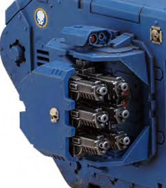

# 1254 飓风爆矢枪 Hurricane Bolter

精校状态：中文行文已逐段精校，部分术语仍为暂定

分类：武器 / 远程武器

原文来源：https://www.bilibili.com/opus/1004737449221423111

原作者：帝国神选罐头

原文时间：2024年11月28日 13:34

[返回分类目录](目录.md) · [全书目录](../../目录.md)

<!-- A1254-B0001 -->
**英文原文**

Hurricane Bolters are a set of six co-axial Boltguns, two of which can be mounted in the side sponsons of the Land Raider, which is one of the hallmarks of the Land Raider Crusader. The Crusader variant, the Stormraven Gunship, and the Ironclad Dreadnought are currently the only vehicles known to make use of this weapon, although they are also carried by some centurion warsuits. The two sponsons on the Land Raider Crusader augment the Assault Cannons and Multi-melta on the vehicle.

<!-- /A1254-B0001 -->

<!-- A1254-B0002 -->

原译文

飓风爆矢枪是一套六个同轴爆矢枪，两个飓风爆矢枪安装在兰德掠袭者的侧舷上，这是十字军型兰德掠袭者的标志之一。十字军变体，风暴鸦炮艇和铁甲无畏是目前已知的唯一使用这种武器的车辆，尽管它们也由一些百夫长战甲携带。十字军型兰德掠袭者上的两个侧翼武器舱增强了车辆上的突击炮和多管热熔。

**校订译文**

一组飓风爆矢枪由六支同轴爆矢枪组成。兰德掠袭者战车可在两侧炮座各安装一组，这也是十字军型兰德掠袭者的标志之一。底稿所述使用这种武器的载具，包括十字军型兰德掠袭者、风暴鸦炮艇和铁甲无畏机甲；部分百夫长战甲也会装备。十字军型兰德掠袭者的两组侧置飓风爆矢枪，为车上的突击炮和多管热熔武器补充了火力。

**校注：** 六支枪组成一组，两侧各一组；不能理解成全车只有两支枪。原文“目前已知唯一”受底稿版本所限。

<!-- /A1254-B0002 -->

<!-- A1254-B0003 图片 -->

<!-- A1254-B0004 -->

原译文

Hurricane Bolter set mounted on Land Raider Crusader 安装在十字军型兰德掠袭者上的飓风爆弹枪

**校订译文**

Hurricane Bolter set mounted on Land Raider Crusader 安装在十字军型兰德掠袭者上的一组飓风爆矢枪

<!-- /A1254-B0004 -->

本篇核心术语与暂定项

以下列出本篇出现的英文原形及核心术语表用词。同形词可能指不同对象，具体词义以本篇正文和校注为准；单复数、别名和仅见于图注的名称可能尚未列入。完整候选见[术语表](../../术语表/双语术语候选.csv)。

| 英文 | 采用中文 | 状态 |
| --- | --- | --- |
| Land Raider | 兰德掠袭者战车 | 官方已核对 |
| Stormraven Gunship | 风暴鸦炮艇 | 官方已核 |
| Raider | 掠袭者飞艇 | 官方已核对 |
| Dreadnought | 无畏机甲 | 暂定·官方待核 |
| Centurion Warsuits | 百夫长战甲 | 暂定·官方待核 |
| The Crusader | 十字军号 | 暂定·官方待核 |
| Multi-melta | 多管热熔 | 官方已核对 |
| Ironclad Dreadnought | 铁甲无畏机甲 | 暂定·官方待核 |
| Land Raider Crusader | 十字军型兰德掠袭者战车 | 官方已核对 |

