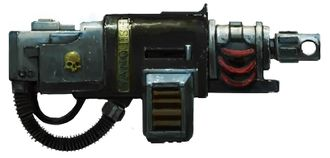
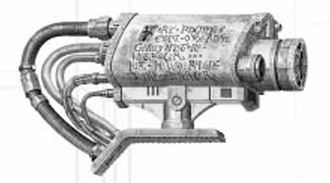
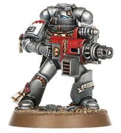
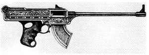
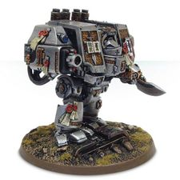
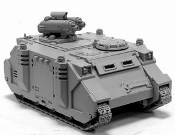
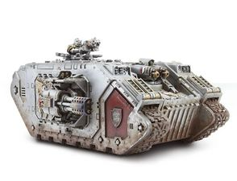
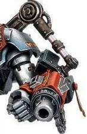

# 1255 灵能炮 Psycannon

精校状态：中文行文已逐段精校，部分术语仍为暂定

分类：武器 / 远程武器

原文来源：https://www.bilibili.com/opus/1217716012657410080

原作者：帝国神选罐头

原文时间：2026年06月25日 12:00

[返回分类目录](目录.md) · [全书目录](../../目录.md)

<!-- A1255-B0001 -->
**英文原文**

Psycannons are weapons only used by the Ordo Malleus and Grey Knights.

<!-- /A1255-B0001 -->

<!-- A1255-B0002 -->

原译文

灵能炮是仅由圣锤修会和灰骑士使用的武器。

**校订译文**

灵能炮是恶魔审判庭和灰骑士专用的武器。

<!-- /A1255-B0002 -->

<!-- A1255-B0003 图片 -->

<!-- A1255-B0004 -->

原译文

Psycannon 灵能炮

**校订译文**

Psycannon 灵能炮

<!-- /A1255-B0004 -->

<!-- A1255-B0005 -->
## Overview 概述

<!-- /A1255-B0005 -->

<!-- A1255-B0006 -->
**英文原文**

Ancient psycannons are based on the boltgun, firing bolts heavily impregnated with negative psychic energy. The bolt is devastating to the psyches and physical bodies of psykers, daemons, and the possessed. As if the negative psychic energy was not enough, each psycannon bolt is also silver-tipped and inscribed with anti-daemonic symbols.

<!-- /A1255-B0006 -->

<!-- A1255-B0007 -->

原译文

古代的灵能炮基于爆矢枪，发射充满负灵能能量的爆矢。这种爆矢对灵能者、恶魔和附魔者的身心都是毁灭性的。仿佛负灵能能量还不够，每个灵能炮爆矢也是银尖端的，上面刻着反恶魔符号。

**校订译文**

古老的灵能炮以爆矢枪为基础，发射灌注大量负向灵能的爆矢，能够同时重创灵能者、恶魔和附身者的精神与肉体。除此之外，每发灵能炮爆矢还配有银制尖端，并刻上驱逐恶魔的符号。

<!-- /A1255-B0007 -->

<!-- A1255-B0008 图片 -->

<!-- A1255-B0009 -->

原译文

Psycannon 灵能炮

**校订译文**

Psycannon 灵能炮

<!-- /A1255-B0009 -->

<!-- A1255-B0010 -->
**英文原文**

Modern psycannons are triggered by the wielder sending a jolt of psychic energy into the weapon’s containment core. The payload released is a focused beam of force that shreds physical matter and saturates the air with burning psychic resonance.

<!-- /A1255-B0010 -->

<!-- A1255-B0011 -->

原译文

现代灵能炮的发射是由使用者向武器的控制核心发送一股灵能能量引发的。释放的有效载荷是一个聚焦的灵能光束，它粉碎了物质，并使空气充满了燃烧的灵能谐振。

**校订译文**

现代灵能炮由使用者向武器的约束核心注入一股灵能来触发，随后释放出聚焦的能量束，撕碎物质，并让空气充满灼烈的灵能共振。

**校注：** 底稿明确将古式爆矢弹和现代聚焦能量束分开描述；保留区别，不把两段强行统一成同一种发射机制。

<!-- /A1255-B0011 -->

<!-- A1255-B0012 图片 -->

<!-- A1255-B0013 -->

原译文

Grey Knight with Psycannon 配备灵能炮的灰骑士

**校订译文**

Grey Knight with Psycannon 配备灵能炮的灰骑士

<!-- /A1255-B0013 -->

<!-- A1255-B0014 图片 -->

<!-- A1255-B0015 -->

原译文

1st Edition Psycannon artwork 第一版灵能炮插图

**校订译文**

1st Edition Psycannon artwork 第一版灵能炮插图

<!-- /A1255-B0015 -->

<!-- A1255-B0016 -->
## Deimos-Lux Pattern Psycannon 迪莫斯-勒克斯型灵能炮

原题：Deimos-Lux Pattern Psycannon 火卫二-勒克斯型灵能炮

<!-- /A1255-B0016 -->

<!-- A1255-B0017 -->
**英文原文**

Among the rarer patterns of weaponry utilised by the Grey Knights, the Deimos-Lux is a pattern of Psycannon designed to be mounted to Dreadnoughts, Razorbacks, Thunderhawks and Land Raiders in favour of more conventional armament. Highly regarded, the use of these weapons by the Grey Knights is only limited by their availability.

<!-- /A1255-B0017 -->

<!-- A1255-B0018 -->

原译文

在灰骑士使用的较为罕见的武器型号中，火卫二-勒克斯是一种灵能炮型号，旨在安装在无畏、豪猪、雷鹰和兰德掠袭者上，以支持更常规的武器。灰骑士对这些武器的使用受到高度重视，仅受其可用性的限制。

**校订译文**

迪莫斯—勒克斯型是灰骑士较为罕见的灵能炮型号，用来替代常规武器，安装在无畏机甲、豪猪战车、雷鹰和兰德掠袭者战车上。灰骑士对它评价极高，装备规模只受产量和供应限制。

**校注：** in favour of表示以本武器取代常规武器，原译“支持常规武器”改变了安装关系。

<!-- /A1255-B0018 -->

<!-- A1255-B0019 图片 -->

<!-- A1255-B0020 -->

原译文

Dreadnought with Deimos-Lux Pattern Psycannon 配备火卫二-勒克斯型灵能炮的无畏

**校订译文**

Dreadnought with Deimos-Lux Pattern Psycannon 装备迪莫斯—勒克斯型灵能炮的无畏机甲

<!-- /A1255-B0020 -->

<!-- A1255-B0021 图片 -->

<!-- A1255-B0022 -->

原译文

Vortimer Pattern Razorback with twin Deimos-Lux Pattern Psycannons 配备双联火卫二-勒克斯型灵能炮的沃蒂默型豪猪

**校订译文**

Vortimer Pattern Razorback with twin Deimos-Lux Pattern Psycannons 装备双联迪莫斯—勒克斯型灵能炮的沃蒂默型豪猪战车

<!-- /A1255-B0022 -->

<!-- A1255-B0023 图片 -->

<!-- A1255-B0024 -->

原译文

Land Raider with twin Deimos-Lux Pattern Psycannons 配备双联火卫二-勒克斯型灵能炮的兰德掠袭者

**校订译文**

Land Raider with twin Deimos-Lux Pattern Psycannons 装备双联迪莫斯—勒克斯型灵能炮的兰德掠袭者战车

<!-- /A1255-B0024 -->

<!-- A1255-B0025 -->
## Heavy Psycannon 重型灵能炮

<!-- /A1255-B0025 -->

<!-- A1255-B0026 -->
**英文原文**

The heavy psycannon is a more powerful version of the psycannon. Just like the heavy incinerator and gatling psilencer, this Grey Knight weapon can only be carried by the infamous Nemesis Dreadknight.

<!-- /A1255-B0026 -->

<!-- A1255-B0027 -->

原译文

重型灵能炮是灵能炮的一个更强大的版本。就像重型焚化炮和灭灵加特林炮一样，这种灰骑士武器只能由著名的天罚恐惧骑士携带。

**校订译文**

重型灵能炮是威力更强的灵能炮版本。与重型焚化枪和灭灵加特林一样，这种灰骑士武器只能由涅墨西斯骇骑机甲携带。

<!-- /A1255-B0027 -->

<!-- A1255-B0028 图片 -->

<!-- A1255-B0029 -->

原译文

Heavy Psycannon on the arm mount of a Nemesis Dreadknight 天罚恐惧骑士手臂上的重型灵能炮

**校订译文**

Heavy Psycannon on the arm mount of a Nemesis Dreadknight 涅墨西斯骇骑机甲臂部安装的重型灵能炮

<!-- /A1255-B0029 -->

本篇核心术语与暂定项

以下列出本篇出现的英文原形及核心术语表用词。同形词可能指不同对象，具体词义以本篇正文和校注为准；单复数、别名和仅见于图注的名称可能尚未列入。完整候选见[术语表](../../术语表/双语术语候选.csv)。

| 英文 | 采用中文 | 状态 |
| --- | --- | --- |
| Grey Knights | 灰骑士 | 官方已核对 |
| Boltgun | 爆矢枪 | 官方已核对 |
| Ordo Malleus | 恶魔审判庭 | 用户指定 |
| Deimos | 迪莫斯 | 暂定·官方待核 |
| Ancient | 旗手 | 官方已核对 |
| Nemesis | 复仇女神 | 暂定·官方待核 |
| Land Raiders | 兰德掠袭者 | 暂定·官方待核 |
| Nemesis Dreadknight | 涅墨西斯骇骑机甲 | 官方已核对 |
| Incinerator | 焚化枪 | 暂定·官方待核 |
| Psycannon | 灵能炮 | 暂定·官方待核 |
| Psilencer | 灭灵武器 | 暂定·官方待核 |
| The Weapon | 武器 | 暂定·官方待核 |
| Gatling Psilencer | 灭灵加特林 | 暂定·官方待核 |
| Bolt | 爆矢 | 暂定·官方待核 |
| Heavy Psycannon | 重型灵能炮 | 暂定·官方待核 |
| Heavy Incinerator | 重型焚化枪 | 暂定·官方待核 |

