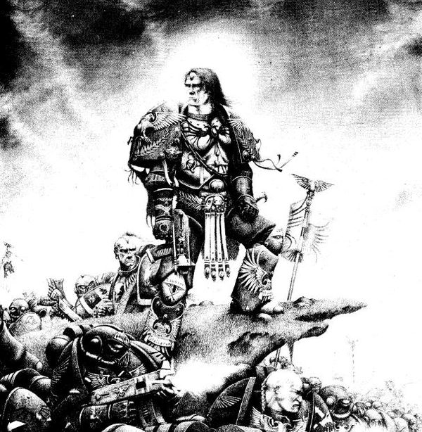

# 1259 帝皇爆矢枪 Emperor's Bolter

精校状态：中文行文已逐段精校，部分术语仍为暂定

分类：武器 / 远程武器

原文来源：https://www.bilibili.com/opus/1084131964128067584

原作者：帝国神选罐头

原文时间：2025年06月30日 12:25

[返回分类目录](目录.md) · [全书目录](../../目录.md)

<!-- A1259-B0001 -->
**英文原文**

The Emperor's Bolter was a as-of-yet unnamed Boltgun which was a personal weapon of the Emperor. One of the very first Boltguns, it was a progenitor all for its kind. The weapon was black and bronze and was not a relic of the Dark Age of Technology but rather one of the Emperor's own inventions.

<!-- /A1259-B0001 -->

<!-- A1259-B0002 -->

原译文

帝皇爆矢枪是一个尚未命名的爆矢枪，是帝皇的私人武器。作为最早的爆矢枪之一，它是同类造物的先驱。这种武器是黑色和青铜色的，不是黑暗技术时代的遗物，而是帝皇自己的发明之一。

**校订译文**

帝皇的这支私人爆矢枪至今尚无已知名称。它是最早的爆矢枪之一，也是同类武器的先驱。枪身为黑色与青铜色，出自帝皇本人的发明，并非黑暗科技时代的遗物。

<!-- /A1259-B0002 -->

<!-- A1259-B0003 图片 -->

<!-- A1259-B0004 -->

原译文

The Emperor's Bolter 帝皇爆矢枪

**校订译文**

The Emperor's Bolter 帝皇爆矢枪

<!-- /A1259-B0004 -->

<!-- A1259-B0005 -->
**英文原文**

What has since become of the weapon is currently unknown.

<!-- /A1259-B0005 -->

<!-- A1259-B0006 -->

原译文

目前尚不清楚该武器的去向。

**校订译文**

目前尚不清楚该武器的去向。

<!-- /A1259-B0006 -->

本篇核心术语与暂定项

以下列出本篇出现的英文原形及核心术语表用词。同形词可能指不同对象，具体词义以本篇正文和校注为准；单复数、别名和仅见于图注的名称可能尚未列入。完整候选见[术语表](../../术语表/双语术语候选.csv)。

| 英文 | 采用中文 | 状态 |
| --- | --- | --- |
| Boltgun | 爆矢枪 | 官方已核对 |
| Dark Age of Technology | 黑暗科技时代 | 暂定 |
| Emperor | 帝皇 | 官方已核对 |
| The Weapon | 武器 | 暂定·官方待核 |
| The Dark | 《黑暗》 | 暂定·官方待核 |
| Bolter | 爆矢枪 | 暂定·官方待核 |
| Emperor's Bolter | 帝皇爆矢枪 | 暂定·官方待核 |

