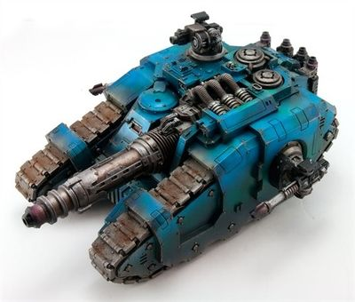

# 1261 中子激光投射炮 Neutron Laser Projector

精校状态：中文行文已逐段精校，部分术语仍为暂定

分类：武器 / 远程武器

原文来源：https://www.bilibili.com/opus/1011763826728632322

原作者：帝国神选罐头

原文时间：2024年12月17日 12:00

[返回分类目录](目录.md) · [全书目录](../../目录.md)

<!-- A1261-B0001 -->
**英文原文**

The Neutron Laser Projector is a powerful and rare weapon used by the Imperium. Mounted on Valdor Tank Hunters, Sicaran Venators, Sabre Strike Tanks, and Cerberus Heavy Tank Destroyers. It is a relic of the Dark Age of Technology. Despite the name, it is not a laser - it shoots neutrons at the target, not photons.

<!-- /A1261-B0001 -->

<!-- A1261-B0002 -->

原译文

中子激光投射器是帝国使用的一种强大而稀有的武器。安装在瓦尔多坦克猎手、西卡然猎手、军刀突击坦克和毁灭者型刻耳柏洛斯重型坦克上。它是黑暗技术时代的遗物。尽管有这个名字，但它不是激光——它向目标发射中子，而不是光子。

**校订译文**

中子激光投射炮是帝国使用的一种强大而罕见的武器，可安装在瓦尔多反坦克车、西卡然猎手、军刀突击坦克和刻耳柏洛斯重型反坦克车上。它是黑暗科技时代的遗物，虽然名称带有“激光”，实际向目标发射的却是中子，而非光子。

<!-- /A1261-B0002 -->

<!-- A1261-B0003 图片 -->

<!-- A1261-B0004 -->

原译文

Sicaran Venator with a Neutron Laser Projector 装备中子激光投射器的西卡然猎手

**校订译文**

Sicaran Venator with a Neutron Laser Projector 装备中子激光投射炮的西卡然猎手

<!-- /A1261-B0004 -->

<!-- A1261-B0005 -->
## Overview 概述

<!-- /A1261-B0005 -->

<!-- A1261-B0006 -->
**英文原文**

These little-understood and highly unstable weapons emit powerful blasts that outmatch any other Imperial weapon of its size. The projector fires a neutron beam capable of destroying even the densest material by explosive matter disruption, smashing apart the target's molecular structure and creating a massive electro-magnetic shock-pulse which can disable electronic systems while the penetrating radiation disrupts any biological matter, though this effect works only against vehicles which lack the thick shielding and protective mass of Super-Heavy Tanks. While this makes the weapon perfect for tank-hunting, the neutron beam's unique nature means that if it fails to transfer its energy discharge entirely to the target vehicle, a dangerous feedback loop can cause damage to the weapon itself. The neutronic-coil arc-reactor which powers the weapon is also inherently unstable and, without the necessary reactor shielding, can be hazardous to operate.

<!-- /A1261-B0006 -->

<!-- A1261-B0007 -->

原译文

这些鲜为人知且高度不稳定的武器会发射出比任何其他帝国武器都强大的爆炸。投射器发射的中子束能够通过爆炸性物质破坏甚至摧毁最致密的材料，粉碎目标的分子结构，并产生巨大的电磁冲击脉冲，在穿透性辐射破坏任何生物物质的同时使电子系统失效，尽管这种效果仅适用于缺乏超重型坦克厚重屏蔽和保护性物质的车辆。虽然这使得该武器非常适合狩猎坦克，但中子束的独特性质意味着，如果它不能将其能量释放完全转移到目标车辆上，危险的反馈回路可能会对武器本身造成损害。为武器提供动力的中子线圈电弧反应堆本身也不稳定，如果没有必要的反应堆屏蔽，操作起来可能会很危险。

**校订译文**

这种武器的原理尚未被充分理解，而且极不稳定，却能释放出威力超过帝国其他同等尺寸武器的能量冲击。它射出的中子束会使物质发生爆炸性崩解，击碎目标的分子结构，连最致密的材料也能摧毁。与此同时，强大的电磁冲击脉冲会令电子系统失效，穿透性辐射则破坏生物组织；不过，这些效应只对缺乏超重型坦克那种厚重屏蔽和大量防护材料的载具有效。它因此十分适合反坦克作战，但中子束若未能将全部能量传递给目标，便可能形成危险的反馈回路，损伤武器自身。供能的中子线圈电弧反应堆本身也不稳定，缺少必要的反应堆屏蔽时，操作会很危险。

**校注：** 原文比较范围是同等尺寸的帝国武器，原译遗漏此限制；关于辐射和反馈机制的描述保留为设定，不扩展解释。

<!-- /A1261-B0007 -->

<!-- A1261-B0008 -->
**英文原文**

In times of the Great Crusade and Horus Heresy this weapon was also installed on Sicaran Venators tanks and Sabre Tank Hunter though even then its systems and principles were barely understood by Tech-adepts.

<!-- /A1261-B0008 -->

<!-- A1261-B0009 -->

原译文

在大远征和荷鲁斯叛乱时期，这种武器也安装在西卡然猎手坦克和军刀坦克猎手上，尽管即使在那时，技术专家也几乎不了解它的系统和原理。

**校订译文**

大远征和荷鲁斯之乱时期，西卡然猎手坦克与军刀反坦克车也曾安装这种武器；即使在当时，技术专家对其系统和原理也知之甚少。

<!-- /A1261-B0009 -->

<!-- A1261-B0010 -->
## Neutron Blaster 中子爆破炮

<!-- /A1261-B0010 -->

<!-- A1261-B0011 -->
**英文原文**

The Neutron Blaster was a variant of the larger Laser Projector mounted on Sabre Strike Tanks. Constructed in the same manner as the larger neutron cannon employed by the Sicaran Venator, the intense radiation emitted by the capacitors and charge packs of the cannon is so deleterious that it will eventually degrade the Sabre's own control systems.

<!-- /A1261-B0011 -->

<!-- A1261-B0012 -->

原译文

中子爆破炮是安装在军刀突击坦克上的较大激光投射器的变体。其构造方式与西卡然猎手使用的更大的中子炮相同，大炮的电容器和能量包发出的强烈辐射非常有害，最终将会削弱军刀自己的控制系统。

**校订译文**

中子爆破炮是大型中子激光投射炮的衍生型号，安装于军刀突击坦克。它的构造原理与西卡然猎手使用的较大型中子炮相同，但电容器和能源包释放的强烈辐射极其有害，最终甚至会损坏军刀自身的控制系统。

<!-- /A1261-B0012 -->

本篇核心术语与暂定项

以下列出本篇出现的英文原形及核心术语表用词。同形词可能指不同对象，具体词义以本篇正文和校注为准；单复数、别名和仅见于图注的名称可能尚未列入。完整候选见[术语表](../../术语表/双语术语候选.csv)。

| 英文 | 采用中文 | 状态 |
| --- | --- | --- |
| Horus Heresy | 荷鲁斯之乱 | 官方已核对 |
| Imperium | 帝国 | 暂定·简称 |
| Dark Age of Technology | 黑暗科技时代 | 暂定 |
| Great Crusade | 大远征 | 暂定·官方待核 |
| Horus | 荷鲁斯 | 暂定·官方待核 |
| Tech | 技术语 | 暂定·官方待核 |
| Destroyers | 毁灭者 | 暂定·官方待核 |
| Powers | 能天使 | 暂定·官方待核 |
| The Weapon | 武器 | 暂定·官方待核 |
| The Dark | 《黑暗》 | 暂定·官方待核 |
| Neutron Laser Projector | 中子激光投射炮 | 暂定·官方待核 |
| Neutron Blaster | 中子爆破炮 | 暂定·官方待核 |
| Sicaran Venator | 西卡然猎手 | 暂定·官方待核 |

