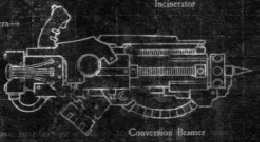
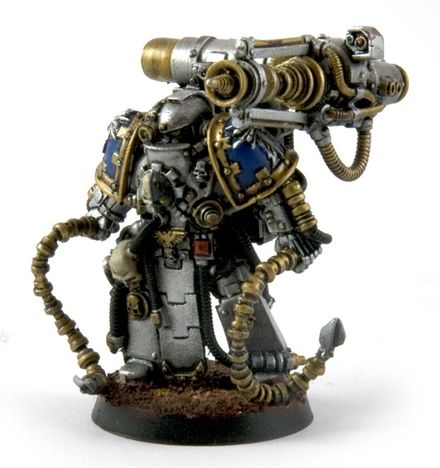

# 1262 转化光束投射炮 Conversion Beam Projector

精校状态：中文行文已逐段精校，部分术语仍为暂定

分类：武器 / 远程武器

原文来源：https://www.bilibili.com/opus/1003608340958281734

原作者：帝国神选罐头

原文时间：2024年11月25日 12:32

[返回分类目录](目录.md) · [全书目录](../../目录.md)

原篇名：转换光束投射炮 Conversion Beam Projector

<!-- A1262-B0001 -->
**英文原文**

A conversion beam projector, often called a "conversion beamer" or simply a "beamer", is a heavy energy weapon.

<!-- /A1262-B0001 -->

<!-- A1262-B0002 -->

原译文

转换光束投射器，通常称为“转换光束枪”或简称为“光束枪”，是一种重型能量武器。

**校订译文**

转化光束投射炮是一种重型能量武器，常简称转化光束炮或光束炮。

**校注：** Conversion Beamer沿251—297篇转化光束炮统一；本篇原转换光束枪、转换光束投射器等异译保留对照。

<!-- /A1262-B0002 -->

<!-- A1262-B0003 -->
## Overview 概述

<!-- /A1262-B0003 -->

<!-- A1262-B0004 -->
**英文原文**

The conversion beamer fires a high intensity energy beam which transforms matter into pure energy. A heavily armoured target or dense material will be rent apart as its matter explodes. The denser the material of the target the more matter is hit and hence the more energy is produced, making conversion beamers particularly good against heavily armoured troops, vehicles, and buildings. The intensity of the beam typically increases as it extends further from the weapon due to converting any surrounding atmosphere along the way, becoming increasingly dangerous until it reaches an inflection point where the beam is so intense that the energy has to be released in a violent explosion.

<!-- /A1262-B0004 -->

<!-- A1262-B0005 -->

原译文

转换光束枪发射高强度能量束，将物质转化为纯能量。当物质爆炸时，重装甲目标或致密材料将被撕裂。目标材料的密度越大，击中的物质就越多，因此产生的能量也就越多，这使得转换光束枪特别适用于重型装甲部队、车辆和建筑物。由于沿途转换了周围的任何大气，光束的强度通常会随着它从武器延伸得更远而增加，变得越来越危险，直到它达到一个转折点，在那里光束的强度如此之强，以至于必须在剧烈爆炸中释放能量。

**校订译文**

转化光束炮发射高强度能量束，将物质转变为纯能量。重装甲或致密材料会因自身物质发生爆炸而被撕裂。目标越致密，被光束击中的物质越多，释放的能量也越大，因此这类武器特别适合打击重装部队、载具和建筑。光束还会转化沿途的周围大气，通常离发射端越远，强度越高；当能量积聚到临界程度，便会以猛烈爆炸的方式释放。

<!-- /A1262-B0005 -->

<!-- A1262-B0006 图片 -->

<!-- A1262-B0007 -->

原译文

Conversion Beamer 转换光束枪

**校订译文**

Conversion Beamer 转化光束炮

<!-- /A1262-B0007 -->

<!-- A1262-B0008 -->
**英文原文**

Smaller versions were once known to be occasionally carried by Terminator Marines for cutting through bulkheads when exploring Space Hulks, but this practice is no longer prevalent.

<!-- /A1262-B0008 -->

<!-- A1262-B0009 -->

原译文

曾经有人知道，星际战士终结者在探索太空废船时偶尔会携带较小的版本来切割舱壁，但这种做法已不再普遍。

**校订译文**

终结者星际战士曾偶尔携带小型转化光束炮，在探索太空废船时切开舱壁，但如今已很少这样做。

<!-- /A1262-B0009 -->

<!-- A1262-B0010 -->
**英文原文**

An unfortunate downside to conversion beamers is that they are incredibly large and heavy (as they require a number of massive capacitors that line the projection tube) and must remain absolutely motionless when operated, or the intensity of the beam will be negated, rendering the shot useless. Because of this, conversion beamers are usually fitted to self-propelled, wheeled carriages or anti-gravity platforms (the operators will often remain at a safe distance using some form of remote control).Users of the smaller hand-held versions are forced to wear boots with special claws to provide more stable purchase. Another problem with the conversion beamer is the length of time they need build up the energy that is released in the beam. Although it is only a second or so, it is easily long enough for potential targets to have moved or escape the field of fire.

<!-- /A1262-B0010 -->

<!-- A1262-B0011 -->

原译文

转换光束枪的一个不幸的缺点是，它们非常大和重（因为它们需要许多巨大的电容器排列在发射管上），并且在操作时必须保持绝对静止，否则光束的强度将被抵消，使发射无效。因此，转换光束枪通常安装在自行式轮式运输车或反重力平台上（操作员通常会使用某种形式的远程控制保持安全距离）。较小的手持版本的使用者被迫穿上带有特殊爪子的靴子，以提供更稳定的抓牢。转换光束枪的另一个问题是它们需要时间来积累光束中释放的能量。虽然只有一秒钟左右，但很容易让可能目标移动或逃离开火区域。

**校订译文**

转化光束炮的一大缺点是极其庞大、沉重：投射管周围需要排列许多大型电容器。操作时，武器还必须保持绝对静止，否则光束强度便会消散，使射击失效。因此，它通常安装在自行轮式炮架或反重力平台上，由操作人员在安全距离外遥控。小型手持版本的使用者则必须穿上带有特殊抓地爪的靴子，以保持稳固。另一个问题是蓄能时间：虽然只需约一秒，仍足以让目标移动或逃离射界。

<!-- /A1262-B0011 -->

<!-- A1262-B0012 图片 -->

<!-- A1262-B0013 -->

原译文

Space Marine Master of the Forge with conversion beamer 星际战士铸造大师装备转换光束

**校订译文**

Space Marine Master of the Forge with conversion beamer 装备转化光束炮的星际战士铸造大师

<!-- /A1262-B0013 -->

<!-- A1262-B0014 -->
## Variants 变体

<!-- /A1262-B0014 -->

<!-- A1262-B0015 -->
**英文原文**

Heavy Conversion Beamer - A more powerful version of the "regular" beamer - is an ancient relic-weapon of incredible and poorly-understood power. It is sometimes found on Contemptor Pattern Dreadnoughts, Decimator Daemon Engines and Deimos pattern Predators Executioner.

<!-- /A1262-B0015 -->

<!-- A1262-B0016 -->

原译文

重型转换光束 - 是“常规”光束枪的一种更强大的版本，是一种古老的遗物武器，具有令人难以置信的力量，但人们对此知之甚少。它有时出现在蔑视者无畏、屠杀者恶魔引擎和火卫二(迪莫斯)型处刑掠食者上。

**校订译文**

重型转化光束炮——普通转化光束炮的加强版本，是威力惊人、原理却知之甚少的古老遗物武器。有时可见于蔑视者型无畏机甲、屠戮者恶魔引擎，以及迪莫斯型处刑者掠食者战车。

<!-- /A1262-B0016 -->

<!-- A1262-B0017 -->
**英文原文**

Conversion Beam Cannon - Among the largest known surviving examples of the rare and delicate conversion beam technology, Conversion Beam Cannons are mounted on Knight Asterius vehicles.

<!-- /A1262-B0017 -->

<!-- A1262-B0018 -->

原译文

转换光束炮 - 在罕见而精致的转换光束技术中，转换光束炮是已知最大的幸存实例之一，安装在阿卡斯托斯骑士机甲上。

**校订译文**

转化光束加农炮——罕见而精密的转化光束技术中，现存体积最大的实例之一，安装于牛头怪型骑士。

**校注：** Knight Asterius对应已核官方完整单位“牛头怪型阿卡斯托斯骑士”；原译只写阿卡斯托斯会漏掉具体型号。

<!-- /A1262-B0018 -->

<!-- A1262-B0019 -->
**英文原文**

Conversion Beam Dissolutor - A massive Titan-class conversion beam weapon mounted on the arm of a Warhound Titan or the carapace of a Reaver Titan.

<!-- /A1262-B0019 -->

<!-- A1262-B0020 -->

原译文

转换光束分解器 - 一种巨大的泰坦级转换光束武器，安装在战犬泰坦的手臂上或掠夺者泰坦的外壳上。

**校订译文**

转化光束分解器——巨大的泰坦级转化光束武器，可安装在战犬级泰坦臂部，或掠夺者级泰坦的背甲上。

<!-- /A1262-B0020 -->

<!-- A1262-B0021 -->
**英文原文**

Conversion Beam Dissipator - A massive Titan-class conversion beam weapon mounted on the carapace of the Dire Wolf Titan.

<!-- /A1262-B0021 -->

<!-- A1262-B0022 -->

原译文

转换光束耗散器 - 一种巨大的泰坦级转换光束武器，安装在恐狼泰坦的外壳上。

**校订译文**

转化光束耗散器——巨大的泰坦级转化光束武器，安装于恐狼泰坦背甲。

<!-- /A1262-B0022 -->

<!-- A1262-B0023 -->
**英文原文**

Extirpator Cannon - A massive Titan-class conversion beam weapon mounted on the arm of a Warlord Titan and is thus far the largest known example of Conversion Beam technology.

<!-- /A1262-B0023 -->

<!-- A1262-B0024 -->

原译文

消除炮 - 一种巨大的泰坦级转换光束武器，安装在军阀泰坦的手臂上，是迄今为止已知的最大的转换光束技术示例。

**校订译文**

消除炮——安装于战将级泰坦臂部的巨型转化光束武器，是底稿所述已知最大的此类武器。

<!-- /A1262-B0024 -->

<!-- A1262-B0025 -->
**英文原文**

SP Conversion Beamer - Conversion Beamer used by the Leagues of Votann.

<!-- /A1262-B0025 -->

<!-- A1262-B0026 -->

原译文

聚能转换光束 - 沃坦联盟使用的转换光束。

**校订译文**

SP型转化光束炮——沃坦联盟使用的转化光束炮。

**校注：** SP为原文型号标记，英文未在此解释缩写，故保留字母，不沿原译擅改成聚能。

<!-- /A1262-B0026 -->

<!-- A1262-B0027 -->
**英文原文**

SP Heavy Conversion Beamer - Larger version of the SP Conversion Beamer used on vehicles of the Leagues of Votann, such as the Hekaton Land Fortress.

<!-- /A1262-B0027 -->

<!-- A1262-B0028 -->

原译文

聚能重型转换光束 - 聚能转换光束的较大版本，用于沃坦联盟的车辆，如赫卡顿陆行要塞。

**校订译文**

SP型重型转化光束炮——SP型转化光束炮的更大型版本，装备于赫卡顿陆行要塞等沃坦联盟载具。

<!-- /A1262-B0028 -->

本篇核心术语与暂定项

以下列出本篇出现的英文原形及核心术语表用词。同形词可能指不同对象，具体词义以本篇正文和校注为准；单复数、别名和仅见于图注的名称可能尚未列入。完整候选见[术语表](../../术语表/双语术语候选.csv)。

| 英文 | 采用中文 | 状态 |
| --- | --- | --- |
| Leagues of Votann | 沃坦联盟 | 官方已核对 |
| Terminator | 终结者 | 官方已核对 |
| Deimos | 迪莫斯 | 暂定·官方待核 |
| Titan | 泰坦 | 暂定·官方待核 |
| Conversion Beamer | 转化光束炮 | 暂定·官方待核 |
| Ancient | 旗手 | 官方已核对 |
| Predators | 掠食者 | 暂定·官方待核 |
| Hekaton | 赫卡顿号 | 暂定·官方待核 |
| Reaver Titan | 掠夺者级泰坦 | 官方已核对 |
| The Weapon | 武器 | 暂定·官方待核 |
| Warhound Titan | 战犬级泰坦 | 官方已核对 |
| Warlord Titan | 战将级泰坦 | 官方已核对 |
| Conversion Beam Projector | 转化光束投射炮 | 暂定·官方待核 |
| Heavy Conversion Beamer | 重型转化光束炮 | 暂定·官方待核 |
| Conversion Beam Cannon | 转化光束加农炮 | 暂定·官方待核 |
| Conversion Beam Dissolutor | 转化光束分解器 | 暂定·官方待核 |
| Conversion Beam Dissipator | 转化光束耗散器 | 暂定·官方待核 |
| Extirpator Cannon | 消除炮 | 暂定·官方待核 |
| SP Conversion Beamer | SP型转化光束炮 | 暂定·官方待核 |
| SP Heavy Conversion Beamer | SP型重型转化光束炮 | 暂定·官方待核 |
| Hekaton Land Fortress | 赫卡顿陆行要塞 | 官方已核对 |

