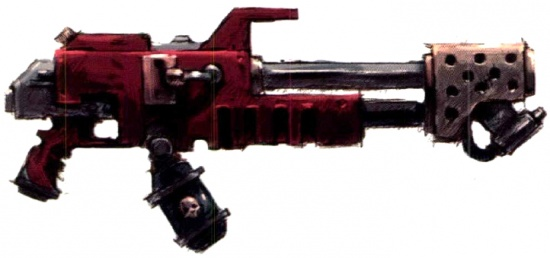
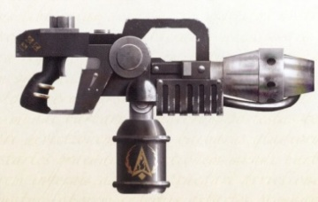
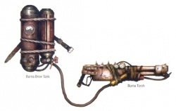
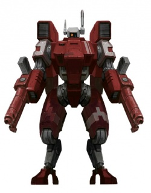

# 1265 火焰喷射器 Flamer

精校状态：中文行文已逐段精校，部分术语仍为暂定

分类：武器 / 远程武器

原文来源：https://www.bilibili.com/opus/1007687035177140227

原作者：帝国神选罐头

原文时间：编辑于 2025年02月06日 19:12

[返回分类目录](目录.md) · [全书目录](../../目录.md)

原篇名：火焰枪 Flamer

<!-- A1265-B0001 -->
**英文原文**

Flamers (or flame-guns) are a basic type of flame weapon used by several races and armies.

<!-- /A1265-B0001 -->

<!-- A1265-B0002 -->

原译文

火焰喷射器（或火焰枪）是几个种族和军队使用的一种基本类型的火焰武器。

**校订译文**

火焰喷射器，又称火焰枪，是多个种族和军队使用的一种基础火焰武器。

<!-- /A1265-B0002 -->

<!-- A1265-B0003 图片 -->

<!-- A1265-B0004 -->

原译文

Imperial Flamer 帝国火焰枪

**校订译文**

Imperial Flamer 帝国火焰喷射器

**校注：** Flamer作为武器时统一官方火焰喷射器；与奸奇火妖的同形名称区分。

<!-- /A1265-B0004 -->

<!-- A1265-B0005 -->
## Overview 概述

<!-- /A1265-B0005 -->

<!-- A1265-B0006 -->
**英文原文**

Flamers unleash a liquid incendiary superheated chemical, usually promethium, that bursts into flame as it leaves the weapon. They are valued for their ability to destroy many enemies at once, regardless of any protective cover. Both flamers and the more compact hand flamers are considered assault weapons due to their relatively short range. Imperial and Chaos Space Marine flamers fire a mix of highly volatile liquid chemicals which are ignited by a pilot light at the weapon's muzzle. The flaming chemical sticks to its target and continues burning of its own accord - those who are not killed instantly die horribly as the super-hot chemical continues to burn.

<!-- /A1265-B0006 -->

<!-- A1265-B0007 -->

原译文

火焰枪释放出一种燃烧性过热化学液体物质，通常是钷素，当它离开武器时会突然燃烧。它们因其一次摧毁许多敌人的能力而受到重视，无论是否有任何保护层。火焰枪和更紧凑的喷火手枪都被认为是突击武器，因为它们的射程相对较短。帝国和混沌星际战士的火焰喷射器发射了一种高挥发性液体化学物质的混合物，这些化学物质由武器枪口处的引燃灯点燃。燃烧的化学物质会附着在目标上，并继续自行燃烧——随着超高温化学物质的继续燃烧，那些没有被杀死的人会立即可怕地死亡。

**校订译文**

火焰喷射器喷出高温燃烧性液体，通常是钷素；这些物质离开武器时便被点燃。它能越过掩体的保护，一次杀伤大量敌人，因而广受重视。由于射程较短，火焰喷射器和更紧凑的火焰手枪都被归为突击武器。帝国和混沌星际战士使用的型号喷射高度挥发性的液态化学混合物，由枪口的引燃火焰点燃。燃料会黏附在目标上，持续自行燃烧；即使没有当场丧命，受害者也会在超高温燃料的灼烧下痛苦死去。

**校注：** 原译将“未被当场杀死，随后继续烧死”误写成另一种立即死亡，现恢复先后关系；cover仍专指掩体。

<!-- /A1265-B0007 -->

<!-- A1265-B0008 图片 -->

<!-- A1265-B0009 -->

原译文

Heresy-era Imperial Flamer 叛乱时期帝国火焰枪

**校订译文**

Heresy-era Imperial Flamer 荷鲁斯之乱时期的帝国火焰喷射器

<!-- /A1265-B0009 -->

<!-- A1265-B0010 -->
**英文原文**

Flamers are an invaluable tactical choice in conditions where spotting the enemy is difficult due to dense terrain (such as jungles), during urban fights and bunker assaults. Flamers are particularly effective in breaking the cycle of Ork infestation by destroying the spores exuded by the corpses.

<!-- /A1265-B0010 -->

<!-- A1265-B0011 -->

原译文

在城市战和掩体攻击中，由于地形茂密（如丛林）而难以发现敌人的情况下，火焰枪是一种宝贵的战术选择。火焰通过破坏尸体散发的孢子，在打破欧克侵扰的循环方面特别有效。

**校订译文**

在丛林等地形密集、难以发现敌人的环境中，以及城市战和碉堡突击中，火焰喷射器具有极高的战术价值。它还能焚毁欧克尸体释放的孢子，尤其适合遏止欧克不断滋生的循环。

<!-- /A1265-B0011 -->

<!-- A1265-B0012 -->
## Imperial Flamers 帝国火焰喷射器

<!-- /A1265-B0012 -->

<!-- A1265-B0013 -->
**英文原文**

More fanatic adherents of the Imperial Creed employ flamers against mutants and heretics as the weapon's flames are seen to cleanse sin and impurity from body and soul alike.

<!-- /A1265-B0013 -->

<!-- A1265-B0014 -->

原译文

更狂热的帝国信仰追随者使用火焰枪对抗变种人和异端，因为武器的火焰被视为从身体和灵魂中清除罪恶和杂质。

**校订译文**

帝国教义的狂热信徒会用火焰喷射器对付变种人和异端，因为他们相信火焰能够同时洗净肉体与灵魂的罪恶和污秽。

<!-- /A1265-B0014 -->

<!-- A1265-B0015 -->
**英文原文**

It is the preferred weapon of the more fervent worshipers of the Emperor such as the fanatical Red Redemptionists and the associated Fanatics of the House of Cawdor of Necromunda.

<!-- /A1265-B0015 -->

<!-- A1265-B0016 -->

原译文

它是更狂热的帝皇崇拜者的首选武器，如狂热的红色救赎者和与之相关的涅克罗蒙达考多家族的狂热分子。

**校订译文**

红色救赎者，以及与其相关的涅克罗蒙达考多家族狂信徒等极端帝皇崇拜者，都偏爱这种武器。

<!-- /A1265-B0016 -->

<!-- A1265-B0017 -->
**英文原文**

Among the Adepta Sororitas, as a purifying weapon, the flamer has a prominent function and for a Sister to be entrusted with one is a great honour.

<!-- /A1265-B0017 -->

<!-- A1265-B0018 -->

原译文

在修女会中，作为一种净化武器，火焰枪具有突出的作用，将火焰枪托付给修女是一种极大的荣誉。

**校订译文**

修女会极为重视火焰喷射器的净化作用；一名修女获准携带它，是莫大的荣誉。

<!-- /A1265-B0018 -->

<!-- A1265-B0019 -->
**英文原文**

The Salamanders Chapter make wide use of flamers and melta weapons due to their preference for close-ranged combat.

<!-- /A1265-B0019 -->

<!-- A1265-B0020 -->

原译文

火蜥蜴战团广泛使用火焰枪和热熔武器，因为他们更喜欢近距离战斗。

**校订译文**

火蜥蜴战团偏爱近距离交战，因此广泛采用火焰喷射器和热熔武器。

<!-- /A1265-B0020 -->

<!-- A1265-B0021 -->
**英文原文**

The Catachan regiments of the Imperial Guard are often deployed to areas of heavy jungle, where enemies can make as much use of the ever present cover as the Catachans themselves. Accordingly flamers and heavy flamers are especially valued by the Catachans for their ability to rob the enemy of the benefit of the terrain.

<!-- /A1265-B0021 -->

<!-- A1265-B0022 -->

原译文

帝国卫队的卡塔昌兵团经常被部署到茂密的丛林地区，在那里，敌人可以像卡塔昌士兵一样利用无处不在的掩护。因此，火焰喷射器和重型火焰喷射器因其能够剥夺敌人地形优势的能力而特别受到卡塔昌士兵的重视。

**校订译文**

帝国卫队的卡塔昌诸团常被派往茂密丛林，敌人也能像他们一样利用随处可见的掩体。因此，能够剥夺敌人地形优势的火焰喷射器和重型火焰喷射器，尤其受到卡塔昌士兵重视。

<!-- /A1265-B0022 -->

<!-- A1265-B0023 -->
**英文原文**

Troops of the Adeptus Mechanicus use a more advanced version of the flamer known as the Cognis Flamer. This weapon is equipped with a Machine Spirit that continue to fire even when its wielder is distracted.

<!-- /A1265-B0023 -->

<!-- A1265-B0024 -->

原译文

机械神教的部队使用一种更为先进的火焰喷射器，称为认知火焰喷射器。这种武器具有一个机魂，即使其使用者分心时也能继续射击。

**校订译文**

机械修会部队使用更先进的智能火焰喷射器。其机魂即使在操作者分心时，也能继续控制武器开火。

**校注：** Cognis与1234智能重型伐木枪统一为智能，不混用认知／智觉。

<!-- /A1265-B0024 -->

<!-- A1265-B0025 -->
## Chaos 混沌

<!-- /A1265-B0025 -->

<!-- A1265-B0026 -->

原译文

Baleflamer 灾焰枪

**校订译文**

Baleflamer 灾焰枪

<!-- /A1265-B0026 -->

<!-- A1265-B0027 -->

原译文

Warpflame Weapon 魔焰武器

**校订译文**

Warpflame Weapon 魔焰武器

<!-- /A1265-B0027 -->

<!-- A1265-B0028 -->
## Orks 欧克蛮人

原题：Orks 欧克

<!-- /A1265-B0028 -->

<!-- A1265-B0029 图片 -->

<!-- A1265-B0030 -->

原译文

Ork Burna 欧克烧烤枪

**校订译文**

Ork Burna 欧克烧烤枪

<!-- /A1265-B0030 -->

<!-- A1265-B0031 -->
## Eldar 灵族

<!-- /A1265-B0031 -->

<!-- A1265-B0032 -->
**英文原文**

Among the Eldar, flamers are used by Fire Dragon Exarchs, Storm Guardians and Wraithlords.

<!-- /A1265-B0032 -->

<!-- A1265-B0033 -->

原译文

在灵族中，火龙主教、风暴守护者和幽冥领主使用火焰枪。

**校订译文**

在灵族中，火龙主教、风暴守护者和幽冥领主使用火焰喷射器。

**校注：** Flamer作为武器时统一官方火焰喷射器；与奸奇火妖的同形名称区分。

<!-- /A1265-B0033 -->

<!-- A1265-B0034 图片 -->

<!-- A1265-B0035 -->

原译文

Eldar Storm Guardian wielding a flamer 灵族风暴守护者装备火焰枪

**校订译文**

Eldar Storm Guardian wielding a flamer 灵族风暴守护者装备火焰喷射器

**校注：** Flamer作为武器时统一官方火焰喷射器；与奸奇火妖的同形名称区分。

<!-- /A1265-B0035 -->

<!-- A1265-B0036 -->
## Tau 钛

<!-- /A1265-B0036 -->

<!-- A1265-B0037 -->
**英文原文**

Tau Crisis Battlesuits may use flamers as well as large Phased Plasma-Flamers.

<!-- /A1265-B0037 -->

<!-- A1265-B0038 -->

原译文

钛危机战斗服可以使用火焰枪以及大型相位等离子火焰枪。

**校订译文**

钛族的危机战斗服既可使用火焰喷射器，也可装备大型相位等离子火焰喷射器。

<!-- /A1265-B0038 -->

<!-- A1265-B0039 图片 -->

<!-- A1265-B0040 -->

原译文

Tau Battlesuit wielding twin Flamers 装备双火焰枪的钛战斗服

**校订译文**

Tau Battlesuit wielding twin Flamers 装备两具火焰喷射器的钛族战斗服

<!-- /A1265-B0040 -->

<!-- A1265-B0041 -->
## Tyranids 泰伦虫族

原题：Tyranids 泰伦

<!-- /A1265-B0041 -->

<!-- A1265-B0042 -->

原译文

Flamespurt 喷射火焰

**校订译文**

Flamespurt 喷焰器

<!-- /A1265-B0042 -->

<!-- A1265-B0043 -->
## Necrons 太空死灵

原题：Necrons 死灵

<!-- /A1265-B0043 -->

<!-- A1265-B0044 -->

原译文

Gauntlet of Fire 烈焰臂铠

**校订译文**

Gauntlet of Fire 烈焰臂铠

<!-- /A1265-B0044 -->

<!-- A1265-B0045 -->

原译文

Gauntlet of the Conflagrator 纵火者臂铠

**校订译文**

Gauntlet of the Conflagrator 纵火者臂铠

<!-- /A1265-B0045 -->

本篇核心术语与暂定项

以下列出本篇出现的英文原形及核心术语表用词。同形词可能指不同对象，具体词义以本篇正文和校注为准；单复数、别名和仅见于图注的名称可能尚未列入。完整候选见[术语表](../../术语表/双语术语候选.csv)。

| 英文 | 采用中文 | 状态 |
| --- | --- | --- |
| Adepta Sororitas | 修女会 | 官方已核对 |
| Adeptus Mechanicus | 机械修会 | 官方已核对 |
| Imperial Guard | 帝国卫队 | 暂定·语境区分 |
| Eldar | 灵族 | 暂定·语境区分 |
| Emperor | 帝皇 | 官方已核对 |
| Necromunda | 涅克罗蒙达 | 暂定·官方待核 |
| Imperial Creed | 帝国教义 | 暂定·官方待核 |
| Salamanders | 火蜥蜴 | 暂定·官方待核 |
| Catachan | 卡塔昌 | 暂定·官方待核 |
| Space Marine | 星际战士 | 暂定·官方待核 |
| Chapter | 战团 | 暂定·官方待核 |
| Flamers | 火妖（奸奇单位）／火焰喷射器（武器） | 语境定译·对应官译已核 |
| The Weapon | 武器 | 暂定·官方待核 |
| Promethium | 钷素 | 暂定·官方待核 |
| Melta Weapons | 热熔武器 | 暂定·官方待核 |
| Flame Weapon | 火焰武器 | 暂定·官方待核 |
| Flamer | 火焰喷射器（武器）／火妖（奸奇单位） | 语境定译·对应官译已核 |
| Cognis Flamer | 智能火焰喷射器 | 暂定·官方待核 |

