# 1266 帝国火焰喷射器 Imperial Flamer

精校状态：中文行文已逐段精校，部分术语仍为暂定

分类：武器 / 远程武器

原文来源：https://www.bilibili.com/opus/1000618094569193493

原作者：帝国神选罐头

原文时间：2024年11月17日 11:09

[返回分类目录](目录.md) · [全书目录](../../目录.md)

原篇名：帝国火焰枪 Imperial Flamer

<!-- A1266-B0001 -->
**英文原文**

Imperial Flamers, also known as Burners, are Flamethrowers used by the various forces of the Imperium.

<!-- /A1266-B0001 -->

<!-- A1266-B0002 -->

原译文

帝国火焰喷射器，也称为燃烧器，是帝国各种武备使用的火焰喷射器。

**校订译文**

帝国火焰喷射器又称燃烧器，是帝国各支武装力量使用的火焰喷射武器。

<!-- /A1266-B0002 -->

<!-- A1266-B0003 图片 -->

<!-- A1266-B0004 -->

原译文

Catachan Jungle Fighter 卡塔昌丛林战士

**校订译文**

Catachan Jungle Fighter 卡塔昌丛林斗士

<!-- /A1266-B0004 -->

<!-- A1266-B0005 图片 -->

<!-- A1266-B0006 -->

原译文

Valhallan Ice Warrior 瓦尔哈拉冰雪战士

**校订译文**

Valhallan Ice Warrior 瓦尔哈拉冰雪战士

<!-- /A1266-B0006 -->

<!-- A1266-B0007 图片 -->
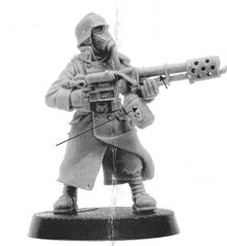

<!-- A1266-B0008 -->

原译文

Death Korps of Krieg Guardsman 克里格死亡军团近卫兵

**校订译文**

Death Korps of Krieg Guardsman 克里格死亡军团士兵

<!-- /A1266-B0008 -->

<!-- A1266-B0009 图片 -->

<!-- A1266-B0010 -->

原译文

Mordian Iron Guardsman 莫迪安铁卫

**校订译文**

Mordian Iron Guardsman 莫迪安铁卫

<!-- /A1266-B0010 -->

<!-- A1266-B0011 图片 -->

<!-- A1266-B0012 -->

原译文

Vostroyan Firstborn 沃斯托尼亚长子团

**校订译文**

Vostroyan Firstborn 沃斯特洛亚长子团士兵

<!-- /A1266-B0012 -->

<!-- A1266-B0013 -->
## Overview 概述

<!-- /A1266-B0013 -->

<!-- A1266-B0014 -->
**英文原文**

Flamers project a highly volatile liquid chemical (often Promethium) which ignites on contact with the air, throwing out a great blech of flame. Flamers have a short range, but is very effective against infantry.

<!-- /A1266-B0014 -->

<!-- A1266-B0015 -->

原译文

火焰喷射器喷射出一种高挥发性的液体化学物质（通常是钷），与空气接触后点燃，喷出巨大的火焰。火焰枪射程较短，但对步兵非常有效。

**校订译文**

火焰喷射器射出高度挥发性的液态化学燃料，通常是钷素，接触空气后便引燃，形成大片烈焰。它的射程虽短，对步兵却十分有效。

**校注：** 本篇称燃料遇空气自燃，1265则称由枪口引燃火焰点燃；按各篇底稿保留机制差异。

<!-- /A1266-B0015 -->

<!-- A1266-B0016 图片 -->
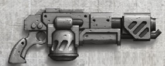

<!-- A1266-B0017 -->

原译文

House Orlock Flamer 欧洛克家族喷火器

**校订译文**

House Orlock Flamer 欧洛克家族喷火器

<!-- /A1266-B0017 -->

<!-- A1266-B0018 -->
**英文原文**

Flamers are used by a wide array of Imperial Forces, most notably the Imperial Guard, Space Marines, Mechanicum, Inquisition and Sisters of Battle.

<!-- /A1266-B0018 -->

<!-- A1266-B0019 -->

原译文

火焰喷射器被各种各样的帝国军队使用，最著名的是帝国卫队、星际战士、机械教、审判庭和战斗修女。

**校订译文**

火焰喷射器被各种各样的帝国军队使用，最著名的是帝国卫队、星际战士、机械教、审判庭和战斗修女。

<!-- /A1266-B0019 -->

<!-- A1266-B0020 -->
## Standard Flamer Patterns 标准火焰喷射器型号

<!-- /A1266-B0020 -->

<!-- A1266-B0021 -->
**英文原文**

Mk.IIIa "Heretic" Pattern — A common pattern used by the Adeptus Astartes and Imperial Guard.

<!-- /A1266-B0021 -->

<!-- A1266-B0022 -->

原译文

Mk.IIIa“异端”型 — 阿斯塔特修会和帝国卫队常用的图案。

**校订译文**

Mk.IIIa“异端”型——阿斯塔特和帝国卫队常用的型号。

<!-- /A1266-B0022 -->

<!-- A1266-B0023 图片 -->
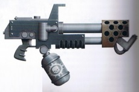

<!-- A1266-B0024 -->

原译文

Mk.IIIa Heretic Pattern Flamer Mk.IIIa“异端”型火焰喷射器

**校订译文**

Mk.IIIa Heretic Pattern Flamer Mk.IIIa“异端”型火焰喷射器

<!-- /A1266-B0024 -->

<!-- A1266-B0025 -->
**英文原文**

Mk.IV Ultima Pattern — Used by the Adeptus Astartes Including the Raven Guard.

<!-- /A1266-B0025 -->

<!-- A1266-B0026 -->

原译文

Mk.IV极限型 — 包括暗鸦守卫在内的阿斯塔特修会使用。

**校订译文**

Mk.IV极限型 — 包括暗鸦守卫在内的阿斯塔特修会使用。

<!-- /A1266-B0026 -->

<!-- A1266-B0027 -->
**英文原文**

Mark VII "Salamander" Assault Flamer — A popular variant in the Calixis Sector, it uss a lighter fuel mixture at higher pressures, with inert propellant gas mixed in. The firing barrel has a large, thin nozzle, resulting in a wider but less powerful spray.

<!-- /A1266-B0027 -->

<!-- A1266-B0028 -->

原译文

Mark.VII“火蜥蜴”突击火焰枪 — 卡利西斯星区的一种流行变体，它是一种在高压下混合惰性推进剂气体的较轻燃料混合物。发射筒有一个大而薄的喷嘴，导致范围更宽但威力较小。

**校订译文**

Mk.VII“火蜥蜴”突击火焰喷射器——卡利西斯星区流行的改型，使用混入惰性推进气体的较轻燃料，在更高压力下喷射。枪管的大型扁薄喷嘴使火焰覆盖更宽，但威力较小。

<!-- /A1266-B0028 -->

<!-- A1266-B0029 -->
**英文原文**

Absolution Pattern — Used by the Adeptus Astartes including the Salamanders.

<!-- /A1266-B0029 -->

<!-- A1266-B0030 -->

原译文

赦免型 — 包括火蜥蜴在内的阿斯塔特修会使用。

**校订译文**

赦免型 — 包括火蜥蜴在内的阿斯塔特修会使用。

<!-- /A1266-B0030 -->

<!-- A1266-B0031 图片 -->
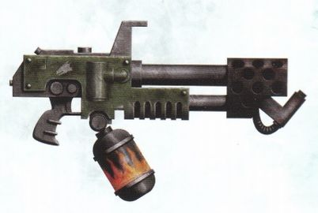

<!-- A1266-B0032 -->

原译文

Salamanders Absolution-Pattern Flamer 火蜥蜴赦免型喷火器

**校订译文**

Salamanders Absolution-Pattern Flamer 火蜥蜴赦免型喷火器

<!-- /A1266-B0032 -->

<!-- A1266-B0033 -->
**英文原文**

Accatran Pattern Mk Ic — Used by the Elysian Drop Troops

<!-- /A1266-B0033 -->

<!-- A1266-B0034 -->

原译文

阿卡特兰型Mk. Ic — 被艾丽西亚空降部队使用

**校订译文**

阿卡特兰型Mk. Ic — 被艾丽西亚空降部队使用

<!-- /A1266-B0034 -->

<!-- A1266-B0035 图片 -->
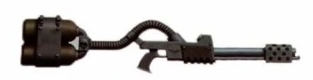

<!-- A1266-B0036 -->

原译文

Accatran Mk. Ic Pattern Flamer 阿卡特兰型Mk. Ic喷火器

**校订译文**

Accatran Mk. Ic Pattern Flamer 阿卡特兰型Mk. Ic喷火器

<!-- /A1266-B0036 -->

<!-- A1266-B0037 -->
**英文原文**

Anoxis Burst Flamer — Shoots a quick pulse of fire designed more to frighten and repel than seriously injure.

<!-- /A1266-B0037 -->

<!-- A1266-B0038 -->

原译文

阿诺西斯爆裂喷火器 — 发射快速的火焰脉冲，其目的更多是为了恐吓和击退，而不是造成严重伤害。

**校订译文**

阿诺西斯爆裂火焰喷射器——释放短促的火焰脉冲，主要用于恐吓、逼退目标，而非造成重伤。

<!-- /A1266-B0038 -->

<!-- A1266-B0039 图片 -->
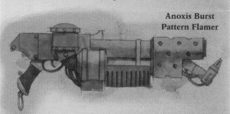

<!-- A1266-B0040 -->

原译文

Anoxis Burst Flamer 阿诺西斯爆裂喷火器

**校订译文**

Anoxis Burst Flamer 阿诺西斯爆裂火焰喷射器

<!-- /A1266-B0040 -->

<!-- A1266-B0041 -->
**英文原文**

Cognis Flamer — A more advanced version of Flamer used by the forces of the Mechanicum, most notably Skitarii and Kataphron Servitors. This weapon is equipped with a Machine Spirit that continue to fire even when its wielder is distracted.

<!-- /A1266-B0041 -->

<!-- A1266-B0042 -->

原译文

智觉喷火器 — 机械教部队使用的更先进的喷火器型号，最著名的是护教军和重型机仆。这种武器配备了机魂，即使使用者分心，它也会继续射击。

**校订译文**

智能火焰喷射器——机械教部队使用的先进型号，主要装备于护教军和卡塔弗隆机仆。其机魂即使在操作者分心时，也能继续控制武器开火。

**校注：** 此处原文Mechanicum沿机械教，Kataphron指机仆系列，不泛译为所有重型机仆。

<!-- /A1266-B0042 -->

<!-- A1266-B0043 图片 -->
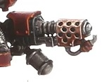

<!-- A1266-B0044 -->

原译文

Cognis Flamer 智觉喷火器

**校订译文**

Cognis Flamer 智能火焰喷射器

<!-- /A1266-B0044 -->

<!-- A1266-B0045 -->
**英文原文**

Coldfire Pattern — Used by House Van Saar on Necromunda.

<!-- /A1266-B0045 -->

<!-- A1266-B0046 -->

原译文

冷焰型 — 凡萨尔家族在涅克罗蒙达中使用。

**校订译文**

冷焰型 — 凡·萨尔家族在涅克罗蒙达中使用。

<!-- /A1266-B0046 -->

<!-- A1266-B0047 图片 -->
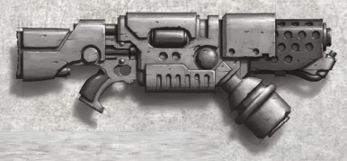

<!-- A1266-B0048 -->

原译文

Coldfire Pattern Flamer 冷焰型喷火器

**校订译文**

Coldfire Pattern Flamer 冷焰型喷火器

<!-- /A1266-B0048 -->

<!-- A1266-B0049 -->
**英文原文**

Helios-Prime Pattern — Used by the Adeptus Astartes including the Space Wolves.

<!-- /A1266-B0049 -->

<!-- A1266-B0050 -->

原译文

赫利俄斯主星型 — 包括太空野狼在内的阿斯塔特修会使用。

**校订译文**

赫利俄斯主星型 — 包括太空野狼在内的阿斯塔特修会使用。

<!-- /A1266-B0050 -->

<!-- A1266-B0051 图片 -->
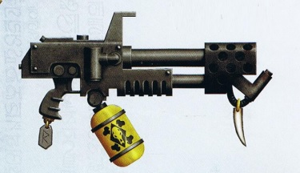

<!-- A1266-B0052 -->

原译文

Space Wolves Helios-Prime Pattern Flamer 太空野狼赫利俄斯主星型喷火器

**校订译文**

Space Wolves Helios-Prime Pattern Flamer 太空野狼赫利俄斯主星型喷火器

<!-- /A1266-B0052 -->

<!-- A1266-B0053 -->
**英文原文**

Incinerati Sub-Pattern — Used by House Escher on Necromunda. Built by Hive Arcos.

<!-- /A1266-B0053 -->

<!-- A1266-B0054 -->

原译文

焚化子型 — 埃舍尔家族在涅克罗蒙达上使用。由阿科斯巢都建造。

**校订译文**

焚化子型 — 埃舍尔家族在涅克罗蒙达上使用。由阿科斯巢都建造。

<!-- /A1266-B0054 -->

<!-- A1266-B0055 图片 -->
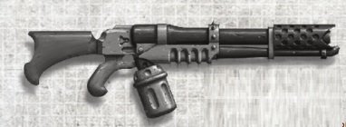

<!-- A1266-B0056 -->

原译文

Incinerati Sub-Pattern Flamer 焚化子型喷火器

**校订译文**

Incinerati Sub-Pattern Flamer 焚化子型喷火器

<!-- /A1266-B0056 -->

<!-- A1266-B0057 -->
**英文原文**

Nocturne Pattern — Used by the Salamanders.

<!-- /A1266-B0057 -->

<!-- A1266-B0058 -->

原译文

夜曲型 — 由火蜥蜴使用。

**校订译文**

夜曲型 — 由火蜥蜴使用。

<!-- /A1266-B0058 -->

<!-- A1266-B0059 -->
**英文原文**

Phaestos Pattern — Used during the Great Crusade and Horus Heresy.

<!-- /A1266-B0059 -->

<!-- A1266-B0060 -->

原译文

费斯托斯型 — 在大远征和荷鲁斯叛乱时期使用。

**校订译文**

费斯托斯型——大远征和荷鲁斯之乱期间使用的型号。

<!-- /A1266-B0060 -->

<!-- A1266-B0061 图片 -->
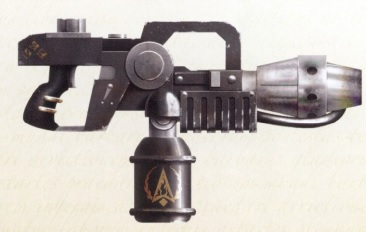

<!-- A1266-B0062 -->

原译文

Phaestos-Pattern Flamer 费斯托斯型喷火器

**校订译文**

Phaestos-Pattern Flamer 费斯托斯型喷火器

<!-- /A1266-B0062 -->

<!-- A1266-B0063 -->
**英文原文**

Phaeton Pattern — Used by the Ultramarines.

<!-- /A1266-B0063 -->

<!-- A1266-B0064 -->

原译文

法厄同型 — 由极限战士使用。

**校订译文**

法厄同型 — 由极限战士使用。

<!-- /A1266-B0064 -->

<!-- A1266-B0065 -->
**英文原文**

Artemia Mk III Purgation Flamer - Hailing from the same forge world as the mighty Hellhound flame tank, this weapon uses volatile promethium to scour heretics with fire.

<!-- /A1266-B0065 -->

<!-- A1266-B0066 -->

原译文

阿耳忒弥亚Mk.III净化火焰枪 - 这款武器与强大的地狱犬火焰坦克来自同一个铸造世界，它使用挥发性的钷用火焰冲刷异端。

**校订译文**

阿尔泰米亚 Mk.III 净化火焰喷射器——产自制造强大地狱犬喷火坦克的同一铸造世界，使用挥发性钷素，以烈焰焚净异端。

**校注：** Artemia按864阿尔泰米亚主星统一词根，原阿耳忒弥亚留原译对照。

<!-- /A1266-B0066 -->

<!-- A1266-B0067 图片 -->
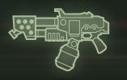

<!-- A1266-B0068 -->

原译文

Artemia Mk III Purgation Flamer 阿耳忒弥亚Mk.III净化火焰枪

**校订译文**

Artemia Mk III Purgation Flamer 阿尔泰米亚 Mk.III 净化火焰喷射器

<!-- /A1266-B0068 -->

本篇核心术语与暂定项

以下列出本篇出现的英文原形及核心术语表用词。同形词可能指不同对象，具体词义以本篇正文和校注为准；单复数、别名和仅见于图注的名称可能尚未列入。完整候选见[术语表](../../术语表/双语术语候选.csv)。

| 英文 | 采用中文 | 状态 |
| --- | --- | --- |
| Space Marines | 星际战士 | 官方已核对 |
| Adeptus Astartes | 阿斯塔特修会 | 官方已核对 |
| Space Wolves | 太空野狼 | 官方已核对 |
| Imperial Guard | 帝国卫队 | 暂定·语境区分 |
| Ultramarines | 极限战士 | 官方已核对 |
| Horus Heresy | 荷鲁斯之乱 | 官方已核对 |
| Inquisition | 审判庭 | 暂定 |
| Imperium | 帝国 | 暂定·简称 |
| Mechanicum | 机械教 | 暂定·历史称谓 |
| Forge World | 铸造世界 | 暂定·官方待核 |
| Necromunda | 涅克罗蒙达 | 暂定·官方待核 |
| House Van Saar | 凡·萨尔家族 | 暂定·官方待核 |
| House Escher | 埃舍尔家族 | 暂定·官方待核 |
| Great Crusade | 大远征 | 暂定·官方待核 |
| Horus | 荷鲁斯 | 暂定·官方待核 |
| Skitarii | 护教军 | 暂定·官方待核 |
| Sisters of Battle | 战斗修女 | 暂定·官方待核 |
| Sector | 星区 | 暂定·官方待核 |
| Salamanders | 火蜥蜴 | 暂定·官方待核 |
| Nocturne | 夜曲星 | 暂定·官方待核 |
| Raven Guard | 暗鸦守卫 | 官方已核 |
| Flamers | 火妖（奸奇单位）／火焰喷射器（武器） | 语境定译·对应官译已核 |
| Calixis Sector | 卡利西斯星区 | 暂定·官方待核 |
| Accatran | 阿卡特兰 | 暂定·官方待核 |
| Phaeton | 法厄同 | 暂定·官方待核 |
| Helios | 赫利俄斯 | 暂定·官方待核 |
| Promethium | 钷素 | 暂定·官方待核 |
| Flamer | 火焰喷射器（武器）／火妖（奸奇单位） | 语境定译·对应官译已核 |
| Cognis Flamer | 智能火焰喷射器 | 暂定·官方待核 |
| Anoxis Burst Flamer | 阿诺西斯爆裂火焰喷射器 | 暂定·官方待核 |
| Coldfire Pattern | 冷焰型 | 暂定·官方待核 |
| Helios-Prime Pattern | 赫利俄斯主星型 | 暂定·官方待核 |
| Incinerati Sub-Pattern | 焚化子型 | 暂定·官方待核 |
| Phaestos Pattern | 费斯托斯型 | 暂定·官方待核 |
| Phaeton Pattern | 法厄同型 | 暂定·官方待核 |
| Artemia Mk III Purgation Flamer | 阿尔泰米亚 Mk.III 净化火焰喷射器 | 暂定·官方待核 |
| Hellhound | 地狱犬战车 | 官方已核对 |
| Elysian Drop Troops | 艾丽西亚空降兵 | 暂定·官方待核 |

