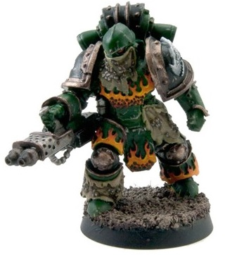

# 1267 焚火者火焰投射器 Pyroclast Flame Projector

精校状态：中文行文已逐段精校，部分术语仍为暂定

分类：武器 / 远程武器

原文来源：https://www.bilibili.com/opus/1009983927860854785

原作者：帝国神选罐头

原文时间：2024年12月12日 16:53

[返回分类目录](目录.md) · [全书目录](../../目录.md)

原篇名：火山岩火焰投射枪 Pyroclast Flame Projector

<!-- A1267-B0001 -->
**英文原文**

Pyroclast Flame Projector's were Salamanders unique and complex flame weapons created by Vulkan himself during the Great Crusade. Wielded by the Legion's Pyroclasts, they were far more elegant and potent than the standard Flamer used by the Legiones Astartes. They were used to incinerate a swathe of targets in the manner of a standard Flamer, but also focused their jet into searing cutting arcs that sliced through durable armour.

<!-- /A1267-B0001 -->

<!-- A1267-B0002 -->

原译文

火山岩火焰投射器是火蜥蜴在大远征期间由沃坎自己创造的独特而复杂的火焰武器。由军团的火山岩挥舞，它们比阿斯塔特军团使用的标准火焰器更优雅而有力。它们被用来以标准火焰枪的方式焚烧一大片目标，但它们还将其喷射聚集成炽热的切割弧，能够切开坚固的装甲。

**校订译文**

焚火者火焰投射器是沃坎在大远征期间亲自为火蜥蜴创造的独特复杂武器，由军团的焚火者部队使用，比阿斯塔特军团的标准火焰喷射器更加精巧、强大。它既能像常规型号一样焚烧大片目标，也能收束喷流，形成炽热的切割弧，剖开坚固装甲。

**校注：** Pyroclasts为火蜥蜴兵种，沿451／454焚火者；原火山岩误取地质词义。

<!-- /A1267-B0002 -->

<!-- A1267-B0003 图片 -->

<!-- A1267-B0004 -->

原译文

Salamander Pyroclast with the Pyroclast Flame Projector 装备火山岩火焰投射器的火蜥蜴火山岩

**校订译文**

Salamander Pyroclast with the Pyroclast Flame Projector 装备焚火者火焰投射器的火蜥蜴焚火者

<!-- /A1267-B0004 -->

本篇核心术语与暂定项

以下列出本篇出现的英文原形及核心术语表用词。同形词可能指不同对象，具体词义以本篇正文和校注为准；单复数、别名和仅见于图注的名称可能尚未列入。完整候选见[术语表](../../术语表/双语术语候选.csv)。

| 英文 | 采用中文 | 状态 |
| --- | --- | --- |
| Great Crusade | 大远征 | 暂定·官方待核 |
| Legiones Astartes | 阿斯塔特军团 | 暂定·官方待核 |
| Vulkan | 沃坎 | 暂定·官方待核 |
| Salamanders | 火蜥蜴 | 暂定·官方待核 |
| Pyroclast | 焚火者 | 暂定 |
| Pyroclast Flame Projector | 焚火者火焰投射器 | 暂定·官方待核 |
| Pyroclasts | 焚火者 | 暂定·官方待核 |
| Flame Weapons | 火焰武器 | 暂定·官方待核 |
| Flamer | 火焰喷射器（武器）／火妖（奸奇单位） | 语境定译·对应官译已核 |

