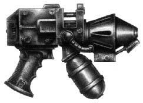
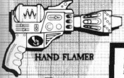
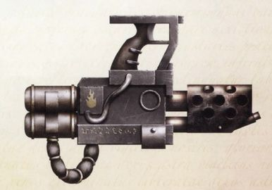
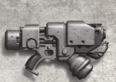
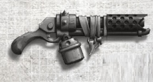
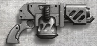
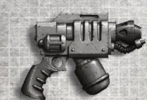
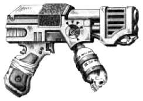
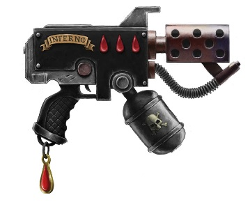

# 1268 火焰手枪 Hand Flamer

精校状态：中文行文已逐段精校，部分术语仍为暂定

分类：武器 / 远程武器

原文来源：https://www.bilibili.com/opus/1002090005632385032

原作者：帝国神选罐头

原文时间：2024年11月21日 10:21

[返回分类目录](目录.md) · [全书目录](../../目录.md)

<!-- A1268-B0001 -->
**英文原文**

Hand Flamers are a type of compact Imperial Flamer weapon. Also called a "burner", the Hand Flamer is a more compact pistol version requiring only one hand.

<!-- /A1268-B0001 -->

<!-- A1268-B0002 -->

原译文

喷火手枪是一种紧凑型帝国火焰武器。也被称为“燃烧器”，喷火手枪是一种更紧凑的手枪版本，只需要一只手。

**校订译文**

火焰手枪是帝国火焰喷射器的紧凑手枪型版本，又称燃烧器，可以单手使用。

**校注：** 统一采用篇名火焰手枪，喷火手枪为原稿同义异译。

<!-- /A1268-B0002 -->

<!-- A1268-B0003 图片 -->

<!-- A1268-B0004 -->

原译文

Hand Flamers 喷火手枪

**校订译文**

Hand Flamers 火焰手枪

<!-- /A1268-B0004 -->

<!-- A1268-B0005 -->
## Overview 概述

<!-- /A1268-B0005 -->

<!-- A1268-B0006 -->
**英文原文**

Along with using a lower-capacity fuel tank it has much reduced range, which makes it suited for assault and close-combat purposes, incinerating foes at short range. The weapon is used by assault squads, such as Seraphim units which employ them in pairs.

<!-- /A1268-B0006 -->

<!-- A1268-B0007 -->

原译文

除了使用容量较低的油箱外，它的射程也大大缩短，这使得它适合用于突击和近战目的，在短距离内焚烧敌人。这种武器由突击小队使用，如炽天使部队，他们成对使用。

**校订译文**

它的燃料罐较小，射程也明显缩短，适合突击和近战，在近距离焚烧敌人。突击小队常使用这种武器，例如炽天使便会双持火焰手枪。

<!-- /A1268-B0007 -->

<!-- A1268-B0008 图片 -->

<!-- A1268-B0009 -->

原译文

Hand Flamers 喷火手枪

**校订译文**

Hand Flamers 火焰手枪

<!-- /A1268-B0009 -->

<!-- A1268-B0010 -->
## Patterns 型号

<!-- /A1268-B0010 -->

<!-- A1268-B0011 -->
**英文原文**

Akkadic Pattern — Used by Ashen Circle Legionaries

<!-- /A1268-B0011 -->

<!-- A1268-B0012 -->

原译文

阿卡迪克型 — 灰烬之环军团士兵使用

**校订译文**

阿卡迪克型 — 灰烬之环军团士兵使用

<!-- /A1268-B0012 -->

<!-- A1268-B0013 图片 -->

<!-- A1268-B0014 -->

原译文

Word Bearers Akkadic Pattern Hand Flamer 怀言者阿卡迪克型喷火手枪

**校订译文**

Word Bearers Akkadic Pattern Hand Flamer 怀言者阿卡迪克型火焰手枪

<!-- /A1268-B0014 -->

<!-- A1268-B0015 -->
**英文原文**

Coldfire Pattern — Used by House Van Saar on Necromunda.

<!-- /A1268-B0015 -->

<!-- A1268-B0016 -->

原译文

冷焰型 — 凡萨尔家族在涅克罗蒙达中使用。

**校订译文**

冷焰型 — 凡·萨尔家族在涅克罗蒙达中使用。

<!-- /A1268-B0016 -->

<!-- A1268-B0017 图片 -->

<!-- A1268-B0018 -->

原译文

Coldfire Pattern Hand Flamer 冷焰型喷火手枪

**校订译文**

Coldfire Pattern Hand Flamer 冷焰型火焰手枪

<!-- /A1268-B0018 -->

<!-- A1268-B0019 图片 -->

<!-- A1268-B0020 -->

原译文

House Escher Hand Flamer 埃舍尔家族喷火手枪

**校订译文**

House Escher Hand Flamer 埃舍尔家族火焰手枪

<!-- /A1268-B0020 -->

<!-- A1268-B0021 -->
**英文原文**

Crucible Variant — Used by House Orlock on Necromunda.

<!-- /A1268-B0021 -->

<!-- A1268-B0022 -->

原译文

熔炉型 — 由欧洛克家族在涅克罗蒙达上使用。

**校订译文**

熔炉型 — 由欧洛克家族在涅克罗蒙达上使用。

<!-- /A1268-B0022 -->

<!-- A1268-B0023 图片 -->

<!-- A1268-B0024 -->

原译文

House Orlock Hand Flamer 欧洛克家族喷火手枪

**校订译文**

House Orlock Hand Flamer 欧洛克家族火焰手枪

<!-- /A1268-B0024 -->

<!-- A1268-B0025 图片 -->

<!-- A1268-B0026 -->

原译文

House Goliath Hand Flamer 歌利亚家族喷火手枪

**校订译文**

House Goliath Hand Flamer 歌利亚家族火焰手枪

<!-- /A1268-B0026 -->

<!-- A1268-B0027 -->
**英文原文**

Destroyer-Pattern — Also known as the Cadence Promethium Incineration Device, it was produced by the Inquisition in the Calixis Sector. It uses technology similar to a Plasma Gun to create super-heated thermal blast that burns fat hotter and with greater fuel efficiency than normal Hand Flamers.

<!-- /A1268-B0027 -->

<!-- A1268-B0028 -->

原译文

毁灭者型 — 也称为凯迪斯钷素焚烧装置，由卡利西斯星区的审判庭制造。它使用类似于等离子枪的技术来产生过热的热力爆炸，比普通喷火手枪燃烧更热，燃料效率更高。

**校订译文**

毁灭者型——又称凯迪斯钷素焚烧装置，由卡利西斯星区的审判庭制造。它采用类似等离子枪的技术，产生极高温热能冲击，既比普通火焰手枪温度更高，也更节省燃料。

**校注：** burns fat hotter中的fat应为far误写，中文按“温度高得多”理解，不误作燃烧脂肪。

<!-- /A1268-B0028 -->

<!-- A1268-B0029 图片 -->

<!-- A1268-B0030 -->

原译文

Inquisition Hand Flamer 审判庭喷火手枪

**校订译文**

Inquisition Hand Flamer 审判庭火焰手枪

<!-- /A1268-B0030 -->

<!-- A1268-B0031 -->

原译文

Exterminator 歼灭者

**校订译文**

Exterminator 歼灭者

<!-- /A1268-B0031 -->

<!-- A1268-B0032 -->
**英文原文**

Ignis Pattern — Used by Space Marines, most notably the Blood Angels and their Successor Chapters.

<!-- /A1268-B0032 -->

<!-- A1268-B0033 -->

原译文

烈焰型 — 被星际战士使用，最著名的是圣血天使及其子战团。

**校订译文**

烈焰型 — 被星际战士使用，最著名的是圣血天使及其子战团。

<!-- /A1268-B0033 -->

<!-- A1268-B0034 图片 -->

<!-- A1268-B0035 -->

原译文

Blood Angels Hand Flamer 圣血天使喷火手枪

**校订译文**

Blood Angels Hand Flamer 圣血天使火焰手枪

<!-- /A1268-B0035 -->

<!-- A1268-B0036 -->
## Notable Hand Flamers 著名火焰手枪

原题：Notable Hand Flamers 著名火焰喷射器

<!-- /A1268-B0036 -->

<!-- A1268-B0037 -->

原译文

Baal's Vengeance 巴尔的复仇

**校订译文**

Baal's Vengeance 巴尔的复仇

<!-- /A1268-B0037 -->

<!-- A1268-B0038 -->
**英文原文**

Drakkis — Wielded by Adrax Agatone.

<!-- /A1268-B0038 -->

<!-- A1268-B0039 -->

原译文

德拉基斯 — 由阿德拉克斯·阿伽顿挥舞。

**校订译文**

德拉基斯——由阿德拉克斯·阿伽顿使用。

<!-- /A1268-B0039 -->

<!-- A1268-B0040 -->
**英文原文**

Ignatus — Wielded by Antor Delassio.

<!-- /A1268-B0040 -->

<!-- A1268-B0041 -->

原译文

伊格纳托斯 — 由安托·德拉西奥挥舞。

**校订译文**

伊格纳托斯——由安托·德拉西奥使用。

<!-- /A1268-B0041 -->

本篇核心术语与暂定项

以下列出本篇出现的英文原形及核心术语表用词。同形词可能指不同对象，具体词义以本篇正文和校注为准；单复数、别名和仅见于图注的名称可能尚未列入。完整候选见[术语表](../../术语表/双语术语候选.csv)。

| 英文 | 采用中文 | 状态 |
| --- | --- | --- |
| Space Marines | 星际战士 | 官方已核对 |
| Blood Angels | 圣血天使 | 官方已核对 |
| Inquisition | 审判庭 | 暂定 |
| Necromunda | 涅克罗蒙达 | 暂定·官方待核 |
| House Van Saar | 凡·萨尔家族 | 暂定·官方待核 |
| Sector | 星区 | 暂定·官方待核 |
| Destroyer | 毁灭者 | 暂定·官方待核 |
| Adrax Agatone | 阿德拉克斯·阿伽顿 | 官方已核 |
| Assault Squads | 突击小队 | 暂定·官方待核 |
| Ashen Circle | 灰烬之环 | 暂定·官方待核 |
| Flamers | 火妖（奸奇单位）／火焰喷射器（武器） | 语境定译·对应官译已核 |
| Ignis | 伊格尼斯 | 暂定·官方待核 |
| The Weapon | 武器 | 暂定·官方待核 |
| Crucible | 熔炉星 | 暂定·官方待核 |
| Gun | 甘 | 暂定·官方待核 |
| The Blood | 鲜血 | 暂定·官方待核 |
| Drakkis | 德拉基斯 | 暂定·官方待核 |
| Calixis Sector | 卡利西斯星区 | 暂定·官方待核 |
| Ashen | 灰白星 | 暂定·官方待核 |
| Promethium | 钷素 | 暂定·官方待核 |
| Flamer | 火焰喷射器（武器）／火妖（奸奇单位） | 语境定译·对应官译已核 |
| Imperial Flamer | 帝国火焰喷射器 | 暂定·官方待核 |
| Coldfire Pattern | 冷焰型 | 暂定·官方待核 |
| Hand Flamer | 火焰手枪 | 暂定·官方待核 |
| Akkadic Pattern | 阿卡迪克型 | 暂定·官方待核 |
| Crucible Variant | 熔炉型 | 暂定·官方待核 |
| Cadence Promethium Incineration Device | 凯迪斯钷素焚烧装置 | 暂定·官方待核 |
| Ignis Pattern | 烈焰型 | 暂定·官方待核 |
| Ignatus | 伊格纳托斯 | 暂定·官方待核 |
| Antor Delassio | 安托·德拉西奥 | 暂定·官方待核 |
| Plasma gun | 等离子枪 | 官方已核对 |
| House Orlock | 欧洛克家族 | 暂定·官方待核 |

