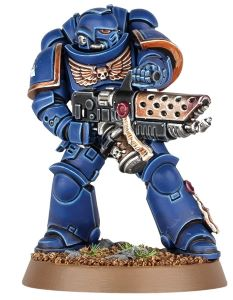

# 1269 焚焰枪 Pyreblaster

精校状态：中文行文已逐段精校，部分术语仍为暂定

分类：武器 / 远程武器

原文来源：https://www.bilibili.com/opus/1000617836833407015

原作者：帝国神选罐头

原文时间：2024年11月17日 11:08

[返回分类目录](目录.md) · [全书目录](../../目录.md)

<!-- A1269-B0001 -->
**英文原文**

Pyreblasters are formidable Space Marine Flamers. They have a sturdier design and longer barrel than a traditional flamer, which allows it to fire with more devastating force from a longer distance.

<!-- /A1269-B0001 -->

<!-- A1269-B0002 -->

原译文

焚焰枪是强大的星际战士喷火器。它们的设计比传统的火焰枪更坚固，枪管更长，这使得它能够从更远的距离发射更具毁灭性的力量。

**校订译文**

焚焰枪是星际战士使用的强大火焰喷射器。与传统型号相比，它结构更坚固、枪管更长，能在更远距离释放破坏力更强的火焰。

<!-- /A1269-B0002 -->

<!-- A1269-B0003 图片 -->

<!-- A1269-B0004 -->

原译文

Infernus Squad marine with Pyreblaster 焚狱者小队装备焚焰枪

**校订译文**

Infernus Squad marine with Pyreblaster 装备焚焰枪的焚狱者小队战士

<!-- /A1269-B0004 -->

本篇核心术语与暂定项

以下列出本篇出现的英文原形及核心术语表用词。同形词可能指不同对象，具体词义以本篇正文和校注为准；单复数、别名和仅见于图注的名称可能尚未列入。完整候选见[术语表](../../术语表/双语术语候选.csv)。

| 英文 | 采用中文 | 状态 |
| --- | --- | --- |
| Space Marine | 星际战士 | 暂定·官方待核 |
| Flamers | 火妖（奸奇单位）／火焰喷射器（武器） | 语境定译·对应官译已核 |
| Flamer | 火焰喷射器（武器）／火妖（奸奇单位） | 语境定译·对应官译已核 |

