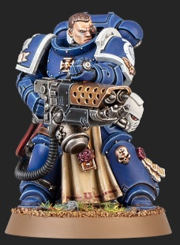

# 1270 焚焰炮 Pyrecannon

精校状态：中文行文已逐段精校，部分术语仍为暂定

分类：武器 / 远程武器

原文来源：https://www.bilibili.com/opus/1005823294270603272

原作者：帝国神选罐头

原文时间：2024年12月01日 11:48

[返回分类目录](目录.md) · [全书目录](../../目录.md)

<!-- A1270-B0001 -->
**英文原文**

Pyrecannons are Space Marine Heavy Flamers used by Sternguard Veterans.

<!-- /A1270-B0001 -->

<!-- A1270-B0002 -->

原译文

焚焰炮是肃卫老兵使用的星际战士重型火焰枪。

**校订译文**

焚焰炮是肃卫老兵使用的一种星际战士重型火焰喷射器。

<!-- /A1270-B0002 -->

<!-- A1270-B0003 图片 -->

<!-- A1270-B0004 -->

原译文

Sternguard Veteran with Pyrecannon 配备焚焰炮的肃卫老兵

**校订译文**

Sternguard Veteran with Pyrecannon 配备焚焰炮的肃卫老兵

<!-- /A1270-B0004 -->

本篇核心术语与暂定项

以下列出本篇出现的英文原形及核心术语表用词。同形词可能指不同对象，具体词义以本篇正文和校注为准；单复数、别名和仅见于图注的名称可能尚未列入。完整候选见[术语表](../../术语表/双语术语候选.csv)。

| 英文 | 采用中文 | 状态 |
| --- | --- | --- |
| Space Marine | 星际战士 | 暂定·官方待核 |
| Sternguard Veterans | 肃卫老兵 | 暂定·官方待核 |
| Flamers | 火妖（奸奇单位）／火焰喷射器（武器） | 语境定译·对应官译已核 |

