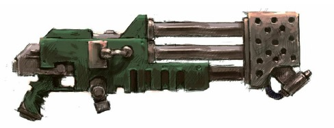
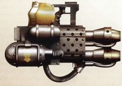
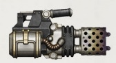

# 1271 重型火焰喷射器 Heavy Flamer

精校状态：中文行文已逐段精校，部分术语仍为暂定

分类：武器 / 远程武器

原文来源：https://www.bilibili.com/opus/1004335006505500694

原作者：帝国神选罐头

原文时间：2024年11月27日 11:32

[返回分类目录](目录.md) · [全书目录](../../目录.md)

原篇名：重型火焰枪 Heavy Flamer

<!-- A1271-B0001 -->
**英文原文**

The heavy flamer is a much larger and bulkier flamer.

<!-- /A1271-B0001 -->

<!-- A1271-B0002 -->

原译文

重型火焰枪是一种更大、更笨重的火焰枪。

**校订译文**

重型火焰喷射器是体积和重量都明显增加的火焰喷射器。

<!-- /A1271-B0002 -->

<!-- A1271-B0003 图片 -->

<!-- A1271-B0004 -->

原译文

Imperial Heavy Flamer 帝国重型火焰枪

**校订译文**

Imperial Heavy Flamer 帝国重型火焰喷射器

<!-- /A1271-B0004 -->

<!-- A1271-B0005 -->
## Overview 概述

<!-- /A1271-B0005 -->

<!-- A1271-B0006 -->
**英文原文**

It produces a larger flame capable of enveloping more targets. Few armies (except Space Marines, Sisters of Battle and Chaos Space Marines) carry it by hand, but it is sometimes fitted to vehicles. The Catachan Jungle Fighters carry it by hand due to the nature of their combat - fighting in jungles makes flame weapons an important asset. It is a standard special weapon of Space Marine Terminators.

<!-- /A1271-B0006 -->

<!-- A1271-B0007 -->

原译文

它会产生更大的火焰，能够包围更多的目标。很少有军队（除了星际战士、战斗修女和混沌星际战士）用手携带它，但它有时会安装在车辆上。由于在丛林中战斗的性质，卡塔昌丛林战士用手携带它，这使得火焰武器成为一种重要的资产。它是星际战士终结者的标准专用武器。

**校订译文**

它喷出的火焰规模更大，能够吞没更多目标。除星际战士、战斗修女和混沌星际战士等部队外，很少有军队以单兵方式携行使用它，但有时会将其装在载具上。卡塔昌丛林斗士也是例外：丛林战让火焰武器格外重要，因此他们会携带这种重型装备。它同时也是星际战士终结者的标准特殊武器之一。

<!-- /A1271-B0007 -->

<!-- A1271-B0008 -->
## Known Patterns 已知型号

<!-- /A1271-B0008 -->

<!-- A1271-B0009 -->

原译文

Mk.III Pattern Mk.III型

**校订译文**

Mk.III Pattern Mk.III型

<!-- /A1271-B0009 -->

<!-- A1271-B0010 -->
**英文原文**

Anvilus Pattern - Common among Terminators

<!-- /A1271-B0010 -->

<!-- A1271-B0011 -->

原译文

安维鲁斯型 - 常见于终结者

**校订译文**

安维鲁斯型 - 常见于终结者

<!-- /A1271-B0011 -->

<!-- A1271-B0012 -->
**英文原文**

Phaestos Pattern - Used during the Horus Heresy

<!-- /A1271-B0012 -->

<!-- A1271-B0013 -->

原译文

菲斯托斯型 - 在荷鲁斯叛乱期间使用

**校订译文**

费斯托斯型——荷鲁斯之乱期间使用。

<!-- /A1271-B0013 -->

<!-- A1271-B0014 图片 -->

<!-- A1271-B0015 -->

原译文

Phaestos-Pattern Heavy Flamer 菲斯托斯型重型火焰枪

**校订译文**

Phaestos-Pattern Heavy Flamer 费斯托斯型重型火焰喷射器

<!-- /A1271-B0015 -->

<!-- A1271-B0016 -->
**英文原文**

Proteus Pattern - Used during the Horus Heresy

<!-- /A1271-B0016 -->

<!-- A1271-B0017 -->

原译文

普罗透斯型 - 在荷鲁斯叛乱期间使用

**校订译文**

普罗透斯型——荷鲁斯之乱期间使用。

<!-- /A1271-B0017 -->

<!-- A1271-B0018 图片 -->

<!-- A1271-B0019 -->

原译文

Proteus-Pattern Heavy Flamer 普罗透斯型重型火焰枪

**校订译文**

Proteus-Pattern Heavy Flamer 普罗透斯型重型火焰喷射器

<!-- /A1271-B0019 -->

本篇核心术语与暂定项

以下列出本篇出现的英文原形及核心术语表用词。同形词可能指不同对象，具体词义以本篇正文和校注为准；单复数、别名和仅见于图注的名称可能尚未列入。完整候选见[术语表](../../术语表/双语术语候选.csv)。

| 英文 | 采用中文 | 状态 |
| --- | --- | --- |
| Space Marines | 星际战士 | 官方已核对 |
| Chaos Space Marines | 混沌星际战士 | 官方已核对 |
| Horus Heresy | 荷鲁斯之乱 | 官方已核对 |
| Horus | 荷鲁斯 | 暂定·官方待核 |
| Sisters of Battle | 战斗修女 | 暂定·官方待核 |
| Catachan | 卡塔昌 | 暂定·官方待核 |
| Space Marine | 星际战士 | 暂定·官方待核 |
| Terminators | 终结者 | 暂定·官方待核 |
| Catachan Jungle Fighters | 卡塔昌丛林斗士 | 官方已核对 |
| Proteus | 普罗透斯 | 暂定·官方待核 |
| Anvilus | 安维鲁斯 | 暂定·官方待核 |
| Flame Weapons | 火焰武器 | 暂定·官方待核 |
| Flamer | 火焰喷射器（武器）／火妖（奸奇单位） | 语境定译·对应官译已核 |
| Phaestos Pattern | 费斯托斯型 | 暂定·官方待核 |
| Heavy flamer | 重型火焰喷射器 | 官方已核对 |

