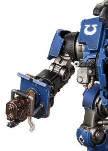

# 1272 燃烧炮 Incendium Cannon

精校状态：中文行文已逐段精校，部分术语仍为暂定

分类：武器 / 远程武器

原文来源：https://www.bilibili.com/opus/1001726569779036167

原作者：帝国神选罐头

原文时间：2024年11月20日 10:50

[返回分类目录](目录.md) · [全书目录](../../目录.md)

<!-- A1272-B0001 -->
**英文原文**

The Incendium Cannon is a weapon used by Invictor Tactical Warsuits. This Flame Weapon allows the Invictor to fire pyrotechnic blasts that reduce swathes of enemies to blazing corpses.

<!-- /A1272-B0001 -->

<!-- A1272-B0002 -->

原译文

燃烧炮是不败者战术机甲使用的武器。这种火焰武器允许不败者发射爆破火焰，将大片敌人变成燃烧的尸体。

**校订译文**

燃烧炮是不败者战术机甲使用的火焰武器，能够喷出炽烈焰流，将大片敌人烧成燃烧的尸体。

<!-- /A1272-B0002 -->

<!-- A1272-B0003 图片 -->

<!-- A1272-B0004 -->

原译文

Incendium Cannon 燃烧炮

**校订译文**

Incendium Cannon 燃烧炮

<!-- /A1272-B0004 -->

本篇核心术语与暂定项

以下列出本篇出现的英文原形及核心术语表用词。同形词可能指不同对象，具体词义以本篇正文和校注为准；单复数、别名和仅见于图注的名称可能尚未列入。完整候选见[术语表](../../术语表/双语术语候选.csv)。

| 英文 | 采用中文 | 状态 |
| --- | --- | --- |
| Flame Weapon | 火焰武器 | 暂定·官方待核 |
| Incendium Cannon | 燃烧炮 | 暂定·官方待核 |

