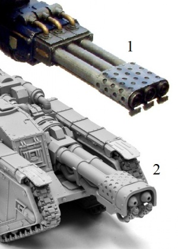

# 1273 炼狱炮 Inferno Gun

精校状态：中文行文已逐段精校，部分术语仍为暂定

分类：武器 / 远程武器

原文来源：https://www.bilibili.com/opus/1011362852894670869

原作者：帝国神选罐头

原文时间：2024年12月16日 10:04

[返回分类目录](目录.md) · [全书目录](../../目录.md)

<!-- A1273-B0001 -->
**英文原文**

The Inferno Gun is a massive Flame weapon designed to be mounted on Imperial Titans and other Super-Heavy Vehicles.

<!-- /A1273-B0001 -->

<!-- A1273-B0002 -->

原译文

炼狱炮是一种巨大的火焰武器，设计用于安装在帝国泰坦和其他超重型车辆上。

**校订译文**

炼狱炮是一种巨型火焰武器，安装于帝国泰坦及其他超重型载具。

<!-- /A1273-B0002 -->

<!-- A1273-B0003 -->
**英文原文**

It is composed of several linked barrels firing highly flammable chemicals in massive waves of flame. It typically uses Promethium for this task, which is stored in multiple parts and pumped independently into a mixing chamber just behind the barrel to create a chemical "jelly." This jelly is then compressed and released as a jet of flaming mass which sticks to any surface. This massive gout of sun-fire can melt stone and concrete, causing buildings to collapse in on themselves, and even liquidate Power Armoured infantry. It can also effectively clear minefields as the sudden heat detonates their fuses on contact.

<!-- /A1273-B0003 -->

<!-- A1273-B0004 -->

原译文

它由多个连接的枪管组成，能够发射大量高度易燃的化学物质，形成巨大的火焰波。通常使用钷素来完成这一任务，钷素被储存在多个部分中，并独立泵送到枪管后方的混合室中，形成一种化学“凝胶”。这种凝胶随后被压缩并以火焰喷射的形式释放出来，粘附在任何表面上。这股巨大的日炎可以熔化石头和混凝土，导致建筑物倒塌，甚至可以液化动力装甲步兵。此外，突然的高温还可以引爆地雷的引信，有效清除雷区。

**校订译文**

它由数根联动炮管组成，喷射极易燃烧的化学物，形成巨大的火浪。通常所用燃料是钷素，其组分分别储存，再独立泵入炮管后方的混合室，形成化学凝胶。凝胶经压缩后化为燃烧喷流射出，黏附在接触到的表面上。这股如太阳般炽烈的火焰能够熔化岩石和混凝土，使建筑自行坍塌，甚至将动力装甲步兵连人带甲熔毁。突如其来的高温还会触发地雷引信，因此也能有效清理雷区。

<!-- /A1273-B0004 -->

<!-- A1273-B0005 图片 -->

<!-- A1273-B0006 -->

原译文

Inferno Guns from various Imperial vehicles: 1-Warhound Scout Titan, 2-Malcador Infernus 不同帝国载具的炼狱炮：1-战犬侦查泰坦，2-炼狱马卡多

**校订译文**

Inferno Guns from various Imperial vehicles: 1-Warhound Scout Titan, 2-Malcador Infernus 不同帝国载具上的炼狱炮：1—战犬级侦察泰坦；2—炼狱马卡多

<!-- /A1273-B0006 -->

<!-- A1273-B0007 -->
**英文原文**

The Inferno Gun can be fitted to the limb mounts on Warhound Scout Titans, as well as the carapace mounts found on Reaver and Warlord Battle Titans. They can also be found on the carapace mounts of some Imperator Titans. The Imperial Guard Malcador Infernus super-heavy tank also mounts an Inferno Gun as its main armament, though it must tow its Promethium fuel in a separate trailer.

<!-- /A1273-B0007 -->

<!-- A1273-B0008 -->

原译文

炼狱炮可以安装在战犬侦察泰坦的肢体支架上，以及掠夺者战斗泰坦和军阀战斗泰坦的护甲支架上。一些帝皇泰坦的护甲支架上也可以看到炼狱炮。帝国卫队的马卡多炼狱超级重型坦克也将炼狱炮作为其主要武器，尽管它需要拖曳一个单独的钷素燃料拖车。

**校订译文**

炼狱炮可安装于战犬级侦察泰坦的臂部，以及掠夺者级和战将级战斗泰坦的背甲武器座。部分帝皇级泰坦的背甲上也有此类武器。帝国卫队的炼狱马卡多超重型坦克同样以炼狱炮为主武器，但必须拖带一辆独立的钷素燃料拖车。

<!-- /A1273-B0008 -->

本篇核心术语与暂定项

以下列出本篇出现的英文原形及核心术语表用词。同形词可能指不同对象，具体词义以本篇正文和校注为准；单复数、别名和仅见于图注的名称可能尚未列入。完整候选见[术语表](../../术语表/双语术语候选.csv)。

| 英文 | 采用中文 | 状态 |
| --- | --- | --- |
| Imperial Guard | 帝国卫队 | 暂定·语境区分 |
| Clear | 清明 | 暂定·官方待核 |
| Scout | 侦察兵 | 暂定·官方待核 |
| Gun | 甘 | 暂定·官方待核 |
| Promethium | 钷素 | 暂定·官方待核 |
| Flame Weapon | 火焰武器 | 暂定·官方待核 |
| Inferno Gun | 炼狱炮 | 暂定·官方待核 |
| Malcador Infernus | 马卡多炼狱 | 暂定·官方待核 |

