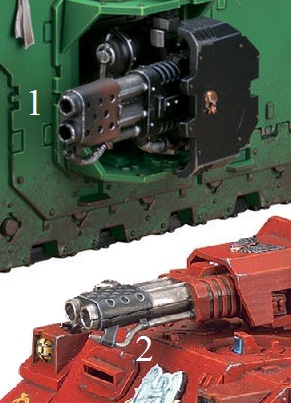

# 1274 火焰风暴炮 Flamestorm Cannon

精校状态：中文行文已逐段精校，部分术语仍为暂定

分类：武器 / 远程武器

原文来源：https://www.bilibili.com/opus/1003958015757385734

原作者：帝国神选罐头

原文时间：2024年11月26日 11:09

[返回分类目录](目录.md) · [全书目录](../../目录.md)

<!-- A1274-B0001 -->
**英文原文**

The Flamestorm Cannon is a large Imperial flamer, more powerful than even the heavy flamer used on several Space Marine vehicles. Each Flamestorm Cannon spouts a billowing tide of burning promethium into the thick of the foe. This powerful flame weapon can be found mounted on the sponsons of a Land Raider Redeemer and the Baal Predator of the Blood Angels Chapter.

<!-- /A1274-B0001 -->

<!-- A1274-B0002 -->

原译文

火焰风暴炮是一种大型帝国火焰枪，甚至比几艘星际战士载具上使用的重型火焰枪都要强大。每门火焰风暴炮都会向敌人的深处喷出滚滚燃烧的钷素。这种强大的火焰武器可以安装在救赎者型兰德掠袭者的侧翼和圣血天使战团的巴尔掠食者上。

**校订译文**

火焰风暴炮是一种大型帝国火焰喷射器，威力甚至超过多种星际战士载具使用的重型火焰喷射器。每门炮都能向敌群倾泻滚滚燃烧的钷素。这种武器可安装在救赎者型兰德掠袭者的侧炮座，也用于圣血天使战团的巴尔掠食者。

**校注：** several Space Marine vehicles指多种载具配用的重型火焰喷射器，不是将几辆载具的总火力拿来比较。

<!-- /A1274-B0002 -->

<!-- A1274-B0003 图片 -->

<!-- A1274-B0004 -->

原译文

Flamestorm Cannons from various Space Marine vehicles: 1-Land Raider Redeemer, 2-Baal Predator 来自各种星际战士载具的火焰风暴炮：1-救赎者型兰德掠袭者，2-巴尔掠食者

**校订译文**

Flamestorm Cannons from various Space Marine vehicles: 1-Land Raider Redeemer, 2-Baal Predator 来自各种星际战士载具的火焰风暴炮：1-救赎者型兰德掠袭者，2-巴尔掠食者

<!-- /A1274-B0004 -->

本篇核心术语与暂定项

以下列出本篇出现的英文原形及核心术语表用词。同形词可能指不同对象，具体词义以本篇正文和校注为准；单复数、别名和仅见于图注的名称可能尚未列入。完整候选见[术语表](../../术语表/双语术语候选.csv)。

| 英文 | 采用中文 | 状态 |
| --- | --- | --- |
| Blood Angels | 圣血天使 | 官方已核对 |
| Redeemer | 救赎者 | 暂定·官方待核 |
| Baal | 巴尔 | 暂定·官方待核 |
| Land Raider | 兰德掠袭者战车 | 官方已核对 |
| Baal Predator | 巴尔掠食者坦克 | 官方已核 |
| Space Marine | 星际战士 | 暂定·官方待核 |
| Chapter | 战团 | 暂定·官方待核 |
| Land Raider Redeemer | 救赎者型兰德掠袭者战车 | 官方已核对 |
| Raider | 掠袭者飞艇 | 官方已核对 |
| The Blood | 鲜血 | 暂定·官方待核 |
| Promethium | 钷素 | 暂定·官方待核 |
| Flame Weapon | 火焰武器 | 暂定·官方待核 |
| Flamer | 火焰喷射器（武器）／火妖（奸奇单位） | 语境定译·对应官译已核 |
| Imperial Flamer | 帝国火焰喷射器 | 暂定·官方待核 |
| Heavy flamer | 重型火焰喷射器 | 官方已核对 |
| Flamestorm Cannon | 火焰风暴炮 | 暂定·官方待核 |

