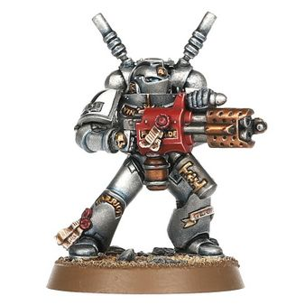
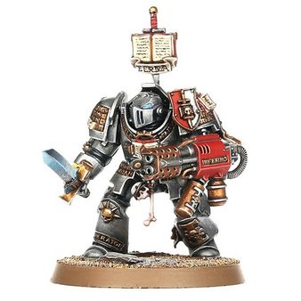
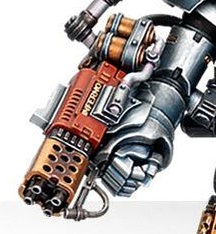

# 1275 焚化枪 Incinerator

精校状态：中文行文已逐段精校，部分术语仍为暂定

分类：武器 / 远程武器

原文来源：https://www.bilibili.com/opus/1218922026538893381

原作者：帝国神选罐头

原文时间：2026年06月28日 18:00

[返回分类目录](目录.md) · [全书目录](../../目录.md)

原篇名：焚化者 Incinerator

<!-- A1275-B0001 -->
**英文原文**

The Incinerator is a weapon crafted exclusively on the moon of Deimos by the Adeptus Mechanicus Tech-artisans, created and designed specifically for the Grey Knights.

<!-- /A1275-B0001 -->

<!-- A1275-B0002 -->

原译文

焚化者是由机械神教技术工匠在火卫二的卫星上专门制作的武器，专为灰骑士创造和设计。

**校订译文**

焚化枪由机械修会技术工匠在迪莫斯上独家制造，专为灰骑士设计。

**校注：** Deimos沿前文迪莫斯，亦即火卫二，现已移至泰坦附近；不是“火卫二的卫星”。

<!-- /A1275-B0002 -->

<!-- A1275-B0003 图片 -->

<!-- A1275-B0004 -->

原译文

Grey Knight with Incinerator 配备焚化者的灰骑士

**校订译文**

Grey Knight with Incinerator 装备焚化枪的灰骑士

<!-- /A1275-B0004 -->

<!-- A1275-B0005 -->
## Overview 概述

<!-- /A1275-B0005 -->

<!-- A1275-B0006 -->
**英文原文**

It has many of the same characteristics as the Heavy Flamer used by many other Imperial forces, but is fuelled by psyflame, a special mix of psychically-charged consecrated promethium and blessed oils which can bypass any protection granted by psychic powers or sorcery. Burning azure and brilliant white with pure faith, and hotter than any regular fire, the flame is especially effective against daemons, even moreso if the bearer is a psyker himself and is able to add his own power to strengthen and direct the jet of fire.

<!-- /A1275-B0006 -->

<!-- A1275-B0007 -->

原译文

它具有许多与许多其他帝国军队使用的重型火焰枪相同的特征，但由灵能火提供燃料，灵能火是一种特殊的混合，由充满灵能的圣钷和圣油组成，可以绕过灵能力量或巫术提供的任何保护。火焰燃烧着湛蓝和明亮的白色，带着纯粹的信仰，比任何普通的火焰都要热，它对恶魔特别有效，如果携带者自己是一名灵能者，并且能够添加自己的力量来加强和引导火焰喷射，就更是如此。

**校订译文**

它与帝国其他部队使用的重型火焰喷射器有许多相似之处，但燃料是“灵能火”——一种由注入灵能的祝圣钷素和圣油调制的特殊混合物，可以绕过灵能力量或巫术提供的防护。这种火焰以纯粹信仰燃烧，呈现湛蓝与耀白色，比普通火焰更热，对恶魔尤其有效。若持枪者本人也是灵能者，还可注入自身力量，增强并引导喷流，进一步提升效果。

<!-- /A1275-B0007 -->

<!-- A1275-B0008 图片 -->

<!-- A1275-B0009 -->

原译文

Grey Knights Terminator with Incinerator 配备焚化者的灰骑士终结者

**校订译文**

Grey Knights Terminator with Incinerator 装备焚化枪的灰骑士终结者

<!-- /A1275-B0009 -->

<!-- A1275-B0010 -->
**英文原文**

After witnessing the terrible power of their allies' weapons, the Inquisitors of the Ordo Malleus sought to obtain a smaller, human-sized variant of the Incinerator for their own use. Akin to a regular flamer, this version is bestowed on Inquisitorial Pyroclasts, and can be found in the hands of the Ecclesiarchy as well. Most of those are kept in the armouries of the Convent Sanctorum, but a rare few have been given to the most ardent of missionaries to help them purge those who would refuse the Imperial Creed.

<!-- /A1275-B0010 -->

<!-- A1275-B0011 -->

原译文

在目睹了盟友武器的可怕力量后，圣锤修会的审判官试图获得一种更小、人类规模的焚化者变体供自己使用。与普通的火焰枪类似，这个版本被授予审判庭火山岩，也可以在国教手中找到。其中大部分保存在圣地修道院的军械库中，但极少数被交给了最热烈的传教士，以帮助他们净化那些拒绝接受帝国信条的人。

**校订译文**

见识到盟友武器的可怕威力后，恶魔审判庭的审判官开始寻求适合普通人使用的轻型焚化枪。这种尺寸接近常规火焰喷射器的型号，会配发给审判庭焚火者，国教会也有使用。大多数存放于圣地修道院的军械库中，只有极少数交给最狂热的传教士，帮助他们清洗拒绝帝国教义的人。

**校注：** Inquisitorial Pyroclasts为审判庭人员，按105篇焚火者；不同于火蜥蜴同名兵种。

<!-- /A1275-B0011 -->

<!-- A1275-B0012 -->
## Heavy Incinerator 重型焚化枪

原题：Heavy Incinerator 重型焚化者

<!-- /A1275-B0012 -->

<!-- A1275-B0013 -->
**英文原文**

A Heavy incinerator is a much larger and therefore much more powerful version of the common Grey Knights Incinerator. It is only known to be mounted on Nemesis Dreadknights.

<!-- /A1275-B0013 -->

<!-- A1275-B0014 -->

原译文

重型焚化者是普通灰骑士焚化者的一个更大、更强的版本。它只被安装在天罚恐惧骑士身上。

**校订译文**

重型焚化枪比灰骑士的常规焚化枪大得多，威力也强得多，目前仅见于涅墨西斯骇骑机甲。

<!-- /A1275-B0014 -->

<!-- A1275-B0015 图片 -->

<!-- A1275-B0016 -->

原译文

Heavy Incinerator 重型焚化者

**校订译文**

Heavy Incinerator 重型焚化枪

<!-- /A1275-B0016 -->

本篇核心术语与暂定项

以下列出本篇出现的英文原形及核心术语表用词。同形词可能指不同对象，具体词义以本篇正文和校注为准；单复数、别名和仅见于图注的名称可能尚未列入。完整候选见[术语表](../../术语表/双语术语候选.csv)。

| 英文 | 采用中文 | 状态 |
| --- | --- | --- |
| Grey Knights | 灰骑士 | 官方已核对 |
| Adeptus Mechanicus | 机械修会 | 官方已核对 |
| Psyker | 灵能者 | 官方已核对 |
| Ordo Malleus | 恶魔审判庭 | 用户指定 |
| Ecclesiarchy | 国教会 | 暂定 |
| Imperial Creed | 帝国教义 | 暂定·官方待核 |
| Deimos | 迪莫斯 | 暂定·官方待核 |
| Tech | 技术语 | 暂定·官方待核 |
| Nemesis | 复仇女神 | 暂定·官方待核 |
| Powers | 能天使 | 暂定·官方待核 |
| Pyroclasts | 焚火者 | 暂定·官方待核 |
| Incinerator | 焚化枪 | 暂定·官方待核 |
| Promethium | 钷素 | 暂定·官方待核 |
| Flamer | 火焰喷射器（武器）／火妖（奸奇单位） | 语境定译·对应官译已核 |
| Convent Sanctorum | 圣地修道院 | 暂定·官方待核 |
| Heavy flamer | 重型火焰喷射器 | 官方已核对 |
| Psyflame | 灵能火 | 暂定·官方待核 |
| Heavy Incinerator | 重型焚化枪 | 暂定·官方待核 |
| Inquisitorial Pyroclasts | 审判庭焚火者 | 暂定·官方待核 |

