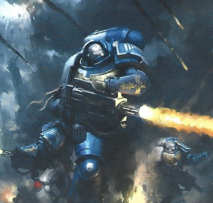

# 1276 热熔武器 Melta Weapon

精校状态：中文行文已逐段精校，部分术语仍为暂定

分类：武器 / 远程武器

原文来源：https://www.bilibili.com/opus/999549489488330759

原作者：帝国神选罐头

原文时间：2024年11月14日 14:02

[返回分类目录](目录.md) · [全书目录](../../目录.md)

<!-- A1276-B0001 -->
**英文原文**

Melta Weapons are potent weapons which work either by sub-atomic agitation of the target causing it to cook or otherwise melt, or by creating a small scale fusion reaction (using a Pyrum/Promethium fuel mix for some imperial weapons), which is projected as a blast which can burn through almost anything, with greater effect the closer to the target.

<!-- /A1276-B0001 -->

<!-- A1276-B0002 -->

原译文

热熔武器是一种强大的武器，其工作原理要么是通过扰动目标的亚原子使其熔化或以其他方式熔化，要么是通过产生小规模的聚变反应（某些帝国武器使用钷素混合物燃料），该反应被预计为几乎可以烧穿任何东西的爆炸，越靠近目标，效果越好。

**校订译文**

热熔武器威力强大，主要有两类原理：一是扰动目标的亚原子结构，将其烤灼或熔化；另一类则制造小规模聚变反应，把释放的能量投射为热能冲击，几乎能烧穿任何物质。部分帝国型号使用派鲁姆与钷素混合燃料。目标距离越近，效果越强。

**校注：** 原译遗漏Pyrum燃料组分，暂译派鲁姆并保留原拼写登记；不补充现实燃料配方。

<!-- /A1276-B0002 -->

<!-- A1276-B0003 图片 -->

<!-- A1276-B0004 -->

原译文

Space Marine fires a Melta Rifle 星际战士发射热熔步枪

**校订译文**

Space Marine fires a Melta Rifle 星际战士发射热熔步枪

<!-- /A1276-B0004 -->

<!-- A1276-B0005 -->
**英文原文**

Although short-ranged and slow to fire, they are prized for their power against armoured vehicles. They are also considered a good alternative to plasma weapons, which are unreliable and capable of killing their user. Besides the roar of the explosive vaporising of the target's moisture, melta weapons themselves make little noise when firing. Given their fairly quiet and very effective nature, infiltrating parties make use of melta weapons to destroy enemy vehicles before they get a chance to fight on the battlefield.

<!-- /A1276-B0005 -->

<!-- A1276-B0006 -->

原译文

虽然射程短，射击缓慢，但它们因对抗装甲车的力量而备受珍视。它们也被认为是等离子武器的良好替代品，等离子武器不可靠，可能杀死使用者。除了目标水分的爆炸蒸发的轰鸣声外，热熔武器本身在射击时几乎不会发出噪音。鉴于其相当安静且非常有效的性质，渗透方在有机会在战场上作战之前，利用热熔武器摧毁敌方车辆。

**校订译文**

虽然射程短、射速低，热熔武器仍因出色的反装甲能力而备受重视。它也被视为等离子武器的理想替代品，后者性能不稳定，甚至可能杀死使用者。除了目标体内水分剧烈汽化时的轰响，热熔武器本身开火声很小。渗透部队因而常借助它安静而高效的特点，在敌方载具来得及投入战斗前就将其摧毁。

<!-- /A1276-B0006 -->

<!-- A1276-B0007 -->
**英文原文**

Many races make use of the same basic technology. In the Imperium they are called meltas, and often referred to as 'fusion guns', 'melters', 'cookers' and 'vape guns'. Equivalent weapons used by other races have similar effects, although sometimes completely different technology and methods of operation. Both the Tau and Eldar use melta weapons, primarily for tank hunting like the Imperium.

<!-- /A1276-B0007 -->

<!-- A1276-B0008 -->

原译文

许多种族使用相同的基本技术。在帝国，它们被称为热熔，通常被称为“融合枪”、“熔化器”、“炊具”和“电子烟枪”。其他种族使用的等效武器具有类似的效果，尽管有时技术和操作方法完全不同。钛和灵族都使用热熔武器，主要用于像帝国这样狩猎坦克。

**校订译文**

许多种族都使用这种基本技术。帝国通常称其为热熔武器，也有“聚变枪”“熔化器”“烤炉”和“汽化枪”等俗称。其他种族的同类武器效果相近，技术与运作方式有时却截然不同。钛族和灵族也像帝国一样，主要将热熔武器用于反坦克作战。

**校注：** vape在此指汽化，不能译成电子烟；cookers为武器绰号，非实用炊具。

<!-- /A1276-B0008 -->

<!-- A1276-B0009 -->
## Imperial Melta Weapons 帝国热熔武器

<!-- /A1276-B0009 -->

<!-- A1276-B0010 -->
### Meltagun 热熔枪

<!-- /A1276-B0010 -->

<!-- A1276-B0011 -->
**英文原文**

The Meltagun is the most commonly seen melta weapon in use by the Imperium and is commonly found throughout all of the Imperium's fighting forces including the Imperial Guard, Space Marines, Ordo Hereticus and Adepta Sororitas.

<!-- /A1276-B0011 -->

<!-- A1276-B0012 -->

原译文

热熔枪是帝国使用中最常见的热熔武器，在帝国的所有战斗部队中都很常见，包括帝国卫队、星际战士、讨逆修会和修女会。

**校订译文**

热熔枪是帝国最常见的热熔武器，广泛装备于帝国卫队、星际战士、异端审判庭及修女会等武装力量。

<!-- /A1276-B0012 -->

<!-- A1276-B0013 -->
### Melta Rifle 热熔步枪

<!-- /A1276-B0013 -->

<!-- A1276-B0014 -->
**英文原文**

The Melta Rifle is used by Eradicator Squads.

<!-- /A1276-B0014 -->

<!-- A1276-B0015 -->

原译文

热熔步枪被根除者小队使用。

**校订译文**

热熔步枪被根除者小队使用。

<!-- /A1276-B0015 -->

<!-- A1276-B0016 -->
### Multi-melta 多管热熔

<!-- /A1276-B0016 -->

<!-- A1276-B0017 -->
**英文原文**

The Multi-melta is a heavier version found primarily on vehicles and occasionally carried by Space Marine Devastator squads and Sisters of Battle.

<!-- /A1276-B0017 -->

<!-- A1276-B0018 -->

原译文

多管热熔是一种较重的版本，主要出现在车辆上，偶尔由星际战士毁灭者小队和战斗修女携带。

**校订译文**

多管热熔是更重型的版本，主要安装于载具，有时也由星际战士破坏者小队和战斗修女携带。

<!-- /A1276-B0018 -->

<!-- A1276-B0019 -->
### Inferno Pistol 地狱火手枪

<!-- /A1276-B0019 -->

<!-- A1276-B0020 -->
**英文原文**

The Inferno Pistol is a very rare and smaller melta weapon, used only by the Sisters of Battle, agents of the Inquisition (Ordo Hereticus and Ordo Malleus), and a select few Space Marines (such as Commander Dante of the Blood Angels Chapter and Vanguard Veterans).

<!-- /A1276-B0020 -->

<!-- A1276-B0021 -->

原译文

地狱火手枪是一种非常罕见且较小的热熔武器，仅由战斗修女、审判庭特工（讨逆修会和圣锤修会）和少数星际战士（如圣血天使战团指挥官但丁和先锋老兵）使用。

**校订译文**

地狱火手枪是一种十分罕见的小型热熔武器，仅由战斗修女、异端审判庭和恶魔审判庭的特工，以及少数星际战士使用，例如圣血天使指挥官但丁和先锋老兵。

<!-- /A1276-B0021 -->

<!-- A1276-B0022 -->
### Melta Cannon 热熔炮

<!-- /A1276-B0022 -->

<!-- A1276-B0023 -->
**英文原文**

The Melta Cannon is a large vehicle-mounted melta weapon, able to destroy several targets at once. It can be found on the Devil Dog, a variant of the Hellhound. An even larger version of the Melta Cannon is mounted on several classes of Imperial Titan.

<!-- /A1276-B0023 -->

<!-- A1276-B0024 -->

原译文

热熔炮是一种大型车载热熔武器，能够同时摧毁多个目标。它可以在地狱犬的变种恶魔犬身上找到。更大版本的热熔炮安装在几类帝国泰坦上。

**校订译文**

热熔炮是一种能同时摧毁多个目标的大型车载热熔武器，可见于地狱犬的恶魔犬改型。若干帝国泰坦型号还装备尺寸更大的热熔炮。

<!-- /A1276-B0024 -->

<!-- A1276-B0025 -->
### Melta Lance 热熔长枪

<!-- /A1276-B0025 -->

<!-- A1276-B0026 -->
### Melta Destroyer 热熔毁灭炮

<!-- /A1276-B0026 -->

<!-- A1276-B0027 -->
### Melta Blast-Gun 热熔爆破炮

原题：Melta Blast-Gun 热熔爆破枪

<!-- /A1276-B0027 -->

<!-- A1276-B0028 -->
### Siege Melta Array 攻城热熔阵列

<!-- /A1276-B0028 -->

<!-- A1276-B0029 -->
### Magna-Melta 巨型热熔

<!-- /A1276-B0029 -->

<!-- A1276-B0030 -->
**英文原文**

The Magna-Melta is an ancient Melta weapon originally developed for space combat, but has since found use on vehicles such as the Deimos Pattern Predator Infernus

<!-- /A1276-B0030 -->

<!-- A1276-B0031 -->

原译文

巨型热熔是一种古老的热熔武器，最初是为太空作战而开发的，但后来被用于迪莫斯型炼狱掠食者等载具上

**校订译文**

巨型热熔是一种古老武器，最初用于太空作战，后来也装备于迪莫斯型炼狱掠食者等载具。

<!-- /A1276-B0031 -->

<!-- A1276-B0032 -->
### Cyclonic Melta Lance 旋风热熔光矛

<!-- /A1276-B0032 -->

<!-- A1276-B0033 -->
### Thermal Spear 热能矛

<!-- /A1276-B0033 -->

<!-- A1276-B0034 -->
**英文原文**

The Thermal Spear is a type of Melta Weapon used by the Knight Armiger.

<!-- /A1276-B0034 -->

<!-- A1276-B0035 -->

原译文

热能矛是侍从骑士使用的一种热熔武器。

**校订译文**

热能矛是侍从骑士使用的一种热熔武器。

<!-- /A1276-B0035 -->

<!-- A1276-B0036 -->
### Melta Torpedo 热熔鱼雷

<!-- /A1276-B0036 -->

<!-- A1276-B0037 -->
**英文原文**

Melta Torpedoes are powerful incendiary weapons used by Imperial Navy warships.

<!-- /A1276-B0037 -->

<!-- A1276-B0038 -->

原译文

热熔鱼雷是帝国海军舰队使用的强大燃烧武器。

**校订译文**

热熔鱼雷是帝国海军军舰使用的强大燃烧武器。

<!-- /A1276-B0038 -->

<!-- A1276-B0039 -->
## Eldar Melta Weapons 灵族热熔武器

<!-- /A1276-B0039 -->

<!-- A1276-B0040 -->
### Fire Pike 火矛

<!-- /A1276-B0040 -->

<!-- A1276-B0041 -->
**英文原文**

The Fire Pike is an Eldar weapon used by the Fire Dragon's Exarch.

<!-- /A1276-B0041 -->

<!-- A1276-B0042 -->

原译文

火矛是火龙主教使用的一种灵族武器。

**校订译文**

火矛是火龙主教使用的一种灵族武器。

<!-- /A1276-B0042 -->

<!-- A1276-B0043 -->
### Fusion Gun 聚变枪

<!-- /A1276-B0043 -->

<!-- A1276-B0044 -->
**英文原文**

The Fusion Gun is an Eldar weapon used by the Fire Dragons Aspect and Storm Guardians.

<!-- /A1276-B0044 -->

<!-- A1276-B0045 -->

原译文

聚变枪是火龙支派和风暴守护者使用的灵族武器。

**校订译文**

聚变枪是火龙支派和风暴守护者使用的灵族武器。

<!-- /A1276-B0045 -->

<!-- A1276-B0046 -->
### Fusion Pistol 聚变手枪

<!-- /A1276-B0046 -->

<!-- A1276-B0047 -->
**英文原文**

The Fusion Pistol is an Eldar weapon used by Harlequins and Autarchs.

<!-- /A1276-B0047 -->

<!-- A1276-B0048 -->

原译文

聚变手枪是丑角和司战使用的灵族武器。

**校订译文**

聚变手枪是丑角和司战使用的灵族武器。

<!-- /A1276-B0048 -->

<!-- A1276-B0049 -->
### Inferno Lance 炼狱光矛

<!-- /A1276-B0049 -->

<!-- A1276-B0050 -->
**英文原文**

The Inferno Lance is an enormous Fusion weapon used by Eldar Wraithknights.

<!-- /A1276-B0050 -->

<!-- A1276-B0051 -->

原译文

炼狱光矛是灵族幽冥骑士使用的一种巨大的聚变武器。

**校订译文**

炼狱光矛是灵族幽冥骑士使用的一种巨大的聚变武器。

<!-- /A1276-B0051 -->

<!-- A1276-B0052 -->
### Heat Lance 热线光矛

<!-- /A1276-B0052 -->

<!-- A1276-B0053 -->
**英文原文**

The Heat Lance is a combination melta and las weapon primarily used by Dark Eldar Reavers and Scourges.

<!-- /A1276-B0053 -->

<!-- A1276-B0054 -->

原译文

热线光矛是一种融合了热熔和激光的武器，主要由黑暗灵族掠夺者和天灾使用。

**校订译文**

热线光矛融合了热熔和激光技术，主要由黑暗灵族劫掠者与天灾使用。

<!-- /A1276-B0054 -->

<!-- A1276-B0055 -->
## Tau Melta Weapons 钛热熔武器

<!-- /A1276-B0055 -->

<!-- A1276-B0056 -->
### Fusion Blaster 融合爆破炮

原题：Fusion Blaster 融合爆破枪

<!-- /A1276-B0056 -->

<!-- A1276-B0057 -->
**英文原文**

The Fusion Blaster is a Tau weapon and is similar to the Imperial version in power.

<!-- /A1276-B0057 -->

<!-- A1276-B0058 -->

原译文

融合爆破枪是一种钛武器，其威力与帝国版本相似。

**校订译文**

融合爆破炮是钛族使用的武器，威力与帝国对应型号相近。

<!-- /A1276-B0058 -->

<!-- A1276-B0059 -->
### Fusion Cascade 融合速射枪

<!-- /A1276-B0059 -->

<!-- A1276-B0060 -->
**英文原文**

The Fusion Cascade is a newly developed Tau weapon which fires in bursts. Due to the increase in amount, the power of each shot is less than the Imperial equivalent. It is equipped on the new Battlesuits.

<!-- /A1276-B0060 -->

<!-- A1276-B0061 -->

原译文

融合速射枪是一种新开发的钛武器，可以连发射击。由于射速的增加，每次射击的威力都小于帝国对应。它装备在新的战斗服上。

**校订译文**

融合速射枪是新开发的钛族武器，能够点射连发。由于单轮射击弹量增加，每发威力低于帝国同类武器，装备于新式战斗服。

<!-- /A1276-B0061 -->

<!-- A1276-B0062 -->
### Fusion Collider 融合对撞枪

<!-- /A1276-B0062 -->

<!-- A1276-B0063 -->
**英文原文**

The Fusion Collider is a heavy Battlesuit-mounted anti-tank weapon.

<!-- /A1276-B0063 -->

<!-- A1276-B0064 -->

原译文

融合对撞枪是一种安装在重型战斗服上的反坦克武器。

**校订译文**

融合对撞枪是一种安装在战斗服上的重型反坦克武器。

**校注：** heavy修饰武器，原译将其错接为重型战斗服。

<!-- /A1276-B0064 -->

<!-- A1276-B0065 -->
### Fusion Eradicator 融合根除者

<!-- /A1276-B0065 -->

<!-- A1276-B0066 -->
**英文原文**

The Fusion Eradicator is the largest and most powerful class of Tau Fusion Weapon.

<!-- /A1276-B0066 -->

<!-- A1276-B0067 -->

原译文

融合根除者是钛融合武器中规模最大、威力最强的一类。

**校订译文**

融合根除者是钛族融合武器中规模最大、威力最强的一类。

<!-- /A1276-B0067 -->

<!-- A1276-B0068 -->
## Necron Melta Weapons 太空死灵热熔武器

原题：Necron Melta Weapons 死灵热熔武器

<!-- /A1276-B0068 -->

<!-- A1276-B0069 -->
### Heat Cannon 热线炮

<!-- /A1276-B0069 -->

<!-- A1276-B0070 -->
**英文原文**

The Heat Cannon is a Necron weapon typically mounted on Sentry Pylons.

<!-- /A1276-B0070 -->

<!-- A1276-B0071 -->

原译文

热线炮是一种通常安装在哨兵炮塔上的死灵武器。

**校订译文**

热线炮是太空死灵通常安装在哨兵方尖碑上的武器。

**校注：** Sentry Pylon暂译哨兵方尖碑，沿太空死灵Pylon词根，具体官方译名待核。

<!-- /A1276-B0071 -->

<!-- A1276-B0072 -->
### Heat Ray 热射线

<!-- /A1276-B0072 -->

<!-- A1276-B0073 -->
**英文原文**

The Heat Ray is a Necron weapon mounted on Triarch Stalkers and capable of anti-tank and anti-infantry modes of fire.

<!-- /A1276-B0073 -->

<!-- A1276-B0074 -->

原译文

热射线是一种安装在三圣追猎者上的死灵武器，能够进行反坦克和反步兵模式的射击。

**校订译文**

热射线是三圣追猎者装备的太空死灵武器，具有反坦克和反步兵两种射击模式。

<!-- /A1276-B0074 -->

本篇核心术语与暂定项

以下列出本篇出现的英文原形及核心术语表用词。同形词可能指不同对象，具体词义以本篇正文和校注为准；单复数、别名和仅见于图注的名称可能尚未列入。完整候选见[术语表](../../术语表/双语术语候选.csv)。

| 英文 | 采用中文 | 状态 |
| --- | --- | --- |
| Space Marines | 星际战士 | 官方已核对 |
| Blood Angels | 圣血天使 | 官方已核对 |
| Adepta Sororitas | 修女会 | 官方已核对 |
| Imperial Guard | 帝国卫队 | 暂定·语境区分 |
| Eldar | 灵族 | 暂定·语境区分 |
| Dark Eldar | 黑暗灵族 | 暂定·旧称对应 |
| Inquisition | 审判庭 | 暂定 |
| Imperium | 帝国 | 暂定·简称 |
| Imperial Navy | 帝国海军 | 暂定 |
| Ordo Malleus | 恶魔审判庭 | 用户指定 |
| Sisters of Battle | 战斗修女 | 暂定·官方待核 |
| Ordo Hereticus | 异端审判庭 | 用户指定 |
| Deimos | 迪莫斯 | 暂定·官方待核 |
| Titan | 泰坦 | 暂定·官方待核 |
| Ancient | 旗手 | 官方已核对 |
| Lance | 骑士矛阵 | 暂定·官方待核 |
| Space Marine | 星际战士 | 暂定·官方待核 |
| Chapter | 战团 | 暂定·官方待核 |
| Devastator | 破坏者 | 暂定·官方待核 |
| Eradicator | 根除者 | 暂定·官方待核 |
| Vanguard | 先锋 | 暂定·官方待核 |
| Dante | 但丁 | 暂定·官方待核 |
| Vanguard Veterans | 先锋老兵 | 暂定·官方待核 |
| Devastator Squads | 破坏者小队 | 暂定·官方待核 |
| Eradicator Squads | 根除者小队 | 暂定·官方待核 |
| Triarch | 三圣（太空死灵统治议会）／三叉戟成员（钢铁勇士职衔） | 语境定译·官方待核 |
| Fire Dragons | 火龙 | 官方已核对 |
| Exarch | 主教（灵族道途） | 暂定·官方待核 |
| Reavers | 劫掠者 | 官方已核对 |
| Fusion Blaster | 融合爆破炮 | 暂定·官方待核 |
| Pylons | 方尖碑 | 暂定·官方待核 |
| Gun | 甘 | 暂定·官方待核 |
| The Blood | 鲜血 | 暂定·官方待核 |
| Promethium | 钷素 | 暂定·官方待核 |
| Plasma Weapons | 等离子武器 | 暂定·官方待核 |
| Melta Weapons | 热熔武器 | 暂定·官方待核 |
| Hellhound | 地狱犬战车 | 官方已核对 |
| Melta Weapon | 热熔武器 | 暂定·官方待核 |
| Pyrum | 派鲁姆 | 暂定·官方待核 |
| Meltagun | 热熔枪 | 官方已核对 |
| Melta Rifle | 热熔步枪 | 暂定·官方待核 |
| Multi-melta | 多管热熔 | 官方已核对 |
| Inferno Pistol | 地狱火手枪 | 暂定·官方待核 |
| Melta Cannon | 热熔炮 | 暂定·官方待核 |
| Magna-Melta | 巨型热熔 | 暂定·官方待核 |
| Thermal Spear | 热能矛 | 暂定·官方待核 |
| Fire Pike | 火矛 | 暂定·官方待核 |
| Fusion Gun | 聚变枪 | 暂定·官方待核 |
| Fusion Pistol | 聚变手枪 | 暂定·官方待核 |
| Inferno Lance | 炼狱光矛 | 暂定·官方待核 |
| Heat Lance | 热线光矛 | 暂定·官方待核 |
| Fusion Cascade | 融合速射枪 | 暂定·官方待核 |
| Fusion Collider | 融合对撞枪 | 暂定·官方待核 |
| Fusion Eradicator | 融合根除者 | 暂定·官方待核 |
| Heat Cannon | 热线炮 | 暂定·官方待核 |
| Heat Ray | 热射线 | 暂定·官方待核 |
| Deimos Pattern Predator | 迪莫斯型掠食者 | 暂定·官方待核 |
| Deimos Pattern Predator Infernus | 迪莫斯型炼狱掠食者 | 暂定·官方待核 |

