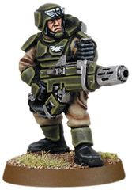
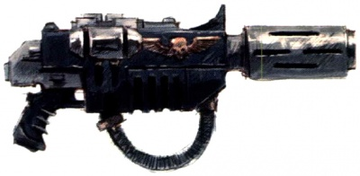
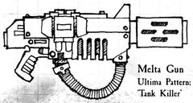
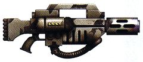
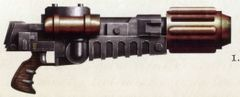
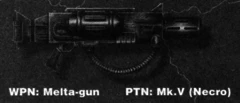
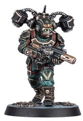

# 1277 热熔枪 Melta Gun

精校状态：中文行文已逐段精校，部分术语仍为暂定

分类：武器 / 远程武器

原文来源：https://www.bilibili.com/opus/1002474757379063811

原作者：帝国神选罐头

原文时间：2024年11月22日 11:14

[返回分类目录](目录.md) · [全书目录](../../目录.md)

<!-- A1277-B0001 -->
**英文原文**

Melta Guns are the basic version of Melta weapons, used by forces of Imperial origin, including the Imperial Guard, Space Marines, Ordo Hereticus and Adepta Sororitas. Given their fairly quiet and very effective nature, infiltrating parties make use of meltaguns to destroy enemy vehicles before they get a chance to fight on the battlefield. They are also given names such as 'fusion guns', 'melters', and 'cookers'.

<!-- /A1277-B0001 -->

<!-- A1277-B0002 -->

原译文

热熔枪是热熔武器的基础版本，由帝国起源的部队使用，包括帝国卫队、星际战士、讨逆修会和修女会。鉴于其相当安静且非常有效的性质，渗透方在有机会在战场上作战之前利用热熔枪摧毁敌方车辆。它们也被命名为“聚变枪”、“熔化器”和“炊具”。

**校订译文**

热熔枪是热熔武器的基础版本，由帝国出身的各支部队使用，包括帝国卫队、星际战士、异端审判庭和修女会。它安静而高效，渗透部队常用它在敌方载具投入战斗前将其摧毁。“聚变枪”“熔化器”和“烤炉”也是它的俗称。

<!-- /A1277-B0002 -->

<!-- A1277-B0003 图片 -->

<!-- A1277-B0004 -->

原译文

Cadian Shock Trooper 卡迪亚突击队

**校订译文**

Cadian Shock Trooper 卡迪亚突击军士兵

<!-- /A1277-B0004 -->

<!-- A1277-B0005 图片 -->

<!-- A1277-B0006 -->

原译文

Catachan Jungle Fighter 卡塔昌丛林战士

**校订译文**

Catachan Jungle Fighter 卡塔昌丛林斗士

<!-- /A1277-B0006 -->

<!-- A1277-B0007 -->
## Overview 概述

<!-- /A1277-B0007 -->

<!-- A1277-B0008 -->
**英文原文**

Meltaguns are effective anti-armour weapons, used by various Imperial forces for close range assault and anti-tank roles. They are most effective at close-range, capable of reducing nearly any material to molten slag through super-heated blasts.

<!-- /A1277-B0008 -->

<!-- A1277-B0009 -->

原译文

热熔枪是有效的反装甲武器，被各种帝国部队用于近距离突击和反坦克任务。它们在近距离下最有效，能够通过过热爆炸将几乎任何材料还原为熔渣。

**校订译文**

热熔枪是有效的反装甲武器，帝国各部队将其用于近距离突击和反坦克任务。它在近距离时威力最强，能以超高温冲击把几乎任何材料化为熔渣。

<!-- /A1277-B0009 -->

<!-- A1277-B0010 图片 -->

<!-- A1277-B0011 -->

原译文

Meltaguns 热熔枪

**校订译文**

Meltaguns 热熔枪

<!-- /A1277-B0011 -->

<!-- A1277-B0012 -->
**英文原文**

Known and Mentioned Meltagun Production Sites and Patterns

<!-- /A1277-B0012 -->

<!-- A1277-B0013 -->

原译文

已知和提及的热熔枪生产地点和型

**校订译文**

已知或有记载的热熔枪产地与型号

<!-- /A1277-B0013 -->

<!-- A1277-B0014 -->

原译文

Ultima Pattern; 'Tank Killer' 极限型；‘坦克杀手’

**校订译文**

Ultima Pattern; 'Tank Killer' 极限型；‘坦克杀手’

<!-- /A1277-B0014 -->

<!-- A1277-B0015 图片 -->

<!-- A1277-B0016 -->

原译文

Ultima Pattern Metla Gun; 'Tank Killer' 极限型热熔枪；‘坦克杀手’

**校订译文**

Ultima Pattern Metla Gun; 'Tank Killer' 极限型热熔枪；‘坦克杀手’

<!-- /A1277-B0016 -->

<!-- A1277-B0017 -->

原译文

Assault Pattern 突击型

**校订译文**

Assault Pattern 突击型

<!-- /A1277-B0017 -->

<!-- A1277-B0018 -->
**英文原文**

Accataran Pattern MkVIII - Used by Elysian Drop Troops

<!-- /A1277-B0018 -->

<!-- A1277-B0019 -->

原译文

阿卡特兰型Mk.VII - 由艾丽西亚空降部队使用

**校订译文**

阿卡特兰型 Mk.VIII——艾丽西亚空降部队使用。

**校注：** 原译把Mk.VIII的8型抄成Mk.VII的7型，已按英文修正；Accataran与已定Accatran按同产地统一中文，英文原样保留。

<!-- /A1277-B0019 -->

<!-- A1277-B0020 图片 -->

<!-- A1277-B0021 -->

原译文

Accataran Pattern MkVIII Meltagun 阿卡特兰型Mk.VII热熔枪

**校订译文**

Accataran Pattern MkVIII Meltagun 阿卡特兰型 Mk.VIII 热熔枪

<!-- /A1277-B0021 -->

<!-- A1277-B0022 -->
**英文原文**

Primus Mk.II — Great Crusade-era Space Marine model

<!-- /A1277-B0022 -->

<!-- A1277-B0023 -->

原译文

首要 Mk.II — 大远征时期星际战士型号

**校订译文**

首要 Mk.II — 大远征时期星际战士型号

<!-- /A1277-B0023 -->

<!-- A1277-B0024 图片 -->

<!-- A1277-B0025 -->

原译文

Primus Mk.II Melta 首要Mk.II热熔枪

**校订译文**

Primus Mk.II Melta 首要Mk.II热熔枪

<!-- /A1277-B0025 -->

<!-- A1277-B0026 -->

原译文

Conflagration Meltagun 爆燃热熔枪

**校订译文**

Conflagration Meltagun 爆燃热熔枪

<!-- /A1277-B0026 -->

<!-- A1277-B0027 -->
**英文原文**

Mk.V Necro Pattern - Used by the Sisters of Battle

<!-- /A1277-B0027 -->

<!-- A1277-B0028 -->

原译文

Mk.V亡灵型 - 战斗修女会使用

**校订译文**

Mk.V亡灵型 - 战斗修女会使用

<!-- /A1277-B0028 -->

<!-- A1277-B0029 图片 -->

<!-- A1277-B0030 -->

原译文

Mk.V Necro Pattern Mk.V亡灵型

**校订译文**

Mk.V Necro Pattern Mk.V亡灵型

<!-- /A1277-B0030 -->

<!-- A1277-B0031 -->
**英文原文**

Melta Carbine - Used by Tempestus Aquilons

<!-- /A1277-B0031 -->

<!-- A1277-B0032 -->

原译文

热熔卡宾枪 - 暴风天鹰使用

**校订译文**

热熔卡宾枪——由风暴天鹰使用。

**校注：** GW09/GW10第8页Tempestus Aquilons官方对应为风暴天鹰。

<!-- /A1277-B0032 -->

<!-- A1277-B0033 图片 -->

<!-- A1277-B0034 -->

原译文

Tempestus Aquilon with Melta Carbine 暴风天鹰装备热熔卡宾枪

**校订译文**

Tempestus Aquilon with Melta Carbine 装备热熔卡宾枪的风暴天鹰

<!-- /A1277-B0034 -->

本篇核心术语与暂定项

以下列出本篇出现的英文原形及核心术语表用词。同形词可能指不同对象，具体词义以本篇正文和校注为准；单复数、别名和仅见于图注的名称可能尚未列入。完整候选见[术语表](../../术语表/双语术语候选.csv)。

| 英文 | 采用中文 | 状态 |
| --- | --- | --- |
| Space Marines | 星际战士 | 官方已核对 |
| Adepta Sororitas | 修女会 | 官方已核对 |
| Imperial Guard | 帝国卫队 | 暂定·语境区分 |
| Great Crusade | 大远征 | 暂定·官方待核 |
| Sisters of Battle | 战斗修女 | 暂定·官方待核 |
| Ordo Hereticus | 异端审判庭 | 用户指定 |
| Space Marine | 星际战士 | 暂定·官方待核 |
| Primus | 领军 | 官方已核对 |
| Melta Weapons | 热熔武器 | 暂定·官方待核 |
| Meltagun | 热熔枪 | 官方已核对 |
| Melta Carbine | 热熔卡宾枪 | 暂定·官方待核 |
| Tempestus Aquilons | 风暴天鹰 | 官方已核对 |
| Elysian Drop Troops | 艾丽西亚空降兵 | 暂定·官方待核 |

