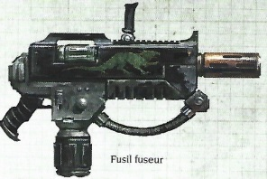
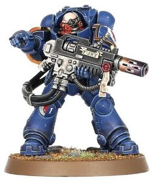

# 1278 热熔步枪 Melta Rifle

精校状态：中文行文已逐段精校，部分术语仍为暂定

分类：武器 / 远程武器

原文来源：https://www.bilibili.com/opus/1001365835452776449

原作者：帝国神选罐头

原文时间：2024年11月19日 11:30

[返回分类目录](目录.md) · [全书目录](../../目录.md)

<!-- A1278-B0001 -->
**英文原文**

Melta Rifles are a type of Melta Weapon used by Primaris Eradicator Squads. An even larger version of the variant rifle exists, known as the Heavy Melta Rifle. This is powered by a cable linking directly to the user's Power Armour.

<!-- /A1278-B0001 -->

<!-- A1278-B0002 -->

原译文

热熔步枪是原铸根除者小队使用的一种热熔武器。存在一种更大型号的变体步枪，称为重型热熔步枪。这是由直接连接到使用者动力盔甲的电缆供电的。

**校订译文**

热熔步枪是原铸根除者小队使用的热熔武器。此外还有尺寸更大的重型热熔步枪，以电缆直接连接使用者的动力装甲供能。

<!-- /A1278-B0002 -->

<!-- A1278-B0003 图片 -->

<!-- A1278-B0004 -->

原译文

Melta Rifle 热熔步枪

**校订译文**

Melta Rifle 热熔步枪

<!-- /A1278-B0004 -->

<!-- A1278-B0005 图片 -->

<!-- A1278-B0006 -->

原译文

Eradicator with Heavy Melta Rifle 根除者装备重型热熔步枪

**校订译文**

Eradicator with Heavy Melta Rifle 根除者装备重型热熔步枪

<!-- /A1278-B0006 -->

本篇核心术语与暂定项

以下列出本篇出现的英文原形及核心术语表用词。同形词可能指不同对象，具体词义以本篇正文和校注为准；单复数、别名和仅见于图注的名称可能尚未列入。完整候选见[术语表](../../术语表/双语术语候选.csv)。

| 英文 | 采用中文 | 状态 |
| --- | --- | --- |
| Power Armour | 动力盔甲 | 暂定·官方待核 |
| Eradicator | 根除者 | 暂定·官方待核 |
| Eradicator Squads | 根除者小队 | 暂定·官方待核 |
| Melta Weapon | 热熔武器 | 暂定·官方待核 |
| Melta Rifle | 热熔步枪 | 暂定·官方待核 |
| Heavy Melta Rifle | 重型热熔步枪 | 暂定·官方待核 |

