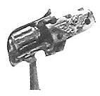
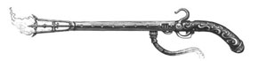
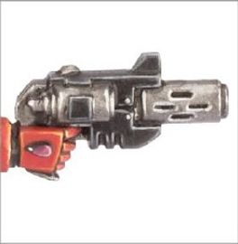
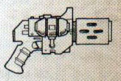

# 1279 地狱火手枪 Inferno Pistol

精校状态：中文行文已逐段精校，部分术语仍为暂定

分类：武器 / 远程武器

原文来源：https://www.bilibili.com/opus/1002090155931074565

原作者：帝国神选罐头

原文时间：编辑于 2025年02月13日 15:43

[返回分类目录](目录.md) · [全书目录](../../目录.md)

原篇名：炼狱手枪 Inferno Pistol

<!-- A1279-B0001 -->
**英文原文**

Inferno Pistols are pistol-sized melta weapons of highly specialised and ancient technology created by Artificers. They are close to impossible to recreate and are rarely used as only a mere handful of them may exist in each Sector of space.

<!-- /A1279-B0001 -->

<!-- A1279-B0002 -->

原译文

炼狱手枪是由工匠创造的高度专业化和古老技术的手枪大小的热熔武器。它们几乎不可能被重新制造，也很少被使用，因为在宇宙的每个星区中可能只存在少数。

**校订译文**

地狱火手枪是工匠以古老而高度专门化的技术制造的手枪型热熔武器，几乎无法仿制，使用也极少：一个星区中可能总共只有寥寥数把。

**校注：** Inferno Pistol沿1276地狱火手枪统一，本篇原题炼狱手枪保留对照；Infernus Pistol在本文作为圣血天使改型另译炼狱手枪。

<!-- /A1279-B0002 -->

<!-- A1279-B0003 图片 -->

<!-- A1279-B0004 -->

原译文

Inferno Pistol 炼狱手枪

**校订译文**

Inferno Pistol 地狱火手枪

<!-- /A1279-B0004 -->

<!-- A1279-B0005 -->
## Overview 概述

<!-- /A1279-B0005 -->

<!-- A1279-B0006 -->
**英文原文**

Possessing an Inferno Pistol is a sign of status, and few but the influential and powerful have the privilege to own one of these valuable devices. Inferno Pistols are available for use by the most privileged members of the Ordo Hereticus and Adepta Sororitas.

<!-- /A1279-B0006 -->

<!-- A1279-B0007 -->

原译文

拥有炼狱手枪是一种地位的象征，除了有影响力和有权势的人外，很少有人有幸拥有这些有价值的装置。炼狱手枪可供讨逆修会和修女会的特许成员使用。

**校订译文**

拥有地狱火手枪是地位的象征，通常只有权势显赫的人才有资格持有。异端审判庭和修女会中地位最特殊的成员，可以获准使用这种珍贵武器。

<!-- /A1279-B0007 -->

<!-- A1279-B0008 图片 -->

<!-- A1279-B0009 -->

原译文

Inferno Pistol of Inquisitor Malich, hand-crafted by Master Artificer Ernst Heckler in M38 审判官马里奇的炼狱手枪，由工匠大师恩斯特·赫克勒在M38手工制作

**校订译文**

Inferno Pistol of Inquisitor Malich, hand-crafted by Master Artificer Ernst Heckler in M38 审判官马里奇的地狱火手枪，由工匠大师恩斯特·赫克勒于M38手工打造

<!-- /A1279-B0009 -->

<!-- A1279-B0010 -->
**英文原文**

The Blood Angels use a variation known as the Infernus Pistol, which are prized relics of the Chapter dating back to the Dark Age of Technology. One of the more famous users of the Infernus Pistol is Commander Dante of the Blood Angels, whose sidearm is known as the Perdition Pistol.

<!-- /A1279-B0010 -->

<!-- A1279-B0011 -->

原译文

圣血天使使用了一种被称为地狱火手枪的变体，这是可追溯到黑暗技术时代的战团珍贵圣物。地狱火手枪最著名的使用者之一是圣血天使的指挥官但丁，他的手枪被称为毁灭手枪。

**校订译文**

圣血天使使用一种名为炼狱手枪的改型，是战团珍藏的遗物，可追溯至黑暗科技时代。著名使用者包括圣血天使指挥官但丁，他的佩枪名为“毁灭手枪”。

**校注：** 本段古老改型的年代照英文保留，不与正文其他工匠制造说法强行合并。

<!-- /A1279-B0011 -->

<!-- A1279-B0012 图片 -->

<!-- A1279-B0013 -->

原译文

Blood Angels Inferno Pistol 圣血天使炼狱手枪

**校订译文**

Blood Angels Inferno Pistol 圣血天使地狱火手枪

<!-- /A1279-B0013 -->

<!-- A1279-B0014 -->
## Types 型号

<!-- /A1279-B0014 -->

<!-- A1279-B0015 -->

原译文

Conflagration Infernus Pistol 爆燃炼狱手枪

**校订译文**

Conflagration Infernus Pistol 爆燃炼狱手枪

<!-- /A1279-B0015 -->

<!-- A1279-B0016 图片 -->

<!-- A1279-B0017 -->

原译文

Mars-pattern Inferno Pistol 火星型炼狱手枪

**校订译文**

Mars-pattern Inferno Pistol 火星型地狱火手枪

<!-- /A1279-B0017 -->

<!-- A1279-B0018 -->
## Notable Inferno Pistols 著名地狱火手枪

原题：Notable Inferno Pistols 著名炼狱手枪

<!-- /A1279-B0018 -->

<!-- A1279-B0019 -->

原译文

Fyrestorm 火焰风暴

**校订译文**

Fyrestorm 火焰风暴

<!-- /A1279-B0019 -->

<!-- A1279-B0020 -->

原译文

Ignis Judicium 烈焰审判

**校订译文**

Ignis Judicium 烈焰审判

<!-- /A1279-B0020 -->

本篇核心术语与暂定项

以下列出本篇出现的英文原形及核心术语表用词。同形词可能指不同对象，具体词义以本篇正文和校注为准；单复数、别名和仅见于图注的名称可能尚未列入。完整候选见[术语表](../../术语表/双语术语候选.csv)。

| 英文 | 采用中文 | 状态 |
| --- | --- | --- |
| Blood Angels | 圣血天使 | 官方已核对 |
| Adepta Sororitas | 修女会 | 官方已核对 |
| Dark Age of Technology | 黑暗科技时代 | 暂定 |
| Ordo Hereticus | 异端审判庭 | 用户指定 |
| Sector | 星区 | 暂定·官方待核 |
| Ancient | 旗手 | 官方已核对 |
| Chapter | 战团 | 暂定·官方待核 |
| Dante | 但丁 | 暂定·官方待核 |
| Perdition Pistol | 毁灭手枪 | 暂定·官方待核 |
| The Dark | 《黑暗》 | 暂定·官方待核 |
| The Blood | 鲜血 | 暂定·官方待核 |
| Melta Weapons | 热熔武器 | 暂定·官方待核 |
| Inferno Pistol | 地狱火手枪 | 暂定·官方待核 |
| Infernus Pistol | 炼狱手枪 | 暂定·官方待核 |

