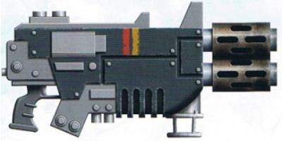
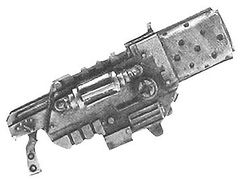
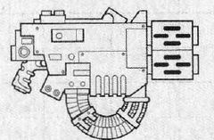
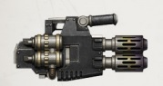
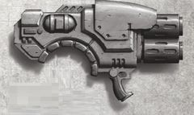

# 1280 多管热熔 Multi-melta

精校状态：中文行文已逐段精校，部分术语仍为暂定

分类：武器 / 远程武器

原文来源：https://www.bilibili.com/opus/1005482720521879575

原作者：帝国神选罐头

原文时间：2024年11月30日 13:46

[返回分类目录](目录.md) · [全书目录](../../目录.md)

<!-- A1280-B0001 -->
**英文原文**

The Multi-melta is a heavy version of the Meltagun that has multiple melta barrels.

<!-- /A1280-B0001 -->

<!-- A1280-B0002 -->

原译文

多管热熔是热熔枪的重型版本，有多个热熔枪管。

**校订译文**

多管热熔是带有多根发射管的重型热熔枪。

<!-- /A1280-B0002 -->

<!-- A1280-B0003 图片 -->

<!-- A1280-B0004 -->

原译文

Multi-melta 多管热熔

**校订译文**

Multi-melta 多管热熔

<!-- /A1280-B0004 -->

<!-- A1280-B0005 -->
## Overview 概述

<!-- /A1280-B0005 -->

<!-- A1280-B0006 -->
**英文原文**

The multi-melta is a vicious and effective Imperial anti-tank weapon, with longer range than its man-portable counterpart but still shorter than other heavy weapons. In different sources, melta weapons are described as firing with either a blinding flash and emitting a beam of light, or just projecting a nearly invisible beam of intense heat. Targets are just melted away, turning creatures to ash and vehicles into twisted goo. Personal armor cannot offer even scant protection from a multi-melta.

<!-- /A1280-B0006 -->

<!-- A1280-B0007 -->

原译文

多管热熔是一种凶猛而有效的帝国反坦克武器，其射程比便携式武器更远，但仍比其他重型武器短。在不同的来源中，热熔武器被描述为用令人致盲的闪光发射光束，或者只是发射出一束几乎看不见的炽热光束。目标被融化，生物变成灰烬，车辆变成扭曲的粘稠物。个人盔甲甚至不能提供足够的保护来抵御多管热熔。

**校订译文**

多管热熔是威力凶猛的帝国反坦克武器，射程长于单兵热熔枪，但仍短于其他重型武器。不同资料对其开火表现的描述有所不同：有的称它伴随炫目闪光射出光束，有的则说它只投射出近乎不可见的强烈热流。目标会被直接熔毁，生物化为灰烬，载具变成扭曲的熔浆。单兵护甲甚至无法提供丝毫防护。

<!-- /A1280-B0007 -->

<!-- A1280-B0008 图片 -->

<!-- A1280-B0009 -->

原译文

Multi-melta 多管热熔

**校订译文**

Multi-melta 多管热熔

<!-- /A1280-B0009 -->

<!-- A1280-B0010 -->
**英文原文**

Due to their size, multi-meltas are usually mounted on vehicles. The Leman Russ Demolisher may have sponson mounted multi-meltas and the Land Raider Crusader has a hull mounted multi-melta, the weapon fitting with both vehicles' short-range firepower. The Immolator may have twin-linked multi-meltas. They are also found mounted on Land Speeders and their variants, Attack Bikes, Razorbacks, and Dreadnoughts.

<!-- /A1280-B0010 -->

<!-- A1280-B0011 -->

原译文

由于其尺寸，多管热熔通常安装在车辆上。黎曼鲁斯粉碎者可能有一个安装在舷侧的多管热熔，而十字军型兰德掠袭者有一个装在车体上的多管热熔，这种武器适合作为两辆载具的短程火力。献祭者可能有双联多管热熔。它们也被安装在兰德速攻艇及其变种、攻击摩托、豪猪战锤和无畏机甲上。

**校订译文**

由于体积庞大，多管热熔通常安装在载具上。黎曼鲁斯破坏者可在侧炮座安装，十字军型兰德掠袭者则在车体上安装，均契合两者近距离作战的火力配置。献祭者可配用双联多管热熔，兰德速攻艇及其改型、攻击摩托、豪猪战车和无畏机甲也会使用。

<!-- /A1280-B0011 -->

<!-- A1280-B0012 图片 -->

<!-- A1280-B0013 -->

原译文

Multi-melta 多管热熔

**校订译文**

Multi-melta 多管热熔

<!-- /A1280-B0013 -->

<!-- A1280-B0014 -->
**英文原文**

Some power armour-equipped forces are known to operate multi-meltas as man-portable units, notably Space Marines and Sisters of Battle. They must still carry the weapon's fuel and power supplies.

<!-- /A1280-B0014 -->

<!-- A1280-B0015 -->

原译文

众所周知，一些装备有动力装甲的部队将多管热熔作为便携式单位，特别是星际战士和战斗修女。他们仍然必须携带武器的燃料和能源。

**校订译文**

一些配备动力装甲的部队，尤其是星际战士和战斗修女，会携行使用多管热熔；他们同时还必须携带武器所需的燃料和能源。

<!-- /A1280-B0015 -->

<!-- A1280-B0016 -->
### Known Multi-Melta Patterns 已知多管热熔型号

<!-- /A1280-B0016 -->

<!-- A1280-B0017 -->
**英文原文**

Maxima Pattern: used by the Astartes

<!-- /A1280-B0017 -->

<!-- A1280-B0018 -->

原译文

马克西姆型：由阿斯塔特使用

**校订译文**

马克西姆型：由阿斯塔特使用

<!-- /A1280-B0018 -->

<!-- A1280-B0019 -->
**英文原文**

Firestorm Multi-melta

<!-- /A1280-B0019 -->

<!-- A1280-B0020 -->

原译文

火焰风暴多管热熔

**校订译文**

火焰风暴多管热熔

<!-- /A1280-B0020 -->

<!-- A1280-B0021 -->
**英文原文**

Sol Militaris Pattern: Used during the Great Crusade and Horus Heresy by the Space Marines. 23-20 Mega-thule, siege assault/Zone Mortalis

<!-- /A1280-B0021 -->

<!-- A1280-B0022 -->

原译文

太阳军型：星际战士在大远征和荷鲁斯叛乱期间使用。23-20兆图(弹匣容量)，围攻攻击/莫塔利斯区

**校订译文**

太阳军型——星际战士在大远征和荷鲁斯之乱期间使用。规格记为“23-20 Mega-thule”，用于攻城突击及死亡区域作战。

**校注：** 原文没有说明Mega-thule参数的量纲，原译擅加“弹匣容量”已删除；23-20照录，不擅改顺序。Zone Mortalis暂译死亡区域，指作战环境术语，非据此认定某个地名。

<!-- /A1280-B0022 -->

<!-- A1280-B0023 图片 -->

<!-- A1280-B0024 -->

原译文

Sol Militaris Pattern 太阳军型

**校订译文**

Sol Militaris Pattern 太阳军型

<!-- /A1280-B0024 -->

<!-- A1280-B0025 -->
**英文原文**

Proteus Pattern: Used during the Great Crusade and Horus Heresy

<!-- /A1280-B0025 -->

<!-- A1280-B0026 -->

原译文

普罗透斯型：在大远征和荷鲁斯叛乱时期使用

**校订译文**

普罗透斯型——大远征和荷鲁斯之乱期间使用。

<!-- /A1280-B0026 -->

<!-- A1280-B0027 图片 -->

<!-- A1280-B0028 -->

原译文

Proteus Pattern 普罗透斯型

**校订译文**

Proteus Pattern 普罗透斯型

<!-- /A1280-B0028 -->

<!-- A1280-B0029 -->
**英文原文**

Thermic Lance Mk.XI Pattern: Used by House Van Saar of Necromunda.

<!-- /A1280-B0029 -->

<!-- A1280-B0030 -->

原译文

热枪Mk.XI型：由涅克罗蒙达的凡萨尔家族使用。

**校订译文**

Mk.XI 热能长矛型——涅克罗蒙达凡·萨尔家族使用。

<!-- /A1280-B0030 -->

<!-- A1280-B0031 图片 -->

<!-- A1280-B0032 -->

原译文

Thermic Lance Mk.XI Pattern 热枪Mk.XI型

**校订译文**

Thermic Lance Mk.XI Pattern Mk.XI 热能长矛型

<!-- /A1280-B0032 -->

本篇核心术语与暂定项

以下列出本篇出现的英文原形及核心术语表用词。同形词可能指不同对象，具体词义以本篇正文和校注为准；单复数、别名和仅见于图注的名称可能尚未列入。完整候选见[术语表](../../术语表/双语术语候选.csv)。

| 英文 | 采用中文 | 状态 |
| --- | --- | --- |
| Space Marines | 星际战士 | 官方已核对 |
| Horus Heresy | 荷鲁斯之乱 | 官方已核对 |
| Necromunda | 涅克罗蒙达 | 暂定·官方待核 |
| House Van Saar | 凡·萨尔家族 | 暂定·官方待核 |
| Great Crusade | 大远征 | 暂定·官方待核 |
| Horus | 荷鲁斯 | 暂定·官方待核 |
| Sisters of Battle | 战斗修女 | 暂定·官方待核 |
| Land Raider | 兰德掠袭者战车 | 官方已核对 |
| Immolator | 献祭者装甲车 | 官方已核对 |
| Lance | 骑士矛阵 | 暂定·官方待核 |
| Sol | 太阳系 | 暂定·官方待核 |
| Power Armour | 动力盔甲 | 暂定·官方待核 |
| Land Speeders | 兰德速攻艇 | 暂定·官方待核 |
| Proteus | 普罗透斯 | 暂定·官方待核 |
| Raider | 掠袭者飞艇 | 官方已核对 |
| Bikes | 摩托 | 暂定·官方待核 |
| Thule | 图勒 | 暂定·官方待核 |
| The Weapon | 武器 | 暂定·官方待核 |
| Leman Russ Demolisher | 黎曼鲁斯破坏者 | 官方已核·中英对照 |
| Sol Militaris Pattern | 太阳军型 | 暂定·官方待核 |
| Melta Weapons | 热熔武器 | 暂定·官方待核 |
| Meltagun | 热熔枪 | 官方已核对 |
| Multi-melta | 多管热熔 | 官方已核对 |
| Firestorm Multi-melta | 火焰风暴多管热熔 | 暂定·官方待核 |
| Thermic Lance Mk.XI Pattern | Mk.XI 热能长矛型 | 暂定·官方待核 |
| Zone Mortalis | 死亡区域 | 暂定·官方待核 |
| Land Raider Crusader | 十字军型兰德掠袭者战车 | 官方已核对 |

