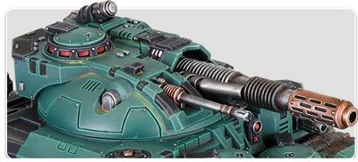

# 1281 热熔爆破炮 Melta Blast-Gun

精校状态：中文行文已逐段精校，部分术语仍为暂定

分类：武器 / 远程武器

原文来源：https://www.bilibili.com/opus/1011362964569063444

原作者：帝国神选罐头

原文时间：编辑于 2024年12月16日 16:33

[返回分类目录](目录.md) · [全书目录](../../目录.md)

<!-- A1281-B0001 -->
**英文原文**

The Melta Blast-Gun is a type of heavy Melta Weapon that was mounted on the Kratos Space Marine Heavy Tank. The weapon specialized in destroying enemy vehicles.

<!-- /A1281-B0001 -->

<!-- A1281-B0002 -->

原译文

热熔爆破炮是一种重型热熔武器，安装在星际战士奎托斯重型坦克上。是专门用于摧毁敌方车辆的武器。

**校订译文**

热熔爆破炮是安装在星际战士奎托斯重型坦克上的重型热熔武器，专门用于摧毁敌方载具。

<!-- /A1281-B0002 -->

<!-- A1281-B0003 图片 -->

<!-- A1281-B0004 -->

原译文

Melta Blast-Gun 热熔爆破炮

**校订译文**

Melta Blast-Gun 热熔爆破炮

<!-- /A1281-B0004 -->

本篇核心术语与暂定项

以下列出本篇出现的英文原形及核心术语表用词。同形词可能指不同对象，具体词义以本篇正文和校注为准；单复数、别名和仅见于图注的名称可能尚未列入。完整候选见[术语表](../../术语表/双语术语候选.csv)。

| 英文 | 采用中文 | 状态 |
| --- | --- | --- |
| Space Marine | 星际战士 | 暂定·官方待核 |
| The Weapon | 武器 | 暂定·官方待核 |
| Gun | 甘 | 暂定·官方待核 |
| Melta Weapon | 热熔武器 | 暂定·官方待核 |
| Melta Blast-Gun | 热熔爆破炮 | 暂定·官方待核 |

