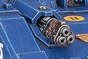

# 1282 热熔毁灭炮 Melta Destroyer

精校状态：中文行文已逐段精校，部分术语仍为暂定

分类：武器 / 远程武器

原文来源：https://www.bilibili.com/opus/1005482561631158290

原作者：帝国神选罐头

原文时间：2024年11月30日 13:45

[返回分类目录](目录.md) · [全书目录](../../目录.md)

原篇名：热熔破坏炮 Melta Destroyer

<!-- A1282-B0001 -->
**英文原文**

The Melta Destroyer is a heavy triple-barreled Melta Weapon mounted on Space Marine Storm Speeder Hammerstrike vehicles.

<!-- /A1282-B0001 -->

<!-- A1282-B0002 -->

原译文

热熔破坏炮是一种重型三管热熔武器，安装在星际战士锤击型风暴速攻艇载具上。

**校订译文**

热熔毁灭炮是安装于星际战士锤击型风暴速攻艇的重型三管热熔武器。

<!-- /A1282-B0002 -->

<!-- A1282-B0003 图片 -->

<!-- A1282-B0004 -->

原译文

Melta Destroyer 热熔破坏炮

**校订译文**

Melta Destroyer 热熔毁灭炮

<!-- /A1282-B0004 -->

本篇核心术语与暂定项

以下列出本篇出现的英文原形及核心术语表用词。同形词可能指不同对象，具体词义以本篇正文和校注为准；单复数、别名和仅见于图注的名称可能尚未列入。完整候选见[术语表](../../术语表/双语术语候选.csv)。

| 英文 | 采用中文 | 状态 |
| --- | --- | --- |
| Destroyer | 毁灭者 | 暂定·官方待核 |
| Space Marine | 星际战士 | 暂定·官方待核 |
| Storm Speeder | 风暴速攻艇 | 暂定·官方待核 |
| Melta Weapon | 热熔武器 | 暂定·官方待核 |
| Melta Destroyer | 热熔毁灭炮 | 暂定·官方待核 |
| Storm Speeder Hammerstrike | 锤击型风暴速攻艇 | 官方已核对 |

