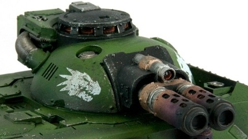

# 1283 巨型热熔 Magna-Melta

精校状态：中文行文已逐段精校，部分术语仍为暂定

分类：武器 / 远程武器

原文来源：https://www.bilibili.com/opus/1005482484334329896

原作者：帝国神选罐头

原文时间：2024年11月30日 13:45

[返回分类目录](目录.md) · [全书目录](../../目录.md)

<!-- A1283-B0001 -->
**英文原文**

The Magna-Melta is a heavy Melta Weapon used by the Imperium. It is a devastating anti-armor weapon, originally designed for boarding actions during space combat. However it has since been used in a number of other platforms, most notably the Deimos Pattern Predator Infernus and Caestus Assault Ram.

<!-- /A1283-B0001 -->

<!-- A1283-B0002 -->

原译文

巨型热熔炮是帝国使用的重型热熔武器。它是一种毁灭性的反装甲武器，最初设计用于太空战斗中的登舰行动。然而，自那以后，它已被用于许多其他平台，最著名的是火卫二型炼狱掠食者和卡瑟图斯突击艇。

**校订译文**

巨型热熔是帝国使用的重型热熔武器，反装甲威力极强。它最初用于太空战中的登舰突击，后来也被装到其他平台上，尤其是迪莫斯型炼狱掠食者和拳套突击撞击艇。

<!-- /A1283-B0002 -->

<!-- A1283-B0003 图片 -->

<!-- A1283-B0004 -->

原译文

Magna-Melta on a Deimos Pattern Predator Infernus 火卫二型炼狱掠食者上的巨型热熔炮

**校订译文**

Magna-Melta on a Deimos Pattern Predator Infernus 迪莫斯型炼狱掠食者上的巨型热熔

<!-- /A1283-B0004 -->

本篇核心术语与暂定项

以下列出本篇出现的英文原形及核心术语表用词。同形词可能指不同对象，具体词义以本篇正文和校注为准；单复数、别名和仅见于图注的名称可能尚未列入。完整候选见[术语表](../../术语表/双语术语候选.csv)。

| 英文 | 采用中文 | 状态 |
| --- | --- | --- |
| Imperium | 帝国 | 暂定·简称 |
| Deimos | 迪莫斯 | 暂定·官方待核 |
| Caestus Assault Ram | 拳套突击撞击艇 | 暂定·官方待核 |
| Melta Weapon | 热熔武器 | 暂定·官方待核 |
| Magna-Melta | 巨型热熔 | 暂定·官方待核 |
| Deimos Pattern Predator | 迪莫斯型掠食者 | 暂定·官方待核 |
| Deimos Pattern Predator Infernus | 迪莫斯型炼狱掠食者 | 暂定·官方待核 |

