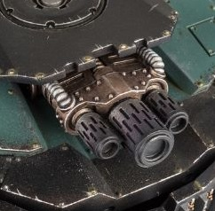

# 1284 攻城热熔阵列 Siege Melta Array

精校状态：中文行文已逐段精校，部分术语仍为暂定

分类：武器 / 远程武器

原文来源：https://www.bilibili.com/opus/1012147174054559747

原作者：帝国神选罐头

原文时间：2024年12月18日 12:47

[返回分类目录](目录.md) · [全书目录](../../目录.md)

<!-- A1284-B0001 -->
**英文原文**

The Siege Melta Array was a type of Melta Weapon used by Space Marine Mastodons during the Great Crusade and Horus Heresy. This massive weapon could easily destroy fortifications, and makes short work of armoured vehicles.

<!-- /A1284-B0001 -->

<!-- A1284-B0002 -->

原译文

攻城热熔阵列是星际战士乳齿象在大十远征和荷鲁斯叛乱期间使用的一种热熔武器。这种巨大的武器可以很容易地摧毁防御工事，并且能迅速解决装甲车辆。

**校订译文**

攻城热熔阵列是星际战士乳齿象载具在大远征和荷鲁斯之乱期间使用的热熔武器。这种巨型武器能轻易摧毁防御工事，也能迅速消灭装甲载具。

<!-- /A1284-B0002 -->

<!-- A1284-B0003 图片 -->

<!-- A1284-B0004 -->

原译文

Siege Melta Array 攻城热熔阵列

**校订译文**

Siege Melta Array 攻城热熔阵列

<!-- /A1284-B0004 -->

本篇核心术语与暂定项

以下列出本篇出现的英文原形及核心术语表用词。同形词可能指不同对象，具体词义以本篇正文和校注为准；单复数、别名和仅见于图注的名称可能尚未列入。完整候选见[术语表](../../术语表/双语术语候选.csv)。

| 英文 | 采用中文 | 状态 |
| --- | --- | --- |
| Horus Heresy | 荷鲁斯之乱 | 官方已核对 |
| Great Crusade | 大远征 | 暂定·官方待核 |
| Horus | 荷鲁斯 | 暂定·官方待核 |
| Space Marine | 星际战士 | 暂定·官方待核 |
| Melta Weapon | 热熔武器 | 暂定·官方待核 |
| Siege Melta Array | 攻城热熔阵列 | 暂定·官方待核 |

