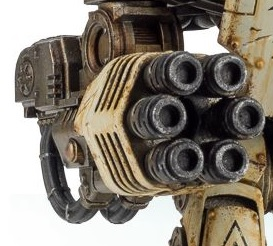

# 1285 旋风热熔光矛 Cyclonic Melta Lance

精校状态：中文行文已逐段精校，部分术语仍为暂定

分类：武器 / 远程武器

原文来源：https://www.bilibili.com/opus/1011020947734396964

原作者：帝国神选罐头

原文时间：2024年12月15日 11:57

[返回分类目录](目录.md) · [全书目录](../../目录.md)

<!-- A1285-B0001 -->
**英文原文**

The Cyclonic Melta Lance is a type of heavy Imperial Melta Weapon. Developed exclusively for the Leviathan Siege Dreadnought during the Great Crusade and Horus Heresy, this powerful weapon could reduce enemy armour to molten slag.

<!-- /A1285-B0001 -->

<!-- A1285-B0002 -->

原译文

旋风热熔光矛是一种重型帝国热熔武器。在大远征和荷鲁斯叛乱期间，这种强大的武器专门为利维坦攻城无畏开发，可以将敌人的盔甲变成熔渣。

**校订译文**

旋风热熔光矛是帝国的重型热熔武器，在大远征和荷鲁斯之乱时期专为利维坦攻城无畏机甲研制，能将敌方装甲熔成残渣。

<!-- /A1285-B0002 -->

<!-- A1285-B0003 图片 -->

<!-- A1285-B0004 -->

原译文

Cyclonic Melta Lance 旋风热熔光矛

**校订译文**

Cyclonic Melta Lance 旋风热熔光矛

<!-- /A1285-B0004 -->

本篇核心术语与暂定项

以下列出本篇出现的英文原形及核心术语表用词。同形词可能指不同对象，具体词义以本篇正文和校注为准；单复数、别名和仅见于图注的名称可能尚未列入。完整候选见[术语表](../../术语表/双语术语候选.csv)。

| 英文 | 采用中文 | 状态 |
| --- | --- | --- |
| Horus Heresy | 荷鲁斯之乱 | 官方已核对 |
| Great Crusade | 大远征 | 暂定·官方待核 |
| Horus | 荷鲁斯 | 暂定·官方待核 |
| Lance | 骑士矛阵 | 暂定·官方待核 |
| Dreadnought | 无畏机甲 | 暂定·官方待核 |
| Cyclonic Melta Lance | 旋风热熔光矛 | 暂定·官方待核 |
| Melta Weapon | 热熔武器 | 暂定·官方待核 |
| Melta Lance | 热熔长枪 | 暂定·官方待核 |
| Siege Dreadnought | 攻城无畏机甲 | 暂定·官方待核 |

