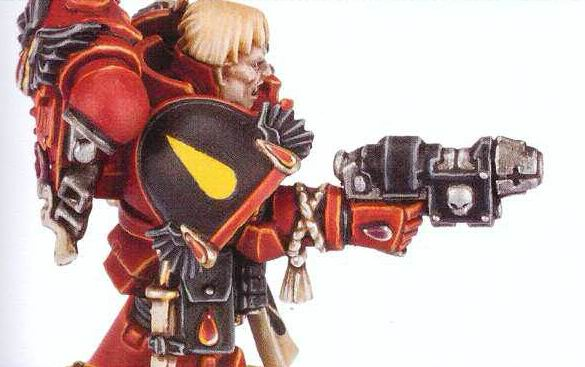

# 1286 重力武器 Graviton Weapon

精校状态：中文行文已逐段精校，部分术语仍为暂定

分类：武器 / 远程武器

原文来源：https://www.bilibili.com/opus/998095917951221767

原作者：帝国神选罐头

原文时间：2024年11月10日 16:01

[返回分类目录](目录.md) · [全书目录](../../目录.md)

<!-- A1286-B0001 -->
**英文原文**

Graviton Weapons are ancient and little-understood weapons dating back to the Dark Age of Technology.

<!-- /A1286-B0001 -->

<!-- A1286-B0002 -->

原译文

重力武器是一种古老而鲜为人知的武器，可以追溯到黑暗技术时代。

**校订译文**

重力武器是可追溯至黑暗科技时代的古老武器，其原理鲜为人知。

<!-- /A1286-B0002 -->

<!-- A1286-B0003 图片 -->

<!-- A1286-B0004 -->

原译文

Blood Angels Sergeant with a Grav-Pistol 圣血天使军士装备重力手枪

**校订译文**

Blood Angels Sergeant with a Grav-Pistol 圣血天使军士装备重力手枪

<!-- /A1286-B0004 -->

<!-- A1286-B0005 -->
**英文原文**

They refer to a group of gravity projector devices whose sophistication is such that few remained even in the Great Crusade era. Such weapons, however, are extremely useful when fighting on a starship or zero-gravity environment. The power of the graviton gun's highest settings is sufficient to rupture organs and smash bones that are encased even in armor, but its primary use is to impede the enemy and damage machinery.

<!-- /A1286-B0005 -->

<!-- A1286-B0006 -->

原译文

它们指的是一组重力投射设备，其复杂程度使得即使在大远征时代也很少有人留下来。然而，在星舰或零重力环境中作战时，这种武器非常有用。重力枪最高设置的力量足以使器官破裂，甚至可以粉碎包裹在盔甲中的骨头，但它的主要用途是阻碍敌人和破坏机械。

**校订译文**

这一名称泛指一类重力投射装置。它们技术极其复杂，即使在大远征时代，留存下来的数量也已很少。不过，在星舰内部或零重力环境中，它们极有价值。重力枪调至最高功率时，足以隔着护甲震碎骨骼、撕裂脏器，但主要用途仍是阻滞敌人和破坏机械。

**校注：** few remained指留存的武器很少，不是“很少有人留下来”。

<!-- /A1286-B0006 -->

<!-- A1286-B0007 -->
## Types 种类

<!-- /A1286-B0007 -->

<!-- A1286-B0008 -->
### Imperial 帝国

<!-- /A1286-B0008 -->

<!-- A1286-B0009 -->
### Melee 近战

<!-- /A1286-B0009 -->

<!-- A1286-B0010 -->

原译文

Graviton Hammer 重力锤

**校订译文**

Graviton Hammer 重力锤

<!-- /A1286-B0010 -->

<!-- A1286-B0011 -->

原译文

Graviton Mace 重力权杖

**校订译文**

Graviton Mace 重力战槌

**校注：** Mace为打击兵器，不是象征权力的权杖。

<!-- /A1286-B0011 -->

<!-- A1286-B0012 -->

原译文

Graviton Crusher 重力粉碎机

**校订译文**

Graviton Crusher 重力粉碎器

<!-- /A1286-B0012 -->

<!-- A1286-B0013 -->

原译文

Graviton Maul 重力槌

**校订译文**

Graviton Maul 重力槌

<!-- /A1286-B0013 -->

<!-- A1286-B0014 -->
### Ranged 远程

<!-- /A1286-B0014 -->

<!-- A1286-B0015 -->

原译文

Grav-pistol - Pistol version 重力手枪 - 手枪型号

**校订译文**

Grav-pistol - Pistol version 重力手枪 - 手枪型号

<!-- /A1286-B0015 -->

<!-- A1286-B0016 -->

原译文

Graviton Gun - Infantry-carried version 重力枪 - 步兵携带型号

**校订译文**

Graviton Gun - Infantry-carried version 重力枪 - 步兵携带型号

<!-- /A1286-B0016 -->

<!-- A1286-B0017 -->

原译文

Graviton Cannon - Heavy vehicle-based version 重力炮 - 重型基本载具型号

**校订译文**

Graviton Cannon - Heavy vehicle-based version 重力炮——重型车载版本

<!-- /A1286-B0017 -->

<!-- A1286-B0018 -->

原译文

Deathwatch Graviton Cannon 死亡守望重力炮

**校订译文**

Deathwatch Graviton Cannon 死亡守望重力炮

<!-- /A1286-B0018 -->

<!-- A1286-B0019 -->

原译文

Graviton Imploder 重力内爆器

**校订译文**

Graviton Imploder 重力内爆器

<!-- /A1286-B0019 -->

<!-- A1286-B0020 -->

原译文

Combi-Grav 复合重力枪

**校订译文**

Combi-Grav 复合重力枪

<!-- /A1286-B0020 -->

<!-- A1286-B0021 -->

原译文

Graviton Pulsar 重力脉冲枪

**校订译文**

Graviton Pulsar 重力脉冲枪

<!-- /A1286-B0021 -->

<!-- A1286-B0022 -->

原译文

Graviton Singularity Cannon 重力奇点炮

**校订译文**

Graviton Singularity Cannon 重力奇点炮

<!-- /A1286-B0022 -->

<!-- A1286-B0023 -->

原译文

Grav Flux Bombard 重力熔解臼炮

**校订译文**

Grav Flux Bombard 重力通量轰击炮

<!-- /A1286-B0023 -->

<!-- A1286-B0024 -->

原译文

Graviton Ram 重力攻城锤

**校订译文**

Graviton Ram 重力攻城锤

<!-- /A1286-B0024 -->

<!-- A1286-B0025 -->

原译文

Graviton Charge Cannon 重力电荷炮

**校订译文**

Graviton Charge Cannon 重力充能炮

<!-- /A1286-B0025 -->

<!-- A1286-B0026 -->

原译文

Graviton Onager 重力投射器

**校订译文**

Graviton Onager 重力投石机

<!-- /A1286-B0026 -->

<!-- A1286-B0027 -->

原译文

Krius Grav Imploder 克里乌斯重力内爆器

**校订译文**

Krius Grav Imploder 克里乌斯重力内爆器

<!-- /A1286-B0027 -->

<!-- A1286-B0028 -->

原译文

Graviton Destructor 重力破坏者

**校订译文**

Graviton Destructor 重力破坏者

<!-- /A1286-B0028 -->

<!-- A1286-B0029 -->

原译文

Graviton Ruinator 重力毁灭者

**校订译文**

Graviton Ruinator 重力毁灭者

<!-- /A1286-B0029 -->

<!-- A1286-B0030 -->

原译文

Giga-Graviton Cannon 千兆重力炮

**校订译文**

Giga-Graviton Cannon 千兆重力炮

<!-- /A1286-B0030 -->

<!-- A1286-B0031 -->
### Leagues of Votann 沃坦联盟

<!-- /A1286-B0031 -->

<!-- A1286-B0032 -->

原译文

Graviton Hammer 重力锤

**校订译文**

Graviton Hammer 重力锤

<!-- /A1286-B0032 -->

<!-- A1286-B0033 -->

原译文

Graviton Rifle 重力步枪

**校订译文**

Graviton Rifle 重力步枪

<!-- /A1286-B0033 -->

<!-- A1286-B0034 -->

原译文

Graviton Blast Cannon 重力冲击炮

**校订译文**

Graviton Blast Cannon 重力冲击炮

<!-- /A1286-B0034 -->

本篇核心术语与暂定项

以下列出本篇出现的英文原形及核心术语表用词。同形词可能指不同对象，具体词义以本篇正文和校注为准；单复数、别名和仅见于图注的名称可能尚未列入。完整候选见[术语表](../../术语表/双语术语候选.csv)。

| 英文 | 采用中文 | 状态 |
| --- | --- | --- |
| Dark Age of Technology | 黑暗科技时代 | 暂定 |
| Great Crusade | 大远征 | 暂定·官方待核 |
| Ancient | 旗手 | 官方已核对 |
| Gun | 甘 | 暂定·官方待核 |
| The Dark | 《黑暗》 | 暂定·官方待核 |
| Zero | 零世界 | 暂定·官方待核 |
| Graviton Gun | 重力枪 | 暂定·官方待核 |

