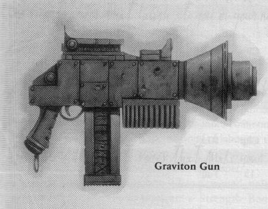
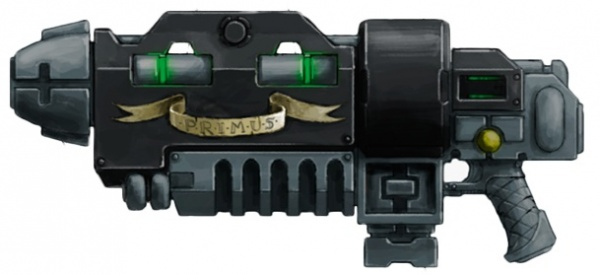
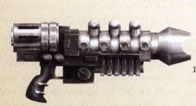
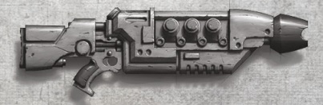
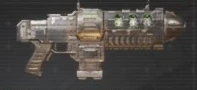

# 1288 重力枪 Graviton Gun

精校状态：中文行文已逐段精校，部分术语仍为暂定

分类：武器 / 远程武器

原文来源：https://www.bilibili.com/opus/1002089924028006448

原作者：帝国神选罐头

原文时间：编辑于 2025年05月13日 15:03

[返回分类目录](目录.md) · [全书目录](../../目录.md)

<!-- A1288-B0001 图片 -->

<!-- A1288-B0002 -->

原译文

Graviton gun 重力枪

**校订译文**

Graviton gun 重力枪

<!-- /A1288-B0002 -->

<!-- A1288-B0003 -->
**英文原文**

The Graviton Gun is an exotic and unconventional Grav-Weapon used by the Imperium.

<!-- /A1288-B0003 -->

<!-- A1288-B0004 -->

原译文

重力枪是帝国使用的一种奇特而非传统的重力武器。

**校订译文**

重力枪是帝国使用的一种奇特而非传统的重力武器。

<!-- /A1288-B0004 -->

<!-- A1288-B0005 图片 -->

<!-- A1288-B0006 -->

原译文

Grav-gun 重力枪

**校订译文**

Grav-gun 重力枪

<!-- /A1288-B0006 -->

<!-- A1288-B0007 -->
## Overview 概述

<!-- /A1288-B0007 -->

<!-- A1288-B0008 -->
**英文原文**

It is a medium-sized weapon which utilises the gravitic reaction principle most commonly seen powering grav-vehicles such as the Land Speeder. Each gun is a rare relic left over from the Dark Age of Technology and are now sacredly guarded by the Adeptus Mechanicus, and very rarely will they allow one to leave their armouries, but some Space Marine Chapters still field a handful of such weapons.

<!-- /A1288-B0008 -->

<!-- A1288-B0009 -->

原译文

它是一种中型武器，利用重力反应原理，最常见的是为兰德掠袭者等轻型载具提供动力。每一把枪都是黑暗技术时代留下的罕见遗物，现在由机械神教神圣地守卫着，他们很少允许一把枪离开他们的军械库，但一些星际战士战团仍然部署着少量这样的武器。

**校订译文**

它是一种中型武器，利用与兰德速攻艇等反重力载具相同的重力反应原理。每一把都是黑暗科技时代留下的稀有遗物，如今由机械修会严加珍藏，极少获准离开军械库。不过，一些星际战士战团仍有少量装备。

**校注：** Land Speeder是兰德速攻艇，原译兰德掠袭者混淆了两类载具；grav-vehicles是反重力载具，不是轻型载具。

<!-- /A1288-B0009 -->

<!-- A1288-B0010 图片 -->

<!-- A1288-B0011 -->

原译文

Heresy-era Autotellurian-Pattern Graviton gun 叛乱时期自动实相型重力枪

**校订译文**

Heresy-era Autotellurian-Pattern Graviton gun 荷鲁斯之乱时期的自动实相型重力枪

<!-- /A1288-B0011 -->

<!-- A1288-B0012 -->
**英文原文**

Graviton gun was originally developed for non-military purposes in low gravity environments to increase objects relative weight. The weapon fires a stream of particles which affects the local gravitational field of a target area, making the targeted object either far heavier or lighter depending on the weapon's setting. The gun also creates a bass rumble as the waves affect the local air pressure, causing the air to vibrate. The effect is generally non-lethal and can be used to incapacitate foes who need to be captured alive, but the power of the graviton gun's highest settings is sufficient to rupture organs and crack bones even inside armour. Some living targets will be affected more variably; a very large creature may be killed under excessive weight, but most targets will either be slowed or completely immobilised. The graviton gun is very useful when fighting on a star ship or a null gravity environment, as well as for demolition and siege work, as it is most effective against massive objects such as bunkers or fortifications, where the building's great mass can be used against it, causing it to collapse.

<!-- /A1288-B0012 -->

<!-- A1288-B0013 -->

原译文

重力枪最初是在低重力环境中为非军事目的而开发的，目的是增加物体的相对重量。武器发射的粒子流会影响目标区域的局部引力场，根据武器的设置，使目标物体变得更重或更轻。当波影响当地气压，导致空气振动时，枪还会发出低沉的隆隆声。这种效果通常是非致命的，可以用来使需要活捉的敌人丧失能力，但重力枪最高设置的力量足以使器官破裂，甚至在盔甲内也能折断骨头。一些活目标将受到更为多变的影响；一个非常大的生物可能会在过重的重量下被杀死，但大多数目标要么会减速，要么会完全静止。重力枪在太空舰船或零重力环境中作战时非常有用，也适用于拆除和攻城工作，因为它对掩体或防御工事等大型物体最有效，因为建筑物的巨大质量可以用来对抗它自己，导致它倒塌。

**校订译文**

重力枪最初用于低重力环境中的民用作业，以增加物体的相对重量。它发射的粒子流会改变目标区域的局部引力场，按设定使目标显著变重或变轻。重力波影响局部气压、使空气振动时，还会发出低沉轰鸣。这种效果通常不致命，可用于制服需要活捉的敌人；但最高功率仍足以隔着护甲撕裂脏器、折断骨骼。不同生物受到的影响不尽相同，庞大生物可能被自身骤增的重量压死，而多数目标则会行动迟缓或完全无法移动。重力枪不仅适合星舰内部和零重力作战，也可用于拆除和攻城。碉堡或防御工事等巨型目标尤为脆弱，其庞大质量反而会成为致命弱点，使建筑自行坍塌。

<!-- /A1288-B0013 -->

<!-- A1288-B0014 图片 -->

<!-- A1288-B0015 -->

原译文

House Van Saar Hystrar Mk.XII Pattern Grav Gun 凡萨尔家族海斯特拉Mk.XII型重力枪

**校订译文**

House Van Saar Hystrar Mk.XII Pattern Grav Gun 凡·萨尔家族海斯特拉Mk.XII型重力枪

<!-- /A1288-B0015 -->

<!-- A1288-B0016 -->
## Patterns 型号

<!-- /A1288-B0016 -->

<!-- A1288-B0017 -->
### Wrath 暴怒

<!-- /A1288-B0017 -->

<!-- A1288-B0018 -->
**英文原文**

A highly modifiable gravgun pattern popular amongst the gangers and hired guns of Necromunda.

<!-- /A1288-B0018 -->

<!-- A1288-B0019 -->

原译文

一种高度可修改的重力枪型号，在涅克罗蒙达的歹徒和雇佣枪手中很受欢迎。

**校订译文**

一种便于进行多种改装的重力枪，在涅克罗蒙达的帮派成员和雇佣枪手中很受欢迎。

<!-- /A1288-B0019 -->

<!-- A1288-B0020 图片 -->

<!-- A1288-B0021 -->

原译文

Wrath Gravgun 暴怒重力枪

**校订译文**

Wrath Gravgun 暴怒重力枪

<!-- /A1288-B0021 -->

本篇核心术语与暂定项

以下列出本篇出现的英文原形及核心术语表用词。同形词可能指不同对象，具体词义以本篇正文和校注为准；单复数、别名和仅见于图注的名称可能尚未列入。完整候选见[术语表](../../术语表/双语术语候选.csv)。

| 英文 | 采用中文 | 状态 |
| --- | --- | --- |
| Adeptus Mechanicus | 机械修会 | 官方已核对 |
| Imperium | 帝国 | 暂定·简称 |
| Dark Age of Technology | 黑暗科技时代 | 暂定 |
| Necromunda | 涅克罗蒙达 | 暂定·官方待核 |
| Space Marine | 星际战士 | 暂定·官方待核 |
| The Weapon | 武器 | 暂定·官方待核 |
| Gun | 甘 | 暂定·官方待核 |
| The Dark | 《黑暗》 | 暂定·官方待核 |
| Graviton Gun | 重力枪 | 暂定·官方待核 |

