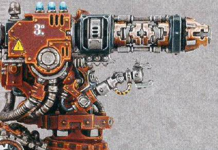
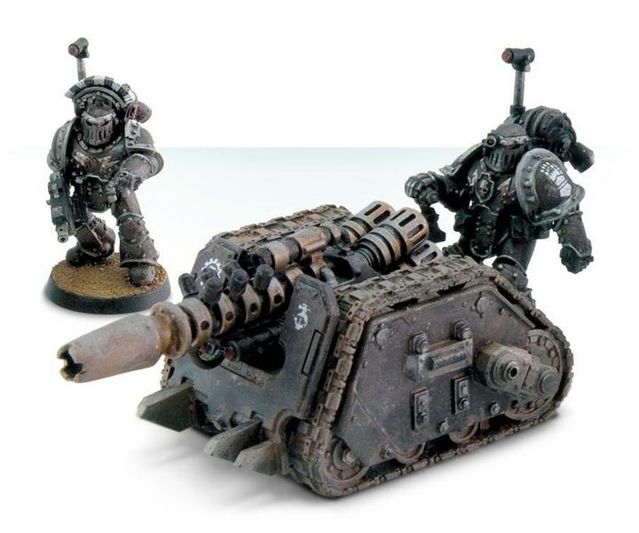

# 1289 重力炮 Graviton Cannon

精校状态：中文行文已逐段精校，部分术语仍为暂定

分类：武器 / 远程武器

原文来源：https://www.bilibili.com/opus/1003958123108499491

原作者：帝国神选罐头

原文时间：2024年11月26日 11:10

[返回分类目录](目录.md) · [全书目录](../../目录.md)

<!-- A1289-B0001 图片 -->

<!-- A1289-B0002 -->

原译文

Heavy Grav-Cannon on the Kataphron Destroyer 重型破坏者上的重力炮

**校订译文**

Heavy Grav-Cannon on the Kataphron Destroyer 铁甲破坏者上的重型重力炮

<!-- /A1289-B0002 -->

<!-- A1289-B0003 -->
**英文原文**

The Graviton Cannon is a large type of gravitational projector weapon. The power of the Graviton Cannon is sufficient to rupture organs and crack bones even inside armour, but it's primary use is to counter enemy machinery without the risk of secondary explosions. Graviton Cannons have been seen mounted on Rapiers and Centurions and heavy versions are used by the Adeptus Mechanicus which are powerful enough to break Obliterators in two with a single blast.

<!-- /A1289-B0003 -->

<!-- A1289-B0004 -->

原译文

重力炮是一种大型重力投射武器。重力炮的威力足以破坏器官和骨头，甚至在盔甲内部，但它的主要用途是对抗敌人的机械，而没有二次爆炸的风险。重力炮已被安装在细剑和百夫长身上，重型版本被机械神教使用，其威力足以通过一次爆炸将泯灭者一分为二。

**校订译文**

重力炮是一种大型重力投射武器，威力足以隔着护甲撕裂脏器、折断骨骼，但主要用途是在避免二次爆炸的情况下破坏敌方机械。细剑载具和百夫长装甲都曾装备重力炮；机械修会还使用重型版本，单次射击便能将泯灭者撕成两截。

<!-- /A1289-B0004 -->

<!-- A1289-B0005 图片 -->

<!-- A1289-B0006 -->

原译文

Graviton Cannon on Rapier chassis 细剑底盘上的重力炮

**校订译文**

Graviton Cannon on Rapier chassis 细剑底盘上的重力炮

<!-- /A1289-B0006 -->

本篇核心术语与暂定项

以下列出本篇出现的英文原形及核心术语表用词。同形词可能指不同对象，具体词义以本篇正文和校注为准；单复数、别名和仅见于图注的名称可能尚未列入。完整候选见[术语表](../../术语表/双语术语候选.csv)。

| 英文 | 采用中文 | 状态 |
| --- | --- | --- |
| Adeptus Mechanicus | 机械修会 | 官方已核对 |
| Centurions | 百夫长 | 暂定·官方待核 |
| Obliterators | 泯灭者 | 官方已核 |
| Graviton Cannon | 重力炮 | 暂定·官方待核 |

