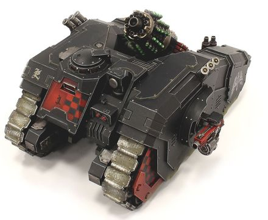

# 1290 重力充能炮 Graviton Charge Cannon

精校状态：中文行文已逐段精校，部分术语仍为暂定

分类：武器 / 远程武器

原文来源：https://www.bilibili.com/opus/1011362401919959057

原作者：帝国神选罐头

原文时间：2024年12月16日 10:02

[返回分类目录](目录.md) · [全书目录](../../目录.md)

原篇名：重力突击炮 Graviton Charge Cannon

<!-- A1290-B0001 -->
**英文原文**

The Graviton Charge Cannon was a type of Imperial Graviton Weapon used on the Arquitor Bombard during the Great Crusade and Horus Heresy.

<!-- /A1290-B0001 -->

<!-- A1290-B0002 -->

原译文

重力充能炮是一种帝国重力武器，在大远征和荷鲁斯叛乱期间用于曲射手臼炮。

**校订译文**

重力充能炮是帝国在大远征和荷鲁斯之乱期间，安装于曲射手臼炮载具上的重力武器。

<!-- /A1290-B0002 -->

<!-- A1290-B0003 图片 -->

<!-- A1290-B0004 -->

原译文

Arquitor Bombard with Graviton Charge Cannon 装备重力充能炮的曲射手臼炮

**校订译文**

Arquitor Bombard with Graviton Charge Cannon 装备重力充能炮的曲射手臼炮载具

<!-- /A1290-B0004 -->

<!-- A1290-B0005 -->
**英文原文**

An exotic example of graviton technology, it fired energised canisters that upon impact emit a gravity field of such strength that it binds infantry to the earth and crushes circuitry and electronics. It was adept at not only destroying the enemy, but also disrupting their advance.

<!-- /A1290-B0005 -->

<!-- A1290-B0006 -->

原译文

这是一种奇特的重力技术示例，它发射出充满能量的罐子，这些罐子在撞击时会释放出强大的重力场，将步兵固定在地面上，并压碎电路和电子设备。它不仅擅长摧毁敌人，还能扰乱敌人的推进。

**校订译文**

这种独特的重力技术武器会发射充能弹筒，命中后释放极强重力场，将步兵牢牢压在地面，并碾碎电路和电子设备。它不仅能消灭敌人，也很擅长阻滞敌军推进。

<!-- /A1290-B0006 -->

本篇核心术语与暂定项

以下列出本篇出现的英文原形及核心术语表用词。同形词可能指不同对象，具体词义以本篇正文和校注为准；单复数、别名和仅见于图注的名称可能尚未列入。完整候选见[术语表](../../术语表/双语术语候选.csv)。

| 英文 | 采用中文 | 状态 |
| --- | --- | --- |
| Horus Heresy | 荷鲁斯之乱 | 官方已核对 |
| Great Crusade | 大远征 | 暂定·官方待核 |
| Horus | 荷鲁斯 | 暂定·官方待核 |
| Adept | 帝国任职者（广义）／文吏（行政语境） | 语境定译·官方待核 |
| Arquitor Bombard | 曲射手臼炮载具 | 暂定·官方待核 |
| Graviton Weapon | 重力武器 | 暂定·官方待核 |
| Graviton Charge Cannon | 重力充能炮 | 暂定·官方待核 |

