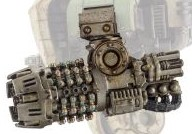

# 1291 重力通量轰击炮 Grav Flux Bombard

精校状态：中文行文已逐段精校，部分术语仍为暂定

分类：武器 / 远程武器

原文来源：https://www.bilibili.com/opus/1003958239066325016

原作者：帝国神选罐头

原文时间：2024年11月26日 11:10

[返回分类目录](目录.md) · [全书目录](../../目录.md)

原篇名：重力熔解轰击炮 Grav Flux Bombard

<!-- A1291-B0001 -->
**英文原文**

The Grav Flux Bombard is a type of heavy Graviton Weapon. Developed for unique use by the Leviathan Dreadnought, the Grav Flux Bombard is a short range siege weapon.

<!-- /A1291-B0001 -->

<!-- A1291-B0002 -->

原译文

重力通量轰击炮是一种重型重力武器。重力通量轰击炮是为利维坦无畏的独特用途而开发的短程攻城武器。

**校订译文**

重力通量轰击炮是一种专为利维坦无畏机甲研制的重型重力武器，用于近距离攻城。

**校注：** Flux沿技术术语译通量，原题熔解误义，统一正文与标题。

<!-- /A1291-B0002 -->

<!-- A1291-B0003 图片 -->

<!-- A1291-B0004 -->

原译文

Grav Flux Bombard 重力通量轰击炮

**校订译文**

Grav Flux Bombard 重力通量轰击炮

<!-- /A1291-B0004 -->

本篇核心术语与暂定项

以下列出本篇出现的英文原形及核心术语表用词。同形词可能指不同对象，具体词义以本篇正文和校注为准；单复数、别名和仅见于图注的名称可能尚未列入。完整候选见[术语表](../../术语表/双语术语候选.csv)。

| 英文 | 采用中文 | 状态 |
| --- | --- | --- |
| Dreadnought | 无畏机甲 | 暂定·官方待核 |
| Graviton Weapon | 重力武器 | 暂定·官方待核 |
| Grav Flux Bombard | 重力通量轰击炮 | 暂定·官方待核 |

