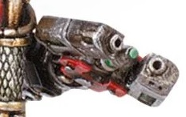

# 1293 等离子切割枪 Plasma Cutter

精校状态：中文行文已逐段精校，部分术语仍为暂定

分类：武器 / 远程武器

原文来源：https://www.bilibili.com/opus/1001365899894063112

原作者：帝国神选罐头

原文时间：2024年11月19日 11:31

[返回分类目录](目录.md) · [全书目录](../../目录.md)

<!-- A1293-B0001 -->
## Plasma Cutter 等离子切割枪

<!-- /A1293-B0001 -->

<!-- A1293-B0002 -->
**英文原文**

Plasma Cutters are a type of Plasma Weapon used by Space Marine Techmarines.

<!-- /A1293-B0002 -->

<!-- A1293-B0003 -->

原译文

等离子切割枪是星际战士技术军士使用的一种等离子武器。

**校订译文**

等离子切割枪是星际战士科技战士使用的一种等离子武器。

<!-- /A1293-B0003 -->

<!-- A1293-B0004 图片 -->

<!-- A1293-B0005 -->

原译文

Plasma Cutters 等离子切割枪

**校订译文**

Plasma Cutters 等离子切割枪

<!-- /A1293-B0005 -->

本篇核心术语与暂定项

以下列出本篇出现的英文原形及核心术语表用词。同形词可能指不同对象，具体词义以本篇正文和校注为准；单复数、别名和仅见于图注的名称可能尚未列入。完整候选见[术语表](../../术语表/双语术语候选.csv)。

| 英文 | 采用中文 | 状态 |
| --- | --- | --- |
| Space Marine | 星际战士 | 暂定·官方待核 |
| Plasma Weapon | 等离子武器 | 暂定·官方待核 |

